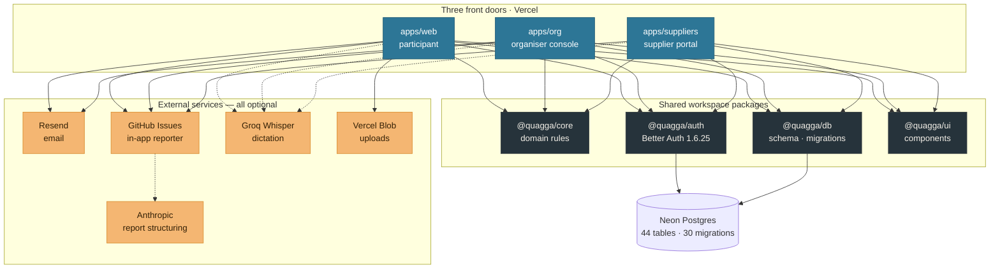
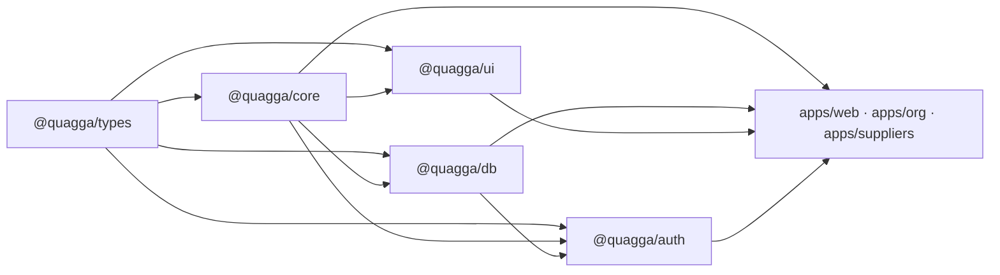
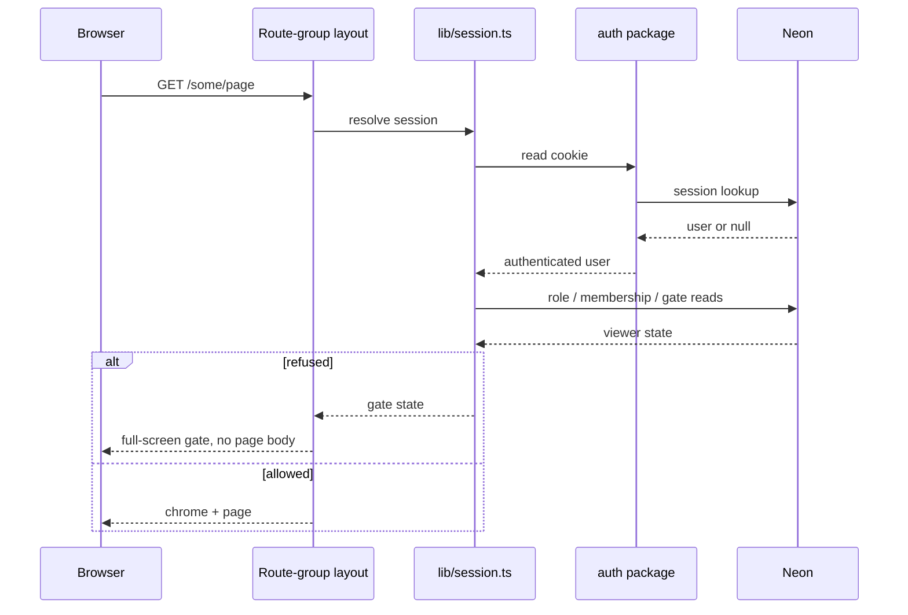
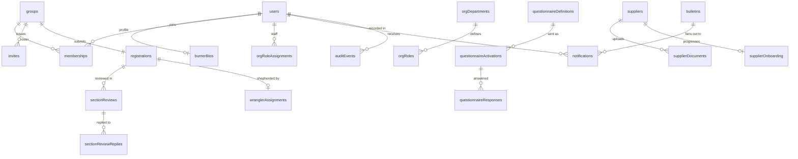

# Architecture

| Field                  | Value                                                                                                         |
| ---------------------- | ------------------------------------------------------------------------------------------------------------- |
| **Category**           | Architecture                                                                                                  |
| **Doc status**         | Active                                                                                                        |
| **Normative language** | Descriptive only                                                                                              |
| **Requirement IDs**    | Partial — `SEC-*`, `CORE-*` (cross-cutting system reference; most content has no direct App Spec counterpart) |
| **Owner / Updated**    | Repo maintainers, 2026-08-05                                                                                  |

Three Next apps, one Postgres, one account pool. This describes what is deployed
today. Where it conflicts with [`build-spec.md`](build-spec.md), the build spec
wins — it is the engineering contract; this is the map. (Full precedence chain,
App Specification included: [`README.md`](README.md).)

## System

**Every external service is optional and degrades in the open.** No
`RESEND_API_KEY` and email is skipped; no `GITHUB_TOKEN` and the reporter is not
offered; no `ANTHROPIC_API_KEY` and reports file from a plain template; no
`GROQ_API_KEY` and dictation is hidden. The apps boot and serve without any of
them — the env-less boot law in [`AGENTS.md`](../AGENTS.md).

## Package dependencies

Strictly one-directional. An app may import anything; nothing imports an app.

Two rules hold this shape:

| Rule                                                   | Why                                                                                                                                           |
| ------------------------------------------------------ | --------------------------------------------------------------------------------------------------------------------------------------------- |
| `@quagga/core` never imports `@quagga/db`              | Domain rules stay pure and testable; the 872 core tests need no database.                                                                     |
| `@quagga/core/report-server` is a separate export path | It reads `GITHUB_TOKEN` and pulls the Anthropic SDK. Re-exporting it from the barrel would ship the filing machinery to every browser bundle. |

## A request

No middleware. Every app resolves its own session in a server component and
decides what the visitor may see.

Each app's gate answers a different question:

| App              | Gate                                                | Refusal                                         |
| ---------------- | --------------------------------------------------- | ----------------------------------------------- |
| `apps/web`       | Is onboarding complete? Any blocking questionnaire? | Blocking flow replaces the page                 |
| `apps/org`       | Does this account hold an org role?                 | `GateScreen` — "restricted to AfrikaBurn staff" |
| `apps/suppliers` | Has this verified email claimed a listing?          | `GateScreen` — unlinked account                 |

Pages re-guard before reading. Hiding a control is never the security boundary.

## Data

44 tables in one database, owned by `packages/db`. Migrations are append-only
and run on deploy (`db:migrate:deploy && next build`) — **against production,
with no staging step.**

Four clusters: **identity** (users, sessions, 2FA, passkeys, bios, deletion and
email-change requests), **camps** (groups, memberships, invites, roles,
registrations, reviews, wranglers), **programme** (questionnaires, bulletins,
notifications, categories), **suppliers** (listings, onboarding, documents,
declarations). `auditEvents` spans all four.

## Constraints worth knowing before changing anything

- **The deployment is live**, with real participants' phone numbers, emergency
  contacts and medical notes in it. There is no staging database.
- **Migrations are append-only.** An applied migration cannot be edited, only
  corrected by another one. `packages/db/migrations/` is CODEOWNERS-gated.
- **Sessions are per-app.** One account pool, but cookies do not cross
  `*.vercel.app` — the Public Suffix List forbids it. Shared sign-on needs a
  custom apex; see [`auth-platform-spec.md`](auth-platform-spec.md).
- **There is no public API.** Every route handler under `apps/*/app/api/` is better-auth,
  blob upload, the in-app reporter or a sweep — all data access is server actions and
  server components behind cookie sessions. An external, key-authenticated `/v1` surface is
  specified in [`docs/sdk/`](sdk/README.md) and **is not built**; when it lands it is the
  first inbound authenticated arrow on the diagram above.
- **Personal data has classes**, enforced in `@quagga/core`: some Bio fields can
  never be public, medical notes require recorded consent, and reads of them are
  audited. A copy of one of those predicates outside `core` is the same risk as
  changing the original.
