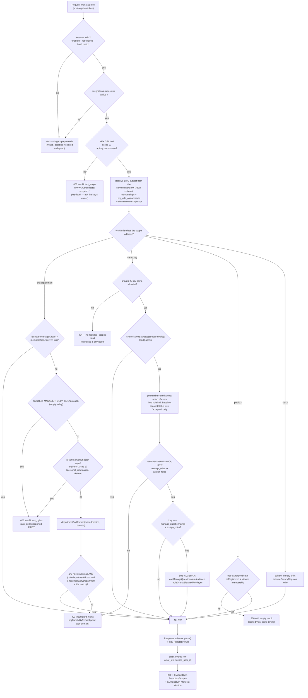

## 1. Overview and the capability model

This shard is the contract for what `@afrikaburn/sdk` **is**, who holds it, what its
vocabulary means, and how a key's rights decide which of its methods work. Every other
shard (transport, endpoints, React, publishing) is downstream of the capability model
defined here. Where this shard and another disagree about a scope string, a predicate
mapping or a refusal shape, this one wins.

Conventions used throughout: file paths are repo-relative and every claim about existing
behaviour carries one. `(spec author's call)` marks a decision the architecture was silent
on. Rejected alternatives appear as a single line with the reason, then we move on.

---

### 1.1 What the SDK is

`@afrikaburn/sdk` is a **typed HTTP client for the Quagga Portal backend whose usable
surface is a function of the API key's rights**. It is three things and nothing else:

1. **A closed vocabulary of 49 scope strings** — addresses into the permission algebra
   that already exists in `packages/core`, never new grants.
2. **A manifest evaluator** — a pure function that reads a server-issued capability
   document and answers "can this key do X, on this thing?" without a round trip.
3. **Generated method stubs and response DTO types** — where a method the key cannot
   reach is a compile-time `Deny<"scope">` and a runtime `NotAuthorisedError` carrying
   the server's own refusal sentence.

**What it is not, stated up front because both are load-bearing:**

- **It contains no authorisation logic.** `packages/core/src/org-permissions.ts`,
  `packages/core/src/project-permissions.ts` and `packages/core/src/privacy.ts` stay in
  this repo, stay FSL-1.1-ALv2, and are never published. The SDK reads a document those
  files produced; it does not re-derive it. The reason is written in the code it would
  have copied — `packages/core/src/org-permissions.ts:22-25`: _"the old `RANK_CAPABILITIES`
  table is gone rather than kept 'just in case', because a second source of truth for
  permissions is how a console ends up refusing what it renders."_ A pinned Apache copy of
  the predicate kernel in strangers' `node_modules` reintroduces exactly that table, across
  a version axis nobody controls.
- **It is not the security boundary.** The server re-runs the identical guards on every
  call. `docs/technical-spec/00-architecture.md` states the law: _"Hiding a control is never the security
  boundary."_ `AGENTS.md:136-138` repeats it. A type error and a local refusal are DX; the
  403 is the boundary. This sentence belongs verbatim in the published README, or someone
  will assume the types are the enforcement.

**Rejected: ship the predicate kernel to integrators as an Apache-2.0 `@afrikaburn/policy`.**
Relicensing is irrevocable per version, it moves files carrying per-file coverage floors out
from under the workspace whose CI enforces them (`packages/core/vitest.config.ts`:
`privacy.ts` at 100/100/100/100 `:59-64` — one of six files held at 100 across `:41-76`;
`org-permissions.ts` at 96/92/95/86 `:81-86`; `project-permissions.ts` at 95/96/100/95
`:87-92`), and it converts a second source of truth in _space_ into a second source of truth
in _time_.

---

### 1.2 The three consumer personas

Every design choice below is checked against these three. They differ in what credential
they can hold, which decides everything else.

#### Persona A — the org-owned internal tool

An AfrikaBurn department writes a script or a small internal dashboard. It runs on a
server the org controls, holds a long-lived API key, and is trusted roughly as far as
a console account with the same rights.

- **Credential:** `qg_live_*` API key, server-side only, via `@afrikaburn/sdk/server`.
- **Rights ceiling:** up to the org tier — `org:read:registrations`, `org:update:suppliers`.
- **What they need from the SDK:** `ScopeContractError` at boot when someone narrows the
  key out from under a running job, and a refusal sentence they can paste into Slack.
- **What they must not get:** `personal_information` (§1.6), and never the System-manager
  rank — `isSystemManager` is a rank check over `memberships.role`, not a permission row
  (`packages/core/src/org-permissions.ts:436-440`), and is deliberately not expressible as
  a permission row, so it is not expressible as a scope either.

#### Persona B — a camp's own website

A theme camp runs its own site and wants its roster, its registration status and its
questionnaires on it. Two sub-cases, and conflating them is the sharpest hazard in the
whole SDK:

- **Server-rendered:** the camp's server holds a key scoped to that camp's group id.
  Fine — `@afrikaburn/sdk/server`.
- **Browser-rendered:** the camp wants a widget in a static site. **A key must never
  reach a browser.** The mechanism is a **delegation token**: minted server-side from
  the key, narrowing-only, ≤10 minutes, audience-bound. Nothing in the isomorphic
  entry's type accepts an `apiKey` at all.

**Rejected: a publishable `ab_pk_live_*` key with `Origin` pinning.** `curl -H 'Origin: …'`
defeats it, and `public:profiles:read` reaches `getPublicBurnerProfile`
(`apps/web/lib/groups-store.ts:626`), which builds a `PublicBioView` whose shape includes
`legalName`, `homeCity` and `contactEmail` (`packages/core/src/bio.ts:331-349`; each is
populated only when its own privacy flag is `true`, per `publicBioView`'s `show` gate at
`:364-365`). A credential-free
bulk-enumeration endpoint over Burn identities is not a DX convenience.

The camp persona is also why the free-camp law is not negotiable in the SDK: a camp with
no approved registration is invisible to a stranger, enforced today at
`apps/web/lib/groups-store.ts:187` (`if (!registered && !viewerRole) continue;`) against
`isRegistered` (`packages/core/src/entitlements.ts:22-26`). Every SDK read inherits that
funnel.

#### Persona C — the third-party integrator

Someone outside AfrikaBurn builds a map, a directory app, a ticketing bridge. They are
a stranger with a credential.

- **Credential:** an API key issued by an org department through the Integrations
  console, anchored on a synthetic service user.
- **Rights ceiling:** `public:*` at v0.1; camp-scoped `camp:*` at v0.2 behind a mint-time
  camp allowlist; org read tranche only with an explicit per-department scope, never a
  wildcard.
- **What they must never reach:** the seven `HARD_LOCKED_PRIVATE_FIELDS`
  (`packages/core/src/privacy.ts:39-47`), medical notes
  (`packages/core/src/privacy.ts:57`), officer contact details
  (`packages/core/src/officers.ts:196` `officerContactVisibleToOrg` — a per-assignment
  consent given to _AfrikaBurn_; the copy the burner accepts is `officerConsentCopy`
  at `:181`, "shares your contact details … with AfrikaBurn for this function".
  Not per-edition: `project_roles` is keyed on `group_id` only,
  `packages/db/src/schema.ts:949-955`),
  the medical access log (`packages/core/src/org-domains.ts:128-129`: _"a list that names
  the burners who have disclosed a health condition"_), and any write to org roles,
  departments or console access.

|                        | Persona A (org tool)               | Persona B (camp site)                      | Persona C (integrator)                      |
| ---------------------- | ---------------------------------- | ------------------------------------------ | ------------------------------------------- |
| Credential             | API key, server                    | key (server) or delegation token (browser) | API key, server                             |
| Entry point            | `@afrikaburn/sdk/server`           | `/server` or `.` + token                   | `@afrikaburn/sdk/server`                    |
| Ceiling                | org tier, per-department           | own camps + `self:*`                       | `public:*`, then allowlisted camps          |
| Sees free camps        | only where the subject is a member | own camps                                  | never                                       |
| `personal_information` | no (§1.6)                          | no                                         | no                                          |
| Refusal style          | `explain` — names the department   | `explain` for own camps                    | `notFound` wherever existence is privileged |

---

### 1.3 Naming: public SDK vocabulary → internal vocabulary

The repo's vocabulary is internally consistent but has four traps that would become
permanent registry scars if copied. The SDK is a **label layer**, and this repo already
rules that the label layer is where divergence belongs — on `god` vs "System manager",
`packages/core/src/org-permissions.ts:41-44` (_"`ORG_RANK_LABELS` is the label layer …
Do not 'fix' the inconsistency."_) and `packages/types/src/roles.ts:29-36` (_"the
inconsistency is deliberate, and the label layer is the place to change."_).

| SDK term                                   | Internal term                                    | Where it lives                                                                  | Why the SDK differs                                                                                                                                                                                                                                                                                                                                                                                                                                                                                         |
| ------------------------------------------ | ------------------------------------------------ | ------------------------------------------------------------------------------- | ----------------------------------------------------------------------------------------------------------------------------------------------------------------------------------------------------------------------------------------------------------------------------------------------------------------------------------------------------------------------------------------------------------------------------------------------------------------------------------------------------------- |
| `ab.groups`                                | `groups` table, `kind` enum                      | `packages/db/src/schema.ts`; `GroupKind` in `packages/types/src/groups.ts:10`   | The honest primary. Any joinable entity.                                                                                                                                                                                                                                                                                                                                                                                                                                                                    |
| `ab.camps` / `ab.artworks` / `ab.vehicles` | `kind = theme_camp \| artwork \| mutant_vehicle` | same                                                                            | **Kind-setting sugar over `ab.groups`, nothing more.** `createCamp` (`apps/web/lib/groups-store.ts:926`) takes `kind: GroupKind` and so creates artworks and mutant vehicles too; its two internals `prepareCampCreate` / `createCampWrites` are what `apps/web/lib/project-registration-store.ts:11` imports and reuses for every project kind (its own comment at `:23` calls the shared path "`createCamp`"). A function named for one kind that builds all three must not be copied into a public name. |
| `ab.burners`                               | `users` table                                    | `packages/db/src/schema.ts`                                                     | Never `ab.users`: the schema has **both** `users` (our identity join) and `user` (Better Auth's, adapter-owned). A public type called `User` is unresolvable. Never `participant` — that word is engineering prose for `apps/web`, not product copy.                                                                                                                                                                                                                                                        |
| `Burner Bio`                               | `burner_bios`                                    | per user × edition                                                              | AfrikaBurn's own official term. Keep it.                                                                                                                                                                                                                                                                                                                                                                                                                                                                    |
| `ab.org`                                   | the single `groups` row with `kind='org'`        | `packages/db/src/schema.ts`                                                     | `org` is the code token everywhere; spelling it out reopens the organisation/organization split (505 vs 15 hits).                                                                                                                                                                                                                                                                                                                                                                                           |
| `rank: "system_manager"`                   | `memberships.role = 'god'`                       | `packages/core/src/org-permissions.ts:154-158` `ORG_RANK_LABELS`                | **`"god"` never crosses the boundary in either direction.** The console has called it System manager since it existed; leaking the enum value would put it in third-party code forever.                                                                                                                                                                                                                                                                                                                     |
| `camp:*` permissions                       | `ProjectPermissionKey`                           | `packages/types/src/roles.ts:262-269`                                           | `project` stays an adjective on rights and is never a namespace: it has two live contradictory meanings (any non-org group, vs `apps/org/lib/project-registration.ts` where it _excludes_ camps).                                                                                                                                                                                                                                                                                                           |
| `org:<cap>:<domain>`                       | `OrgCapabilityKey` × `OrgDomain`                 | `packages/types/src/roles.ts:141-150`; `packages/core/src/org-domains.ts:72-81` | 1:1, no translation. Every org guard already names its cell literally.                                                                                                                                                                                                                                                                                                                                                                                                                                      |
| `edition`                                  | `editions`                                       | `packages/db/src/schema.ts`                                                     | Unchanged. "Years are the root namespace."                                                                                                                                                                                                                                                                                                                                                                                                                                                                  |
| — (no namespace)                           | `wrangler_assignments`                           | `packages/db/src/schema.ts`                                                     | Perfect internally; `wrangler` on npm is Cloudflare's CLI. Exposed as `ab.registrations.wrangler`.                                                                                                                                                                                                                                                                                                                                                                                                          |
| — (does not exist)                         | `collective`                                     | artist-credit string only; structure parked                                     | No `ab.collectives`.                                                                                                                                                                                                                                                                                                                                                                                                                                                                                        |

**Client object:** the client TYPE is `AfrikaBurn`, the conventional variable is `ab`, and it
is built by the `createServerClient` factory of §1.9 — never `new AfrikaBurn(...)`, because
the `const S extends ScopeTuple` inference that the whole build-time gate rests on is a
function-call-site inference.

```ts
import { createServerClient, type AfrikaBurn } from "@afrikaburn/sdk/server";

const ab: AfrikaBurn<"public:camps:read" | "camp:view_member_details"> =
  createServerClient({
    apiKey: process.env.AFRIKABURN_API_KEY!,
    scopes: ["public:camps:read", "camp:view_member_details"],
  });
```

Rejected: `Quagga` / `@quagga/*` — `quagga` on npm is QuaggaJS (barcode scanner), and
`@quagga/*` is already load-bearing as the private workspace scope for seven packages,
every one `"private": true`.

---

### 1.4 The capability model — the invariant everything hangs from

> **A scope string is an address into the existing algebra, never a new grant.**

Each of the 49 scopes resolves to exactly one existing predicate call with concrete
arguments. There is no fourth permission model. The SDK never evaluates a predicate — it
reads a document that predicates produced.

```
effective(key, op) = resolveLiveSubject(key.serviceUserId) ∩ key.ceiling
```

**Intersection, never union.** The key's stored permissions are a **ceiling**, not a
source of rights. The subject's rank, backstop and carve-outs are resolved live, per
request, from `memberships` and `org_role_assignments`. Two consequences, both deliberate:

- A key can never carry its own rank. `isSystemManager` is `actor.rank === "god"`
  (`packages/core/src/org-permissions.ts:438-440`), and `rank` is only ever derived from
  `memberships.role` by `orgRankFromRole` (`:178-182`) — _"never a role row, never a
  permission bit, so nothing editable can change it"_ (`:436-437`). `isPermissionBackstop` is
  unconditional (`packages/core/src/project-permissions.ts:23-25`). A key that carried a
  rank would make both forgeable.
- A revoked department assignment takes effect on the **next call**, not on the next
  key rotation.

**Key identity: a synthetic service user, never a delegated human.** Each integration gets
its own `user`/`users` row holding its own `memberships` and `org_role_assignments`.

> **DOES NOT EXIST YET (spec author's call).** There is no `kind` column on `users` today —
> `packages/db/src/schema.ts:283-318` is `id · auth_user_id · email · username ·
sanitized_at · created_at` and nothing else. There is likewise **no `integrations` table
> and no API-key table** anywhere in `schema.ts`, and better-auth's `apiKey` plugin is not
> enabled in `packages/auth/src/config.ts`. Everything this shard says about
> `users.kind = 'service'`, `integrations.status` and `apikey.permissions` is a **proposed**
> schema, specified in the backend shard, and lands as a new append-only migration
> (`docs/technical-spec/00-architecture.md`: migrations are append-only and run on deploy against
> production). Read every mention of them below as "the new tables", not as description.

Anchoring on an ordinary `users` row is what lets `resolveOrgSession`
(`apps/org/lib/session.ts:135`), `orgCanInDomain`
(`packages/core/src/org-permissions.ts:521`), `hasProjectPermission`
(`packages/core/src/project-permissions.ts:43`) and the audit writer run **unmodified**.

Rejected: delegating from a real person's `user.id` — the key's rights then change silently
when that person joins a department, dies when they leave, and inherits the irrevocable
lead/admin backstop as a permanent skeleton key for their camp.

---

### 1.5 The scope vocabulary — 49 closed strings

The vocabulary lives in a new **private** workspace package, `@quagga/scopes` — as-const
tuples, no zod, and no _runtime_ dependency on anything (its only imports are the
`OrgDomain` / `ProjectPermissionKey` **types**, which erase at build).
`packages/types/src/roles.ts:150` is inverted so the
zod enum derives from the tuple rather than the other way round (today it reads
`export const ORG_CAPABILITY_KEYS = OrgCapabilityKey.options;`, which makes the vocabulary
a runtime value derived from zod and drags zod into every consumer).

```ts
// @quagga/scopes — PRIVATE, FSL. The SDK re-exports the string union only.
export type OrgScope =
  `org:${"create" | "read" | "update" | "delete"}:${OrgDomain}`;
export type CampScope = `camp:${ProjectPermissionKey}`;
export type SelfScope =
  | "self:profile:read"
  | "self:profile:write"
  | "self:notifications:read"
  | "self:notifications:write"
  | "self:registrations:read"
  | "self:registrations:write";
export type PublicScope =
  | "public:editions:read"
  | "public:camps:read"
  | "public:profiles:read"
  | "public:bulletins:read"
  | "public:suppliers:read"
  | "public:categories:read";

export type Scope = OrgScope | CampScope | SelfScope | PublicScope;
```

| Tier       | Count          | Derivation                                                           | Source of truth                                                                 |
| ---------- | -------------- | -------------------------------------------------------------------- | ------------------------------------------------------------------------------- |
| `org:*`    | 4 × 8 = **32** | four of the five `OrgCapabilityKey` values × all eight `ORG_DOMAINS` | `packages/types/src/roles.ts:141-148`; `packages/core/src/org-domains.ts:72-81` |
| `camp:*`   | **5**          | every `ProjectPermissionKey`                                         | `packages/types/src/roles.ts:262-269`                                           |
| `self:*`   | **6**          | the signed-subject surfaces                                          | (spec author's call) — no internal enum exists                                  |
| `public:*` | **6**          | the unauthenticated read surfaces                                    | (spec author's call) — no internal enum exists                                  |
| **total**  | **49**         |                                                                      |                                                                                 |

**Four rules on the shape of this list, none of them soft:**

1. **`org:personal_information:<domain>` is not issuable to any integrator key at v0.1 or
   v0.2.** It is the fifth `OrgCapabilityKey` and it is a real console capability; it is
   not an SDK scope. Verified reason: `apps/org/lib/queries.ts:952-960` defines
   `REGISTRATION_CONTACT_KEYS` — `s1ContactEmail`, `s1AltContactName`, `s1AltContactPhone`,
   `s1AltContactEmail`, `s2LntLeadName`, `s2LntLeadPhone`, `s2LntLeadEmail` — seven
   **third-party** contact columns that live on `registrations`, not `burner_bios`, and are
   therefore **outside `HARD_LOCKED_PRIVATE_FIELDS` entirely**. Any claim of the form
   "hard-locked PII is outside all scopes" does not cover them. Re-admitting this
   capability at v1.0 is an explicit decision made against those seven column names, not a
   consequence of the vocabulary's shape.
2. **No wildcards.** Not `org:*:registrations`, not `org:read:*`. `["org:*:registrations"]`
   silently declares `org:personal_information:registrations` — PII by autocomplete.
3. **`camp:` scopes carry no group id.** Reach is a _mint-time allowlist_ on the key
   (`CampGrant[]` in the manifest, §1.7), not a string. Putting group ids in scope strings
   makes the declared tuple unstable across camps and defeats the literal-type gating.
4. **The vocabulary is closed and the closure is what makes build-time gating possible.**
   Template-literal types over `as const` tuples give a finite union for free. A single
   free-form capability breaks it — which is its own argument for keeping CRUD+PII closed
   (`packages/types/src/roles.ts:152-187` documents the vocabulary that was killed for
   being open-ended).

#### Scope → predicate mapping

This table is the contract. A scope that is not in it does not exist.

| Scope                                       | Predicate the server MUST call                                                                                                                     | Extra arguments                                       | Source                                                                                 |
| ------------------------------------------- | -------------------------------------------------------------------------------------------------------------------------------------------------- | ----------------------------------------------------- | -------------------------------------------------------------------------------------- |
| `org:create\|read\|update\|delete:<domain>` | `orgCanInDomain(actor, cap, domain)`                                                                                                               | actor = `{rank, roles, domains}` for the service user | `packages/core/src/org-permissions.ts:521-532`                                         |
| _(affordance only)_                         | `orgCan(actor, cap)`                                                                                                                               | —                                                     | `:456-468`. **Different question, different answer.** Never use it to decide a select. |
| `camp:view_member_details`                  | `hasProjectPermission(m, "view_member_details")`                                                                                                   | `m` from `getMemberPermissions(groupId, subject)`     | `packages/core/src/project-permissions.ts:43`; `apps/web/lib/roles-store.ts:869`       |
| `camp:manage_members`                       | `hasProjectPermission(m, "manage_members")`                                                                                                        |                                                       | `:43`                                                                                  |
| `camp:manage_roles`                         | `hasProjectPermission(m, "manage_roles")`                                                                                                          |                                                       | `:43`. **Implies `assign_roles`** — `:53`.                                             |
| `camp:assign_roles`                         | `hasProjectPermission(m, "assign_roles")` **plus** `roleGrantsElevatedPrivileges(kind, perms)` refused unless the caller also holds `manage_roles` | the target role's `{kind, permissions}`               | `:53`, `:142-150`; enforced at `apps/web/lib/roles-store.ts:432-447`                   |
| `camp:manage_questionnaires`                | `hasProjectPermission(m, "manage_questionnaires")` **then** `canManageQuestionnaireAudience(m, {targetRoleIds, blocking})`                         | audience spec + baseline role id                      | `:43-57`, `:74-97`                                                                     |
| _(questionnaire results)_                   | `canViewActivationResults(memberships, activation, orgGroupId)`                                                                                    |                                                       | `packages/core/src/questionnaire-authz.ts:85`                                          |
| `self:*`                                    | session identity of the subject, plus `enforcePrivacyFlags` on every write                                                                         |                                                       | `packages/core/src/privacy.ts:108-116`                                                 |
| `public:camps:read`                         | the free-camp predicate (§1.6, to be extracted)                                                                                                    | `(registrationStatus, viewerMembership)`              | today `apps/web/lib/groups-store.ts:187`                                               |
| `public:profiles:read`                      | `publicBioView(fields, privacyFlags, extras)`                                                                                                      |                                                       | `packages/core/src/bio.ts:359`                                                         |

Two predicates the mapping deliberately does **not** flatten:

- **`manage_questionnaires` is not a boolean.** It stores
  `{audienceRoles: "all" | string[], mayBlock: boolean}`
  (`packages/types/src/roles.ts:280-286`). `canManageQuestionnaireAudience` collapses
  three distinct refusals into one `false` at `packages/core/src/project-permissions.ts:93-96`.
  The SDK surfaces a **discriminated verdict**, evaluated server-side (§1.9).
- **`isOrgAuthor` is a fourth, membership-role-based path.**
  `packages/core/src/questionnaire-authz.ts:34` returns true for any `org_staff`/`god` org
  membership _with zero org roles_ — a state the console gate refuses. Every org
  questionnaire scope must check `orgCanInDomain` **first**, then `canAuthorAudience`, in
  that order. Calling the pure predicate alone makes the SDK wider than the console.

---

### 1.6 What can never be a scope, and why

These are not "scopes that always deny". They are absent from the vocabulary, absent from
the type union, and absent from every response schema. A right that always denies is the
affordance that eventually gets a `true`.

| Never a scope                                                                                                           | Where it is defined                                                                                                       | Why it cannot become one                                                                                                                                                                                                                                                                                                   |
| ----------------------------------------------------------------------------------------------------------------------- | ------------------------------------------------------------------------------------------------------------------------- | -------------------------------------------------------------------------------------------------------------------------------------------------------------------------------------------------------------------------------------------------------------------------------------------------------------------------- |
| The 7 `HARD_LOCKED_PRIVATE_FIELDS` — `saId`, `passport`, `phone`, `onsiteContactName/Phone`, `offsiteContactName/Phone` | `packages/core/src/privacy.ts:39-47`                                                                                      | No access path of any kind exists in-product. `enforcePrivacyFlags` forces them false on every write (`:108-116`); `publicBioView` gates again on `canBePublic` (`packages/core/src/bio.ts:364-365`). `docs/technical-spec/01-auth-and-identity.md` requires one unconditional stripper precisely so they "can never be scoped-in". |
| `medical` (`SAFETY_VISIBLE_FIELDS`)                                                                                     | `packages/core/src/privacy.ts:57`                                                                                         | The consent is "your camp leads and AfrikaBurn's safety/org staff" (`:12-21`). An integrator is neither. Exposing it would also make the integrator's own log the compliance record for `bio.medical.view` (`packages/core/src/medical-access.ts:142`).                                                                    |
| Officer contact release                                                                                                 | `packages/core/src/officers.ts:196`                                                                                       | A per-edition consent given to AfrikaBurn, not a permission. Widening it to a third party breaks the consent the burner actually gave.                                                                                                                                                                                     |
| The medical access log                                                                                                  | domain description at `packages/core/src/org-domains.ts:128-129`                                                          | _"a list that names the burners who have disclosed a health condition."_                                                                                                                                                                                                                                                   |
| `god` / System manager                                                                                                  | `packages/core/src/org-permissions.ts:438-440`                                                                            | Reads `memberships.role`, never a permission bit. Not grantable, therefore not scopable, therefore not delegable.                                                                                                                                                                                                          |
| The engineer rank ceiling                                                                                               | `packages/core/src/org-permissions.ts:300-303`                                                                            | `personal_information` and `delete` are refused **before any role is consulted** (`:466`, `:496`). A ceiling on a rank is not a grant that can be handed out.                                                                                                                                                              |
| The lead/admin backstop                                                                                                 | `packages/core/src/project-permissions.ts:20-25` (`isPermissionBackstop` over `PROJECT_ADMIN_ROLES`); rationale at `:1-5` | Unconditional and irrevocable by design — _"no permission edit can ever strand a camp (no self-lockout class of bugs, by construction)"_ (`:5`). Not revocable ⇒ not scopable. Reported in the manifest as a **flag**, never as five scopes.                                                                               |
| Free-camp discoverability                                                                                               | `apps/web/lib/groups-store.ts:187`                                                                                        | A query-shape law, not a predicate. No scope turns it off.                                                                                                                                                                                                                                                                 |
| Questionnaire result-scope crossing                                                                                     | `packages/core/src/questionnaire-authz.ts:85-97`                                                                          | An org actor cannot read a camp's project-scoped results and vice versa — _including a System manager_. Structural.                                                                                                                                                                                                        |
| Money                                                                                                                   | —                                                                                                                         | The platform never holds or processes money. `payments` stores a reference and a status.                                                                                                                                                                                                                                   |

Consequence for the SDK's error surface: **the SDK must never emit "this key is not
authorised for phone number."** That sentence implies some key could be. Those fields are
absent from the response type, with no error branch and no remediation link.

The PII strip itself is **not** an SDK function. `docs/technical-spec/01-auth-and-identity.md` puts
it in `@quagga/core` and calls for it to be built now; grep confirms it does not exist
(`stripHardLocked` returns zero hits repo-wide, and there is no `/api/me`). It is
implemented as a **zod output schema whose `.parse()` at the response boundary is the
stripper** — a field absent from the schema cannot be in the body, in the type, or in the
docs. The SDK's copy of the field names is used at the **type** level only. A client-side
filter is the failure mode the spec names.

---

### 1.7 The capability manifest

The document. Fetched once at client construction from `GET /api/v1/capabilities`,
ETag'd, TTL 300s (matched to `cookieCacheMaxAgeSeconds` so there is one staleness story
to explain), produced by a new pure assembler
`packages/core/src/integration-manifest.ts` over `summarizeOrgActor`, `orgCanInDomain`,
`orgCapabilityRefusal` and `hasProjectPermission`.

```ts
interface Manifest {
  manifestVersion: 1;
  kernel: string; // server build stamp, echoed on every response
  etag: string;
  issuedAt: string;
  expiresAt: string;
  key: { id: string; prefix: string; name: string; integrationSlug: string };
  subject: {
    kind: "service";
    id: string;
    rank: "system_manager" | "org_staff" | "engineer" | null;
  };
  granted: {
    org: OrgGrant[];
    camps: CampGrant[];
    self: SelfScope[];
    public: PublicScope[];
  };
  refusals: Refusal[]; // LAZY — see below
  routes: Record<string, { base: string }>; // namespace → origin
  never: readonly string[]; // informational only, NOT members of Scope
  limits: { rateLimit: { max: number; windowSeconds: number } };
  vocabulary: {
    orgCapabilities: string[];
    orgDomains: string[];
    campPermissions: string[];
  };
}

interface OrgGrant {
  capability: OrgCapability;
  departments: { id: string; name: string }[] | null; // null = org-wide
  domains: OrgDomain[] | null;
  hollow: boolean; // domains.length === 0 — a grant reaching nothing
}

interface CampGrant {
  groupId: string;
  slug: string;
  kind: GroupKind;
  backstop: boolean; // lead/admin — a FLAG, never five scopes
  permissions: CampScope[]; // manage_roles ⇒ assign_roles ALREADY materialised
  questionnaires: { audienceRoles: "all" | string[]; mayBlock: boolean } | null;
}

interface Refusal {
  scope: Scope;
  reason:
    | "rank_ceiling"
    | "no_roles"
    | "wrong_department"
    | "unowned_domain"
    | "not_granted"
    | "not_delegated"
    | "key_ceiling";
  message: string; // orgCapabilityRefusal(…, {audience:"integrator"})
  mode: "explain" | "notFound"; // SERVER-AUTHORED policy, never client choice
  remediationUrl?: string;
}
```

`key.*` and `integrationSlug` read off the proposed key/integration tables (§1.4 box — they
do not exist today); `subject`, `granted` and `refusals` are assembled from predicates that do.

Six shape rules an implementer must not soften:

1. **`hollow` is not `granted`.** `summarizeOrgActor` distinguishes `domains: null`
   (org-wide) from `domains: []` (scoped to a department that owns nothing) precisely
   because _"a summary that overstates access to the exact person deciding whether the
   access is acceptable"_ is the failure — the comment is at
   `packages/core/src/org-permissions.ts:766-775`. Flattening it is over-reporting. The
   client renders it disabled and amber, using `grantScopeClause`
   (`:835-850`), which already produces _"in Safety only — which owns no part of the
   console, so this reaches nothing"_.
2. **`backstop: true` short-circuits the camp tier.** Report the flag; never enumerate a
   lead's rights as revocable scopes.
3. **`questionnaires` is the object or `null`.** Never a boolean.
4. **`manage_roles ⇒ assign_roles` is materialised once, server-side,** into
   `CampGrant.permissions`. It is one line at
   `packages/core/src/project-permissions.ts:53`; re-deriving it in the client evaluator
   would be two implementations of one rule — the exact failure this design exists to avoid.
5. **`refusals` is lazy.** Only scopes in the key's ceiling ∪ the declared tuple. An
   exhaustive 32-cell org refusal list is the department-ownership map serialised into a
   browser: `orgCapabilityRefusal`'s scoped arm names the owning department out loud
   (`:602`), which is correct for a colleague and wrong for a stranger.
6. **`subject.rank` carries labels.** `"system_manager"`, never `"god"`.

---

### 1.8 Resolution order

Server-side, per call, in this order. Every step is an existing predicate.



Stated as precedence, highest wins — this is the same table the console obeys:

```
System-manager rank            → resolves everything, org-wide, whatever any row says
lead/admin structural backstop → resolves every project permission for that group
engineer rank carve-out        → DENIES personal_information + delete, before any role
captain kind coercion          → forces project permissions to all on write
SYSTEM_MANAGER_ONLY_SET        → denies however written (empty today)
role union (org: dept-matched) → the only positive grant path
                               → fail closed
```

Two orderings that are not cosmetic:

- **The key ceiling is checked before the live subject.** A refusal at the ceiling is
  `insufficient_scope` and the person to ask is the key's owner. A refusal at the subject
  is `insufficient_rights` and the person to ask is a System manager. Collapsing them
  sends people to argue with the wrong colleague — the failure
  `packages/core/src/org-permissions.ts:576-588` was rewritten to fix.
- **`rank_ceiling` is reported first among refusals**, matching
  `orgCapabilityRefusal`'s own ordering and its stated reason
  (`:631-633`): _"for an engineer it is the whole answer and 'none of your roles grant it'
  would send them to ask for a role edit that cannot work."_

---

### 1.9 Build-time enforcement

The declared-scope contract. The integrator declares what they _believe_ the key holds;
the type system gates on that declaration; construction reconciles it against what the
key _actually_ holds.

```ts
declare const DENIAL: unique symbol;
export interface Deny<S extends Scope> {
  readonly [DENIAL]: S;
}

/** Undeclared (S = Scope) ⇒ ungated at compile time; runtime still gates. */
export type Gate<S extends Scope, Need extends Scope, T> = [Scope] extends [S]
  ? T
  : [Need] extends [S]
    ? T
    : Deny<Need>;

/** Closes the measured fail-open: a runtime-computed Scope[] is a compile error. */
export type ScopeTuple = readonly [] | readonly [Scope, ...Scope[]];

/**
 * The default MUST itself satisfy `ScopeTuple` — `= readonly Scope[]` does not
 * (it is not assignable to `readonly [] | readonly [Scope, ...Scope[]]`) and is a
 * TS2344 on the declaration itself. `readonly [Scope, ...Scope[]]` is a member of
 * the union AND has `S[number] = Scope`, which is exactly the ungated escape hatch.
 */
export declare function createServerClient<
  const S extends ScopeTuple = readonly [Scope, ...Scope[]],
>(cfg: ServerConfig & { scopes?: S }): AfrikaBurn<S[number]>;
```

Every gated member carries **generated** JSDoc, because measurement on TS 6.0.x — the line
this repo pins, `package.json:27` `"typescript": "^6.0.3"` — shows
quickinfo prints `Deny<"org:update:suppliers">` and **never** a sentence embedded in a
template-literal brand. Only JSDoc tags come back from the language service.

```ts
export interface SuppliersNs<S extends Scope> {
  /**
   * Change a supplier's standing.
   * @requires org:update:suppliers
   * @see https://developers.afrikaburn.org/scopes/org:update:suppliers
   */
  setStanding: Gate<
    S,
    "org:update:suppliers",
    (code: string, standing: Standing) => Promise<void>
  >;
}
```

Three properties, stated so nobody misreads them:

1. **Omitting `scopes` is legal and ungated.** `[Scope] extends [S]` is the escape hatch.
   Time-to-first-call stays around 60 seconds; the runtime still gates.
2. **A computed `Scope[]` is a compile error, not a silent full unlock.** With
   `S extends readonly Scope[]`, a runtime-computed array widens `S[number]` to the whole
   union and _every gate opens_. `ScopeTuple` closes that. `createDynamicClient()` is the
   greppable, named door for genuinely dynamic scopes.
3. **It systematically under-reports and never over-reports.** A key whose subject is a
   camp `lead` resolves everything through the backstop; the declared tuple will not say
   so. That direction is chosen deliberately — a type system that promises access the
   server refuses is the "console refuses what it renders" failure wearing a compiler.

**Rejected encodings**, each with the measured failure:

| Rejected                                | What the developer actually sees                                                                      |
| --------------------------------------- | ----------------------------------------------------------------------------------------------------- |
| `Omit<Client, "suppliers">`             | `Property 'suppliers' does not exist on type …` — reads as a typo, names no scope                     |
| `this`-context brand                    | degrades to `'this' context of type 'void' …` on destructure, and still renders callable in quickinfo |
| bare template-literal type as the value | widens to `String` at the call site; the message is lost                                              |
| wildcard scopes (`org:*:suppliers`)     | type-checks, and silently declares `org:personal_information:suppliers`                               |

**Construction-time reconciliation.** Compile-time gating gates on what the developer
_wrote_; the server gates on what the key _has_. Nobody in the vendor landscape reconciles
these.

```ts
// `declared` = the tuple the developer wrote; `granted` = manifest scopes.
const declaredSet = new Set<Scope>(declared);
const grantedSet = new Set<Scope>(granted);

const missing = declared.filter((s) => !grantedSet.has(s)); // → ScopeContractError
const unused = granted.filter((s) => !declaredSet.has(s)); // → info notice
```

- `missing` **throws in dev/CI, warns loudly in production**, and every affected call then
  fails with `NotAuthorisedError`. Throwing in production would turn a legitimate rights
  _narrowing_ by an operator into the integrator's outage.
- The thrown error prints the missing scopes, each `Refusal.message`, the
  `remediationUrl`, **and the held-scope list** — the single line that kills the most
  common support ticket, and one nobody prints today.
- `unused` is the least-privilege review nobody does, delivered free.

---

### 1.10 Runtime enforcement

One gate, one throw site.

```ts
export function assertScopes(
  m: Manifest,
  req: { scopes: readonly Scope[]; groupId?: string },
): void;
```

Every method body is one `scopes:` array and nothing else. A method that declares none
fails a source-scanning test — the idiom already exists in this repo at
`apps/org/lib/__tests__/org-rank-enforcement.test.ts`, which `readFileSync`s ~15 source
files (four query modules at `:98-101`, then the action modules at `:392`, `:573-685`) to
assert every query names its domain and every mutation names its capability.

Escapes, and only these two:

- `preflight: false` per call — the false-negative override. A stale manifest can only be
  wrong invisibly in the deny direction, so this is the documented way out.
- `createDynamicClient()` for computed scope sets.

`mode: "disabled"` and a global `ab.refresh()` are **cut**: three overlapping staleness
hatches is two too many.

`manage_questionnaires` returns a verdict rather than throwing, because it is the one
permission a flat scope cannot express:

```ts
type QuestionnaireVerdict =
  | { ok: true; activationId: string }
  | { ok: false; because: "not_granted"; reason: string }
  | {
      ok: false;
      because: "audience_out_of_scope";
      allowed: string[];
      reason: string;
    }
  | { ok: false; because: "may_not_block"; reason: string };
```

Evaluated **server-side** from the same inputs `canManageQuestionnaireAudience` takes
(`packages/core/src/project-permissions.ts:74-97`); the client reads the verdict. Those
three arms are exactly the three distinct refusals that function collapses into one
`false` at `:93-96`.

**What the manifest can and cannot preflight.** It eliminates _key-scope_ errors, not
_authorisation_ errors. Roughly five of the twelve deny-by-construction rules are
preflightable; the rest are relationship-level and arrive over the wire regardless: free-camp
visibility (`apps/web/lib/groups-store.ts:187`), questionnaire result-scope crossing
(`packages/core/src/questionnaire-authz.ts:85`), officer consent
(`packages/core/src/officers.ts:196`), `isEditableStatus`
(`apps/web/lib/registration-store.ts:33`), the escalation clause
(`packages/core/src/project-permissions.ts:142`), and the audience sub-algebra. **The
README must say this in its own words**, or the first support ticket will be about a 403
the SDK promised would not happen.

---

### 1.11 "Your key cannot do this" — end to end

The same missing right, surfaced four times, in the order a developer meets it. Every
sentence a human reads is generated by `orgCapabilityRefusal`
(`packages/core/src/org-permissions.ts:621-655`) with one new arm,
`{ audience: "integrator" }` — never a second copy table, because
`:611-615` names that shape as the one that let a retired capability exist. Its signature
today is `(actor, capability, domain: OrgDomain | null = null)` with no options object
(`:621-625`), so the arm arrives as a fourth optional parameter; adding it is a change to
that file, not to the SDK.

**Stage 1 — the editor, before anything runs.**

```ts
const ab = createServerClient({
  apiKey: process.env.AFRIKABURN_API_KEY!,
  scopes: ["public:camps:read", "org:read:suppliers"],
});

await ab.suppliers.setStanding("SUP-2027-0416", "watch");
//        ~~~~~~~~~~~~~~~~~~~~
```

```
error TS2349: This expression is not callable.
  Type 'Deny<"org:update:suppliers">' has no call signatures.
```

Hover on `setStanding`:

```
(property) SuppliersNs<"public:camps:read" | "org:read:suppliers">.setStanding:
    Deny<"org:update:suppliers">

Change a supplier's standing.

@requires — org:update:suppliers
@see — https://developers.afrikaburn.org/scopes/org:update:suppliers
```

The completion list shows a **property** icon, not a method icon. A typo in the scope
tuple yields `TS2820: Type '"org:reed:suppliers"' is not assignable … Did you mean
'"org:read:suppliers"'?`, because scopes are literals.

**Stage 2 — construction, when the declaration and the key disagree.**

```
ScopeContractError: This key is not authorised for 2 of the 4 scopes you declared.

  ✗ org:update:suppliers
      Suppliers belongs to the Suppliers department, and your update is scoped to your
      own department. That boundary is the role this key holds, not this endpoint.
      reason: wrong_department
      fix:    https://console.afrikaburn.org/integrations/int_9f2c/scopes

  ✗ org:delete:suppliers
      Engineer accounts reach every department, and deliberately cannot delete anything
      in any of them. No role edit changes that.
      reason: rank_ceiling

  This key HOLDS:
      public:camps:read   public:editions:read   org:read:suppliers   org:read:registrations

  Declared but unused: public:editions:read
  Key: qg_live_7fA2…  ·  Integration: shade-structures  ·  Manifest kernel: 2026.08.05-a17c
```

The rank-ceiling arm is printed first, deliberately: for an engineer-ranked subject a role
edit cannot help.

Both sentences above are **illustrations of the new `{ audience: "integrator" }` arm**, not
today's output. Do not grep for them: today's `delete` carve-out arm
(`packages/core/src/org-permissions.ts:636`) ends _"Destroying org data is org work — ask
someone with the org staff door to do it…"_, and _"No role edit changes that"_ belongs to
the `personal_information` arm at `:637`. The integrator arm drops the "ask a colleague"
tail (a stranger has no colleague to ask) and keeps the ceiling statement.

**Stage 3 — the wire, when preflight was skipped or the manifest was stale.**

```http
HTTP/1.1 403 Forbidden
Content-Type: application/problem+json
WWW-Authenticate: Bearer error="insufficient_scope", scope="org:update:suppliers"
X-AfrikaBurn-Accepted-Scopes: org:update:suppliers
X-AfrikaBurn-Manifest-Version: 1;kernel=2026.08.05-a17c

{
  "type": "https://developers.afrikaburn.org/errors/insufficient-scope",
  "title": "API key lacks a required scope",
  "status": 403,
  "code": "insufficient_scope",
  "detail": "Key qg_live_7fA2… is not authorised to change a supplier's standing.",
  "instance": "/api/v1/suppliers/SUP-2027-0416/standing",
  "required_scopes": ["org:update:suppliers"],
  "key_id": "key_01JQ…",
  "remediation_url": "https://console.afrikaburn.org/integrations/int_9f2c/scopes",
  "request_id": "req_01JQ…"
}
```

Three codes, three different people to go and ask:

| Code                                       | HTTP | Layer                                                    | Who fixes it                                              |
| ------------------------------------------ | ---- | -------------------------------------------------------- | --------------------------------------------------------- |
| `insufficient_scope`                       | 403  | key ceiling                                              | the integration's owner, in the Integrations console      |
| `insufficient_rights`                      | 403  | live subject (`orgCanInDomain` / `hasProjectPermission`) | a System manager, by editing the service user's org roles |
| _(none — 404, no `required_scopes` field)_ | 404  | existence is privileged                                  | nobody; the resource is not knowable                      |

`X-AfrikaBurn-Accepted-Scopes` rides on **every** response, success included — the
GitHub `X-Accepted-OAuth-Scopes` pattern — so the SDK builds a live scope→endpoint map
from ordinary traffic with no extra round trip. `X-AfrikaBurn-Manifest-Version` is how a
mid-session revocation reaches a rendered UI.

**Stage 4 — the client throw.**

```
NotAuthorisedError: org:update:suppliers

  Suppliers belongs to the Suppliers department, and your update is scoped to your own
  department. That boundary is the role this key holds, not this endpoint.

  code:        insufficient_scope
  scope:       org:update:suppliers
  reason:      wrong_department
  remediation: https://console.afrikaburn.org/integrations/int_9f2c/scopes
  request_id:  req_01JQ…

  at ab.suppliers.setStanding (…/node_modules/@afrikaburn/sdk/dist/index.js)
```

The error object mirrors the shape this repo already uses for honest capability failure —
`packages/core/src/auth-capabilities.ts:257-269` `assertCapability` returns a discriminated
`CapabilityGuardResult` (`:248-249`) — `{ ok: true }` or
`{ ok: false; message; support }`, never a bare boolean — and its stated rule (`:20-23`) is
_"never fake an unsupported capability … its action must fail closed — never a silent no-op
that looks like success."_ Same discipline, new frontier.

#### The existence oracle — where the sentence itself is the leak

A scope refusal that names a resource confirms the resource exists. That collides directly
with the product law that free camps are undiscoverable to strangers.

- `Refusal.mode` is **server-authored**. `"explain"` yields the sentence above.
  `"notFound"` yields a 404 with **no `required_scopes` field at all**.
- The client's `degrade` option may only **narrow**. An integrator writing
  `degrade="explain"` on an existence-privileged camp still gets nothing rendered — that
  sentence would confirm a free camp exists.
- Camp probes return **200 with empty permissions** for all three of "no such camp",
  "free camp you cannot see" and "camp exists, key holds nothing" — same bytes, same
  latency budget, closing the timing channel as well as the status channel.

#### Namespace gating

A namespace the key cannot reach at all still exists as an object; its methods throw.

**Rejected: an `inert()` Proxy namespace.** It breaks destructuring, `Object.keys` and
debugger expansion, and it needs a third hand-maintained policy table mapping namespaces
to root scopes — a second source of truth by another name.

---

### 1.12 Prerequisites this model depends on

Four things must exist before the model above is true rather than aspirational. Each is
specified in the backend shard; they are listed here because the capability model is
**unsound without them**.

1. **The zod response schemas.** §9.4 decision 2 of `docs/technical-spec/01-auth-and-identity.md`
   requires one unconditional PII-strip helper, and it does not exist (`stripHardLocked`:
   zero hits; no `/api/me`). Implemented as output schemas in `@quagga/types/responses`,
   with a build-failing recursive assertion that no forbidden field name appears in any
   response tree, and a ban on `z.any`/`z.unknown`/`z.record`/`.passthrough` inside one
   (a single `z.record()` disables stripping for its whole subtree — a review-invisible
   one-line PII bypass in the mechanism the whole safety argument rests on).
2. **`REGISTRATION_CONTACT_KEYS` must be moved and exported.** Today it is a
   module-private `const` inside an app: `apps/org/lib/queries.ts:952-960`. Packages
   cannot import from apps. The forbidden-field assertion must import it, not retype it,
   so the tuple moves to `@quagga/core` (or `@quagga/types`) and `queries.ts` imports it
   back. **(spec author's call — the architecture assumed it was importable.)**
3. **The free-camp law extracted into `@quagga/core`** as a pure predicate over
   `(registrationStatus, viewerMembership)`. It is re-implemented in at least four places
   today, and only the first calls `isRegistered` at all: the directory
   (`apps/web/lib/groups-store.ts:184-187`), `searchCampDirectory`'s filter (`:507`), the
   camp-history public-link gate (`:569-592`), the public-profile camp list (`:737-740`),
   and the invite landing view, which recomputes it inline as `approved.length > 0`
   (`apps/web/lib/invites-store.ts:154-167`). Every SDK read endpoint would become the next.
4. **`packages/types/src/roles.ts:150` inverted** so the tuples are the source and the zod
   enums derive from them, giving a zod-free vocabulary to the manifest producer, the SDK
   and `@quagga/types` alike.

### 1.13 Known stale prose — do not generate docs from it

SDK documentation is generated from the scope registry and the test matrix, **never** from
doc-comments in `packages/core`. Three comment blocks in the permission modules are stale
relative to the code they sit above, and all three are wrong in the _permissive_ direction:

| Location                                                                             | The comment says                                                                                              | The code says                                                                                                                      |
| ------------------------------------------------------------------------------------ | ------------------------------------------------------------------------------------------------------------- | ---------------------------------------------------------------------------------------------------------------------------------- |
| `packages/core/src/org-permissions.ts:239-262`                                       | only `delete` and `read_personal_information` are department-scoped; "`read`/`write` are NOT here on purpose" | `DEPARTMENT_SCOPED_CAPABILITIES = ORG_CAPABILITIES` — **all five** (`:263-264`)                                                    |
| `packages/core/src/org-permissions.ts:195-211`                                       | documents `manage_camp_categories`, `manage_accounts`, `read_system`, `write` as live capabilities            | none of the four exist; the vocabulary is `create/read/update/delete/personal_information` (`packages/types/src/roles.ts:141-148`) |
| `packages/core/src/org-permissions.ts:796-803` (`summarizeOrgActor`'s own doc block) | "a role's department narrows `delete` and `read_personal_information` and nothing else"                       | same contradiction, using two retired key names                                                                                    |

Also note `SYSTEM_MANAGER_ONLY_CAPABILITIES` is `[]` (`:230`), so
`orgCapabilityRefusal`'s "Only a System manager can do that" arm (`:640-642`) is
unreachable today. An SDK author reading these comments builds a model that is wrong in
the permissive direction and writes documentation that teaches integrators the wrong
boundary. The prose is corrected in the same PR that inverts `roles.ts:150`, because it
becomes load-bearing for a third party the day the SDK ships.
