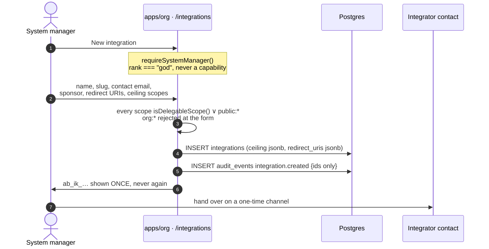
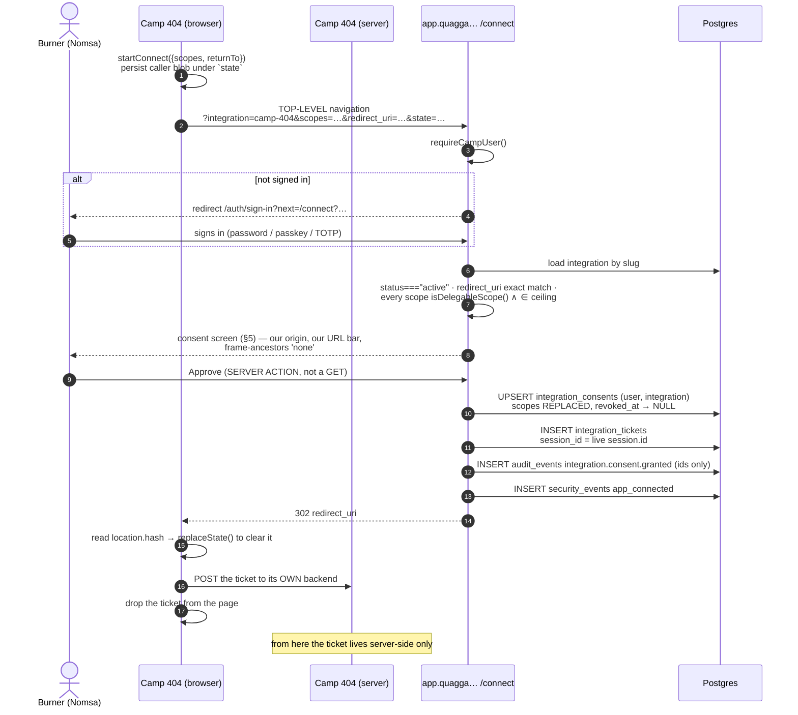
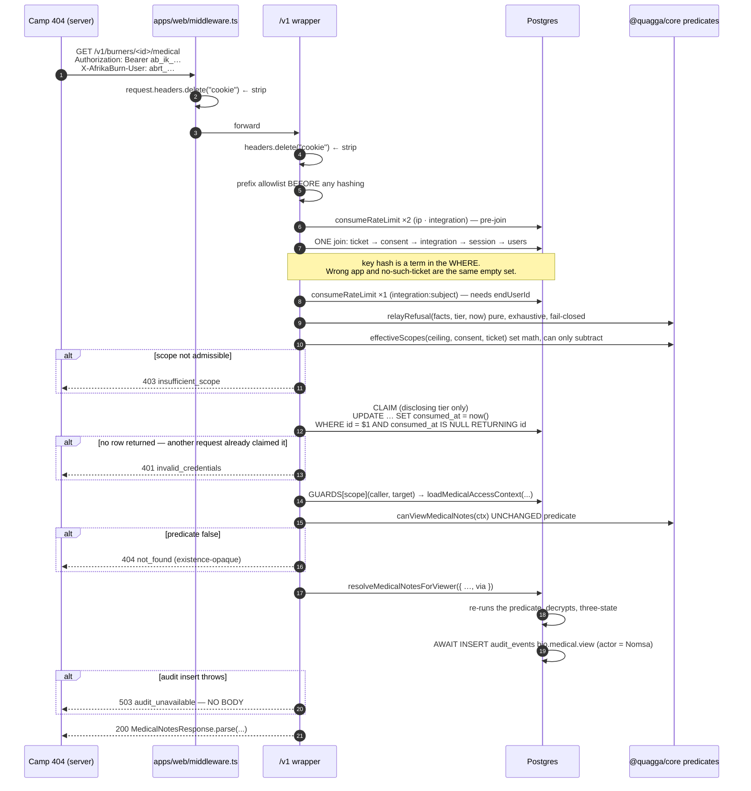
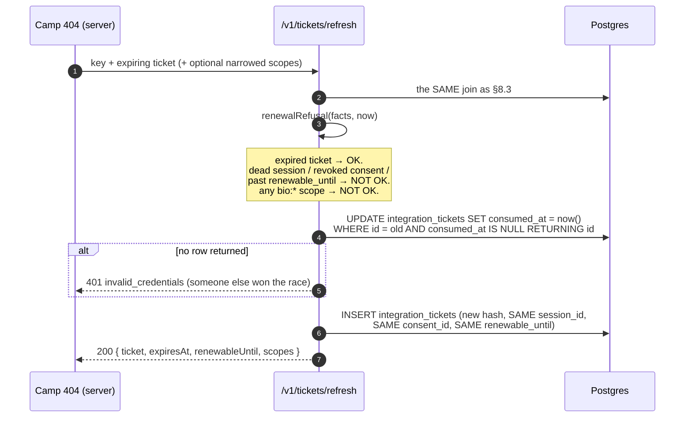
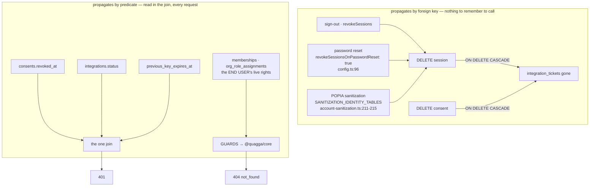
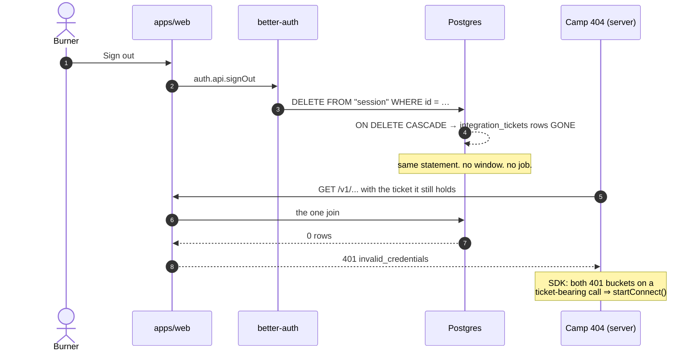
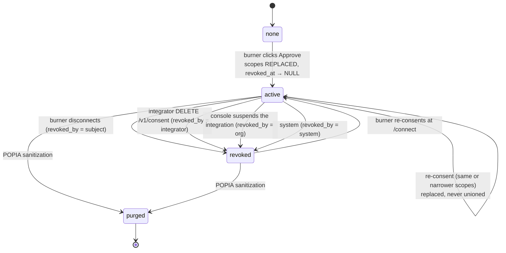
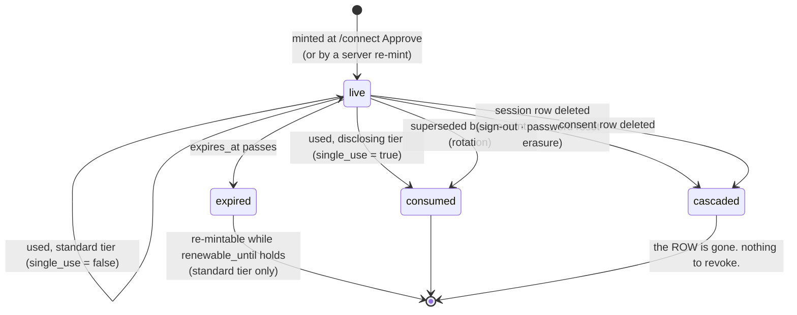

## 07 — Delegated identity: the relay ticket

The contract for how an application outside this monorepo — Camp 404
(github.com/ryry79261/camp-404) first — acts **for a named burner** against `/v1`, and
how the platform proves that burner was there.

This document supersedes `docs/sdk/04-backend-work-required.md` §4.3.12 in full. `POST
/v1/delegations` with a body field naming a user does not exist in any version, and CI
scans for the absence of the identifier (§18). It is the resolution of `docs/sdk/06-review.md`
finding C1.

Where this document and the prior shards conflict, this one wins for delegation, presence
and audit. Everything it does not mention stands as written.

---

## 1. What this settles

Three artifacts, no protocol invention, zero new dependencies.

| Artifact            | Prefix   | What it is                                                                             | What it is not                                                                     |
| ------------------- | -------- | -------------------------------------------------------------------------------------- | ---------------------------------------------------------------------------------- |
| **Integration key** | `ab_ik_` | The app's own long-lived secret. A **ceiling**.                                        | Not a principal. Alone it reaches `public:*` and nothing else.                     |
| **Consent**         | —        | A durable row: this burner permits this app these scopes. Burner-revocable.            | Not a token. Never leaves the database.                                            |
| **Relay ticket**    | `abrt_`  | A 256-bit opaque pointer at a row whose foreign key is the burner's live `session.id`. | **Not a credential.** Useless without the key; useless without a live session row. |

**The load-bearing property: two-factor request authentication.** The key names the app.
The ticket names the human. Neither alone reaches a burner. This is why the ticket may be
delivered through a URL fragment where an OAuth access token could not: a ticket lifted
from a browser, a proxy log or a screenshot buys an attacker nothing unless they also hold
the integrator's server-side key, and if they hold that they did not need the ticket to
begin with.

**The law, restated as a structural property.** Every request resolves

```
effective = resolve(END USER, live from the DB)   ∩ key.ceiling ∩ consent.scopes ∩ ticket.scopes
            └─ the only term that can GRANT ──┘   └────── terms that can only SUBTRACT ──────┘
```

Because the three right-hand terms are pure set intersection, the delegated answer is
**provably a subset** of what that same human gets in `apps/web` signed in as themselves.
Ryan's law — _"the API key can only have as much access as its owner"_ — is therefore a
type of the resolver, not a promise in a review.

---

## 2. The scope vocabulary, and what may be delegated

49 → **50**. One new string in a fifth namespace with exactly one member.

| Namespace                     | Count | Delegable?                   | Tier           |
| ----------------------------- | ----- | ---------------------------- | -------------- |
| `org:<cap>:<domain>`          | 32    | **No — not expressible**     | —              |
| `camp:<ProjectPermissionKey>` | 5     | yes                          | standard       |
| `self:*`                      | 6     | yes                          | standard       |
| `public:*`                    | 6     | yes (and reachable key-only) | public         |
| `bio:medical:read`            | **1** | yes                          | **disclosing** |

`org:*` is not "not issued by default" — `isDelegableScope()` rejects the prefix, and the
50 × 2 table test `org-scopes-are-not-delegable` fails the build if it ever returns true.
The reasoning: org-rank authority is the **console's** authority, sponsored by a System
manager and inspectable in the console. A burner clicking a consent screen is not the party
whose rights are at stake for an org capability, so no consent screen can honestly ask for
one. Refusing the whole prefix also deletes the service user, the `users.kind` column
(which does not exist — verified `packages/db/src/schema.ts:283-306`), both service-user
invariants, and the insider-issues-themselves-a-key path in one decision.

`bio:medical:read` is deliberately **not** `camp:medical:read`. `camp:*` is a 1:1
derivation from `ProjectPermissionKey` (`packages/types/src/roles.ts:262-269`), and medical
access for a lead is decided by the **structural** role — the lead/admin backstop at
`packages/core/src/project-permissions.ts:23-25` — not by a project permission. Its own
namespace makes "medical is a higher tier" structurally enforceable: its own TTL rule, its
own single-use rule, never renewable, its own blocking audit.

**Precondition on `org:*` ever becoming delegable.** The resolver must first recompute
`orgCanInDomain(loadOrgActor(sponsorUserId), cap, domain)` **live on every request**, or a
demoted sponsor leaves a live ceiling that outlives them. This sentence is the failure
message of the `org-scopes-are-not-delegable` test, so it cannot be deleted without a
reviewer reading it.

---

## 3. Client registration

There is no self-service registration endpoint, at any version. Registration is a human act
by a System manager in the org console, on the same reasoning that makes role editing
rank-gated: **the right to create an authority must not itself be a grantable permission.**



### 3.1 What is registered

| Field             | Rule                                                                                                                                                                                                         |
| ----------------- | ------------------------------------------------------------------------------------------------------------------------------------------------------------------------------------------------------------ |
| `slug`            | Unique, immutable. The `/connect` URL names it.                                                                                                                                                              |
| `name`            | Rendered on the consent screen **from the database**, never from the request.                                                                                                                                |
| `contact_email`   | The human a POPIA complaint is addressed through. An integration whose contact no longer reaches a person is suspended, not left running.                                                                    |
| `sponsor_user_id` | Provenance. `onDelete: "restrict"`. **Not a live authority** — nothing is resolved through it at request time, because `org:*` is not delegable.                                                             |
| `redirect_uris`   | `jsonb string[]`. **Exact match, `===` semantics only.** No `startsWith`, no regex, no wildcard, no scheme-less patterns. CI-pinned by `redirect-uri-exact-match`.                                           |
| `ceiling`         | `jsonb string[]`. Every edit writes `audit_events` `integration.ceiling.changed` with `{before, after}` — the house pattern `org.department.domains` already uses (`apps/org/lib/actions/org-roles.ts:337`). |
| `status`          | `active` \| `suspended`. Checked in our resolver, in the join.                                                                                                                                               |

`redirect_uris` is a token-exfiltration primitive if it is editable by anyone who can also
mint a key. Both live behind `requireSystemManager`, and both edits are audited.

### 3.2 Key rotation

Three columns on `integrations`, not a fourth table: `key_hash`, `previous_key_hash`,
`previous_key_expires_at`.

- **Rotate** — mint a new key into `key_hash`, move the old hash to `previous_key_hash`,
  set `previous_key_expires_at = now() + 7 days`.
- **Revoke now** — clears **both** hashes and suspends, in one statement (below).

**`previous_key_expires_at = now()` is NOT a revocation, and an earlier draft of this spec
said it was.** That column is only ever consulted inside the `previous_key_hash` arm of the
resolver's `WHERE`; the live key matches the `i.key_hash = $keyHash` arm and never reaches
it. Expiring the grace window on a key that is still in `key_hash` changes nothing at all.
"Revoke now" is therefore one indivisible statement that makes **both** hashes unmatchable:

```sql
UPDATE integrations
   SET key_hash               = NULL,
       previous_key_hash      = NULL,
       previous_key_expires_at = now(),
       status                 = 'suspended'
 WHERE id = $1
```

`key_hash` is nullable for exactly this reason, and the resolver's `WHERE` compares it to a
presented hash, so `NULL` matches nothing. It is one statement because a console action that
containment depends on must not have a window between two of them.

Both hashes are terms in the resolver's `WHERE` clause (§8.2); the grace _clock_ is
evaluated in the pure refusal function so `key_revoked` is reachable and testable with no
database.

---

## 4. Proof of presence

Presence is the browser's own httpOnly cookie reaching our own handler on our own origin.
It is not asserted by anybody, and there is no request field in which it could be.

### 4.1 Established once, at mint time

| Leg                                                     | Proves                                                                                                  | Why it cannot be forged                                                                                                                                                                                                                                                                                                                                       |
| ------------------------------------------------------- | ------------------------------------------------------------------------------------------------------- | ------------------------------------------------------------------------------------------------------------------------------------------------------------------------------------------------------------------------------------------------------------------------------------------------------------------------------------------------------------- |
| Top-level navigation to `app.example-apex.org/connect`  | the burner's own cookie, on our origin, reached our handler                                             | No cookie spans registrable domains. `resolveCookieDomain` returns `undefined` off-apex (`packages/auth/src/env.ts:200-202`) and the apex is `AUTH_COOKIE_DOMAIN = ".example-apex.org"` (`packages/auth/src/env.ts:38`, `:72`), consumed as `crossSubDomainCookies` at `packages/auth/src/config.ts:266-268`. Camp 404's origin can neither mint nor read it. |
| `requireCampUser()` (`apps/web/lib/session.ts:194-200`) | the whole existing ladder — password / passkey / TOTP — plus existing rate limits and `security_events` | **Zero new authentication code exists to get wrong.**                                                                                                                                                                                                                                                                                                         |
| The re-animation guard inside `ensureCampUser`          | the account is not a sanitized tombstone                                                                | `if (isSanitized(campUser)) return null;` — `apps/web/lib/session.ts:152`, written precisely because the 300s cookie cache can serve a stale session.                                                                                                                                                                                                         |
| Not an iframe                                           | the burner sees our URL bar and our copy                                                                | `Content-Security-Policy: frame-ancestors 'none'` + `X-Frame-Options: DENY` on `/:path*`, `config/security-headers.mjs:18-19`. That header exists because the console was framable and a clickjacked click reached `deleteSupplier` (`security-headers.mjs:3-5`). **It is not weakened for this. The consent screen is a top-level redirect.**                |
| `redirect_uri` exact match against the registered array | the ticket lands where a System manager registered it                                                   | §3.1                                                                                                                                                                                                                                                                                                                                                          |
| Approve is a **server action**, never a GET             | a credential mint is not reachable by navigation                                                        | §17 rejected alternative 6                                                                                                                                                                                                                                                                                                                                    |

### 4.2 Re-established on every single request

`session.expires_at > now()` — as a `JOIN`, not as a check somebody can forget:

```sql
JOIN "session" s ON s.id = t.session_id
```

`session` is `packages/db/src/schema.ts:376-396`: `id text PK`, `expires_at`, `user_id →
user.id ON DELETE CASCADE`. No join, no row, no answer. The 300s signed cookie cache
(`packages/auth/src/config.ts:150-153`) is irrelevant here because we read the **row**, not
the cookie.

### 4.3 Established by a foreign key, not by code

```sql
ALTER TABLE integration_tickets ADD CONSTRAINT integration_tickets_session_id_fk
  FOREIGN KEY (session_id) REFERENCES "session"(id) ON DELETE CASCADE;
```

All three revocation paths hard-delete `session` rows:

| Path                                      | Where                                                                                                                               |
| ----------------------------------------- | ----------------------------------------------------------------------------------------------------------------------------------- |
| Sign-out / revoke session / revoke others | `auth.api.revokeSession` etc., `docs/accounts-security-spec.md:38`                                                                  |
| Password reset                            | `revokeSessionsOnPasswordReset: true`, set **explicitly** at `packages/auth/src/config.ts:96` because Better Auth defaults it false |
| POPIA sanitization                        | `SANITIZATION_IDENTITY_TABLES = ["session","account","user"]`, hard-deleted, `packages/core/src/account-sanitization.ts:211-215`    |

Postgres does the rest in the same statement. **Revocation is a foreign key, not a job.**
There is no propagation window and nothing to remember to call.

### 4.4 What is refused as a presence input

| Refused                                                     | Because                                                                                                                                                      |
| ----------------------------------------------------------- | ------------------------------------------------------------------------------------------------------------------------------------------------------------ |
| Any request field naming a subject                          | The subject is a **column on a row the burner wrote**. CI: `no-subject-id-in-v1` scans for the identifier's absence anywhere under `apps/web/app/api/v1/**`. |
| `Origin` / `Referer`                                        | `curl -H 'Origin: …'` defeats it in one flag. Already ruled at `docs/sdk/04-backend-work-required.md:256-257`.                                               |
| The apex session cookie on `/v1`                            | Deleted **twice** — §7.3. Finding C3 is invisible in testing because the cookie subject and the ticket subject are usually the same person.                  |
| A ticket presented without a key, or with another app's key | The join returns nothing. Indistinguishable from "no such ticket".                                                                                           |

### 4.5 What this does not prove — stated plainly

It does not prove a human is at the keyboard at that millisecond. It proves the burner's
session was **alive at the instant of the read** and that they clicked Approve within the
ticket's lifetime — ≤120 seconds for medical. That is the strongest honest claim available
without per-read re-authentication, which would make the emergency path unusable. Any
document that claims more is wrong.

---

## 5. The consent screen

Rendered by `apps/web/app/(app)/connect/page.tsx`, inside the participant app's normal
session gate. Three variants; the copy is the contract.

### 5.1 Standard tier (`self:*`, `camp:*`)

> ### Connect **Camp 404**
>
> Camp 404 is asking to act as you on AfrikaBurn. It will only ever see what **you** can
> see — connecting an app never gives it more than your own account has.
>
> **It will be able to**
>
> - read your own profile and bio
> - see the member details of camps you lead
>
> Access lasts as long as you stay signed in here, and at most 24 hours before Camp 404 has
> to ask again.
>
> Camp 404 keeps its own copy of anything you share. Disconnecting stops new access; it
> cannot delete what they already have.
>
> [ Connect ] [ Cancel ]
>
> <small>You can disconnect at any time from Account → Connected apps.</small>

### 5.2 Disclosing tier (`bio:medical:read`)

No shortcut of any kind exists for this tier — no silent path, no remembered approval, no
"don't ask again". The copy reuses `MEDICAL_AUDIENCE_NOTE` (`packages/core/src/bio.ts:156`)
verbatim, so the burner reads the same sentence here that they read on the bio form:

> ### **Camp 404** wants to see medical information
>
> _Your camp leads and AfrikaBurn's safety team can see this. It's here so someone can help
> you if something goes wrong on site._
>
> Camp 404 wants to see medical information for members of camps you lead. **This is the
> same information you can already see on AfrikaBurn** — connecting an app never gives it
> more than your own account has.
>
> Every time Camp 404 reads it, we record it against **your** name — not Camp 404's —
> because you are the one who is allowed to look, and the person whose notes they are can
> see that record.
>
> **Access lasts two minutes, is good for one read, and cannot run in the background.**
> Camp 404 will have to send you back here the next time it needs this.
>
> Camp 404 keeps its own copy of anything you share. Disconnecting stops new access; it
> cannot delete what they already have.
>
> [ Allow for two minutes ] [ Cancel ]

### 5.3 Reconnect (the consent already exists and is unchanged)

Same screen, headed _"Reconnect Camp 404"_, listing the scopes unchanged and stating when
they were first granted. It is still a click. Never a redirect that mints on sight.

### 5.4 Rules the screen obeys

1. **Everything identifying the app comes from the database.** `integrations.name`, the
   sponsoring department. Never a query parameter. An attacker who registers
   `camp404-official` cannot render themselves as "Camp 404".
2. **A scope outside the ceiling renders a generic refusal that never says which.** No
   ceiling probe. Same reasoning as `orgCapabilityRefusal` never naming a department the
   caller cannot see (`packages/core/src/org-permissions.ts:621`).
3. **Scope prose is generated from the closed vocabulary**, one sentence per scope, no
   scrolling grid. A vocabulary of 18 delegable strings fits on a screen; that is why
   RFC 9396 rich authorization requests are not needed (§17).
4. **Re-consent replaces, never unions.** Consenting to less genuinely reduces the grant.
5. **Approve is a server action.** Cancel is a server action. Neither is a GET.

---

## 6. The connect flow



### 6.1 The `/connect` request

```
GET https://app.example-apex.org/connect
  ?integration=camp-404
  &scopes=camp:view_member_details%20bio:medical:read     space-delimited
  &redirect_uri=https://camp404.example/ab/callback        exact match, registered
  &state=<opaque, ≤128 chars, [A-Za-z0-9._~-]>
```

**No caller blob is accepted or echoed.** `startConnect()` persists whatever the caller
wants to carry in the caller's own `sessionStorage`, keyed by `state`; we echo `state` and
nothing else. A server that echoes arbitrary attacker-supplied bytes into a fragment on a
third-party origin is a free delivery vector the moment that integrator renders it; `state`
is charset- and length-bounded by contract, a blob is not. _(Spec author's call — this
diverges from the DECISION's `&ctx=<blob>`; see §21 item 2.)_

### 6.2 The ticket at the redirect

```
https://camp404.example/ab/callback#ticket=abrt_<43 chars>&state=<echo>
```

**Fragment, never query string.** A fragment never reaches a CDN, a proxy, an access log or
a referrer header, and it sidesteps `Referrer-Policy` entirely. The SDK's browser half
reads it, calls `history.replaceState` to clear it, and hands it to the integrator's
backend. It sets `location.href` and reads `location.hash`; **it never calls `/v1`.** That
is why there is no CORS (§16.3).

### 6.3 Denial

`302 redirect_uri#error=access_denied&state=<echo>`. No ticket, no consent row written, no
`security_events` row. A cancelled consent is not a security event.

---

## 7. The delegated call



### 7.1 The two headers

```
Authorization: Bearer ab_ik_<43 chars>     the app. A ceiling.
X-AfrikaBurn-User: abrt_<43 chars>         the human. A pointer at a live session row.
```

A request carrying only `Authorization` may reach `public:*` and nothing else. A request
carrying only `X-AfrikaBurn-User` is `invalid_credentials` before anything is hashed.

### 7.2 Order of operations, and why

1. **Cookie strip** — before anything reads a header.
2. **Prefix allowlist** — anything not `ab_ik_` / `abrt_` is refused _before_ it is hashed.
   Cheap, and it keeps garbage out of the hash path.
3. **The two pre-join rate limits** — `v1_ip` and `v1_key`, so a flood costs one
   `action_rate_limit` statement, not a five-table join. `v1_subject` **cannot** be one of
   them: its key contains `endUserId`, which is an _output_ of the join. It is consumed at
   step 5, still ahead of every read.
4. **The join** — one statement. `createHttpDb()` has **no transactions**
   (`packages/db/src/index.ts:37-39`), so every fact that must be mutually consistent is
   established in one statement rather than a sequence a concurrent revoke could split.
5. **`v1_subject`** — the per-burner counter, now that the burner is known.
6. **`relayRefusal`** — pure, no I/O.
7. **`effectiveScopes`** — pure, set math.
8. **The claim, on the disclosing tier only** — see §7.2.1. Ahead of the guard, because a
   ticket burned after the read is not single-use.
9. **The guard** — the first thing that can say _yes_, and it is a `@quagga/core` predicate.
10. **The read.**
11. **The audit** — blocking on the disclosing path.

### 7.2.1 The claim comes BEFORE the guard, and this is the whole of it

An earlier draft of this spec burned the ticket at the end — "after the predicate said yes,
before the body is built, so a refusal the burner did not cause never costs her the ticket."
That ordering is wrong, and it is wrong in the way that matters most.

`resolveRelayCaller` reads `consumed_at` as a **returned column**, not a `WHERE` term, and
`relayRefusal` is a pure function evaluating the snapshot that join produced. So N concurrent
requests carrying the same 120-second medical ticket and N different subject ids each see
`consumed_at IS NULL`, each pass `relayRefusal`, each run the guard, each decrypt, each write
an audit row, and each return notes. Exactly one wins the burn at the end. **The losers have
already disclosed.** One consent click yields as many medical notes as the caller can open
sockets — and the burner was told "good for one read" (§5.2).

The bound is `v1_subject` at 60/60s, which §6.2 of shard 03 makes **fail open on a storage
error by design**, and which §21 flags as possibly removable. A rate limit is not an
atomicity mechanism.

**The rule.** When `scopeTier(requiredScope) === "disclosing"`, claim the ticket immediately
after `resolveRelayCaller` and before `GUARDS[...]`:

```sql
UPDATE integration_tickets
   SET consumed_at = now()
 WHERE id = $1 AND consumed_at IS NULL
RETURNING id
```

No row returned ⇒ `401 invalid_credentials`. This is the same compare-and-swap §10 rule 6
already uses on the refresh path, applied to the path that discloses.

**What this costs, stated plainly.** A predicate refusal now consumes the ticket. A camp lead
who requests a member of the wrong camp gets `404` and must return to the consent screen. That
is what "one read" means, the burner is one click from another, and it is the correct trade:
the alternative preserved a nicety for the caller and left a hole under it.

**The one alternative that also works.** `packages/db/src/index.ts:37-39` is explicit that
`createHttpDb()` has no transactions **but `createPooledDb()` is a WebSocket pool that DOES**,
and that "multi-statement atomic work must use the pool". So the disclosing path may instead
run on the pool inside a transaction with `SELECT … FOR UPDATE` on the ticket row, which keeps
the refusal-is-free property. It costs a pooled connection on the hottest-consequence path and
a second db handle in the wrapper. Take it only if the refusal-is-free property is judged worth
that; otherwise claim first.

**CI check `disclosing-ticket-claimed-before-predicate`.** The existing `ticket-tier-invariant`
inspects the mint and cannot see this. The new check asserts that in the disclosing branch of
the wrapper the claim statement precedes the `GUARDS` call.

### 7.3 The cookie is deleted twice

`ls apps/*/middleware.ts` returns nothing today — **there is no middleware in any app.**
One is added for `apps/web` whose only job is this, and the wrapper does it again:

```ts
// apps/web/middleware.ts — NEW FILE. Its entire purpose.
import { NextResponse, type NextRequest } from "next/server";

export function middleware(request: NextRequest) {
  const headers = new Headers(request.headers);
  headers.delete("cookie");
  return NextResponse.next({ request: { headers } });
}

export const config = { matcher: "/v1/:path*" };
```

Two independent strips, one of them _outside_ the handler, because C3 is invisible in
testing: the cookie subject and the ticket subject are usually the same person, so a
resolution bug produces correct-looking answers until the day it does not. The CI check is
a **transitive import-graph scan** (`v1-never-reads-cookies`), not a route-file scan — four
stores reach `getCurrentCampUser` one call deeper (`apps/web/lib/session.ts:183-192`), and
`ensureCampUser` runs `bootstrapGod` on every call (defined `apps/web/lib/session.ts:63`,
called unconditionally at `:163`), so a
cookie-authenticated identity could be _created and elevated_ by a request the wrapper
believed was key-authenticated.

---

## 8. The three-way intersection, implemented

### 8.0 It is two stages, and they are different in kind

The most important correction to how this has been described elsewhere: **the end user's
rights are not a set of scope strings**, and projecting them into one is exactly the second
authorisation path `packages/core/src/org-permissions.ts:20-25` exists to prevent.

```
STAGE 1 — THE SCOPE GATE.   Set math. Cheap. Can ONLY subtract.
    admissible = ticket.scopes ∩ consent.scopes(live) ∩ integration.ceiling(live)
    ⇒ 403 insufficient_scope

STAGE 2 — THE RIGHTS GATE.  The decision. UNCHANGED @quagga/core predicates,
    over an actor loaded LIVE from the DB for the END USER.
    canViewMedicalNotes / hasProjectPermission / orgCanInDomain
    ⇒ 404 not_found (existence-opaque)
```

Scopes narrow. Predicates decide. Neither can widen the other.

### 8.1 Where each term resolves

| Term                  | Resolved     | From                                                                                                                    | Cacheable |
| --------------------- | ------------ | ----------------------------------------------------------------------------------------------------------------------- | --------- |
| key ceiling           | request time | `integrations.ceiling`, in the join                                                                                     | **never** |
| consented scopes      | request time | `integration_consents.scopes`, `revoked_at IS NULL`, in the join                                                        | **never** |
| ticket scopes         | request time | `integration_tickets.scopes` — a narrowing _hint_, never an authority                                                   | **never** |
| presence              | request time | `JOIN "session" s ON s.id = t.session_id`, `s.expires_at > now()`                                                       | **never** |
| **END USER's rights** | request time | `loadOrgActor` / `loadCampPermissions` / `loadMedicalAccessContext` in `packages/db/src/actors.ts`, keyed on `users.id` | **never** |

Nothing is a token claim. Nothing is a manifest claim. There is **no sweep job**, and there
must never be one — a job's schedule would become the security boundary.

### 8.2 The pure half — `packages/core/src/delegation.ts`

```ts
// The delegation vocabulary and the liveness decision. PURE — no I/O, no DB, no
// clock of its own. Every arm is a refusal and the null default is reached only
// when all of them pass, so this is fail-closed by construction: a reviewer can
// enumerate every way a delegated call dies without mocking anything.

import type { OrgDomain, ProjectPermissionKey } from "@quagga/types";

// FOUR of the five `OrgCapabilityKey` values. `personal_information` is a
// CAPABILITY, never a scope — the inherited vocabulary is explicit about this
// (`docs/sdk/01-overview-and-capability-model.md:239-240` and the `4 × 8 = 32`
// row at `:263`), and `OrgCapabilityKey` has five members
// (`packages/types/src/roles.ts:141-147`), so writing the template over the
// whole enum would silently mint 40 strings and re-admit
// `org:personal_information:*` — the exact regression `06-review.md:336` (A1)
// names. 4 × 8 = 32.
export type OrgScope =
  `org:${"create" | "read" | "update" | "delete"}:${OrgDomain}`;
export type CampScope = `camp:${ProjectPermissionKey}`;
export type SelfScope =
  | "self:profile:read"
  | "self:profile:write"
  | "self:notifications:read"
  | "self:notifications:write"
  | "self:registrations:read"
  | "self:registrations:write";
export type PublicScope =
  | "public:editions:read"
  | "public:camps:read"
  | "public:profiles:read"
  | "public:bulletins:read"
  | "public:suppliers:read"
  | "public:categories:read";
/** The fifth namespace. Exactly one member, on purpose: a separate namespace makes
 *  "medical is a higher tier" structurally enforceable rather than a convention. */
export type BioScope = "bio:medical:read";

export type Scope = OrgScope | CampScope | SelfScope | PublicScope | BioScope;

/** Everything a relay ticket may ever carry. `org:*` is EXCLUDED AT THE TYPE LEVEL:
 *  a delegated org call is not "not issued by default", it is not expressible.
 *
 *  PRECONDITION if this ever changes: the resolver must first recompute
 *  orgCanInDomain(loadOrgActor(sponsorUserId), cap, domain) LIVE on every request,
 *  or a demoted sponsor leaves a live ceiling that outlives them. */
export type DelegableScope = Exclude<Scope, OrgScope>;

export const DELEGABLE_SCOPE_PREFIXES = [
  "self:",
  "camp:",
  "bio:",
  "public:",
] as const;

export function isDelegableScope(s: string): s is DelegableScope {
  return DELEGABLE_SCOPE_PREFIXES.some((p) => s.startsWith(p));
}

export type ScopeTier = "public" | "standard" | "disclosing";

/** Total over all 50 strings. Pinned by `every-scope-has-a-tier`. */
export function scopeTier(s: Scope): ScopeTier {
  if (s.startsWith("public:")) return "public";
  if (s.startsWith("bio:")) return "disclosing";
  return "standard";
}

/** POSITIVE allowlist. A denylist is one forgotten entry from being wrong, which is
 *  the same reasoning that keeps `personal_information` ABSENT from the console's
 *  scope grid rather than greyed out. `bio:*` is not here and never will be. */
export const RENEWABLE_SCOPES: readonly DelegableScope[] = [
  "self:profile:read",
  "self:profile:write",
  "self:notifications:read",
  "self:notifications:write",
  "self:registrations:read",
  "self:registrations:write",
  "camp:view_member_details",
  "camp:manage_members",
  "camp:manage_roles",
  "camp:assign_roles",
  "camp:manage_questionnaires",
  "public:editions:read",
  "public:camps:read",
  "public:profiles:read",
  "public:bulletins:read",
  "public:suppliers:read",
  "public:categories:read",
];

const RENEWABLE = new Set<string>(RENEWABLE_SCOPES);
export function isRenewableScope(s: string): boolean {
  return RENEWABLE.has(s);
}

/** THE INTERSECTION. Returns a narrowed VOCABULARY, never an "allowed".
 *  There is nothing in this function that can say yes. */
export function effectiveScopes(input: {
  ceiling: readonly string[];
  consented: readonly string[];
  requested: readonly string[];
}): DelegableScope[] {
  const ceiling = new Set(input.ceiling);
  const consented = new Set(input.consented);
  return input.requested.filter(
    (s): s is DelegableScope =>
      isDelegableScope(s) && ceiling.has(s) && consented.has(s),
  );
}

/** Internal. NEVER appears on the wire — §13 collapses it to two buckets. It
 *  surfaces in full in the org console's Activity tab and in server logs, where
 *  the reader is already trusted. */
export type RelayRefusal =
  | "no_ticket"
  | "unknown_ticket"
  | "ticket_expired"
  | "ticket_consumed"
  | "session_ended"
  | "consent_revoked"
  | "renewal_window_closed"
  | "key_revoked"
  | "integration_suspended"
  | "subject_sanitized"
  | "empty_intersection";

export interface RelayFacts {
  integrationStatus: "active" | "suspended";
  /** True when the presented key matched `previous_key_hash` rather than `key_hash`. */
  keyIsPrevious: boolean;
  previousKeyExpiresAt: Date | null;
  subjectSanitizedAt: Date | null;
  consentRevokedAt: Date | null;
  sessionExpiresAt: Date;
  ticketExpiresAt: Date;
  ticketConsumedAt: Date | null;
  ticketSingleUse: boolean;
  /** ticket ∩ consent ∩ ceiling, already computed by `effectiveScopes`. */
  admissibleScopeCount: number;
}

/**
 * Every way a delegated call dies, in one total function.
 *
 * ORDER MATTERS AND IS DELIBERATE: the integration-wide states come first, then
 * the account, then the grant, then the session, then the ticket. A suspended
 * integration must not be able to learn from the refusal that a particular
 * burner's session has ended.
 */
export function relayRefusal(
  f: RelayFacts,
  tier: ScopeTier,
  now: Date,
): RelayRefusal | null {
  if (f.integrationStatus !== "active") return "integration_suspended";
  if (
    f.keyIsPrevious &&
    (f.previousKeyExpiresAt === null || f.previousKeyExpiresAt <= now)
  ) {
    return "key_revoked";
  }
  if (f.subjectSanitizedAt !== null) return "subject_sanitized";
  if (f.consentRevokedAt !== null) return "consent_revoked";
  if (f.sessionExpiresAt <= now) return "session_ended";
  if (f.ticketExpiresAt <= now) return "ticket_expired";
  if (f.ticketConsumedAt !== null) return "ticket_consumed";
  // A disclosing-tier ticket is minted single-use (§9.2). A row that violates
  // that mint invariant is corrupt, and the fail-closed reading of a corrupt row
  // is that it is not a ticket at all.
  if (tier === "disclosing" && !f.ticketSingleUse) return "unknown_ticket";
  if (f.admissibleScopeCount === 0) return "empty_intersection";
  return null;
}

export interface RenewalFacts extends RelayFacts {
  renewableUntil: Date | null;
  /** Every scope the integrator asked to carry forward. */
  requestedScopes: readonly string[];
}

/** Server-to-server re-mint (§10). Stricter than `relayRefusal`: an expired
 *  ticket may be renewed, a revoked consent or a dead session never may. */
export function renewalRefusal(
  f: RenewalFacts,
  now: Date,
): RelayRefusal | null {
  if (f.integrationStatus !== "active") return "integration_suspended";
  if (
    f.keyIsPrevious &&
    (f.previousKeyExpiresAt === null || f.previousKeyExpiresAt <= now)
  ) {
    return "key_revoked";
  }
  if (f.subjectSanitizedAt !== null) return "subject_sanitized";
  if (f.consentRevokedAt !== null) return "consent_revoked";
  if (f.sessionExpiresAt <= now) return "session_ended";
  if (f.ticketConsumedAt !== null) return "ticket_consumed";
  if (f.renewableUntil === null || f.renewableUntil <= now) {
    return "renewal_window_closed";
  }
  if (!f.requestedScopes.every(isRenewableScope))
    return "renewal_window_closed";
  if (f.admissibleScopeCount === 0) return "empty_intersection";
  return null;
}
```

Coverage floor for this file: **100/100/100/100**, matching `medical-access.ts` and
`privacy.ts` (`packages/core/vitest.config.ts`). A tripwire, not a measurement — anything
that fails it is a predicate someone smuggled in.

### 8.3 The impure half — one query, one file

`apps/web/lib/v1/relay.ts`:

```ts
import "server-only";

import { sql } from "drizzle-orm";
import {
  effectiveScopes,
  relayRefusal,
  scopeTier,
  type DelegableScope,
  type RelayRefusal,
  type Scope,
} from "@quagga/core";
import { db } from "@/lib/db";
// Reused VERBATIM. 256 uniform bits have no dictionary, so a slow KDF buys
// nothing but latency on every request — the reasoning is written out at
// apps/web/lib/account-tokens.ts:8-17.
import { hashToken } from "@/lib/account-tokens";

const KEY_PREFIX = "ab_ik_";
const TICKET_PREFIX = "abrt_";

export interface RelayCaller {
  endUserId: string;        // users.id — OUR uuid, never Better Auth's text user.id
  integrationId: string;
  integrationSlug: string;
  consentId: string;
  ticketId: string;
  ticketSingleUse: boolean;
  scopes: readonly DelegableScope[];
}

interface RelayRow {
  ticket_id: string;
  ticket_scopes: string[];
  single_use: boolean;
  ticket_expires_at: string;
  consumed_at: string | null;
  renewable_until: string | null;
  consent_id: string;
  consent_scopes: string[];
  consent_revoked_at: string | null;
  integration_id: string;
  integration_slug: string;
  integration_status: "active" | "suspended";
  ceiling: string[];
  key_is_previous: boolean;
  previous_key_expires_at: string | null;
  session_expires_at: string;
  end_user_id: string;
  sanitized_at: string | null;
}

function date(v: string | null): Date | null {
  return v === null ? null : new Date(v);
}

/**
 * Resolve the caller of a /v1 request that names a burner.
 *
 * ONE STATEMENT. `createHttpDb()` has no transactions (packages/db/src/index.ts:37-39),
 * so every fact that must be mutually consistent — ticket, consent, integration,
 * session, account — is established in a single statement rather than a sequence a
 * concurrent revoke could split.
 *
 * THE KEY HASH IS A TERM IN THE `WHERE`. Audience binding is therefore a join, not
 * a comparison somebody can forget, and "ticket minted for another app" and "no such
 * ticket" are the same empty result set — the wrong-app oracle is removed for free.
 */
export async function resolveRelayCaller(
  headers: Headers,
  requiredScope: Scope,
  now: Date = new Date(),
): Promise<{ caller: RelayCaller } | { refusal: RelayRefusal }> {
  const bearer = headers.get("authorization")?.replace(/^Bearer\s+/i, "") ?? "";
  const ticket = headers.get("x-afrikaburn-user") ?? "";

  // Prefix allowlist BEFORE anything is hashed.
  if (ticket === "") return { refusal: "no_ticket" };
  if (!bearer.startsWith(KEY_PREFIX) || !ticket.startsWith(TICKET_PREFIX)) {
    return { refusal: "unknown_ticket" };
  }

  const keyHash = hashToken(bearer);
  const ticketHash = hashToken(ticket);

  const result = (await db().execute(sql`
    SELECT t.id                        AS ticket_id,
           t.scopes                    AS ticket_scopes,
           t.single_use                AS single_use,
           t.expires_at                AS ticket_expires_at,
           t.consumed_at               AS consumed_at,
           t.renewable_until           AS renewable_until,
           c.id                        AS consent_id,
           c.scopes                    AS consent_scopes,
           c.revoked_at                AS consent_revoked_at,
           i.id                        AS integration_id,
           i.slug                      AS integration_slug,
           i.status                    AS integration_status,
           i.ceiling                   AS ceiling,
           -- COALESCE, not a bare comparison: `previous_key_hash` is NULL until
           -- the first rotation, and `NULL = $2` is NULL, not false. Without it
           -- `key_is_previous` arrives as null and the TS type below is a lie.
           COALESCE(i.previous_key_hash = ${keyHash}, false) AS key_is_previous,
           i.previous_key_expires_at   AS previous_key_expires_at,
           s.expires_at                AS session_expires_at,
           u.id                        AS end_user_id,
           u.sanitized_at              AS sanitized_at
      FROM integration_tickets  t
      JOIN integration_consents c ON c.id = t.consent_id
      JOIN integrations         i ON i.id = c.integration_id
      JOIN "session"            s ON s.id = t.session_id
      -- THE SESSION AND THE CONSENT MUST NAME THE SAME HUMAN. `session.user_id`
      -- references better-auth's `user.id` (packages/db/src/schema.ts:389-391)
      -- and `users.auth_user_id` is our link to it (schema.ts:287). Joining
      -- `users` on `c.user_id` ALONE would leave the ticket's two foreign keys
      -- unrelated at read time — the §9.3 binding chain would be an invariant of
      -- the mint rather than a term in the query. Both, so it is neither.
      JOIN users                u ON u.id = c.user_id
                                 AND u.auth_user_id = s.user_id
     WHERE t.token_hash = ${ticketHash}
       AND (i.key_hash = ${keyHash} OR i.previous_key_hash = ${keyHash})
     LIMIT 1
  `)) as unknown as { rows?: RelayRow[] };

  const rows = Array.isArray(result) ? (result as RelayRow[]) : (result.rows ?? []);
  const row = rows[0];
  // No row: no such ticket, another app's ticket, a rotated-away key, or a
  // signed-out burner whose ticket the session CASCADE already deleted. All one
  // answer, deliberately.
  if (!row) return { refusal: "unknown_ticket" };

  const scopes = effectiveScopes({
    ceiling: row.ceiling,
    consented: row.consent_scopes,
    requested: row.ticket_scopes,
  }).filter((s) => s === requiredScope);

  const refusal = relayRefusal(
    {
      integrationStatus: row.integration_status,
      keyIsPrevious: row.key_is_previous,
      previousKeyExpiresAt: date(row.previous_key_expires_at),
      subjectSanitizedAt: date(row.sanitized_at),
      consentRevokedAt: date(row.consent_revoked_at),
      sessionExpiresAt: new Date(row.session_expires_at),
      ticketExpiresAt: new Date(row.ticket_expires_at),
      ticketConsumedAt: date(row.consumed_at),
      ticketSingleUse: row.single_use,
      admissibleScopeCount: scopes.length,
    },
    scopeTier(requiredScope),
    now,
  );
  if (refusal) return { refusal };

  return {
    caller: {
      endUserId: row.end_user_id,
      integrationId: row.integration_id,
      integrationSlug: row.integration_slug,
      consentId: row.consent_id,
      ticketId: row.ticket_id,
      ticketSingleUse: row.single_use,
      scopes,
    },
  };
}
```

The `.execute()` cast idiom (array-or-`{rows}`) is the one already in use at
`packages/db/src/rate-limit.ts:106-125`; it is not new ceremony.

### 8.4 The prerequisite that makes term one sound — `packages/db/src/actors.ts`

**Three call sites want an `OrgActor` from a `users.id`, and two of them disagree today.**
This is a live production defect, it is the widest input to the intersection, and it is
**stage 0 of the delivery plan** (§20). If the extraction preserves it, every other control
in this document is a fence around an open gate.

Verified verbatim at `apps/web/lib/medical-access.ts:215`:

```ts
rank: orgRankFromRole(actorOrgRole) ?? "org_staff",
```

`apps/org/lib/session.ts:234-235` treats the same `null` as **forbidden**:

```ts
const rank = orgRankFromRole(membership?.role);
if (rank && membership) {
  /* …resolve… */
}
// else → { kind: "forbidden" }
```

`orgRankFromRole` is documented as _"THE CONSOLE GATE and nothing else"_
(`packages/core/src/org-permissions.ts:175-182`), and it returns `null` for exactly the
roles that are **not** org ranks — `ORG_RANKS = ["engineer","org_staff","god"]` (`:150`), so
`lead` / `admin` / `member` on an org group. Coercing that `null` to `org_staff` — the rank
with **no ceiling at all** (`ENGINEER_RANK_CARVE_OUTS` `:300-303`, applied by
`isRankCarveOut` `:312`) — is the fail-open, and it bites in
two distinct ways. Be precise about which, because the imprecise version is easy to dismiss:

1. **Directly:** an org-group `member` (the console door _closed_ — `apps/org/lib/session.ts:234-235`
   refuses them) is handed rank `org_staff` in `apps/web`, and their org roles are then
   resolved as if they were staff.
2. **In combination with the fold below:** an `engineer` alone does _not_ hit the coercion —
   `orgRankFromRole("engineer")` is non-null. They reach it only because a later `member` row
   on a second org group **overwrites** their role (next paragraph), after which
   `orgRankFromRole("member")` is `null` and the coercion fabricates `org_staff`. That is the
   path that gets past `ENGINEER_RANK_CARVE_OUTS`, which otherwise makes
   `personal_information` unreachable _by rank, however their roles are written_.

The inherited spec already found item 1 and scheduled the fix
(`docs/sdk/04-backend-work-required.md:949-952`, task 8 at `:1422`), calling it _"latent
today because the console's write path always sets a rank first"_. Item 2 is the reason it is
not merely latent, and it is why this is stage 0 rather than a cleanup.

And the fold above it, also verbatim (`apps/web/lib/medical-access.ts:141-146`; the comment
is `:141-143`):

```ts
// "so the outcome does not depend on row order"     ← the comment
if (isOrgGroup) {
  if (!isOrgStaffRole(actorOrgRole)) actorOrgRole = row.role;
  actorOrgMembershipIds.push(row.id);
}
```

`ORG_STAFF_ROLES` is `{god, org_staff}` only (`packages/core/src/medical-access.ts:56-59`),
so an `engineer` **is** overwritten by a later `member` row on a second org group. The
comment is false for `engineer`. The existing regression test uses `god`
(`apps/web/lib/__tests__/medical-access-resolver.test.ts:227-250`) and therefore
structurally cannot fail on this.

`packages/db` already imports `@quagga/core` (`packages/db/package.json:27`) and the reverse
is forbidden (`README.md:135-137`), so `packages/db/src/actors.ts` is the one place all three
apps and `/v1` can share.

**Two deliberate divergences from the inherited plan, flagged rather than silently taken.**
`docs/sdk/04-backend-work-required.md:935` names the file `packages/db/src/actor.ts`
(singular) and sketches `loadCampPermissions(db, userId, groupIds?): Promise<CampSubject[]>`
(`:942-946`). This document uses `actors.ts` (the file holds three loaders, not one actor)
and a **single-group** `loadCampPermissions(db, userId, groupId)` returning
`PermissionMembership | null`, because that is the exact input `hasProjectPermission` takes
and it is the shape `getMemberPermissions` already produces (`apps/web/lib/roles-store.ts:869`).
A multi-group variant can be added later; a plural return type here would force every guard
to pick a row, which is a decision the guards must not make. Pick one filename before
stage 0 starts — the divergence is cosmetic, but two half-done extractions is the failure
mode §19 item 1 describes.

```ts
// packages/db/src/actors.ts — ONE resolution path for "who is this human, live".
// apps/org/lib/session.ts, apps/web/lib/medical-access.ts and /v1 all call these.
// FIX, DO NOT COPY: the org rank fails CLOSED here.

import { and, eq, inArray } from "drizzle-orm";
import {
  buildDomainOwnership,
  isOrgStaffRole,
  orgRankFromRole,
  sanitizeOrgPermissions,
  type MedicalAccessContext,
  type OrgActor,
  type OrgRoleGrant,
  type PermissionMembership,
} from "@quagga/core";
import type { MembershipRole } from "@quagga/types";
import type { Database } from "./index";
import * as schema from "./schema";

/** Rank strength, so the strongest org row wins REGARDLESS OF ROW ORDER — the
 *  property `apps/web/lib/medical-access.ts:141-143` claims and does not have. */
const RANK_STRENGTH: Record<string, number> = {
  god: 3,
  org_staff: 2,
  engineer: 1,
};

function strongerRole(
  a: MembershipRole | null,
  b: MembershipRole | null,
): MembershipRole | null {
  const sa = a ? (RANK_STRENGTH[a] ?? 0) : 0;
  const sb = b ? (RANK_STRENGTH[b] ?? 0) : 0;
  return sb > sa ? b : a;
}

/**
 * The org actor for a human, or NULL when their org membership role is not an org
 * rank at all. FAILS CLOSED — this is the whole point of the extraction. There is
 * deliberately no `?? "org_staff"`: `orgRankFromRole` IS the console gate
 * (packages/core/src/org-permissions.ts:175-182), and a caller that coerces its
 * null resolves an engineer's roles with no rank ceiling.
 */
export async function loadOrgActor(
  db: Database,
  dbUserId: string,
): Promise<OrgActor | null> {
  const orgGroups = await db
    .select({ id: schema.groups.id })
    .from(schema.groups)
    .where(eq(schema.groups.kind, "org"));
  if (orgGroups.length === 0) return null;
  const orgGroupIds = orgGroups.map((g) => g.id);

  const rows = await db
    .select({ id: schema.memberships.id, role: schema.memberships.role })
    .from(schema.memberships)
    .where(
      and(
        eq(schema.memberships.userId, dbUserId),
        inArray(schema.memberships.groupId, orgGroupIds),
      ),
    );
  if (rows.length === 0) return null;

  let role: MembershipRole | null = null;
  for (const r of rows) role = strongerRole(role, r.role);
  const rank = orgRankFromRole(role);
  if (!rank) return null; // ← the fix. apps/web used to coerce this to org_staff.

  const [grants, owners] = await Promise.all([
    db
      .select({
        id: schema.orgRoles.id,
        key: schema.orgRoles.key,
        name: schema.orgRoles.name,
        kind: schema.orgRoles.kind,
        departmentId: schema.orgRoles.departmentId,
        permissions: schema.orgRoles.permissions,
      })
      .from(schema.orgRoleAssignments)
      .innerJoin(
        schema.orgRoles,
        eq(schema.orgRoles.id, schema.orgRoleAssignments.orgRoleId),
      )
      .where(
        inArray(
          schema.orgRoleAssignments.membershipId,
          rows.map((r) => r.id),
        ),
      ),
    db
      .select({
        domain: schema.orgDepartmentDomains.domain,
        departmentId: schema.orgDepartmentDomains.departmentId,
        departmentName: schema.orgDepartments.name,
      })
      .from(schema.orgDepartmentDomains)
      .innerJoin(
        schema.orgDepartments,
        eq(schema.orgDepartments.id, schema.orgDepartmentDomains.departmentId),
      ),
  ]);

  const roles: OrgRoleGrant[] = grants.map((g) => ({
    id: g.id,
    key: g.key,
    name: g.name,
    kind: g.kind,
    departmentId: g.departmentId,
    permissions: sanitizeOrgPermissions(g.permissions),
  }));

  return { rank, roles, domains: buildDomainOwnership(owners) };
}

/** The five facts `canViewMedicalNotes` needs. The domain scoping to
 *  "registrations" is INTACT and is not a parameter — flattening it to
 *  `departmentId: null` was a live hole (apps/web/lib/medical-access.ts:162-169). */
export async function loadMedicalAccessContext(
  db: Database,
  viewerUserId: string,
  subjectUserId: string,
): Promise<MedicalAccessContext> {
  /* …memberships fold for both parties, unchanged from
     apps/web/lib/medical-access.ts:117-154, plus:
       actorOrgRole  ← the strongest org role, rank-aware (strongerRole above)
       actorOrgPersonalInformation ←
         canReadPersonalInformationIn(await loadOrgActor(db, viewerUserId), "registrations")
       — which is FALSE when loadOrgActor returns null, rather than resolved
         against a fabricated org_staff rank. */
  throw new Error("see §20 stage 0");
}

/** The project-permission inputs for a camp — EXACTLY `PermissionMembership`
 *  (`packages/core/src/project-permissions.ts:33-36`), so the result is passed to
 *  `hasProjectPermission` with no cast. `rolePermissions` is
 *  `readonly ProjectPermissions[]`, never `object[]`: a widened element type is
 *  what forces an `as never` at the call site, and an `as never` at the call site
 *  is how a wrong shape reaches the predicate that decides who reads a member's
 *  details. */
export async function loadCampPermissions(
  db: Database,
  dbUserId: string,
  groupId: string,
): Promise<PermissionMembership | null> {
  /* …the body of `getMemberPermissions`, apps/web/lib/roles-store.ts:869-910,
     moved. It already builds exactly this shape (`ViewerPermissionMembership`,
     `roles-store.ts:858-861` — field-for-field identical to `PermissionMembership`, so
     collapsing the duplicate is part of the move), baseline role included. */
  throw new Error("see §20 stage 0");
}

export { isOrgStaffRole };
```

**Proof it landed:** a new fixture — an `engineer` plus a later `member` row on a second org
group, asserted in **both row orders** — goes red on the current code and green after. The
existing `god` test cannot fail on this. Plus `org-actor-fails-closed-on-non-rank`, a source
scan asserting `?? "org_staff"` appears nowhere in the function body (the idiom already
exists: `apps/org/lib/__tests__/org-rank-enforcement.test.ts`).

### 8.5 The guards — where the delegated path meets the unchanged predicates

The wrapper's only powers are `401` and `403`. It holds no rights, resolves no roles, reads
no memberships. **Every `200` still requires a `@quagga/core` predicate to return `true`
inside the handler.**

```ts
// apps/web/lib/v1/guards.ts
import {
  canViewMedicalNotes,
  hasProjectPermission,
  type DelegableScope,
} from "@quagga/core";
// Re-exported from `packages/db/src/index.ts` alongside the existing exports;
// `@quagga/db` already depends on `@quagga/core` (packages/db/package.json:27),
// and the reverse edge stays forbidden (README.md:135-137).
import { loadCampPermissions, loadMedicalAccessContext } from "@quagga/db";
import { db } from "@/lib/db";
import type { RelayCaller } from "./relay";

export interface GuardTarget {
  /** The burner this request names, when it names one. Comes from the PATH,
   *  resolved from a public identifier — never from a request body. */
  subjectUserId?: string;
  groupId?: string;
  editionId: string;
}

export type GuardVerdict =
  { allow: true; context?: unknown } | { allow: false };

export type Guard = (
  caller: RelayCaller,
  target: GuardTarget,
) => Promise<GuardVerdict>;

const deny: GuardVerdict = { allow: false };

/**
 * EXHAUSTIVE MAPPED TYPE. A scope added without a guard does not compile — that
 * is a `tsc` failure, not a grep. (`guards-exhaustive-over-scopes` keeps the
 * source scan as belt.)
 *
 * Every entry is a call into @quagga/core. `guards-call-core-only` asserts that
 * no guard body contains a comparison, a role string or a rank — the wrapper is
 * a CALLER of the permission model, never a second copy of it.
 */
export const GUARDS: { readonly [S in DelegableScope]: Guard } = {
  "bio:medical:read": async (caller, target) => {
    if (!target.subjectUserId) return deny;
    const ctx = await loadMedicalAccessContext(
      db(),
      caller.endUserId,
      target.subjectUserId,
    );
    return canViewMedicalNotes(ctx) ? { allow: true, context: ctx } : deny;
  },

  "camp:view_member_details": async (caller, target) => {
    if (!target.groupId) return deny;
    const m = await loadCampPermissions(db(), caller.endUserId, target.groupId);
    return m && hasProjectPermission(m, "view_member_details")
      ? { allow: true }
      : deny;
  },
  "camp:manage_members": async (caller, target) => {
    if (!target.groupId) return deny;
    const m = await loadCampPermissions(db(), caller.endUserId, target.groupId);
    return m && hasProjectPermission(m, "manage_members")
      ? { allow: true }
      : deny;
  },
  "camp:manage_roles": async (caller, target) => {
    if (!target.groupId) return deny;
    const m = await loadCampPermissions(db(), caller.endUserId, target.groupId);
    return m && hasProjectPermission(m, "manage_roles")
      ? { allow: true }
      : deny;
  },
  // `manage_roles` implies `assign_roles` inside the predicate — packages/core/
  // src/project-permissions.ts:53. The guard does not re-implement the implication.
  "camp:assign_roles": async (caller, target) => {
    if (!target.groupId) return deny;
    const m = await loadCampPermissions(db(), caller.endUserId, target.groupId);
    return m && hasProjectPermission(m, "assign_roles")
      ? { allow: true }
      : deny;
  },
  "camp:manage_questionnaires": async (caller, target) => {
    if (!target.groupId) return deny;
    const m = await loadCampPermissions(db(), caller.endUserId, target.groupId);
    return m && hasProjectPermission(m, "manage_questionnaires")
      ? { allow: true }
      : deny;
  },

  // `self:*` is the identity itself: the subject IS caller.endUserId, resolved
  // from the session row. There is no id to compare, which is the point.
  "self:profile:read": async () => ({ allow: true }),
  "self:profile:write": async () => ({ allow: true }),
  "self:notifications:read": async () => ({ allow: true }),
  "self:notifications:write": async () => ({ allow: true }),
  "self:registrations:read": async () => ({ allow: true }),
  "self:registrations:write": async () => ({ allow: true }),

  // `public:*` needs no subject and is reachable key-only. Listed so the mapped
  // type stays total over the whole delegable vocabulary.
  "public:editions:read": async () => ({ allow: true }),
  "public:camps:read": async () => ({ allow: true }),
  "public:profiles:read": async () => ({ allow: true }),
  "public:bulletins:read": async () => ({ allow: true }),
  "public:suppliers:read": async () => ({ allow: true }),
  "public:categories:read": async () => ({ allow: true }),
};
```

`camp:*` reach is decided by `hasProjectPermission` **against the end user's own
membership**, not by a mint-time camp allowlist on the key. A lead of camp A gets `404` for
a member of camp B because the predicate says so — the same predicate, the same answer, as
in `apps/web`.

`public:camps:read` still passes through the free-camp predicate at the query layer:
`if (!registered && !viewerRole) continue;` (`apps/web/lib/groups-store.ts:187`). An
undiscoverable camp stays undiscoverable, and `404` for "no such camp", "free camp you
cannot see" and "camp exists, you hold nothing" is byte-identical.

### 8.6 The medical read — one implementation, one `via?` parameter

`/v1` **calls** `resolveMedicalNotesForViewer` — the same exported function
`apps/web/app/(app)/burners/[id]/page.tsx:69` calls. It does not reimplement decrypt, the
three-state, or the audit. One implementation cannot drift from itself, so no anti-drift
test is needed for the sharpest read in the product.

The complete diff to `apps/web/lib/medical-access.ts`:

```ts
export interface MedicalNotesResolution {
  visible: boolean;
  notes: string | null;
  unreadable: boolean;
  /** Only ever true on the `via` path. The /v1 handler maps it to 503 with NO BODY. */
  auditUnavailable?: boolean;
}

export async function resolveMedicalNotesForViewer(input: {
  viewerUserId: string;
  subjectUserId: string;
  editionId: string;
  /**
   * Present ONLY when the read arrived through /v1 on behalf of this viewer.
   * Its presence flips the audit from `after()` fail-open to blocking fail-closed.
   *
   * WHY THE DIVERGENCE. The fail-open above is justified by a medic at a screen:
   * "nobody should wait on a log row to find out someone is diabetic" (:70-74).
   * That does not transfer to an HTTP round trip an integrator can retry in 40 ms,
   * and the whole basis on which we disclose to a party holding no membership is
   * that the disclosure is RECORDED. No row, no body.
   *
   * This paragraph is duplicated into docs/accounts-security-spec.md immediately
   * beside the fail-open paragraph. Without that, the next reader "fixes" the
   * inconsistency in the wrong direction.
   */
  via?: {
    integrationId: string;
    consentId: string;
    ticketId: string;
    requestId: string;
  };
}): Promise<MedicalNotesResolution> {
  const { viewerUserId, subjectUserId, editionId, via } = input;
  const isSelf = viewerUserId === subjectUserId;

  const ctx = await buildMedicalAccessContext(viewerUserId, subjectUserId);
  if (!canViewMedicalNotes(ctx))
    return { visible: false, notes: null, unreadable: false };

  /* …unchanged: select burner_bios, decryptField, three-state… */

  if (!isSelf && notes) {
    const basis = medicalAccessBasis(ctx);
    const values = {
      // THE HUMAN. audit_events.actor_id is uuid REFERENCES users(id)
      // ON DELETE SET NULL (packages/db/src/schema.ts:1711-1714) — the column
      // type already makes it impossible for this to be an integration.
      actorId: viewerUserId,
      action: MEDICAL_VIEW_AUDIT_ACTION, // unchanged string. See §14.3.
      subject: subjectUserId,
      meta: via
        ? {
            basis,
            via: "integration" as const,
            integrationId: via.integrationId,
            consentId: via.consentId,
            ticketId: via.ticketId,
            scope: "bio:medical:read" as const,
            requestId: via.requestId,
          }
        : { basis },
    };

    if (via) {
      // BLOCKING. FAIL-CLOSED. No `after(` in this branch — CI asserts its absence.
      try {
        await db().insert(schema.auditEvents).values(values);
      } catch (err) {
        console.error("[medical-access] api audit write failed", err);
        return {
          visible: false,
          notes: null,
          unreadable: false,
          auditUnavailable: true,
        };
      }
    } else {
      after(async () => {
        try {
          await db().insert(schema.auditEvents).values(values);
        } catch (err) {
          console.error("[medical-access] audit write failed", err);
        }
      });
    }
  }

  return { visible: true, notes, unreadable };
}
```

`meta` carries **ids, enums and a request id only**. Never names, emails, counts, rates,
risk scores or thresholds. The POPIA scrubber is a literal three-key subtraction
(`meta - 'email' - 'contactEmail' - 'primaryEmail'`, `apps/web/lib/account-sanitize.ts:351`)
and `audit_events` is in `SANITIZATION_PRESERVED_TABLES`
(`packages/core/src/account-sanitization.ts:167-178`), so anything else added here is
permanent and un-scrubbed. And `AGENTS.md:172-177` forbids monitoring: no volume thresholds,
no per-actor profiling, no alerting. An enumeration detector was built and deliberately
removed. **The row is a record.**

---

## 9. Token shapes, lifetimes, binding

### 9.1 Shapes

|               | Integration key                                                                               | Relay ticket                              |
| ------------- | --------------------------------------------------------------------------------------------- | ----------------------------------------- |
| Wire form     | `ab_ik_<43 chars base64url>`                                                                  | `abrt_<43 chars base64url>`               |
| Entropy       | 256 bits from the CSPRNG                                                                      | 256 bits from the CSPRNG                  |
| Minted by     | `newToken()` — `apps/web/lib/account-tokens.ts:20-22`                                         | same                                      |
| Stored as     | sha256 **hex**, `hashToken()` — `account-tokens.ts:25-27`                                     | same                                      |
| Column        | `integrations.key_hash` (unique)                                                              | `integration_tickets.token_hash` (unique) |
| Comparison    | equality in SQL, on an indexed unique column                                                  | same                                      |
| Shown         | once, at mint                                                                                 | once, in the redirect fragment            |
| Scanner regex | `ab_ik_[A-Za-z0-9_-]{43}` — register with GitHub secret scanning + push protection on day one | `abrt_[A-Za-z0-9_-]{43}`                  |

**The `ab_ik_` prefix is a change to an inherited decision, and is called out as one.** The
prior spec formats keys `ab_sk_live_<64 chars>` (`docs/sdk/04-backend-work-required.md:803`,
`defaultPrefix` at `:742`, `apikey.start` display at `:817`), and `06-review.md:390` (A8)
settled the family as `ab_sk_` after finding four incompatible prefixes across the shards.
`ab_ik_` is proposed here for one reason only: this document's key is an **integration
ceiling**, not a secret key bound to a service user, and a distinguishable prefix means the
secret-scanning regex, the `apikey.start` console display and a support engineer reading a
log all see which animal they have — the two credentials in §7.1 are already distinguished
by header, and a shared prefix would be the only place they are not. **If Ryan prefers to
hold A8's line, `ab_sk_` works unchanged**: nothing in this document depends on the letters,
only on (a) one prefix per credential class and (b) the allowlist check happening before any
hashing (§7.2 step 2). Do not leave both in the tree.

**No new crypto.** No bcrypt, no argon2, no HMAC, no HKDF, no JWT, no signature scheme.
256 uniform bits have no dictionary, so a slow KDF buys nothing but latency on every
request — the reasoning is already written out at `apps/web/lib/account-tokens.ts:8-17`, and
`docs/auth-platform-spec.md:714` says _no custom crypto anywhere_.

### 9.2 Lifetimes, by tier

| Tier           | Scopes             | TTL                | `single_use` | `renewable_until`                           |
| -------------- | ------------------ | ------------------ | ------------ | ------------------------------------------- |
| public         | `public:*`         | no ticket required | —            | —                                           |
| standard       | `self:*`, `camp:*` | **900 s**          | `false`      | `min(session.expires_at, granted_at + 24h)` |
| **disclosing** | `bio:medical:read` | **120 s**          | **`true`**   | **`NULL`** — never re-mintable              |

A ticket carrying a disclosing scope carries **only** disclosing scopes. Mixing tiers on one
ticket would let a 900 s standard ticket smuggle a medical scope; the mint refuses it, and a
DB `CHECK` on `integration_tickets` refuses it again:

```sql
CONSTRAINT integration_tickets_disclosing_policy CHECK (
  NOT (scopes @> '["bio:medical:read"]'::jsonb)
  OR (single_use = true AND renewable_until IS NULL)
)
```

24 hours is the absolute cap on any ticket chain. **One navigation a day, maximum**, for
standard scopes. Medical costs a fresh, deliberate click every single time.

### 9.3 Binding

| Bound to         | How                                                                                                                    | Consequence                                                                                                                            |
| ---------------- | ---------------------------------------------------------------------------------------------------------------------- | -------------------------------------------------------------------------------------------------------------------------------------- |
| **The app**      | `key_hash` is a term in the resolver's `WHERE`                                                                         | App B presenting app A's ticket sees the same empty result set as a bogus ticket                                                       |
| **The human**    | `session_id` FK → `session.id`; and `u.auth_user_id = s.user_id` is a **join term** (§8.3), not a mint-time assumption | The subject is a column on a row the burner wrote. No request field can name one, and the ticket's two foreign keys cannot drift apart |
| **The grant**    | `consent_id` FK → `integration_consents`                                                                               | Revoke the consent, the ticket dies with it (`ON DELETE CASCADE`)                                                                      |
| **Presence**     | `JOIN "session"` on every request                                                                                      | Sign out and the row is gone (`ON DELETE CASCADE`)                                                                                     |
| **The redirect** | `redirect_uri` exact-matched before the ticket is minted                                                               | The ticket lands where a System manager registered it                                                                                  |

Not bound to: an origin, a client IP, a user-agent, a TLS certificate, a DPoP key. All of
those either break behind Vercel's proxy, break on mobile networks, or need per-request
proof JWTs in every SDK client. Rotation plus a 120–900 s TTL satisfies RFC 9700's
public-client requirement without any of it (§17).

---

## 10. Refresh — server-to-server re-mint

The problem it solves: a standard ticket lives 900 s, and a full-page navigation back to
`/connect` every 15 minutes destroys the integrator's SPA state silently. The session row is
the authority either way, so the navigation bought friction and no security for non-disclosing
scopes.

```
POST /v1/tickets/refresh
Authorization: Bearer ab_ik_…
X-AfrikaBurn-User: abrt_<the expiring or expired ticket>
Content-Type: application/json

{ "scopes": ["camp:view_member_details"] }        # optional; narrowing only

→ 200
{ "ticket": "abrt_…",
  "expiresAt": "2026-08-06T19:57:00Z",
  "renewableUntil": "2026-08-07T12:14:00Z",
  "scopes": ["camp:view_member_details"] }
```



Rules, all enforced by `renewalRefusal` (§8.2):

1. **The old ticket may be expired.** That is the point — no navigation.
2. **The session must be alive.** Re-checked as a join, as always.
3. **The consent must be live.**
4. **`renewable_until` must not have passed**, and it is **copied unchanged** to the new
   ticket, so the 24-hour absolute cap is not extended by chaining.
5. **Every requested scope must be in `RENEWABLE_SCOPES`** — a positive allowlist. `bio:*`
   is not in it. `bio-scopes-are-never-renewable` is a CI table over all 50 strings.
6. **Rotation, not grace.** Two statements, not one — `createHttpDb()` has no transactions
   (`packages/db/src/index.ts:37-39`), so there is no transaction to put them in. Atomicity
   comes from the _conditional_ first statement instead:
   `UPDATE integration_tickets SET consumed_at = now() WHERE id = $1 AND consumed_at IS NULL
RETURNING id` is a single-row compare-and-swap, so of two concurrent refreshes exactly one
   gets a row back and only that one proceeds to the insert. The loser is `401
invalid_credentials`. This is RFC 9700's refresh-token-rotation requirement, obtained
   without adopting OAuth. **The consume precedes the mint deliberately:** a crash between
   the two costs the integrator one navigation, whereas the reverse order would leave two
   live tickets on one session.
7. **Narrowing only.** A refresh can never widen: `effectiveScopes` intersects against the
   old ticket's scopes, the live consent and the live ceiling.
8. **A ticket can never mint a ticket without the key.** The key is in the `WHERE`.

### 10.1 Silent minting on GET does not exist

There is no route that mints a ticket in response to a navigation, gated by a denylist of
"restricted" scopes. A credential mint reachable by navigation and guarded by a denylist is
one forgotten entry from being wrong. §10 removed the need for it entirely: every ticket
originates from an explicit click, or from a server re-mint that already holds the key.

---

## 11. Revocation and propagation

Five independent levers. Four of them propagate by foreign key.

| #   | Lever                                   | Actor                                 | Mechanism                                                                                                | Propagation                                                                                                                                                                                                                                   |
| --- | --------------------------------------- | ------------------------------------- | -------------------------------------------------------------------------------------------------------- | --------------------------------------------------------------------------------------------------------------------------------------------------------------------------------------------------------------------------------------------- |
| 1   | **Disconnect the app**                  | the burner, `/account/connected-apps` | `integration_consents.revoked_at = now()`, `revoked_by = 'subject'`; tickets deleted in the same request | Next call: `consent_revoked` → **401 `reconnect_required`**. Live, not eventual — `revoked_at` is read in the join.                                                                                                                           |
| 2   | **Integrator disconnect**               | the app, `DELETE /v1/consent`         | same, `revoked_by = 'integrator'`                                                                        | same                                                                                                                                                                                                                                          |
| 3   | **Suspend the integration**             | System manager, console               | `integrations.status = 'suspended'`                                                                      | Every key, every ticket, every consent for that slug dies on the next request. One row. `integration_suspended` → **401 `invalid_credentials`**. The consent screen for that slug also freezes, so a suspended app cannot re-acquire consent. |
| 4   | **Revoke the key**                      | System manager, console               | `key_hash = NULL, previous_key_hash = NULL, status = 'suspended'` — one statement (§3.2)                 | `key_revoked` → **401 `invalid_credentials`**                                                                                                                                                                                                 |
| 5   | **Sign out / password reset / erasure** | the burner, or the system             | `session` rows hard-deleted → `ON DELETE CASCADE`                                                        | Tickets vanish **in the same Postgres statement**. §12.                                                                                                                                                                                       |



**There is no sweep job and there must never be one.** A job's schedule would become the
security boundary. The only cron involvement is hygiene: expired tickets that the session
cascade did not collect ride the existing deletion sweep —
`DELETE FROM integration_tickets WHERE expires_at < now() - interval '1 day'`. Small, but it
must exist and be watched.

### 11.1 What revocation cannot do, said out loud

The consent screen says it, `/account/connected-apps` says it again:

> Camp 404 keeps its own copy of anything you share. Disconnecting stops new access; it
> cannot delete what they already have.

A promise the platform cannot keep must not be implied. The technical mitigation is
minimisation — there is no `GET /v1/burners` list at any scope, no medical in any list,
roster, export or count, and `nextCursor` with no `total`. The non-technical mitigation is
the issuance record: a named human and a contact email, which is the artefact a POPIA
complaint is answered through.

### 11.2 What the burner is told

`/account/connected-apps` (new, `apps/web`), beside the existing session list so it is the
same page family and the same mental model. Per app: name, scopes in English, when granted,
when last used, who revoked it if revoked (`revoked_by` exists so the card can say _"you
disconnected this"_ versus _"AfrikaBurn suspended this app"_ — a bare timestamp renders
neither), and a Disconnect button. Connecting writes `security_events` `app_connected`;
disconnecting writes `app_disconnected`. Both kinds are new values on
`securityEventKindEnum` (`packages/db/src/schema.ts:212-222`, nine values today) **and on the
`SecurityEventLogKind` zod enum in `@quagga/types`** — the schema comment at `:208-210` states
that the two mirror each other, so adding one and not the other is a type that no longer
describes the column. The display titles live in `packages/core/src/security-events.ts`
(`describeSecurityEvent`, `:31`), never in the database.

---

## 12. Logout

The single sharpest property in the design, and it is one word in a migration.



### 12.1 The honest wrinkle

After sign-out the ticket **row is deleted**, so the join returns nothing and the wire
answer is `invalid_credentials`, not `reconnect_required`. `session_ended` is reachable only
for a session row that has _expired_ but not yet been deleted.

Both drive the same integrator behaviour. The SDK contract is therefore:

| Response                  | On a call carrying a ticket                                                | On a key-only call |
| ------------------------- | -------------------------------------------------------------------------- | ------------------ |
| `401 reconnect_required`  | `startConnect()`                                                           | cannot occur       |
| `401 invalid_credentials` | **`startConnect()`** — then, if the fresh ticket also fails, check the key | check the key      |

This is worth stating because it slightly blunts the two-bucket rationale: for a
ticket-bearing call the two buckets do not produce different actions. They still produce
different _diagnostics_ (`invalid_credentials` on a key-only call means the key is wrong),
and neither leaks whether the burner personally revoked. Keep both; document the collapse.

### 12.2 What survives sign-out

The **consent**, deliberately. The burner-facing object is the grant, not the ticket, and
`/account/connected-apps` must be able to render _"Camp 404 — connected 4 Aug — cannot act
for you right now because you signed out"_. On the next `/connect` visit the screen is the
reconnect variant (§5.3): still a click, no scope change, no new grant.

---

## 13. Every refusal and its wire form

### 13.1 The two 401 buckets

`RelayRefusal` has eleven members. Ten of them are **401s in two buckets**, and the split is
by _what the integrator should do_, not by what happened. The eleventh,
`empty_intersection`, is not a 401 at all: it is the scope gate, and it is the one refusal
that may name what it refused, because the scope string is data the integrator itself sent.
It leaves as **403 `insufficient_scope`** (§13.2, row 3).

| Wire code             | Status | `RelayRefusal` members it covers                                                                              | Why grouped                                                                                                                                                                                      |
| --------------------- | ------ | ------------------------------------------------------------------------------------------------------------- | ------------------------------------------------------------------------------------------------------------------------------------------------------------------------------------------------ |
| `reconnect_required`  | 401    | `ticket_expired`, `session_ended`, `consent_revoked`, `renewal_window_closed`                                 | All four have the **identical correct response**: `startConnect()`. Naming the bucket leaks nothing actionable; distinguishing _which_ would tell a thief whether the burner personally revoked. |
| `invalid_credentials` | 401    | `no_ticket`, `unknown_ticket`, `ticket_consumed`, `key_revoked`, `integration_suspended`, `subject_sanitized` | **Byte-identical bodies**, CI-pinned by `refusals-are-two-bucket`. This is what removes the wrong-app oracle, the account-existence oracle and the suspension oracle in one move.                |

### 13.2 The full wire table

| Condition                                                                                                                             | Status | `error`               | Body / headers                                                                                                                                                                                                                                                           |
| ------------------------------------------------------------------------------------------------------------------------------------- | ------ | --------------------- | ------------------------------------------------------------------------------------------------------------------------------------------------------------------------------------------------------------------------------------------------------------------------ |
| No ticket · unknown ticket · another app's ticket · ticket already consumed · key revoked · integration suspended · account sanitized | 401    | `invalid_credentials` | `WWW-Authenticate: Bearer error="invalid_credentials"`. Byte-identical.                                                                                                                                                                                                  |
| Ticket expired · session ended · consent revoked · renewal window closed                                                              | 401    | `reconnect_required`  | `WWW-Authenticate: Bearer error="reconnect_required"`                                                                                                                                                                                                                    |
| Scope ∉ ticket ∩ consent ∩ ceiling                                                                                                    | 403    | `insufficient_scope`  | Names the **scope string** and nothing else. `WWW-Authenticate: Bearer error="insufficient_scope", scope="bio:medical:read"`, plus `X-AfrikaBurn-Accepted-Scopes`. **Never** a department name, never an `ORG_DOMAIN_LABELS` value (`integrator-refusal-leaks-nothing`). |
| Predicate false · no such burner · a burner the end user may not see                                                                  | 404    | `not_found`           | **Identical bytes for all three.** The API face of `apps/web/lib/groups-store.ts:187`.                                                                                                                                                                                   |
| Body failed `.parse()` on the way in                                                                                                  | 400    | `invalid_request`     | Field paths only, never values.                                                                                                                                                                                                                                          |
| Rate limit                                                                                                                            | 429    | `rate_limited`        | `Retry-After` from `consumeRateLimit`'s `retryAfterSeconds`.                                                                                                                                                                                                             |
| Medical audit insert threw                                                                                                            | 503    | `audit_unavailable`   | **No body.** The record is the basis for the disclosure.                                                                                                                                                                                                                 |
| No active edition                                                                                                                     | 503    | `no_active_edition`   |                                                                                                                                                                                                                                                                          |

Wire shape, everywhere:

```json
{
  "error": "insufficient_scope",
  "message": "This app is not permitted bio:medical:read for this person.",
  "requestId": "01J…"
}
```

`requestId` is echoed in `X-Request-Id` and is the only correlation handle an integrator
gets. It is also the `meta.requestId` on the audit row, so a burner's subject-access answer
and an integrator's support ticket can be joined by a human without either side learning
anything new.

### 13.3 What is never in a refusal

A department name. An `ORG_DOMAIN_LABELS` value. A burner's name, email or username. Whether
an account exists. Whether a camp exists. Whether a ticket existed but belonged to another
app. Which of the four `reconnect_required` causes fired. The presented credential or any
prefix of it — `apikey.start`-style logging only.

---

## 14. The audit record

### 14.1 The row

```
audit_events
  actor_id : <the END USER's users.id>     ← THE HUMAN. The column type
                                              (uuid REFERENCES users(id) ON DELETE SET NULL,
                                              packages/db/src/schema.ts:1711-1714)
                                              makes anything else impossible.
  action   : "bio.medical.view"             ← UNCHANGED string.
  subject  : <the member's users.id>
  meta     : { basis: "camp_lead",          ← unchanged closed union
               via: "integration",
               integrationId, consentId, ticketId,
               scope: "bio:medical:read", requestId }
  created_at : defaultNow()
```

### 14.2 Why the actor is the human and the app is the basis

The API is not a new _authority_. `basis` names why the **person** was allowed —
`"self" | "org_staff" | "camp_lead"`, `packages/core/src/medical-access.ts:126`. `parseBasis`
in `apps/org/lib/medical-audit.ts:59-66` hard-codes those three and returns `null` for
anything else, so a fourth value would blank the column on exactly the rows most in need of
explanation. The app is the **route**, not the authority, and it goes in `meta`.

### 14.3 Why the action string does not change

A variant like `bio.medical.view.api` would silently:

- drop out of `getMedicalAccessLog`'s filter (`apps/org/lib/medical-audit.ts:141`);
- drop out of `FEED_EXCLUDED_ACTIONS` and render as a raw dotted key in the activity feed;
- and worst, fall **back into** `getAuditTrail` for actors _without_ `personal_information`
  in the `audit` domain, because that filter is a single `ne(action, MEDICAL_VIEW_AUDIT_ACTION)`
  (`apps/org/lib/medical-audit.ts:227-231`) — creating an unfiltered disclosure census for
  the one rank that must not have one.

One action string, discriminated in `meta`.

### 14.4 The burner-facing answer — a **blocking prerequisite**

`apps/web` has no medical-access reader today; the only one is `getMedicalAccessLog` in
`apps/org` behind `personal_information` in the `audit` domain. Opening a third-party
disclosure channel while the burner can only find out by emailing a volunteer is not
shippable. `/account/medical-access` ships **before** `bio:medical:read` exists (§20 stage 4).

- Query: `audit_events WHERE action = 'bio.medical.view' AND subject = <me>`, **unbounded in
  time**. The console's 30-day / 500-row window (`apps/org/lib/medical-audit.ts:29-32`) is
  page ergonomics, not a legal answer.
- Renders actor → display name, `meta.basis` → English, `meta.integrationId` → app name:

> **Nomsa Dlamini** · camp lead · 4 Aug, 19:42 · **through Camp 404**

Not _"Camp 404 read your medical notes."_ A person read them, through an app, and both facts
are on the page. `MedicalReadRow` in `apps/org/lib/medical-audit.ts:38-50` gains the same
`viaIntegration` column. **Adding the `meta` keys without adding the column satisfies the
schema and fails the requirement.**

The page carries the caveat honestly: _reads inside AfrikaBurn's own apps are recorded on a
best-effort basis; reads through a connected app are recorded before the data is released._

**No thresholds, no per-actor profiling, no alerting, no counts in `meta`.**

---

## 15. The grant state machine

### 15.1 Consent (the durable grant)



`purged` is not a status column — the row is **deleted**. `integration_consents` and
`integration_tickets` join `SANITIZATION_PURGED_TABLES` in
`packages/core/src/account-sanitization.ts` (currently exactly three entries at `:188-192`).
A live authorisation for a person who no longer exists must not survive their erasure.
`audit_events` stays in `SANITIZATION_PRESERVED_TABLES` (`:167-178`): **the disclosure record
survives erasure; the live authority does not.** `consent-tables-in-erasure` pins this.

### 15.2 Ticket



Terminal-state wire mapping: `consumed` → `invalid_credentials`; `expired` →
`reconnect_required`; `cascaded` → `invalid_credentials` (the row is gone, §12.1).

---

## 16. Endpoint surface, transport, limits

### 16.1 The delegation endpoints

| Endpoint                                  | Credentials                            | Notes                                                                                                                                                  |
| ----------------------------------------- | -------------------------------------- | ------------------------------------------------------------------------------------------------------------------------------------------------------ |
| `GET /connect`                            | the burner's **cookie**, on `apps/web` | Not `/v1`. Top-level navigation only. `requireCampUser()`.                                                                                             |
| server action `approveConnection`         | same                                   | Mints the ticket. Never a GET.                                                                                                                         |
| `POST /v1/tickets/refresh`                | key + ticket                           | §10                                                                                                                                                    |
| `DELETE /v1/consent`                      | key + ticket                           | Integrator-initiated disconnect                                                                                                                        |
| `GET /v1/me/capabilities`                 | key + ticket                           | The manifest, resolved **per ticket** for that burner. **H1 fix mandatory**: the SDK hardcodes its base URL and never takes a route from the manifest. |
| `GET /v1/burners/{id}/medical`            | key + ticket, `bio:medical:read`       | §8.6. Detail only, one subject at a time.                                                                                                              |
| `GET /.well-known/afrikaburn-integration` | none                                   | Discovery, so an integrator who is not on Node is not stranded on our SDK.                                                                             |

### 16.2 The resource surface — what the `camp:*` and `self:*` guards actually protect

An earlier draft specified `GUARDS` (§13) without the endpoints they guard, which left an
implementer to design an API at the point of building it. Every delegable scope now names its
routes. DTOs are the ones already defined in `docs/sdk/02-core-api-reference.md` §9 — this
adds no new response shape except `MemberDetail`, and reuses `RosterMember` (`:1259`),
`GroupSummary` (`:1224`), `GroupDetail` (`:1244`) and `ProjectRole` (`:1368`) unchanged.

| Endpoint                                         | Scope                      | Target          | Response                |
| ------------------------------------------------ | -------------------------- | --------------- | ----------------------- |
| `GET /v1/camps`                                  | — (ticket only)            | —               | `GroupSummary[]`        |
| `GET /v1/camps/{groupId}`                        | — (ticket only)            | `groupId`       | `GroupDetail`           |
| `GET /v1/camps/{groupId}/members`                | — (ticket only)            | `groupId`       | `RosterMember[]`        |
| `GET /v1/camps/{groupId}/members/{userId}`       | `camp:view_member_details` | `groupId`       | `MemberDetail`          |
| `PATCH /v1/camps/{groupId}/members/{userId}`     | `camp:manage_members`      | `groupId`       | `RosterMember`          |
| `DELETE /v1/camps/{groupId}/members/{userId}`    | `camp:manage_members`      | `groupId`       | `204`                   |
| `GET /v1/camps/{groupId}/roles`                  | `camp:assign_roles`        | `groupId`       | `ProjectRole[]`         |
| `PUT /v1/camps/{groupId}/members/{userId}/roles` | `camp:assign_roles`        | `groupId`       | `RosterMember`          |
| `POST /v1/camps/{groupId}/roles`                 | `camp:manage_roles`        | `groupId`       | `ProjectRole`           |
| `PATCH /v1/camps/{groupId}/roles/{roleId}`       | `camp:manage_roles`        | `groupId`       | `ProjectRole`           |
| `GET /v1/burners/{userId}/medical`               | `bio:medical:read`         | `subjectUserId` | `MedicalNotesResponse`  |
| `GET /v1/me/profile`                             | `self:profile:read`        | self            | `SelfProfile`           |
| `GET /v1/me/notifications`                       | `self:notifications:read`  | self            | `Notification[]`        |
| `GET /v1/me/registrations`                       | `self:registrations:read`  | self            | `RegistrationSummary[]` |

Four rules bind this table, and none is negotiable.

1. **`groupId` in the path is the guard's `target`, never a filter applied after the read.**
   `GUARDS["camp:*"]` resolves `loadCampPermissions(db(), caller.endUserId, target.groupId)`
   — the END USER's live membership of THAT camp. A lead of camp A asking for camp B resolves
   no membership and gets `404`, existence-opaque, exactly as `apps/web` does.
2. **The three unscoped rows are not unguarded.** `GET /v1/camps*` carries no scope because
   membership _is_ the authority: the list is the end user's own camps, and the detail is
   refused for a camp they are not in. Free camps stay undiscoverable by the same predicate
   the app uses (`apps/web/lib/groups-store.ts:187`) — there is no scope that widens it, and
   a search or lookup-by-slug endpoint is deliberately absent.
3. **Writes ship after reads.** Every `PATCH`/`PUT`/`POST`/`DELETE` row is v0.3 at the
   earliest, behind the read tranche and behind idempotency keys. They are specified here so
   the scope vocabulary is not later stretched to cover a shape nobody designed.
4. **Every response goes through its zod output schema's `.parse()`** (shard 03 §8). A field
   absent from the schema cannot be in the body, the type, or the docs.

```ts
/**
 * What `camp:view_member_details` unlocks beyond the roster projection: the
 * fields a burner filled in for their camp's leads. It is `RosterMember` plus
 * the camp-visible bio, and it is defined by SUBTRACTION from the row.
 *
 * Absent by construction, not nulled: every HARD_LOCKED_PRIVATE_FIELD
 * (packages/core/src/privacy.ts:39-47 — saId, passport, phone, both emergency
 * contacts) and `medical` (`:57`). Hard-locked fields have no reveal path of any
 * kind, at any scope, in any version. Medical is not a field here at all: it is a
 * separate endpoint, a separate scope, a separate ticket tier, and a blocking
 * audit row — precisely so it can never be harvested as a column of a member
 * record.
 */
export interface MemberDetail extends RosterMember {
  joinedAt: string;
  roles: readonly ProjectRole[];
  /** Public-flagged bio fields only — `PublicBioView`, packages/core/src/bio.ts. */
  bio: PublicBio;
}
```

**`MemberDetail` carries no email.** `RosterMember`'s own note
(`docs/sdk/02-core-api-reference.md:1254-1257`) records that `getCampBySlug`'s member
projection must never select the account email, because it renders on a public camp page and
email is POPIA-relevant. A detail view is a narrower audience than that page, but the scope
gating it is `view_member_details`, not `personal_information` — and email is on the org
console's personal-information list (`packages/core/src/org-permissions.ts`, the
load-bearing rule). A camp lead who needs to email a member has the camp's own roster; the API
does not become the shortcut that puts every member's address behind a camp-level scope.

The inherited "never" tranche (`docs/sdk/04-backend-work-required.md` §4.2, the
_"Never — no endpoint, at any scope, in any version"_ table at `:411-418`) is amended in
**exactly one row and one sentence**, and both are quoted here so the amendment cannot be
mistaken for a broader one:

- `:416` — _"medical notes (`SAFETY_VISIBLE_FIELDS`, `privacy.ts:57`) … An integrator is
  neither, and an integrator's log would become the compliance record for
  `bio.medical.view`."_ **Amended.** The reasoning was sound about an _integrator acting as
  itself_; it is answered, not overruled, by the relay ticket: the reader is a camp lead who
  is already in the consented audience, the integrator is only the route, and the compliance
  record stays ours because the audit row is written by us, blocking, before the body
  (§8.6).
- `:1016` — _"`bio.medical.view` is untouched and unreachable: no scope reaches medical
  notes."_ **Superseded** by `bio:medical:read`.

Everything else in that table stands verbatim, including `:415` (anything selecting
`HARD_LOCKED_PRIVATE_FIELDS`) and `:418` (the medical access _log_ —
`getMedicalAccessLog`, _"a named list of those rows is a census of who has disclosed a
health condition"_). No list, roster or export of medical notes exists at any scope; that is
this document's own rule (§11.1), not a quotation from §4.2.

### 16.2 Rate limiting

`consumeRateLimit` from `packages/db/src/rate-limit.ts:82`, unchanged. It already owns its
own table for the documented reason that Better Auth sweeps `rate_limit` unfiltered and that
cost a 15-minute password-reset budget (`packages/db/src/schema.ts:453-501`). **Nothing of
ours goes in `rate_limit`.**

| Key                                          | Budget     | Why                                                                                                                                                                                                                                        |
| -------------------------------------------- | ---------- | ------------------------------------------------------------------------------------------------------------------------------------------------------------------------------------------------------------------------------------------ |
| `v1_ip:<ip>`                                 | 600 / 60 s | Shield, not the limit. `rateLimitIp` at `rate-limit.ts:148-153`.                                                                                                                                                                           |
| `v1_key:<integrationId>`                     | 300 / 60 s | Per app.                                                                                                                                                                                                                                   |
| **`v1_subject:<integrationId>:<endUserId>`** | 60 / 60 s  | **The one delegation adds.** Under delegation the resource is a _person_; without this, one integration's budget is shared across every burner it serves, so a per-user abuse pattern is invisible and a noisy tenant starves a quiet one. |
| `connect_mint:<endUserId>`                   | 30 / 300 s | The consent screen's mint.                                                                                                                                                                                                                 |

`consumeRateLimit` **fails open** on a storage error, deliberately (`rate-limit.ts:75-77`,
implemented at `:136-139`) — every caller sits in front of a flow needing the same database.

**The medical tension, named rather than resolved silently.**
`docs/accounts-security-spec.md:313-314` says _"a throttle on this path fails closed in an
emergency"_ and there is no rate limit on the first-party medical read. That rule was written
for a human at a screen. The `v1_subject` counter sits in front of the API medical endpoint
deliberately, because a machine enumerating burners is not anybody's job. **If this is judged
to violate the emergency rule, the resolution is to raise the budget, not to remove the
counter.** This is a decision for Ryan, not for an implementer.

### 16.3 CORS: none

Integrators call `/v1` **server-side only**. The SDK's browser half sets `location.href` and
reads `location.hash`; it never calls `/v1`. A browser that can call `/v1` with an
integration key is a browser holding a leaked key. `Access-Control-Allow-Credentials` is
therefore not merely `false` — no CORS headers are emitted at all. A public-client tier is a
separate, later, deliberate decision.

---

## 17. Rejected alternatives

**Provenance note on the first four rows.** `node_modules` is absent in the environment this
document was written and reviewed in, so the claims about `@better-auth/oauth-provider`,
`oidcProvider`, `bearer()` and `oneTimeToken` internals are **carried forward from the
identity-flow survey's inspection of the published 1.6.25 dist — they were not re-verified
here.** They are load-bearing (each is a reason not to adopt a plugin), so re-confirm them
against `node_modules/better-auth@1.6.25` before stage 1, the same way
`packages/db/src/schema.ts:457` records its own dist inspection. Everything cited from this
repo — `packages/auth/src/config.ts`, `packages/auth/src/env.ts`, `packages/db/src/schema.ts` —
was read directly. The pin itself is verified: `better-auth` and `@better-auth/passkey` are
both exactly `1.6.25` (`packages/auth/package.json:22`, `:26`), never to be auto-bumped
(AGENTS.md rule 3).

| Rejected                                                                  | Reason                                                                                                                                                                                                                                                                                                                                                                                                |
| ------------------------------------------------------------------------- | ----------------------------------------------------------------------------------------------------------------------------------------------------------------------------------------------------------------------------------------------------------------------------------------------------------------------------------------------------------------------------------------------------- |
| **OAuth 2.1 via `@better-auth/oauth-provider`**                           | Four new tables, a new plugin inside the exact `1.6.25` pin, and — verified in the published 1.6.25 dist — `/oauth2/introspect` returns `active: true` when the linked session is gone or expired, so the plugin does not enforce presence past issuance anyway. We would re-check the session ourselves regardless. Zero dependencies beats a plugin that needs its central property re-implemented. |
| **`oidcProvider` (in-core)**                                              | `@deprecated` at 1.6.25, "will be removed in the next major version".                                                                                                                                                                                                                                                                                                                                 |
| **`bearer()` plugin**                                                     | Its `before` hook injects the presented token as the **session cookie** and its `after` hook matches every request and emits `set-auth-token`. Mounting it makes the raw session token a valid cross-origin credential for the entire app surface.                                                                                                                                                    |
| **`oneTimeToken` / session-token exchange**                               | `verifyOneTimeToken` returns the full session and calls `setSessionCookie` — a whole-session handoff, not a scoped delegation. The stored `verification` row holds the session token in plaintext by default.                                                                                                                                                                                         |
| **Bare `subjectUserId` in a request body**                                | Finding C1. Any integrator key becomes an impersonation primitive over every burner. Not "constrained" — the field does not exist and CI scans for its absence.                                                                                                                                                                                                                                       |
| **Silent ticket mint on a GET, gated by a denylist**                      | A credential mint reachable by navigation and guarded by a `RESTRICTED_SCOPES` denylist is one forgotten entry from being wrong. §10 removed the need.                                                                                                                                                                                                                                                |
| **Denylist for renewable scopes**                                         | Same reasoning that keeps `personal_information` absent from the console grid rather than greyed out.                                                                                                                                                                                                                                                                                                 |
| **`org:*` delegable behind a static ceiling**                             | The ceiling would encode a rank-derived authority that goes stale the moment the sponsor is demoted, and nothing would notice.                                                                                                                                                                                                                                                                        |
| **`camp:medical:read` instead of `bio:medical:read`**                     | Breaks the 1:1 derivation `camp:` has from `ProjectPermissionKey`, and medical for a lead is decided by the **structural** role, not a project permission.                                                                                                                                                                                                                                            |
| **An iframe or silent-refresh frame for the consent screen**              | `frame-ancestors 'none'` + `X-Frame-Options: DENY` (`config/security-headers.mjs:18-19`), added because the console was framable and a clickjacked click reached `deleteSupplier`. Not weakened.                                                                                                                                                                                                      |
| **`Origin` / `Referer` as an authorisation input**                        | `curl -H 'Origin: …'` defeats it in one flag.                                                                                                                                                                                                                                                                                                                                                         |
| **A cross-domain session cookie**                                         | `camp-404.example` is a different registrable domain. No `Domain=` value spans two. Not a Vercel/PSL quirk — the fundamental same-site rule.                                                                                                                                                                                                                                                          |
| **Query string for the ticket**                                           | Reaches CDNs, proxies, access logs and referrers. Fragment does not.                                                                                                                                                                                                                                                                                                                                  |
| **DPoP (RFC 9449) / mTLS (RFC 8705)**                                     | Per-request proof JWTs, key storage, nonce and clock-skew handling in every client; certificate distribution to volunteer camp integrators is a non-starter. RFC 9700 accepts rotation as the alternative, which §10 does. Revisit only if a browser-resident ticket ever carries a medical scope.                                                                                                    |
| **RFC 8693 token exchange (`subject_token` / `actor_token` / `may_act`)** | Solves multi-hop chains. We have one hop. Borrow the `act` concept into `meta.via`; leave the protocol.                                                                                                                                                                                                                                                                                               |
| **RFC 9396 rich authorization requests**                                  | 18 delegable strings fit on a consent screen. RAR exists because scopes cannot express "transfer €X to IBAN Y". Ours can express everything we need.                                                                                                                                                                                                                                                  |
| **Macaroons / Biscuit offline attenuation**                               | Their selling point is attenuation _without_ consulting the server. Ryan's law requires live re-resolution on every request, so the online lookup happens regardless and the token logic language is pure cost.                                                                                                                                                                                       |
| **Caching the end user's rights in the ticket or a manifest**             | A role change at 14:00 must take effect at 14:00. No claim, no cache, no sweep job.                                                                                                                                                                                                                                                                                                                   |
| **`ON DELETE SET NULL` on `integration_tickets.session_id`**              | What a schema generator would emit and what `@better-auth/oauth-provider` actually does. With `set null`, sign-out stops revoking and tickets die only by TTL. The happy path is byte-identical and every test that does not specifically delete a `session` row still passes.                                                                                                                        |
| **A row-per-scope `integration_scopes` table**                            | House pattern is jsonb for a permission set (`org_roles.permissions`, `packages/db/src/schema.ts:902-905`), and `org.department.domains` already audits `{before, after}`. Three tables instead of four.                                                                                                                                                                                              |
| **`text[]` columns**                                                      | Verified: **zero** `text[]` columns exist in `packages/db/src/schema.ts`. A foreign convention landing permanently on an append-only chain is a cost with no benefit.                                                                                                                                                                                                                                 |
| **A caller blob (`ctx`) round-tripped through `/connect`**                | §6.1. `state` is charset- and length-bounded; a blob is not. The caller persists its own blob.                                                                                                                                                                                                                                                                                                        |
| **Nine distinct refusal codes on the wire**                               | An oracle. One code for everything is undebuggable. Two buckets.                                                                                                                                                                                                                                                                                                                                      |

---

## 18. What CI pins

All inside `pnpm turbo run lint typecheck test build` under the single `CI pass` check —
no new required status check, which matters because `SECURITY.md:103-111` deliberately
requires exactly one.

| Test                                 | Asserts                                                                                                                                                                                                |
| ------------------------------------ | ------------------------------------------------------------------------------------------------------------------------------------------------------------------------------------------------------ |
| `no-subject-id-in-v1`                | The identifier `subjectUserId` appears nowhere in request-parsing position under `apps/web/app/api/v1/**`.                                                                                             |
| `v1-never-reads-cookies`             | **Transitive import-graph** scan from every `/v1` entry: no reachable module references `getCurrentCampUser`, `requireCampUser`, `cookies()`, `getSession` or `redirect`.                              |
| `v1-double-strips-cookie`            | `apps/web/middleware.ts` and the wrapper both delete `Cookie`.                                                                                                                                         |
| `guards-exhaustive-over-scopes`      | Compile-time (the mapped type) plus a source-scan belt.                                                                                                                                                |
| `guards-call-core-only`              | No guard body contains a role string, a rank comparison or a permission literal.                                                                                                                       |
| `every-scope-has-a-tier`             | `scopeTier` is total over all 50 strings.                                                                                                                                                              |
| `org-scopes-are-not-delegable`       | 50 × 2 table. **Its failure message _is_ the sponsor-re-resolution precondition.**                                                                                                                     |
| `renewable-scopes-is-an-allowlist`   | `RENEWABLE_SCOPES` is a literal array, not a filter over a denylist.                                                                                                                                   |
| `bio-scopes-are-never-renewable`     | Table over all 50.                                                                                                                                                                                     |
| `relay-refusal-exhaustive`           | Every member of the `RelayRefusal` union is reachable by some `RelayFacts`.                                                                                                                            |
| `refusals-are-two-bucket`            | Byte-identical bodies within `invalid_credentials`.                                                                                                                                                    |
| `audience-binding-is-a-join`         | `key_hash` appears inside the resolver's `WHERE`, not after the lookup.                                                                                                                                |
| `subject-binding-is-a-join`          | `u.auth_user_id = s.user_id` appears in the resolver's `JOIN`, so the ticket's `session_id` and its consent's `user_id` cannot name two different humans at read time (§8.3).                          |
| `scope-vocabulary-is-fifty`          | `org:*` is 4 × 8 = 32 — `personal_information` is a capability, never a scope — and the total is 32 + 5 + 6 + 6 + 1 = 50. Pins the arity `06-review.md:336` (A1) found stated three incompatible ways. |
| `redirect-uri-exact-match`           | `===` semantics; no `startsWith`, no regex, no wildcard.                                                                                                                                               |
| `medical-api-audits-before-response` | No `after(` in the `via` branch; the insert is `await`ed and precedes the response.                                                                                                                    |
| `medical-audit-actor-is-end-user`    | `actorId` is the end user's `users.id`; `meta` carries `via`, `integrationId`, `consentId`, `ticketId`, `requestId`.                                                                                   |
| `consent-tables-in-erasure`          | `integration_consents` and `integration_tickets` ∈ `SANITIZATION_PURGED_TABLES`.                                                                                                                       |
| `org-actor-fails-closed-on-non-rank` | `?? "org_staff"` appears nowhere in `loadOrgActor`.                                                                                                                                                    |
| `session-fk-is-cascade`              | Queries `information_schema.referential_constraints` for the delete rule — **not** the Drizzle source. §19.                                                                                            |
| `ticket-tier-invariant`              | A ticket carrying `bio:medical:read` is `single_use = true` and `renewable_until IS NULL`, in code and by DB `CHECK`.                                                                                  |

Deleted from `docs/sdk/04-backend-work-required.md` §4.3.11:
`service-user-is-never-god` (`:1028`), `service-user-holds-no-camp-backstop` (`:1029`),
`bootstrap-god-skips-service` (`:1030`). All three guard a **synthetic service user** that
this document abolishes: `org:*` is not delegable, so there is nothing for a service identity
to be, and the end user is the only principal. `bootstrap-god-skips-service` additionally
asserts over `users.kind = 'service'`, a column that does not exist (verified — no `kind`
column in `users`, `packages/db/src/schema.ts:283-307`) and whose migration the inherited plan
still schedules (`:1429`). That migration line goes with them.

---

## 19. The three things most likely to go wrong

**1. The extraction copies the coercion instead of fixing it.**
`packages/db/src/actors.ts` is a refactor with an obvious mechanical shape, and the fastest
way to write it is to paste the org branch of `apps/web/lib/medical-access.ts` — `?? "org_staff"`
and all. If that happens, `resolve(END USER, live)` — **the only term in the intersection
that grants anything** — stays widened, and every other control here is a fence around an
open gate. The failure is silent: the console keeps refusing, the API keeps allowing, and
the audit row honestly records `basis: "org_staff"`, a true description of what the code
decided and a false description of who the person is.

**2. The blocking medical audit gets reverted, correctly-looking, at the worst time.**
Two paths now write `bio.medical.view` with opposite failure semantics, and the first-party
one carries a long, persuasive comment explaining why fail-open is right
(`apps/web/lib/medical-access.ts:70-78`). When a camp lead on one bar of signal at 3am gets
a 503 instead of a medical note, the cheapest and most sympathetic fix is to make the API
path match — framed as removing an inconsistency. It removes the entire basis on which
disclosure to a party with no membership was permitted. _Mitigation:_ the divergence
paragraph lives immediately beside the fail-open paragraph in
`docs/accounts-security-spec.md`, not in a spec nobody opens.

**3. `ON DELETE SET NULL` on `integration_tickets.session_id`.**
One word. It is what a schema generator would plausibly emit and what
`@better-auth/oauth-provider` actually does. With `set null`, sign-out no longer revokes:
tickets survive their session and die only by TTL. The happy path is byte-identical, every
test that does not specifically delete a `session` row still passes, and the property this
entire design is built on — _revocation is a foreign key, not a job_ — is silently gone. It
lands on an append-only chain, applied at deploy against production, with no staging.
_Mitigation:_ every FK in migration 0029 is written by hand with its reason in the migration
file; the migration is read line by line before commit; and `session-fk-is-cascade` asserts
the delete rule by querying `information_schema.referential_constraints` rather than by
trusting the Drizzle source.

---

## 20. Staged delivery

Each stage has a proof. Nothing in a later stage starts before the earlier one is green.

| Stage                                                          | Ships                                                                                                                                                                                                                                                                                                                                                                                                                                                                                                                | Proof                                                                                                                                                                                                                                                      |
| -------------------------------------------------------------- | -------------------------------------------------------------------------------------------------------------------------------------------------------------------------------------------------------------------------------------------------------------------------------------------------------------------------------------------------------------------------------------------------------------------------------------------------------------------------------------------------------------------- | ---------------------------------------------------------------------------------------------------------------------------------------------------------------------------------------------------------------------------------------------------------- |
| **0 — prerequisites. Nothing else starts.**                    | (a) `apps/web/lib/medical-access.ts:215` fails closed; the fold becomes rank-aware. (b) Extract `packages/db/src/actors.ts`; `apps/org/lib/session.ts` and `apps/web/lib/medical-access.ts` both call it. (c) Build `stripHardLocked` as closed `z.object()` response schemas plus the build-failing forbidden-field walk and the open-ended-zod ban — `grep -rn stripHardLocked` is **zero hits** today. (d) Enable branch protection with code-owner review (CODEOWNERS is inert until then, `AGENTS.md:331-333`). | An `engineer` + a later `member` row on a second org group, asserted in **both** row orders, goes red on current code and green after. A planted `phone` in a response schema fails the build, and the commit hash where it did is recorded in the README. |
| **1 — migration 0029, issuance, `public:*`**                   | Three tables. Console screen behind `requireSystemManager`. Key mint/rotate/revoke/suspend. The wrapper, both cookie strips, `relayRefusal`, rate limits.                                                                                                                                                                                                                                                                                                                                                            | `pnpm sdk:local` mints a local key (the minter refuses any non-compose target, no `--force`), reads `public:camps`, 401s on everything else. `integration.ceiling.changed` carries `{before, after}`.                                                      |
| **2 — `/connect`, consent, tickets, `self:*`**                 | Consent screen, reconnect variant, server re-mint, `/account/connected-apps`.                                                                                                                                                                                                                                                                                                                                                                                                                                        | End-to-end in `sdk:local`: consent, read own profile, re-mint **without navigation**, disconnect, **next call 401s with no expiry wait**. A ticket minted for app A presented with app B's key is byte-identical to a bogus ticket.                        |
| **3 — `camp:*`**                                               | The five camp guards.                                                                                                                                                                                                                                                                                                                                                                                                                                                                                                | Two-camp fixture: lead of A gets `404` for a member of B, identical bytes to a nonexistent id.                                                                                                                                                             |
| **4 — the reading surfaces. Before any medical scope exists.** | `/account/medical-access` (unbounded, honest caveat) and `viaIntegration` on `MedicalReadRow`.                                                                                                                                                                                                                                                                                                                                                                                                                       | A **first-party** medical read — no API involved — appears on the burner's own page with actor, basis and timestamp.                                                                                                                                       |
| **5 — `bio:medical:read`**                                     | Vocabulary 49→50. The `via?` diff. 120 s single-use tickets. Blocking audit.                                                                                                                                                                                                                                                                                                                                                                                                                                         | The row names the human and the app. Forcing the insert to throw returns 503 **and no body**. The ticket is dead on second use. The burner's page renders "…through Camp 404". `docs/accounts-security-spec.md` carries the divergence paragraph.          |
| **6 — publish**                                                | `@afrikaburn/sdk` Apache-2.0, `"dependencies": {}`, both licence checks green, the discovery document.                                                                                                                                                                                                                                                                                                                                                                                                               | Both licence checks green; `npm audit signatures` passes.                                                                                                                                                                                                  |

---

## 21. Open items — decisions for Ryan, not for an implementer

1. **The medical rate limit (§16.2).** `docs/accounts-security-spec.md:313-314` says a
   throttle on the medical path fails closed in an emergency. The `v1_subject` counter is in
   front of the API medical endpoint deliberately. Raise the budget or accept it — do not
   let an implementer silently remove it.
2. **`ctx` round-tripping (§6.1).** This document refuses to echo a caller blob and echoes
   only `state`. The DECISION's §5 hop 4 shows `&ctx=<blob>` in the redirect. Confirm.
3. **`self:profile:write` in `RENEWABLE_SCOPES`.** A re-mint cannot widen, and the write is
   still gated by the live predicate, so it is included. If a 24-hour unattended write
   window is unacceptable, remove it from the allowlist — that is a one-line change and a
   table-test update.
4. **`ALTER TYPE "security_event_kind" ADD VALUE`** for `app_connected` / `app_disconnected`.
   The in-transaction semantics of `ADD VALUE` are Postgres-version-dependent. **Confirm the
   Neon server version before generating 0029.** Nothing in 0029 inserts a row using the new
   values, so the two statements can stand alone.
5. **`M7` remains open for `public:*`.** Successful `public:*` reads are not audited. The
   incident runbook must say so rather than imply a completeness the data lacks.
