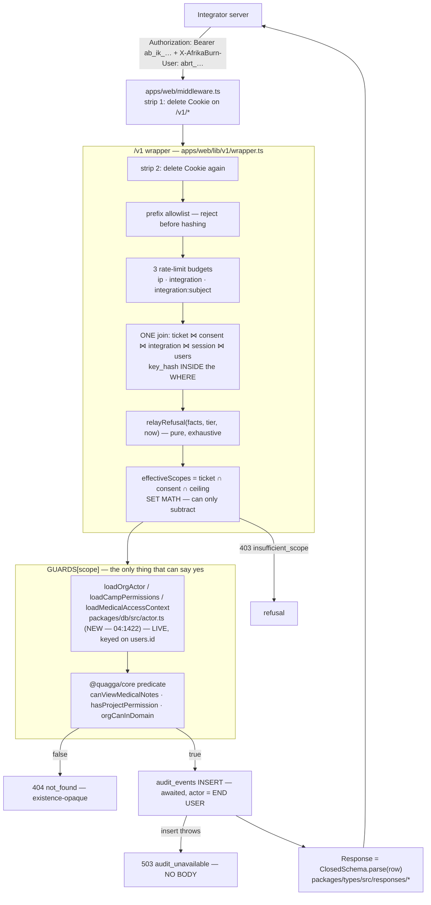

## Security measures — the defence-in-depth contract for `/v1`

_Every control that stands between an integrating app and a burner's data, with the
file or endpoint that implements it. Companion to the architecture decision (the
Relay Ticket) and to `docs/sdk/04-backend-work-required.md`, which this supersedes
in §§4.1.9, 4.3.3–4.3.8, 4.3.10, 4.3.11, 4.3.12 and 4.6._

**Named supersessions, so none of them is silent.** Each of these reverses a
written sentence in the prior spec and must be amended there, not left to collide:

| Prior spec                  | Said                                                                                  | This document says                                                                                | Where           |
| --------------------------- | ------------------------------------------------------------------------------------- | ------------------------------------------------------------------------------------------------- | --------------- |
| `04` §4.1.9 (`:241-258`)    | v0.2 adds `Access-Control-Allow-Origin` + `Vary: Origin` on delegation routes         | **no CORS headers at any version**; a browser tier is a separate decision                         | §7.1            |
| `04` §4.3.4 (`:800-818`)    | `ab_sk_live_` / `ab_sk_test_`                                                         | `ab_ik_` / `abrt_`; no `test` prefix                                                              | §3.2            |
| `04` §4.3.6 (`:833-855`)    | rotation with grace on the api-key plugin's rows                                      | two columns on `integrations`, both in the resolver's `WHERE`                                     | §3.4            |
| `04` §4.3.7 (`:856-874`)    | **"Revocation — three levels, all instant"**                                          | **five** levels; adds burner-consent revocation and session cascade                               | §3.5            |
| `04` §4.3.10 (`:1016`)      | **"`bio.medical.view` is untouched and unreachable: no scope reaches medical notes"** | `bio:medical:read` exists; 49 scopes → 50                                                         | §9.1            |
| `04` §4.3.10 (`:1012-1014`) | "Successful **reads are not audited**"                                                | true for `public:*`/`standard`; **false for the disclosing tier**, which audits before it answers | §10.1 refusal 3 |
| `04` §4.6 (`:1271-1332`)    | budgets keyed on ip and key                                                           | adds `v1_subject:` — under delegation the resource is a person                                    | §6.2            |

**Files named in this document that do not exist yet.** Everything under
`apps/web/lib/v1/**` (`wrapper.ts`, `relay.ts`), `apps/web/middleware.ts`,
`packages/core/src/delegation.ts`, `packages/db/src/tokens.ts`, migration `0029`,
and the `integrations` / `integration_consents` / `integration_tickets` tables are
**new**. `packages/db/src/actor.ts` (`loadOrgActor`, `loadCampPermissions`) is the
prior spec's task 8 (`04:1422`) and is also unbuilt — note the file name is
`actor.ts`, singular, as `04:1422` names it. Everything else cited with a line
number was read from the tree this round.

**The one sentence this document exists to enforce:** _the API key can only have as
much access as its owner_ — and under delegation the "owner" is a named burner whose
live `session` row is a term in the resolver's `FROM` clause, not a claim anybody
types.

---

## 1. The boundary, in one picture



Two stages, different in kind, and the difference is the whole design:

| Stage           | What it is                                                                     | Can it grant?                          | Refusal                  |
| --------------- | ------------------------------------------------------------------------------ | -------------------------------------- | ------------------------ |
| **Scope gate**  | set intersection over three vocabularies                                       | **No — only subtracts**                | `403 insufficient_scope` |
| **Rights gate** | unchanged `@quagga/core` predicates over an actor loaded live for the END USER | Yes, and it is the only thing that can | `404 not_found`          |

Because stage 1 only subtracts, the delegated answer is **provably a subset** of the
first-party answer for the same human. That is Ryan's law as a structural property,
not a review promise.

---

## 2. Threat model

Continues the numbering of `docs/auth-platform-spec.md` §9.1, which ends at actor 6
("Rogue / compromised third-party OAuth integrator — the PARKED IdP",
`auth-platform-spec.md:558`). Actor 6 is now unparked and decomposed into actors
7–16. Same three-column format.

| #      | Actor / event                                                                                 | Likelihood / impact                                                                                                                                                 | Primary controls                                                                                                                                                                                                                                                                                                                                                                                                                                                                                                                                                                                                                                                                                                                                                                                                                                                                                                                        |
| ------ | --------------------------------------------------------------------------------------------- | ------------------------------------------------------------------------------------------------------------------------------------------------------------------- | --------------------------------------------------------------------------------------------------------------------------------------------------------------------------------------------------------------------------------------------------------------------------------------------------------------------------------------------------------------------------------------------------------------------------------------------------------------------------------------------------------------------------------------------------------------------------------------------------------------------------------------------------------------------------------------------------------------------------------------------------------------------------------------------------------------------------------------------------------------------------------------------------------------------------------------- |
| **7**  | **Leaked integration key** (`ab_ik_…` in a public repo, a CI log, a pasted issue)             | **HIGH** (secrets in git is the modal leak) / **LOW**                                                                                                               | The key alone is a **ceiling with no principal**: it reaches `public:*` and nothing else, because every scope that can name a burner requires a ticket whose `session_id` FK points at a live row. Plus: instant revocation (`integrations.key_hash` rotated or `status='suspended'`, checked in the same join); secret-scanning push protection on `ab_ik_[A-Za-z0-9_-]{43}` (`SECURITY.md:120-122`); rotation-with-grace with a "revoke now" that nulls **both** hashes and suspends in one statement (§3.4). **The blast radius is the control** — this is the single largest security dividend of the Relay Ticket over a bearer-key API                                                                                                                                                                                                                                                                                            |
| **8**  | **Stolen relay ticket** (`abrt_…` lifted from an integrator's logs, a proxy, a browser paste) | MEDIUM / **LOW-MEDIUM**                                                                                                                                             | A ticket is not a credential on its own: the resolver's `WHERE` carries `t.token_hash = $ticketHash AND i.key_hash = $keyHash`, so a ticket without its minting app's key returns **zero rows**. TTL 900 s standard, **120 s single-use for `bio:*`**. `session.expires_at > now()` is re-checked as a `JOIN` on every request. Stored as sha256 hex, never plaintext. A stolen ticket cannot mint a ticket — re-mint requires the key **and** an unexpired `renewable_until`, which is `NULL` for every disclosing scope                                                                                                                                                                                                                                                                                                                                                                                                               |
| **9**  | **Phishing integration** — a Camp-404 lookalike that gets real burners to click Approve       | **MEDIUM** (trivial to build; the audience trusts camp tooling) / **HIGH** — consent is genuine, so no cryptographic control helps; only issuance and revocation do | (a) **Issuance is a human act by a System manager** — `requireSystemManager`, gated on rank, never a grantable capability, because the right to edit rights must not be grantable; there is no self-service "create an app" endpoint at any version. (b) `redirect_uris` **exact match** (`includes()`, `===` semantics — no `startsWith`, no regex, no wildcard), registered at issuance, CI-pinned. (c) The consent screen renders the integration's **registered** name and sponsoring department **out of the database**, never anything the request supplied. (d) `org:*` is not expressible as a delegable scope, so an org staffer cannot be phished out of console authority. (e) One-click kill: `status='suspended'` freezes minting, invalidates every key, and refuses every outstanding ticket on its next use                                                                                                             |
| **10** | **Compromised integrator SERVER holding many tickets** — the worst case in this design        | LOW-MEDIUM / **MEDIUM** (it would be HIGH under a refresh-token design)                                                                                             | (a) **There is no long-lived credential to hold.** The longest-lived artifact is a 900 s ticket capped by `min(session.expires_at, granted_at + 24h)`; `bio:*` tickets are 120 s and single-use. (b) Blast radius is `⋂` of three live sets — only what each burner individually consented to, only while each burner's session is alive. (c) One lever, instant, org-side: suspend. (d) The platform can enumerate victims **truthfully**: `integration_consents` names exactly who consented to what; `audit_events WHERE action='bio.medical.view'` names exactly whose notes were actually read — which is what POPIA s22 notification requires (`auth-platform-spec.md:393-397`). (e) `integration:subject` rate limiting bounds per-person extraction                                                                                                                                                                             |
| **11** | **Integrator retains data after withdrawal**                                                  | **HIGH** (it is the default behaviour of every cache) / MEDIUM-HIGH — **the honest control is not technical**                                                       | (a) **Say it out loud on the consent screen**: _"Camp 404 keeps its own copy of anything you share. Disconnecting stops new access; it cannot delete what they already have."_ A promise the platform cannot keep must not be implied. (b) A named human, a reachable `contact_email` and an acknowledged deletion undertaking (§5.5) captured at issuance — the artefact a POPIA complaint is answered through. (c) Technical minimisation so there is less to retain: no burner list endpoint at any scope, no medical in any list/roster/export/count, cursor pagination with no `total`                                                                                                                                                                                                                                                                                                                                             |
| **12** | **Burner revokes an app**                                                                     | Certain to happen / LOW **if it works**, HIGH if it silently does not                                                                                               | `integration_consents.revoked_at` is a term in the resolver's join — revocation bites on the **next request**, with no sweep job and no cache. `/account/connected-apps` in `apps/web`, beside the existing session list. A `security_events` row (`app_disconnected`). `revoked_by` records **who** cut it off, so the card can say "you disconnected this" vs "AfrikaBurn suspended this app"                                                                                                                                                                                                                                                                                                                                                                                                                                                                                                                                         |
| **13** | **Burner signs out / resets password / deletes their account**                                | Certain / LOW **because it is a foreign key**                                                                                                                       | `integration_tickets.session_id → session(id) ON DELETE CASCADE`. Sign-out and `revokeSessions` delete `session` rows; `revokeSessionsOnPasswordReset: true` is set explicitly (`packages/auth/src/config.ts:96`); `SANITIZATION_IDENTITY_TABLES = ["session","account","user"]` are **hard-deleted** (`packages/core/src/account-sanitization.ts:211-215`). Postgres does the rest in the same statement. **There is no propagation window and nothing to remember to call.** `ON DELETE SET NULL` here would silently convert revocation into "eventually, via TTL" — see §3.6                                                                                                                                                                                                                                                                                                                                                        |
| **14** | **Insider issues themselves an integration** to reach data their own rank refuses             | **MEDIUM** — the sole-maintainer/volunteer-org shape makes this structurally likely / **MEDIUM** (it was HIGH under the service-user design)                        | (a) Minting is gated on **rank** (`isSystemManager`, `packages/core/src/org-permissions.ts:438`), never a capability. (b) **`org:*` is not delegable and there is no service user**, so an integration has no rank-derived reach at all — the laundering path the prior spec's service user opened is _deleted_, not fenced. (c) `personal_information` is **absent from the console scope grid entirely**, not greyed — an always-refusing control is the affordance that eventually gets a `true`. (d) Every ceiling edit writes an `audit_events` row carrying `{before, after}`, exactly as `org.department.domains` already does (`apps/org/lib/actions/org-roles.ts:335-343`, action string at `:337`, `before`/`after` at `:340-341`). (e) The monthly privileged-access review reads that trail — this is the control that actually catches it, because a System manager can always defeat (a)                                  |
| **15** | **Cookie / ticket subject confusion on `/v1`** (finding C3)                                   | MEDIUM / **HIGH** — and it is _invisible in testing_, because cookie-subject and ticket-subject are usually the same person                                         | The `Cookie` header is deleted **twice**: once in `apps/web/middleware.ts` (which **does not exist today** — verified: `ls apps/*/middleware.ts` → no such file) and again at the wrapper's entry. Enforced by a **transitive import-graph** scan, not a route-file scan, because `apps/web` library modules reach the session one call deeper: `bulletins.ts` and `notifications.ts` call `getCurrentCampUser` (`apps/web/lib/session.ts:183`), and `account-actions.ts`, `camp-search-action.ts` and `notifications-actions.ts` call `requireCampUser` (`:194`) — five files, none of them a route (verified: `grep -rln "requireCampUser\|getCurrentCampUser\|getAuthenticatedUser" apps/web/lib/*.ts`). A route-file scan sees none of them. The apex cookie domain is `AUTH_COOKIE_DOMAIN = ".example-apex.org"` (`packages/auth/src/env.ts:38,72`, wired at `config.ts:266-268`), so on any `api.` alias the cookie _does_ arrive |
| **16** | **PII crossing the response boundary that no scope should have reached**                      | MEDIUM / **HIGH** — hard-locked fields have "no access path of any kind" (`packages/core/src/privacy.ts:33-38`)                                                     | The unconditional stripper, §8. `auth-platform-spec.md:626-630` (§9.4 decision 2) committed to this and **it was never built** — `grep -rn stripHardLocked apps packages e2e` returns **zero hits**, re-verified (the string does appear in `docs/sdk/*`, which is the spec discussing its own absence — never in source). Until every `/v1` body is the return value of a closed `z.object().parse()`, "which fields cross the boundary" is a per-caller judgement, which is the exact failure mode decision 2 named                                                                                                                                                                                                                                                                                                                                                                                                                   |

**Inherited and not restated:** C1, C2, H1–H4, M1–M8 and L1–L4 of `docs/sdk/06-review.md`
stand as written, with three status changes recorded here rather than rediscovered:

- **C1 (bare `subjectUserId`) is closed structurally.** There is no field to constrain:
  the subject is a column on a row the burner wrote. CI scans for the identifier's
  absence anywhere under `app/api/v1/**`.
- **C3 gets worse under delegation, not better** — see actor 15. Its fix (c) is no
  longer defence in depth; it is required, and it is doubled.
- **M4 (`audience` unenforceable) is moot.** There is no audience concept. Binding is
  a join.
- **M7 (successful reads unaudited) is answered for the disclosing path and remains
  open for `public:*`.** The incident runbook must say so rather than imply a
  completeness the data lacks.

---

## 3. Credential lifecycle

### 3.1 Two artifacts, and only one of them is a credential

| Artifact            | Prefix   | Holder                              | What it proves                                                                 | Lifetime                                         |
| ------------------- | -------- | ----------------------------------- | ------------------------------------------------------------------------------ | ------------------------------------------------ |
| **Integration key** | `ab_ik_` | the integrator's server, long-lived | _which app_ — a **ceiling**, never a principal                                 | until rotated or revoked                         |
| **Relay ticket**    | `abrt_`  | the integrator's server, per-burner | _which burner, present and consenting_ — a **pointer at a live `session` row** | 900 s standard / **120 s single-use disclosing** |

A ticket without its minting app's key authenticates nothing. A key without a ticket
reaches `public:*` and nothing else. **Neither alone is an impersonation primitive,
and that is the design.**

### 3.2 Format

```ts
// packages/db/src/tokens.ts  (see §3.3 — promoted, not re-implemented)
export const INTEGRATION_KEY_PREFIX = "ab_ik_";
export const RELAY_TICKET_PREFIX = "abrt_";

/** `ab_ik_` + 43 base64url chars (256 bits from the CSPRNG). */
export function newIntegrationKey(): string {
  return INTEGRATION_KEY_PREFIX + newToken();
}

/** `abrt_` + 43 base64url chars. */
export function newRelayTicket(): string {
  return RELAY_TICKET_PREFIX + newToken();
}
```

Secret-scanning patterns, registered on day one under push protection
(`SECURITY.md:120-122` — _"Push protection is the one that matters: it blocks the
commit rather than telling you afterwards"_):

```
ab_ik_[A-Za-z0-9_-]{43}
abrt_[A-Za-z0-9_-]{43}
```

**A distinct prefix per artifact is a security control, not cosmetics.** The wrapper
rejects anything that does not carry the expected prefix **before it hashes
anything** — so a ticket presented in the `Authorization` header, or a key presented
as a ticket, dies at a string comparison and never becomes a database lookup.

_Rejected: `ab_sk_test_` / `ab_sk_live_` (prior spec, `04:800-818`). The `test`
variant promises a sandbox tier that no shard defines and no environment provides
(`docs/sdk/06-review.md:470`). A prefix that lies is worse than no prefix._

### 3.3 Hashing — and the promotion this requires

Both artifacts are stored as **sha256, hex**, via the repo's existing primitive:

```ts
// apps/web/lib/account-tokens.ts:25-27  — VERBATIM, not re-implemented
export function hashToken(token: string): string {
  return createHash("sha256").update(token, "utf8").digest("hex");
}
```

The reasoning is already written down at `account-tokens.ts:10-17` and applies
unchanged: 256 uniform bits have no dictionary, so a slow KDF buys nothing but
latency on every single request; lookups are hash-equality in SQL, which compares
digests, not secrets.

**Blocking prerequisite (spec author's call).** `apps/web/lib/account-tokens.ts`
carries `import "server-only"` (`:1`) and lives inside an app. The org console mints
and rotates keys, and `apps/org` cannot import from `apps/web` — they are sibling
workspaces, not dependencies. The file must be **promoted to
`packages/db/src/tokens.ts`** and re-exported from `apps/web/lib/account-tokens.ts`
so no call site changes. Not `@quagga/core`: the file's own comment forbids it —
_"Lives in the app, not @quagga/core, because core is pure and must not reach for a
runtime crypto module"_ (`account-tokens.ts:7-8`). `packages/db` is server-side by
construction (`src/index.ts` opens with the `@neondatabase/serverless` driver) and
is already a dependency of all three apps (`@quagga/db` appears in
`apps/{web,org,suppliers}/package.json`). **It does not carry `import
"server-only"` today** — verified, `grep -rn server-only packages/db` matches only
a comment in `seed.ts:94` — so the promoted `tokens.ts` should add it rather than
inherit it.

_Rejected: bcrypt/argon2 (no dictionary to defend against; a per-request KDF on a
stateless `neon-http` driver is pure latency), HMAC with `BETTER_AUTH_SECRET`
(introduces a secret this design otherwise does not need — see §9), and any new
signature scheme (`auth-platform-spec.md:714`: **no custom crypto anywhere**)._

### 3.4 Rotation with grace

Two columns on `integrations`, not a second table:

```ts
keyHash:              text("key_hash").notNull().unique(),
previousKeyHash:      text("previous_key_hash").unique(),
previousKeyExpiresAt: timestamp("previous_key_expires_at", { mode: "date" }),
```

Both are in the resolver's `WHERE`, so grace is a join term rather than a branch:

```sql
AND ( i.key_hash = $keyHash
   OR ( i.previous_key_hash = $keyHash AND i.previous_key_expires_at > now() ) )
```

| Action         | Effect                                                                                                                                                                                                                                                                                                                                   |
| -------------- | ---------------------------------------------------------------------------------------------------------------------------------------------------------------------------------------------------------------------------------------------------------------------------------------------------------------------------------------- |
| **Rotate**     | `previous_key_hash ← key_hash`, `previous_key_expires_at ← now() + 7 days`, `key_hash ← sha256(new)`. Plaintext shown **once**, never stored, never re-displayable                                                                                                                                                                       |
| **Revoke now** | `key_hash ← NULL`, `previous_key_hash ← NULL`, `previous_key_expires_at ← now()`, `status ← 'suspended'`, in ONE statement. Both keys stop matching on the next request. Expiring the grace window alone is **not** a revocation — it is only read in the `previous_key_hash` arm, so it does nothing to the live key (§3.2 of shard 01) |
| **Suspend**    | `status='suspended'`. Both keys stop working, minting stops, every outstanding ticket refuses                                                                                                                                                                                                                                            |

Every one of the three writes an `audit_events` row: `integration.key.rotated`,
`integration.key.revoked`, `integration.suspended` — **ids only**, never the key,
never a prefix of it (§9.4).

**The grace window is the exposure.** A leaked key reported during grace is a "revoke
now", not a "rotate" — the runbook says so in that order (§10.2), because rotation
alone leaves the leaked key live for up to seven days.

### 3.5 Revocation — five independent levels, all of them instant

Nothing here is a job, a sweep, or a TTL. Every level is a term in the one join at
`apps/web/lib/v1/relay.ts`, so all five bite on the **next request**.

| #   | Level                                                 | Actor                      | Mechanism                                                        | Latency                     |
| --- | ----------------------------------------------------- | -------------------------- | ---------------------------------------------------------------- | --------------------------- |
| 1   | **Burner disconnects the app**                        | the burner                 | `integration_consents.revoked_at IS NOT NULL`                    | next request                |
| 2   | **Burner signs out / resets password / is sanitized** | the burner, or the sweeper | `session` row deleted → `ON DELETE CASCADE` removes every ticket | **same Postgres statement** |
| 3   | **Key revoked or rotated-with-revoke**                | System manager             | `key_hash` / `previous_key_expires_at` in the `WHERE`            | next request                |
| 4   | **Integration suspended**                             | System manager             | `integrations.status = 'suspended'`                              | next request                |
| 5   | **Ticket expiry / single-use burn**                   | the clock                  | `expires_at`, `consumed_at`                                      | ≤900 s (≤120 s disclosing)  |

**There is no cache in front of any of this, and there must never be one.** A cache's
TTL, or a job's schedule, would become the security boundary. Compare the first-party
path, which _does_ have a documented staleness window: Better Auth's 300 s signed
cookie cache (value `AUTH_SESSION.cookieCacheMaxAgeSeconds = 300`,
`packages/auth/src/env.ts:59`; wired at `packages/auth/src/config.ts:150-152`;
called out again at `apps/web/lib/session.ts:150-151`) means a revoked session is
honoured for up to five minutes in the apps. `/v1` reads the `session` **row**, not
the cookie, so it does not inherit that window.

### 3.6 The one-word failure that would delete this whole property

```sql
-- packages/db/migrations/0029_integrations.sql — written by hand, with its reason
ALTER TABLE "integration_tickets"
  ADD CONSTRAINT "integration_tickets_session_id_fk"
  FOREIGN KEY ("session_id") REFERENCES "session"("id") ON DELETE CASCADE;
--                                                       ^^^^^^^^^^^^^^^
-- CASCADE, not SET NULL. This is the mechanism, not a tidy-up.
-- With SET NULL, sign-out no longer revokes: tickets outlive their session and die
-- only by TTL. The happy path is byte-identical and every test that does not
-- specifically DELETE a session row still passes.
```

Migrations are append-only, generated offline, and applied at deploy **against
production with no staging** (`AGENTS.md` rules 1–2); latest is **0028** (verified:
`packages/db/migrations/` ends at `0028_questionnaire_responses_group_scope.sql`).
There is no second attempt.

**Invariant test, and it must not read the Drizzle source:**

```ts
// packages/db/src/__tests__/integration-fk-rules.test.ts
const [row] = await db.execute(sql`
  SELECT delete_rule FROM information_schema.referential_constraints
   WHERE constraint_name = 'integration_tickets_session_id_fk'
`);
expect(row.delete_rule).toBe("CASCADE");
```

### 3.7 Ticket binding and TTLs

```ts
// packages/core/src/delegation.ts
export type ScopeTier = "public" | "standard" | "disclosing";

export const TICKET_TTL_SECONDS: { readonly [T in ScopeTier]: number } = {
  public: 900,
  standard: 900,
  disclosing: 120,
};

/** Server re-mint window. NULL ⇒ never re-mintable. */
export const RENEWAL_WINDOW_SECONDS = 24 * 60 * 60;
```

| Property          | Standard tier                               | Disclosing tier (`bio:*`)            |
| ----------------- | ------------------------------------------- | ------------------------------------ |
| TTL               | 900 s                                       | **120 s**                            |
| Single use        | no                                          | **yes** (`single_use = true`)        |
| Server re-mint    | yes, while `renewable_until > now()`        | **never** — `renewable_until = NULL` |
| `renewable_until` | `min(session.expires_at, granted_at + 24h)` | `NULL`                               |
| Origin            | an explicit click, or a server re-mint      | **an explicit click, every time**    |

**Four things a ticket is bound to, all of them enforced by the same statement:**

1. **The app** — `i.key_hash = $keyHash` is inside the `WHERE`, so a ticket minted for
   app A is structurally invisible to app B's key. "Wrong app" and "no such ticket"
   are the same empty result set, which removes the wrong-app oracle for free.
2. **The burner's live session** — `JOIN "session" s ON s.id = t.session_id AND
s.expires_at > now()`. Presence is a table in the `FROM` clause, not a claim to be
   checked.
3. **The consent** — `JOIN integration_consents c ON c.id = t.consent_id`, with
   `c.revoked_at IS NULL`.
4. **A scope subset** — `t.scopes` is a **narrowing hint**, re-intersected with
   consent and ceiling on every request. It can never widen anything.

**Silent ticket minting on a GET does not exist.** Every ticket originates from an
explicit click on a server action, or from a server-to-server re-mint that presents
the key _and_ an unexpired ticket. _Rejected: a silent 302 mint gated by a
`RESTRICTED_SCOPES` denylist — a credential mint reachable by navigation, guarded by
a list somebody has to remember to add to, is one forgotten entry from being wrong._

**Re-mint is a positive allowlist, table-tested over all 50 strings:**

```ts
export const RENEWABLE_SCOPES: readonly Scope[] = [/* … no bio:* member … */];
export function isRenewable(s: Scope): boolean; // total
```

---

## 4. Proof of presence — what is established, and when

### 4.1 At mint time

| Leg                                                            | Proves                                                                                                 | Why it cannot be forged                                                                                 | Implementing file                     |
| -------------------------------------------------------------- | ------------------------------------------------------------------------------------------------------ | ------------------------------------------------------------------------------------------------------- | ------------------------------------- |
| Top-level navigation to `app.example-apex.org/connect`         | the burner's own httpOnly cookie, on our origin, reached our handler                                   | no cookie spans registrable domains; Camp 404 can neither mint nor read `__Secure-quagga.session_token` | `apps/web/app/(app)/connect/page.tsx` |
| `requireCampUser()`                                            | the full existing ladder — password / passkey / TOTP — plus existing rate limits and `security_events` | **zero new authentication code exists to get wrong**                                                    | `apps/web/lib/session.ts:194`         |
| Not an iframe                                                  | the burner sees our URL bar and our copy                                                               | `frame-ancestors 'none'` + `X-Frame-Options: DENY` on `/:path*` (`config/security-headers.mjs:18-19`)   | shared header list                    |
| `redirect_uri` exact `includes()` against the registered array | the ticket lands where a System manager registered it                                                  | `===` semantics only; no `startsWith`, no regex, no wildcard; CI-pinned                                 | `/connect` loader                     |
| Approve is a **server action**, never a GET                    | a credential mint is not reachable by navigation                                                       | §3.7                                                                                                    | `/connect/actions.ts`                 |
| `users.sanitized_at IS NULL` re-checked                        | the account is not a tombstone                                                                         | the same re-animation guard all three session resolvers carry (`apps/web/lib/session.ts:152`)           | `/connect` loader                     |

The clickjacking header is load-bearing and must not be weakened for this: it exists
because _"the org console was framable, so a clickjacked click could reach a
destructive server action — `deleteSupplier` among them"_ (`config/security-headers.mjs:3-5`).

### 4.2 On every single request

`s.expires_at > now()`, as a `JOIN`. No join, no row, no answer.

### 4.3 What this does **not** prove, stated plainly

That a human is at the keyboard at that millisecond. It proves the burner's session
was alive at the instant of the read, and that they clicked Approve within the
ticket's lifetime — **≤120 seconds for medical**. That is the strongest honest claim
available without per-read re-authentication, which would make the emergency path
unusable. Do not let a later document upgrade this sentence.

### 4.4 What is refused as a presence proof

| Refused                                                 | Because                                                                                                                                                       |
| ------------------------------------------------------- | ------------------------------------------------------------------------------------------------------------------------------------------------------------- |
| Any request field naming a subject                      | the subject is a **column on a row the burner wrote**. CI scans for the absence of `subjectUserId` in request-parsing position anywhere under `app/api/v1/**` |
| `Origin` / `Referer` as an authorisation input          | `curl -H 'Origin: …'` defeats it in one flag (`docs/sdk/04-backend-work-required.md:256-257`)                                                                 |
| The apex session cookie                                 | deleted twice, with a transitive import-graph CI scan (actor 15)                                                                                              |
| A ticket presented without a key, or with the wrong key | the join returns nothing; byte-identical to "no such ticket"                                                                                                  |
| Distinguishing _why_ on the wire                        | two buckets — see §10.3                                                                                                                                       |

---

## 5. Consent records and withdrawal semantics

### 5.1 The record

```ts
// packages/db/src/schema.ts — migration 0029
export const consentRevokerEnum = pgEnum("consent_revoker", [
  "subject",
  "org",
  "integrator",
  "system",
]);

export const integrationConsents = pgTable(
  "integration_consents",
  {
    // Explicit column names on every field: the house style in schema.ts, which
    // never uses drizzle's nameless form. `users` is OUR table (schema.ts:283) —
    // not Better Auth's `user` (:358).
    id: uuid("id").defaultRandom().primaryKey(),
    userId: uuid("user_id")
      .notNull()
      .references(() => users.id, { onDelete: "cascade" }),
    integrationId: uuid("integration_id")
      .notNull()
      .references(() => integrations.id, { onDelete: "restrict" }),
    scopes: jsonb("scopes").$type<string[]>().notNull().default([]),
    grantedAt: timestamp("granted_at", { mode: "date" }).notNull().defaultNow(),
    revokedAt: timestamp("revoked_at", { mode: "date" }),
    // So the burner's card can say WHO cut it off. "You disconnected this" and
    // "AfrikaBurn suspended this app" are different sentences; a bare timestamp
    // renders neither.
    revokedBy: consentRevokerEnum("revoked_by"),
    lastUsedAt: timestamp("last_used_at", { mode: "date" }),
  },
  (c) => ({
    pairIdx: uniqueIndex("integration_consents_pair_idx").on(
      c.userId,
      c.integrationId,
    ),
    userIdx: index("integration_consents_user_idx").on(c.userId),
  }),
);
```

`scopes` is `jsonb`, matching `org_roles.permissions` (`packages/db/src/schema.ts:902`,
`:967`) — the house pattern for a permission set. **Verified: there are zero `text[]`
columns in `packages/db/src/schema.ts`.** A foreign array convention landing
permanently on an append-only chain is a cost with no benefit.

_Rejected: a row-per-scope `integration_consent_scopes` table. Diffability was the
argument; `{before, after}` in the `audit_events` row gives the same answer with one
fewer table on a one-shot production migration, and `org.department.domains` already
audits exactly that way (`apps/org/lib/actions/org-roles.ts:335-343`, action string at `:337`, `before`/`after` at `:340-341`)._

### 5.2 Granting

`POST` server action at `/connect`, never a GET. In order:

1. `requireCampUser()`.
2. Integration loaded by slug; `status === 'active'`.
3. `redirect_uri` exact-matched against the registered array.
4. Every requested scope passes `isDelegableScope` **and** is present in
   `integrations.ceiling`. A scope outside the ceiling renders a **generic** refusal
   that never names which — no ceiling probe.
5. Upsert `integration_consents` on `(user_id, integration_id)`; `revoked_at → NULL`;
   **scopes replaced, not unioned** — re-consenting to less genuinely reduces the
   grant.
6. Insert `integration_tickets` with `session_id` from `auth.api.getSession`.
7. `audit_events` `integration.consent.granted` (ids only) + a `security_events` row
   (`app_connected`).
8. `302` to `redirect_uri#ticket=abrt_…&state=…`.

**Ticket delivery is the URL fragment, cleared by `replaceState`.** A fragment never
reaches a CDN, a proxy or an access log, and sidesteps referrer policy entirely.
_Rejected: query string._

**Widening requires a fresh screen.** Any scope not already in the live consent forces
the full consent flow again. The SDK cannot silently escalate.

### 5.3 Withdrawal

`/account/connected-apps` in `apps/web`, beside the existing session list at
`/account/security` — same page family, same mental model as `auth.api.revokeSession`
(`docs/accounts-security-spec.md:103-104`).

One statement, one transaction-free effect:

```sql
UPDATE integration_consents
   SET revoked_at = now(), revoked_by = 'subject'
 WHERE user_id = $me AND integration_id = $app AND revoked_at IS NULL;
-- tickets die by CASCADE on consent_id; the resolver's join is the real mechanism.
```

Writes a `security_events` row (`app_disconnected`). Adding that kind requires two
`ALTER TYPE "security_event_kind" ADD VALUE` statements in 0029 — the enum is a
`pgEnum` with nine members at `packages/db/src/schema.ts:212-222` and the display
titles live in `packages/core/src/security-events.ts:31` (`describeSecurityEvent`),
so **no strings go in the DB**. Confirm the
Neon server version before generating: the in-transaction semantics of
`ALTER TYPE … ADD VALUE` are version-dependent, and 0029 must not itself insert a row
using the new values.

**What withdrawal does and does not do, in the copy the burner reads:**

| Does                                                                                        | Does not                                                                           |
| ------------------------------------------------------------------------------------------- | ---------------------------------------------------------------------------------- |
| stops all new access on the next request                                                    | delete the copy the app already holds                                              |
| kills every outstanding ticket                                                              | notify the app (there is no webhook — see §12)                                     |
| survives sign-out and sign-in (the consent row persists; only tickets die with the session) | erase the audit rows recording what was read — those are the burner's own evidence |

### 5.4 The consent screen copy for the disclosing tier

Not decoration — it is the informed-consent basis, exactly as
`MEDICAL_AUDIENCE_NOTE` is for the bio form (`docs/accounts-security-spec.md:191-199`,
which notes a test asserts that string names both audiences, _"if it stops doing so,
the consent basis is gone"_). The same rule applies here: this string is pinned by a
test.

> **Camp 404** wants to see medical information for members of camps you lead.
> This is the same information you can see on AfrikaBurn. Every time Camp 404 reads it,
> we record it against **your** name — not Camp 404's — because you are the one who is
> allowed to look, and the person can see that record. Access lasts two minutes and
> cannot run in the background.
> Camp 404 keeps its own copy of anything you share. Disconnecting stops new access;
> it cannot delete what they already have.

### 5.5 What an integrator must delete — the undertaking

The platform **cannot enforce this**. It is captured at issuance as a written
undertaking against a named human and a reachable `contact_email`, and it is the
artefact a POPIA complaint is answered through. State the limit honestly rather than
implying erasure.

| Trigger                                                         | The integrator must, within 30 days                                                                                 | Note                                                                               |
| --------------------------------------------------------------- | ------------------------------------------------------------------------------------------------------------------- | ---------------------------------------------------------------------------------- |
| A burner disconnects the app                                    | delete every field derived from that burner's `self:*` and `camp:*` reads                                           |                                                                                    |
| A burner disconnects, and `bio:medical:read` was ever consented | delete every medical note **and every derivative** — summaries, roster annotations, "flagged" lists, printed sheets | special personal information under POPIA s26/s27 (`auth-platform-spec.md:347-352`) |
| The integration is suspended or deleted                         | delete everything read through the API, for every burner                                                            |                                                                                    |
| An edition ends                                                 | delete or re-consent — a grant is not perpetual                                                                     | mirrors `id-retention` (`docs/accounts-security-spec.md:158-167`)                  |
| At any time                                                     | **never** persist a ticket or key beyond its use; never write either to a log                                       |                                                                                    |

**Medical notes must never be persisted at rest by an integrator at all.** The 120 s
single-use ticket is the mechanism that makes "read it when you need it" the cheapest
implementation, and the undertaking says so.

### 5.6 Erasure — the change to POPIA sanitization

```ts
// packages/core/src/account-sanitization.ts — currently EXACTLY three entries
// (verified, :188-192)
export const SANITIZATION_PURGED_TABLES = [
  "profile_keys",
  "email_change_requests",
  "security_events",
  "integration_consents", // NEW — a live authorisation for a person who no longer exists
  "integration_tickets", // NEW — cascades from the above; listed because this list is
  //       what the tests assert over and what a reader checks
] as const;
```

`audit_events` stays in `SANITIZATION_PRESERVED_TABLES`
(`packages/core/src/account-sanitization.ts:167-178`). **The disclosure record
survives erasure; the live authority does not.** That asymmetry is the point.

`SANITIZATION_IDENTITY_TABLES` already hard-deletes `session` (`:211-215`), so ticket
removal is doubly guaranteed: by the purge list and by the FK cascade. Belt and
braces, and the belt is the one that works.

**Invariant test:** `consent-tables-in-erasure` asserts membership. Without it, a
deleted account leaves a live grant behind — the same class of defect as M2's
idempotency store (`docs/sdk/06-review.md:259-261`) and more severe.

---

## 6. Rate limiting

### 6.1 Which table, and why it is not Better Auth's

All `/v1` counters use `consumeRateLimit` against **`action_rate_limit`**
(`packages/db/src/rate-limit.ts:82`, table at `packages/db/src/schema.ts:490-502`).

**Nothing of ours may live in `rate_limit`.** The schema comment records why, and it
is not a preference: _"Better Auth's database rate-limit storage prunes: after any
successful window roll it runs `DELETE FROM rate_limit WHERE last_request < now -
max(configured window, 10s, 60s)` — the whole table, not just its own keys"_
(`packages/db/src/rate-limit.ts:19-23`). That sweep silently converted a 15-minute
password-reset budget into a 60-second one, _"enough to flood somebody's inbox with
reset emails, which is the abuse this whole file exists to prevent"_ (`:30-31`).

### 6.2 The budgets

| #   | Key                                   | Budget     | Applies to                           | On storage failure                 |
| --- | ------------------------------------- | ---------- | ------------------------------------ | ---------------------------------- |
| 1   | `v1_ip:<ip>`                          | 600 / 60 s | every `/v1` request                  | **open** — a shield, not the limit |
| 2   | `v1_key:<integrationId>`              | 300 / 60 s | every `/v1` request                  | open                               |
| 3   | `v1_subject:<integrationId>:<userId>` | 60 / 60 s  | every request that resolved a ticket | open                               |
| 4   | `v1_mint:<integrationId>`             | 60 / 60 s  | server re-mint only                  | open                               |
| 5   | `connect:<userId>`                    | 20 / 60 s  | the `/connect` server action         | open                               |

(`userId` is `users.id` — our table, `packages/db/src/schema.ts:283` — never Better
Auth's `user.id` at `:358`. Using the wrong one silently gives each burner two
budgets.)

`rateLimitIp` (`packages/db/src/rate-limit.ts:148-153`) supplies key 1's value and
already collapses unattributable callers into one shared bucket rather than letting
them escape.

**Budget 3 is the one this design adds, and it is the important one.** Budgets 1–2 are
keyed on the _integrator_; under delegation the resource is a **person**. Without a
per-subject key, one integration's budget is shared across every burner it serves, a
per-person extraction pattern is invisible, and a noisy tenant starves a quiet one.

**Every budget fails open on a storage error, by design** (`rate-limit.ts:72-78`,
`:137-140`): every caller sits in front of a flow that needs the same database, so a
limiter outage would become a hard outage rather than abuse. That property is
inherited, not chosen here — but it must be _stated_, because a reader who assumes
these limits are fail-closed will mis-size the incident response in §10.2.

### 6.3 The medical tension, resolved explicitly rather than silently

`docs/accounts-security-spec.md:313-314` states: _"**No rate limit, on purpose.** A
throttle on this path fails closed in an emergency, which is the outcome the whole
consent-at-entry model refuses."_

That rule was written for **a human at a screen inside our own app**, and it stands
there unchanged. Budget 3 sits in front of the **API** medical endpoint deliberately,
because a machine-to-machine read is not a medic squinting at a phone. If the budget
is ever judged to violate the emergency rule, **the resolution is to raise the number,
not to remove the counter** — and note that at 60/60 s a camp lead working through a
whole camp one member at a time will never approach it.

This is a named decision, not an implementation detail. It belongs in
`docs/accounts-security-spec.md` beside the no-rate-limit paragraph.

_Rejected: better-auth's `apiKey` plugin `remaining`/`refillInterval` quotas. Per
`docs/sdk/04-backend-work-required.md:1302-1306` an exhausted key is **deleted**, not
disabled — which destroys the integration's audit linkage. Marked ⚠ unverified:
`node_modules` is absent (`ls node_modules` → not present), so no better-auth plugin
claim in this document has been read from source._

---

## 7. CORS and origin rules

### 7.1 There are no CORS headers, and that is the policy

Verified: `grep -rn "Access-Control-Allow" apps packages` returns **zero hits**. The
only response headers any app sends come from one shared list,
`config/security-headers.mjs:15-35`, applied to `/:path*`.

`/v1` adds none. **Integrators call `/v1` server-side only.**

| Consequence                                              | Why it is acceptable                                                                                  |
| -------------------------------------------------------- | ----------------------------------------------------------------------------------------------------- |
| A browser cannot call `/v1` cross-origin                 | the browser half of the SDK only sets `location.href` and reads `location.hash`; it never calls `/v1` |
| A leaked key cannot be exercised from a victim's browser | a browser that can call `/v1` with a key is a browser holding a leaked key                            |
| No `Vary: Origin` cache-correctness surface exists       | there is nothing to vary on                                                                           |

A public-client tier (browser-resident tickets, per-integration origin allowlist,
`Access-Control-Allow-Credentials: false`) is a **separate, later, deliberate
decision**, not a follow-up. It changes the threat model — see §12.

### 7.2 `Origin` and `Referer` are never authorisation inputs

Anywhere. `curl -H 'Origin: …'` defeats them in one flag
(`docs/sdk/04-backend-work-required.md:256-257`).

**`redirect_uri` matching is a different thing and must not be conflated with it.**
It is compared _server-side, before a ticket is issued,_ against a value a System
manager registered. It is an authorisation input precisely because the request does
not supply the comparand.

### 7.3 The frame rule

`Content-Security-Policy: frame-ancestors 'none'` and `X-Frame-Options: DENY`
(`config/security-headers.mjs:18-19`) apply to `/connect` like every other route.
**Any design that embeds the consent screen, or a silent-refresh iframe, in Camp 404
is dead on arrival — correctly.** The consent screen is a top-level navigation, and
that is also what makes leg 1 of §4.1 true.

### 7.4 `trustedOrigins` must not grow

`resolveTrustedOrigins` (`packages/auth/src/env.ts`) governs Better Auth's own
callback/origin trust. Wildcard or loose `trustedOrigins` is the documented ATO bypass
class (`auth-platform-spec.md:670`, GHSA-vp58-j275-797x). Registered integrator
redirect URIs live in `integrations.redirect_uris` — a **separate list, consumed by a
separate code path**. Never merge them.

---

## 8. The unconditional PII stripper

`auth-platform-spec.md:626-630` (§9.4 decision 2) committed to _"ONE unconditional
PII-strip helper in `@quagga/core`, reused by BOTH first-party and integrator
responses, so hard-locked fields can never be scoped-in… **Build the stripper now**
even though only first-party calls it — a per-caller filter is the failure mode that
leaks PII when a scope or filter is mistaken."_

**It was never built.** `grep -rn stripHardLocked apps packages e2e` returns zero
hits, re-verified this round (the identifier appears only in `docs/sdk/*`, where the
spec records its own absence). Today the filtering is per-caller: `HARD_LOCKED_PRIVATE_FIELDS`
(`packages/core/src/privacy.ts:39-47`) governs _privacy flags_, and
`REGISTRATION_CONTACT_KEYS` (`apps/org/lib/queries.ts:952-960`) is a **module-private
const inside an app**, invisible to anything else. This section is the buildable
specification. **It is a blocking prerequisite of stage 1 — no `/v1` endpoint ships
without it.**

### 8.1 The mechanism: the schema _is_ the stripper

Not a helper somebody has to remember to call. The response body is the **return value
of a parse**, and the row never reaches the serializer:

```ts
// apps/web/app/api/v1/burners/[id]/route.ts  — the only shape a handler may end in
import { BurnerProfileResponse } from "@quagga/types/responses";

return Response.json(BurnerProfileResponse.parse(row));
//                   ^^^^^^^^^^^^^^^^^^^^^^^^^^^^^^^  never `row`, never a spread
```

**Stage-0 prerequisite the prior spec does not list: the subpath export.**
`packages/types/package.json` declares exactly one export path — `{ ".":
"./src/index.ts" }` (verified) — so `@quagga/types/responses` **does not resolve
today** and every import above fails. This is the identical trap `04:1211-1214`
already documents for `@quagga/core` ("declares exactly two export paths … a
`@quagga/core/registration-contact` subpath would not resolve"). Either add
`"./responses": "./src/responses/index.ts"` to `packages/types/package.json`, or
re-export the schemas from `packages/types/src/index.ts` and import from the
package root. Pick one before writing a handler; a spec that ships unresolvable
import specifiers gets "fixed" by whoever hits it first, at speed.

Zod's plain `z.object()` **strips** unknown keys. That is the whole control: a column
added to a query, a store that starts returning one more field, a careless `...row` —
none of them can reach a client, because the object handed to `Response.json` is
constructed by the schema, not by the query.

**Six bans, all CI-enforced by source scan** under `packages/types/src/responses/**`:

| Banned                                           | Why                                                                                                                            |
| ------------------------------------------------ | ------------------------------------------------------------------------------------------------------------------------------ |
| `.passthrough()`                                 | turns the stripper off for its subtree                                                                                         |
| `.catchall(...)`                                 | same                                                                                                                           |
| `z.record(...)`                                  | one `z.record` disables stripping for everything under it                                                                      |
| `z.any()` / `z.unknown()`                        | ditto, with no type-level warning                                                                                              |
| `.strict()`                                      | _throws_ on an unknown key — a 500 where a strip was wanted. Silent removal is the correct failure mode at a response boundary |
| a bare `as unknown as` cast into the schema type | reintroduces the row                                                                                                           |

### 8.2 The forbidden set

Four lists, unioned, promoted to one place so a walker can see them:

```ts
// packages/core/src/privacy.ts — additions
export const HARD_LOCKED_PRIVATE_FIELDS = [/* 7, unchanged, :39-47 */] as const;
export const SAFETY_VISIBLE_FIELDS = ["medical"] as const; // :57

/**
 * PROMOTED from apps/org/lib/queries.ts:952-960, where it is a module-private
 * const and therefore invisible to any cross-package guard. Seven human contact
 * columns on `registrations` that sit OUTSIDE the hard-locked set — a genuinely
 * separate class, and one nothing else in the repo currently knows about.
 *
 * NOT a new finding: `04:1216-1223` already carries this as a task ("promote that
 * tuple into @quagga/core as REGISTRATION_CONTACT_KEYS" and have queries.ts import
 * it) and calls it "the sharpest hole in the whole surface". Restated here only
 * because it is a stage-0 blocker for §8 rather than an item in the v0.2 tranche.
 * Export from packages/core/src/index.ts — `@quagga/core` declares only "." and
 * "./report-server", so a subpath would not resolve (`04:1211-1214`).
 */
export const REGISTRATION_CONTACT_KEYS = [
  "s1ContactEmail",
  "s1AltContactName",
  "s1AltContactPhone",
  "s1AltContactEmail",
  "s2LntLeadName",
  "s2LntLeadPhone",
  "s2LntLeadEmail",
] as const;

/** Physical column names, because a schema may key on either shape. */
export const FORBIDDEN_COLUMN_NAMES = [
  "medicalNotes",
  "medical_notes",
  // `medicalNotesUnreadable` is in the prior spec's set (`04:1201`) and is REAL:
  // `apps/org/lib/queries.ts:1380`, set from `decrypted?.state === "unreadable"`
  // at `:1445`. It is a per-named-person boolean about whether a health
  // disclosure exists — refusal 2 exactly. Do not drop it because it is "only a
  // flag"; the roster signpost that was deleted was also only a flag
  // (`docs/accounts-security-spec.md:235-245`).
  "medicalNotesUnreadable",
  "medical_notes_unreadable",
  "saIdEncrypted",
  "sa_id_encrypted",
  "passportEncrypted",
  "passport_encrypted",
] as const;

// NOT forbidden, and adding them would fail the build on our own v0.1 endpoints:
// `legalName`, `homeCity`, `contactEmail`. They are OPT-IN publics, absent from
// `HARD_LOCKED_PRIVATE_FIELDS` (`privacy.ts:39-47`) and returned by
// `publicBioView` when the burner set the flag. `04:1213-1219` states this
// explicitly. §8.6 is the separate, correct answer for them: no write scope.

export const RESPONSE_FORBIDDEN_KEYS: readonly string[] = [
  ...HARD_LOCKED_PRIVATE_FIELDS,
  ...SAFETY_VISIBLE_FIELDS,
  ...REGISTRATION_CONTACT_KEYS,
  ...FORBIDDEN_COLUMN_NAMES,
];
```

### 8.3 The test is BEHAVIOURAL, not introspective

**This is a deliberate design choice and it matters.** A test that walks zod's `_def`
tree depends on zod's internal shape (`zod ^4.4.3`, `packages/types/package.json`),
which I cannot verify here — `node_modules` is absent. More importantly, an
introspective test proves the _declaration_ is clean; a behavioural test proves the
_stripping works_.

Every response module exports its schema **and a valid sample**:

```ts
// packages/types/src/responses/burner-profile.ts
// `z.uuid()` top-level, not `z.string().uuid()`: every workspace is on zod
// ^4.4.3 (`packages/types/package.json`) and `04:1163` pins the top-level form.
export const BurnerProfileResponse = z.object({
  id: z.uuid(),
  username: z.string().nullable(),
  displayName: z.string(),
  campIds: z.array(z.uuid()),
});

/** A valid instance. Exists so the poison test has something to parse. */
export const BurnerProfileResponseSample = {
  id: "00000000-0000-4000-8000-000000000000",
  username: "nomsa",
  displayName: "Nomsa",
  campIds: [],
} satisfies z.infer<typeof BurnerProfileResponse>;
```

```ts
// packages/core/src/__tests__/response-schemas.test.ts
// Lives in @quagga/core, NOT in @quagga/types. packages/core depends on
// packages/types (core/package.json "@quagga/types": "workspace:*"); the reverse
// is a dependency CYCLE. So the schemas live in types and the guard that knows the
// forbidden list lives in core, which can see both.
import { RESPONSE_FORBIDDEN_KEYS } from "../privacy";
import * as responses from "@quagga/types/responses";

const poison = Object.fromEntries(
  RESPONSE_FORBIDDEN_KEYS.map((k) => [k, "LEAK"]),
);

function poisonDeep(value: unknown): unknown {
  if (Array.isArray(value)) return value.map(poisonDeep);
  if (value && typeof value === "object")
    return {
      ...Object.fromEntries(
        Object.entries(value).map(([k, v]) => [k, poisonDeep(v)]),
      ),
      ...poison,
    };
  return value;
}

function keysDeep(value: unknown, out: string[] = []): string[] {
  if (Array.isArray(value)) value.forEach((v) => keysDeep(v, out));
  else if (value && typeof value === "object")
    for (const [k, v] of Object.entries(value)) {
      out.push(k);
      keysDeep(v, out);
    }
  return out;
}

describe("every /v1 response schema strips forbidden fields", () => {
  for (const [name, schema] of registeredResponseSchemas(responses)) {
    it(`${name} emits no forbidden key`, () => {
      const sample = registeredSample(responses, name);
      const parsed = schema.parse(poisonDeep(sample));
      // The exemption is consumed HERE, by export name — §8.4. Without this
      // subtraction the medical schema fails on its own `medical` field, and
      // the cheap fix somebody reaches for is `.passthrough()`, which is the
      // exact failure C2 predicted.
      const allowed =
        name === MEDICAL_EXEMPTION.exportName
          ? new Set<string>(MEDICAL_EXEMPTION.allowedForbiddenKeys)
          : new Set<string>();
      const leaked = keysDeep(parsed).filter(
        (k) => RESPONSE_FORBIDDEN_KEYS.includes(k) && !allowed.has(k),
      );
      expect(leaked).toEqual([]);
    });
  }
});

// A third test pins the exemption itself: exactly one entry, exactly one key,
// on exactly one export name. If `MEDICAL_EXEMPTION` ever grows a second member
// the suite fails before it can be used.
it("the medical exemption never widens", () => {
  expect(MEDICAL_EXEMPTION.allowedForbiddenKeys).toEqual(["medical"]);
});
```

Plus a second test asserting **every** exported `*Response` has a matching `*Sample`,
so a new schema cannot join the set untested.

### 8.4 The one exemption, by path and export name — never by loosening the walk

`bio:medical:read` returns a field in `SAFETY_VISIBLE_FIELDS`. It gets its **own
module**, exempted by an allowlist written out in the test's own source:

```ts
// packages/core/src/__tests__/response-schemas.test.ts
const MEDICAL_EXEMPTION = {
  module: "@quagga/types/responses/medical",
  exportName: "MedicalNotesResponse",
  allowedForbiddenKeys: ["medical"], // and NOTHING else, ever
} as const;
```

```ts
// packages/types/src/responses/medical.ts
export const MedicalNotesResponse = z.object({
  subjectUserId: z.uuid(),
  /** Three-state, not two. Real today: `medicalNotesUnreadable`
   *  (`apps/org/lib/queries.ts:1380`) is set from
   *  `decrypted?.state === "unreadable"` (`:1445`), so a decrypt failure is
   *  never rendered as "no notes". The field NAME is `state`, deliberately —
   *  `medicalNotesUnreadable` itself is in FORBIDDEN_COLUMN_NAMES (§8.2). */
  state: z.enum(["notes", "none", "unreadable"]),
  medical: z.string().nullable(),
  basis: z.enum(["self", "org_staff", "camp_lead"]),
  readAt: z.iso.datetime(),
});
```

⚠ `z.iso.datetime()` is zod 4's replacement for the deprecated
`z.string().datetime()`. `node_modules` is absent here, so this specific call
shape is **unverified against zod ^4.4.3's source** — confirm before writing it.
`z.uuid()` is not speculation: `04:1163` states the repo idiom outright.

The exemption is one key, on one export, in one module. **It never widens to
`HARD_LOCKED_PRIVATE_FIELDS` and never to another schema.** C2
(`docs/sdk/06-review.md:152-166`) predicted the cheap resolution would be to add an
allowlist entry or a `.passthrough()`; naming that in advance is what lets a reviewer
point at this paragraph.

### 8.5 The deliberately-red proof

Per `AGENTS.md`'s adversarial-verification rule (_"after writing a regression test,
break the thing on purpose and watch it go red"_), the workstream records the commit
hash where adding `phone` to `BurnerProfileResponse` failed CI, in the README beside
the stripper's description. A gate nobody has watched fail is a gate nobody knows
works.

### 8.6 What the stripper does not solve

`enforcePrivacyFlags` (`packages/core/src/privacy.ts:108-116`) forces only
`ALWAYS_PRIVATE_FIELDS` to `false`. The **opt-in publics** — `legalName`, `homeCity`,
`contactEmail` — have no such floor. That is correct for a burner editing their own
profile and catastrophic for a third party: which is why there is **no `self:*` write
scope in v0.1** (§10.1, refusal 12).

---

## 9. Scope minimisation and secret handling

### 9.1 The vocabulary is closed at 50

Five namespaces: `org:<cap>:<domain>`, `camp:<permission>`, `self:*`, `public:*`, and
the new `bio:` with **exactly one member**, `bio:medical:read`. 49 → 50.

**Where the string itself lives.** The closed vocabulary is `@quagga/scopes`
(`packages/scopes/`, PRIVATE, FSL, zero runtime deps — `00-decision.md:266`,
`01-overview-and-capability-model.md:228-232`), and that is where `bio:medical:read`
and the `Scope` union must be added; the SDK re-exports the string union only.
`packages/core/src/delegation.ts` below holds the delegation **rules** over that
vocabulary — tiers, TTLs, renewability, the intersection — not the vocabulary, and
therefore takes a type-only dependency on `@quagga/scopes`. Two homes, one list.
Adding `bio:medical:read` to `delegation.ts` alone would give the SDK a scope it
cannot name and re-create the second-source-of-truth the whole design refuses.

**Why its own namespace and not `camp:medical:read`:** `camp:*` derives 1:1 from
`ProjectPermissionKey`, and medical access for a lead is decided by the _structural_
role (`memberships.role ∈ {lead, admin}`), not by a project permission — custom project
roles deliberately grant nothing here (`packages/core/src/medical-access.ts:85-87`).
A separate namespace makes "medical is a higher tier" **structurally enforceable** —
its own tier, its own TTL rule, never renewable — rather than a convention in a list.

```ts
// packages/core/src/delegation.ts
export const DELEGABLE_SCOPE_PREFIXES = [
  "self:",
  "camp:",
  "bio:",
  "public:",
] as const;

/** `org:*` IS NOT DELEGABLE — not "not issued by default", NOT EXPRESSIBLE.
 *  PRECONDITION if this ever changes: the resolver must recompute
 *  orgCanInDomain(loadOrgActor(sponsorUserId), cap, domain) LIVE on every request,
 *  or a demoted sponsor leaves a live ceiling that outlives them. */
export function isDelegableScope(s: string): boolean;

export function scopeTier(s: Scope): ScopeTier; // total over all 50
export const RENEWABLE_SCOPES: readonly Scope[]; // allowlist; excludes bio:*

/** THE INTERSECTION. Returns a narrowed VOCABULARY, never an "allowed".
 *  Branchless set math: nothing here can say yes. */
export function effectiveScopes(i: {
  ceiling: readonly Scope[];
  consented: readonly Scope[];
  requested: readonly Scope[];
}): Scope[];
```

Four minimisation rules, each with a CI test:

1. **Ceiling ⊇ consent ⊇ ticket ⊇ effective.** Narrowing at every hop, checked
   server-side, never trusted from the wire.
2. **`org:*` is not expressible.** 50 × 2 table test; its failure message _is_ the
   sponsor-re-resolution precondition.
3. **`personal_information` is absent from the console scope grid**, not greyed. An
   always-refusing control is the affordance that eventually gets a `true`.
4. **Every scope has a tier and a guard.** `GUARDS: { readonly [S in Scope]: Guard }`
   is an exhaustive mapped type: a scope with no guard **fails `tsc`**, not a grep.

### 9.2 This design introduces zero new secrets

Worth stating loudly, because it is the property that makes the whole thing cheap to
operate:

| Secret                                  | Needed?                                                                 |
| --------------------------------------- | ----------------------------------------------------------------------- |
| `BETTER_AUTH_SECRET`                    | unchanged; **not used** by the ticket path                              |
| `PGCRYPTO_KEY`                          | unchanged; medical decrypt already goes through `decryptField`          |
| A signing key for tickets               | **none** — tickets are opaque random values, verified by a table lookup |
| An HKDF / envelope scheme for the API   | **none**                                                                |
| A JWKS endpoint, a key rotation runbook | **none**                                                                |

There is no key to leak, rotate, or version. Compare a JWT design, which would add
all five rows and, worse, would make revocation depend on token lifetime rather than
on a foreign key. `auth-platform-spec.md:368-378` already records that the _existing_
`PGCRYPTO_KEY` scheme has no rotation path; adding a second key with the same problem
would be a choice, not an inheritance.

### 9.3 CI holds no production credential

The build gate is `pnpm turbo run lint typecheck test build` (`.github/workflows/ci.yml:102`),
which needs no secret; `ci.yml` carries `permissions: contents: read` (`:18-19`) and
must keep it. **`pnpm sdk:local` does not exist yet** — the root `package.json` has
`e2e:local` (`:15`) and nothing else; the key minter is the prior spec's
`mint-local-key.mts` (shard-05, referenced at `06-review.md:466-467`) and is a new
script. As specified it mints a **local** key against the local stack and
**hard-refuses any non-local target** — that refusal is the only thing between a
convenience and a production key in somebody's shell history. Never add a `--force`.

A key printed by the local minter is a secret even though it is local: no fixture,
no issue, no snapshot.

### 9.4 Logging

| Log                                                | Never log                                                |
| -------------------------------------------------- | -------------------------------------------------------- |
| `integrationId` (uuid)                             | the presented key or ticket, or **any prefix of either** |
| `ticketId` (the row's uuid, not the token)         | a request body or a response body                        |
| `requestId`, scope string, refusal code            | any `RESPONSE_FORBIDDEN_KEYS` value                      |
| the `RelayRefusal` union member (server-side only) | an email, a display name, an IP tied to a burner id      |

`audit_events.meta` carries **ids, enums and `requestId` only**. The POPIA scrubber is
a literal three-key subtraction — `SET meta = meta - 'email' - 'contactEmail' -
'primaryEmail'` (`apps/web/lib/account-sanitize.ts:350-355`) — so **any other
PII-bearing key added to `meta` is permanent and un-scrubbed forever**. That is not
theoretical: the comment above that statement records _"32 such rows on the live
database at the time this was found"_, carrying an email address through erasure
_"while the farewell email told them nothing identifying remained"_
(`account-sanitize.ts:343-348`). `auth-platform-spec.md:692` already carries the
invariant ("assert scrubber strips known-sensitive keys"); `/v1` is a new inbound
path into `meta` and inherits it.

And no counts, rates, running totals, risk scores, severity flags or threshold markers
— AGENTS.md forbids monitoring on this path, and an enumeration detector was built and
deliberately removed (`docs/accounts-security-spec.md:278-287`).

---

## 10. The refusal list

Checkable against a PR line by line. Each entry restates an existing product law with
its source; none is new.

### 10.1 Personal information

1. **Never expose a `HARD_LOCKED_PRIVATE_FIELDS` value through any endpoint, at any
   scope, in any version, to any caller — including the burner's own ticket.** Seven
   fields, `packages/core/src/privacy.ts:39-47`: _"ABSOLUTELY private with no access
   path of any kind"_ (`:33-38`; restated at `:6` as "NO access path, ever").
2. **Never put medical notes in a list, a roster, a card, a search result, an export,
   or a count.** Detail only, one subject at a time. No `hasMedicalNotes` boolean, no
   "3 members with disclosures" badge — that signpost was built and deleted
   (`docs/accounts-security-spec.md:235-245`).
3. **Never disclose medical notes without writing the audit row first.** On the API
   path the insert is `await`ed and precedes the response: **no row, no body, 503**.
   **This is a deliberate divergence, on the `/v1` path only, and must be recorded
   as one.** `packages/core/src/medical-access.ts:137-142` says the row is _"never on
   the critical path — the read must not be blocked or slowed by its own audit row"_,
   and the first-party apps keep exactly that behaviour via `after()`. The reason the
   API differs: in-app, the actor is a signed-in human whose identity is already
   established and whose read is recoverable from other evidence; through an
   integration, the audit row is the **only** artefact that ties a disclosure to a
   named human and a named app, and it is the thing §12.3 answers a subject-access
   request out of. A missing row there is an undetectable disclosure. Amend the
   comment at `medical-access.ts:137-142` to say "first-party reads" rather than
   leaving two rules that read as one.
4. **Never attribute a medical read to the integration.** `actorId` is the end user's
   `users.id`. The column type already enforces it —
   `uuid REFERENCES users(id) ON DELETE SET NULL` (`packages/db/src/schema.ts:1712-1714`).
5. **Never add a fourth `basis` value.** The union is `"self" | "org_staff" |
"camp_lead"` (`packages/core/src/medical-access.ts:126`); `parseBasis`
   (`apps/org/lib/medical-audit.ts:59-66`) returns `null` for anything else and would blank the column on exactly the rows most in need
   of explanation. The app is the _route_; the basis is the _authority_.
6. **Never mint a second action string** (`bio.medical.view.api`). A variant drops out
   of `getMedicalAccessLog`'s filter and back _into_ `getAuditTrail` for actors without
   `personal_information` in the `audit` domain — creating an unfiltered disclosure
   census for the one rank that must not have one.
7. **Never add a volume threshold, per-actor profiling, or an alert.** A detector was
   built and deliberately removed; re-adding it is a product decision with a stated
   threat model, not a refactor (`docs/accounts-security-spec.md:277-287`).
8. **Never emit a field the response schema does not name.** No `.passthrough()`, no
   `z.record()`, no per-handler `stripX()` helper as the primary control (§8).

### 10.2 Identity and authority

9. **Never accept a caller-supplied subject identifier as proof of a subject.** No
   request field anywhere under `app/api/v1/**` names a user.
10. **Never treat a key as a principal.** Intersection, never union, resolved live.
11. **Never let an empty scope set mean "unrestricted".** `ceiling.length === 0`
    authorises nothing.
12. **Never ship a write scope in v0.1.** `enforcePrivacyFlags` has no floor for the
    opt-in publics (§8.6); a write path would let a third party flip a stranger's
    `legalName`/`homeCity`/`contactEmail` public. That is C1's damage multiplier
    (`docs/sdk/06-review.md:146`).
13. **Never make `org:*` delegable** without first building live sponsor
    re-resolution (§9.1).
14. **Never make minting an integration or a key a grantable capability.** Rank only —
    the right to edit rights must not be grantable.
15. **Never let a ticket mint a ticket, and never let a re-mint widen a scope set.**
16. **Never re-mint a `bio:*` ticket.** Every medical read costs a fresh, deliberate
    click.

### 10.3 Boundary and transport

17. **Never read a cookie below a `/v1` handler**, transitively.
18. **Never accept a credential in a query string or a cookie.**
19. **Never treat `Origin` or `Referer` as an authorisation input.**
20. **Never return a refusal that confirms a free camp exists.** Identical bytes for
    "no such camp", "free camp you cannot see" and "camp exists, you hold nothing" —
    the API face of `apps/web/lib/groups-store.ts:187`:
    `if (!registered && !viewerRole) continue;`
21. **Never distinguish the eleven authentication-class refusal causes on the wire.**
    They collapse into **two** 401 codes; the other four rows below are different
    statuses, not buckets of those eleven:

    | Wire code             | Status | Members                                                                                                                  | Why bucketed                                                                                                                                                |
    | --------------------- | ------ | ------------------------------------------------------------------------------------------------------------------------ | ----------------------------------------------------------------------------------------------------------------------------------------------------------- |
    | `reconnect_required`  | 401    | `ticket_expired`, `session_ended`, `consent_revoked`, `renewal_window_closed`                                            | all four have the identical correct integrator response — `startConnect()`. Distinguishing _which_ would tell a thief whether the burner personally revoked |
    | `invalid_credentials` | 401    | `no_ticket`, `unknown_ticket`, wrong app, `key_revoked`, `integration_suspended`, `subject_sanitized`, `ticket_consumed` | **byte-identical**, CI-pinned                                                                                                                               |
    | `insufficient_scope`  | 403    | empty intersection                                                                                                       | names the scope string and nothing else — never a department name, never an `ORG_DOMAIN_LABELS` value                                                       |
    | `not_found`           | 404    | predicate false · no such burner · a burner they may not see                                                             | identical bytes for all three                                                                                                                               |
    | `audit_unavailable`   | 503    | the audit insert threw                                                                                                   | **no body**                                                                                                                                                 |
    | `rate_limited`        | 429    | any budget in §6.2                                                                                                       | `Retry-After` from `retryAfterSeconds`                                                                                                                      |

    The full `RelayRefusal` union surfaces in the org console's Activity tab and in
    server logs — the places where the reader is already trusted.

22. **Never ship a burner list endpoint at any scope.**

### 10.4 Operations

23. **Never edit or regenerate an existing migration.** Append-only; latest is 0028;
    applied at deploy against production; there is no staging.
24. **Never ship the ticket table without the consent table.** Shipping delegation
    before the consent record recreates C1 in production, permanently, on an
    append-only schema.
25. **Never auto-bump `better-auth`** (pinned 1.6.25 exactly, `AGENTS.md` rule 3,
    `SECURITY.md:83-86`).
26. **Never weaken a guard to make a test pass** (`SECURITY.md:87-89`); **never lower
    a coverage floor to make a build pass** — the per-file 100/100/100/100 thresholds
    are `packages/core/vitest.config.ts:27-45` (lines/statements/functions/branches),
    not a SECURITY.md sentence.
27. **Never test against the live deployment**, including an integrator's first
    integration test (`SECURITY.md:30-54`, which prescribes `pnpm e2e:local` at
    `:44`). A local-only key minter (§9.3) is the honest answer for integrators, and
    it does not exist yet.
28. **Never relicense anything.** `@afrikaburn/sdk` is Apache-2.0; apps, server and
    packages stay FSL-1.1-ALv2; `org-permissions.ts`, `project-permissions.ts` and
    `privacy.ts` are never published.

---

## 11. Threat → control → invariant-test matrix

Same format as `docs/auth-platform-spec.md` §9.7. Every test runs inside
`pnpm turbo run … test` under the single `CI pass` check
(`.github/workflows/ci.yml:519`), so **no new required status check is needed** —
which matters, because `SECURITY.md:103-111` deliberately requires exactly one.

| Threat                                                                | Control                                         | Invariant test                                                                                                     | Status                      |
| --------------------------------------------------------------------- | ----------------------------------------------- | ------------------------------------------------------------------------------------------------------------------ | --------------------------- |
| An integrator names a subject it did not obtain consent from          | the subject is a column on a burner-written row | `no-subject-id-in-v1` — source scan under `app/api/v1/**`                                                          | new                         |
| A `/v1` handler resolves the cookie's subject instead of the ticket's | `Cookie` deleted twice                          | `v1-never-reads-cookies` (**transitive import graph**) + `v1-double-strips-cookie`                                 | new                         |
| A ticket minted for app A works with app B's key                      | `key_hash` inside the `WHERE`                   | `audience-binding-is-a-join` — asserts the literal appears in the resolver's WHERE clause                          | new                         |
| Sign-out stops revoking                                               | `ON DELETE CASCADE` on `session_id`             | query `information_schema.referential_constraints`, assert `CASCADE`                                               | new                         |
| A scope ships with no guard                                           | exhaustive mapped type `GUARDS`                 | compile-time; plus `guards-exhaustive-over-scopes`                                                                 | new                         |
| A guard grants something itself                                       | guards call `@quagga/core` only                 | `guards-call-core-only` — source scan                                                                              | new                         |
| A scope has no tier                                                   | `scopeTier` total                               | `every-scope-has-a-tier` — table over all 50                                                                       | new                         |
| `org:*` becomes delegable by accident                                 | `isDelegableScope`                              | `org-scopes-are-not-delegable` — 50 × 2 table; failure message _is_ the sponsor precondition                       | new                         |
| A `bio:*` ticket becomes renewable                                    | positive allowlist                              | `renewable-scopes-is-an-allowlist` + `bio-scopes-are-never-renewable`                                              | new                         |
| A refusal arm becomes unreachable (fail-open by omission)             | `relayRefusal` total and exhaustive             | `relay-refusal-exhaustive` — every union member reachable; 100/100/100/100 floor                                   | new                         |
| A refusal leaks which cause fired                                     | two buckets                                     | `refusals-are-two-bucket` — byte-identical within `invalid_credentials`                                            | new                         |
| A refusal leaks the org chart                                         | ids only                                        | `integrator-refusal-leaks-nothing` — no `ORG_DOMAIN_LABELS` value, no department name                              | `04:1036`                   |
| A medical read is disclosed without a record                          | blocking, fail-closed audit                     | `medical-api-audits-before-response` — no `after(` in the `via` branch; insert `await`ed and precedes the response | new                         |
| The audit names the app instead of the human                          | `actorId` is `users.id`                         | `medical-audit-actor-is-end-user`                                                                                  | new                         |
| A deleted account leaves a live grant                                 | purge list membership                           | `consent-tables-in-erasure`                                                                                        | new                         |
| `apps/web` resolves a non-rank org role as `org_staff`                | fail closed                                     | `org-actor-fails-closed-on-non-rank` — reads the function body; fixture asserts **both row orders**                | new, **stage 0**            |
| Hard-locked PII crosses the response boundary                         | closed `z.object()` schemas                     | `no-forbidden-fields` (poison-and-parse, §8.3) + `no-open-ended-zod` (source scan)                                 | new, **stage 0**            |
| A redirect URI is matched loosely                                     | exact `includes()`                              | `redirect-uri-exact-match` — no `startsWith`, no regex, no wildcard                                                | new                         |
| An existing migration is edited                                       | append-only discipline                          | `migration-append-only` — git-diff status M/D fails                                                                | `auth-platform-spec.md:683` |
| A secret literal lands in CI or a build script                        | grep                                            | `no-secret-in-ci-source` — `ab_ik_`, `abrt_`, `PGCRYPTO_KEY`, `BETTER_AUTH_SECRET`                                 | new                         |
| `better-auth` is auto-bumped                                          | exact pin                                       | `better-auth-pin` — pin unchanged, absent from any auto-merge config                                               | `AGENTS.md` rule 3          |

**What CI cannot enforce, and is therefore a human step** (monthly, folded into the
existing digest at `auth-platform-spec.md:514-526`):

- whether an added ceiling scope was actually **requested** by anyone;
- whether an integration's `contact_email` still reaches a real person;
- whether a consented app is doing what it said;
- whether the review happened at all — which is why the output is a **dated one-page
  note**, not a feeling.

Monthly checklist, in one line each: live integrations and their contacts · keys with
no request in 60 days (**revoke them**) · ceiling diff since last month, each row
traceable to a named request · current `god`/`org_staff` holders and every elevation ·
live consent counts per integration and revocations this month · refusal counts by
code (a sustained `insufficient_scope` rate is a broken integrator nobody told you
about) · outstanding GHSA/Dependabot advisories, `better-auth` explicitly ·
`security.txt` `Expires` still valid.

---

## 12. Incident runbooks

Extends `auth-platform-spec.md` §8.10 with two cases.

### 12.1 Leaked integration key

1. **Contain before investigating.** Run **"Revoke now"** — the single statement that nulls
   both hashes and suspends. **Do not rotate, and do not rotate afterwards.** Rotation moves
   the CURRENT hash — which is the leaked one — into `previous_key_hash` and grants it a
   fresh seven-day grace window, so the containment step would re-arm the very key you are
   containing. Issue a replacement key only after the incident note is written, as a new
   mint, never as a rotation of the compromised row.
2. **Scope it honestly.** The key alone reaches `public:*`. Ask the only question that
   matters: _were tickets minted for it, and were any used?_ —
   `integration_consents WHERE integration_id = …` and the audit rows.
   **Successful `public:*` reads are unaudited (M7).** Say so in the incident note
   rather than implying a completeness the data lacks.
3. **POPIA s22 assessment.** Trigger is reasonable grounds to believe an unauthorised
   person **accessed OR acquired** personal information; **no materiality threshold**
   (`auth-platform-spec.md:384-386`). Mandatory Regulator template plus each affected
   subject, with the four required content elements (`:393-397`). **Do not write 72
   hours into any policy — that is GDPR** (`:389-392`).
4. **Re-issue** only after containment, with the ceiling **re-justified**, not copied.
5. **Post-incident:** was the leak path covered by push protection? If a partner leaked
   it, was the hand-off channel one-time? Fix the channel, not the person.

### 12.2 Rogue integration

1. **Suspend first, ask second.** One row. Reversible. A wrongly-suspended honest
   partner loses an hour; a wrongly-tolerated rogue loses burners' data.
2. **Enumerate the affected subjects truthfully.** `integration_consents` names
   everyone who consented and to what; `audit_events WHERE action='bio.medical.view'`
   names every medical read that actually happened, with the human who made it.
3. **Notify the consenting burners directly** — the inbox `notifications` row plus the
   security-events feed they already have, plus email. Tell them what the app was
   authorised for, what it actually read, that access is revoked, and — honestly — that
   the platform cannot make the integrator delete its copy (§5.5).
4. **s22 assessment.** Medical is special personal information under s26/s27
   (`auth-platform-spec.md:347-352`) — the top of the severity scale here.
5. **Preserve evidence before rotating anything** (`auth-platform-spec.md:495`).
6. **Structural follow-up:** if consent was obtained by misrepresentation, the failure
   is at **issuance**, not at the ticket layer. Tighten the issuance form; record it.

### 12.3 Subject access — "who has seen my medical notes?"

`/account/medical-access` in `apps/web` is a **blocking prerequisite** of
`bio:medical:read`, not a follow-up. Verified: `apps/web` has no such reader today;
the only one is `getMedicalAccessLog` in `apps/org`, behind `personal_information` in
the `audit` domain. **Opening a third-party disclosure channel while the burner can
only find out by emailing a volunteer is not shippable.**

- Query `audit_events WHERE action='bio.medical.view' AND subject=<me>`, **unbounded in
  time** — the console's 30-day / 500-row window is page ergonomics, not a legal answer.
- Render actor display name, `meta.basis` in English, `meta.integrationId` → app name,
  timestamp:

  > **Nomsa Dlamini** · camp lead · 4 Aug, 19:42 · **through Camp 404**

  Not "Camp 404 read your medical notes." A person read them, through an app, and both
  facts are on the page. `MedicalReadRow` in `apps/org/lib/medical-audit.ts` gains the
  same `viaIntegration` column — **adding the `meta` keys without adding the column
  satisfies the schema and fails the requirement.**

- State the caveat honestly: _reads inside AfrikaBurn's own apps are recorded on a
  best-effort basis; reads through a connected app are recorded before the data is
  released._ A subject-access answer that overstates completeness is worse than one
  that admits its bound.
- Include live consents and a link to revoke.

---

## 13. Open decisions for Ryan

| #   | Decision                                                                                                                                                                                                                                     | Blocks                                               |
| --- | -------------------------------------------------------------------------------------------------------------------------------------------------------------------------------------------------------------------------------------------- | ---------------------------------------------------- |
| 1   | **Grace window length on key rotation.** 7 days is the prior spec's number; it is also the exposure window on a leak reported late. 24 h with an explicit "extend" button is the alternative.                                                | §3.4                                                 |
| 2   | **`integration:subject` budget number.** 60/60 s is a guess sized so a camp lead working through a whole camp never touches it. Confirm against the largest camp roster.                                                                     | §6.2                                                 |
| 3   | **Whether the medical rate-limit exists at all.** §6.3 argues it should and that the fix for any tension is a bigger number. This contradicts the letter of `accounts-security-spec.md:313-314` and must be ruled on, not resolved silently. | §6.3, and a paragraph in `accounts-security-spec.md` |
| 4   | **Deletion-undertaking retention numbers** (§5.5 uses 30 days / end-of-edition). POPIA s14 gives no statutory figure; this is the same open decision as `auth-platform-spec.md` §11 item 2, now with a third party in it.                    | §5.5, the issuance form                              |
| 5   | **Whether a public-client (browser) tier ever exists.** It would reintroduce CORS, an origin allowlist, and a token in a browser — a materially different threat model. Currently refused (§7.1).                                            | §7                                                   |
| 6   | **Whether an integrator is notified on revocation.** There is no webhook and none is proposed; the integrator discovers revocation as a 401. Cheap and honest, but it means an app cannot proactively delete on disconnect.                  | §5.3, §5.5                                           |

---

## 14. Verification notes

**Read and cited from source this round:** `packages/core/src/privacy.ts`,
`packages/core/src/medical-access.ts`, `packages/core/src/account-sanitization.ts`,
`packages/core/src/org-permissions.ts`, `apps/web/lib/medical-access.ts`,
`apps/web/lib/account-tokens.ts`, `apps/web/lib/groups-store.ts`,
`apps/org/lib/queries.ts`, `packages/db/src/rate-limit.ts`,
`packages/db/src/schema.ts`, `packages/db/src/index.ts`, `packages/auth/src/config.ts`,
`config/security-headers.mjs`, `packages/types/package.json`,
`packages/core/package.json`, `docs/accounts-security-spec.md`,
`docs/auth-platform-spec.md`.

**Verified absences** (each re-run this round, not inherited): `grep -rn
stripHardLocked apps packages e2e` → 0 (**repo-wide it is NOT zero** — the string
appears in `docs/sdk/{README,00-decision,01,04,06-review}.md` and in
`.git/COMMIT_EDITMSG`, all of them the spec discussing its own absence; the earlier
unqualified "zero hits repo-wide" claim was wrong and is corrected) ·
`grep -rn "Access-Control-Allow" apps packages` → 0 ·
`ls apps/*/middleware.ts` → no such file · `grep -n "\.array()" packages/db/src/schema.ts`
→ 0, `grep -n "text\[\]"` → 0 · `ls apps/web/app/api/` → `account auth blob notifications
registration report` (no `v1`) · `ls packages/db/migrations/` ends at
`0028_questionnaire_responses_group_scope.sql` · `ls packages/db/src/` → no `actor.ts`
/ `actors.ts`; `grep -rn "loadOrgActor|loadCampPermissions|loadMedicalAccessContext"
apps packages` → 0 · `ls apps/web/app/(app)/account/` → `delete error.tsx loading.tsx
page.tsx security` (no `medical-access`, no `connected-apps`) ·
`grep -rn server-only packages/db` → one comment in `seed.ts:94`, no import ·
`grep -n sdk:local package.json` → 0.

**Package-manifest facts that constrain the code samples** (read this round):
`packages/types/package.json` exports **only** `"."`; `packages/core/package.json`
exports `"."` and `"./report-server"`; `packages/core` depends on `@quagga/types`
(`workspace:*`) while `packages/types` depends on `zod` alone — so a
types→core import is a **cycle**, which is why §8.3's guard test lives in
`packages/core/src/__tests__/`. `packages/db` depends on `@quagga/core`,
`@quagga/types`, `drizzle-orm ^0.45.2`; all three apps depend on `@quagga/db`.
zod is `^4.4.3` in `packages/{core,types}`.

**Not verified, and marked as such wherever used:** every claim about `better-auth`
and its plugins. `node_modules` is absent at every level in this environment, so no
library source was read. Nothing in this document depends on a plugin — that is
partly why.

**Not verified:** zod v4's schema-introspection API. §8.3 is behavioural precisely so
that it does not need to be.
