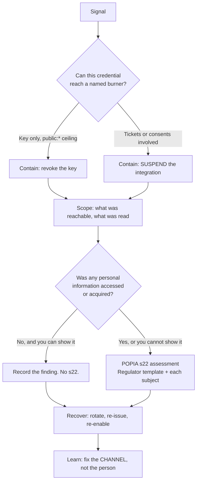

## Security auditing procedures — the human process

This is the operational half of the Relay Ticket design. Every control the
architecture defines has a moment where it stops being code and becomes somebody
doing something on a Tuesday. This document is that half, written to be followed.

It binds a small volunteer maintainer team (one maintainer as of 6 Aug 2026) plus,
where a second person is named, one other. Anything that needs a team this project
does not have is marked **NOT STAFFED** rather than written as if it were.

Three properties every procedure below is built to preserve:

1. **The API key is a ceiling, never a principal.** Every `/v1` answer is
   `resolve(END USER, live) ∩ ceiling ∩ consented`, and every review question is a
   question about one of those three terms.
2. **The medical trail is a RECORD, not monitoring.** `AGENTS.md:172-177` and
   `docs/accounts-security-spec.md:277-287` forbid volume thresholds, per-actor
   profiling and alerting on `bio.medical.view`. An enumeration detector was built
   and deliberately removed. Nothing in this document reintroduces one.
3. **A process step that CI can enforce is a CI check, not a checklist line.**
   §10 is the enforceable half; §9 states honestly which half is which, because a
   checklist nobody can prove ran is decoration.

Terminology, fixed here and used throughout, matching the schema in migration 0029:

| Term                | Concretely                                                                                                                      |
| ------------------- | ------------------------------------------------------------------------------------------------------------------------------- |
| **integration**     | one row in `integrations` — slug, name, contact email, sponsor, status, `ceiling`, `redirect_uris`, `key_hash`                  |
| **key**             | the `ab_ik_…` secret whose sha256 hex is `integrations.key_hash`. A **ceiling**. Reaches `public:*` and nothing else on its own |
| **ceiling**         | `integrations.ceiling` jsonb — the scope strings this integration may ever ask a burner for                                     |
| **consent**         | one row in `integration_consents` — `(user_id, integration_id)` unique, `scopes`, `granted_at`, `revoked_at`, `revoked_by`      |
| **ticket**          | `abrt_…`, a row in `integration_tickets` pointing at a live `session.id`. The presence proof                                    |
| **disclosing read** | a `/v1` response carrying `medical`, i.e. scope `bio:medical:read`                                                              |

---

## 1. The review calendar

| Cadence                                                                                    | Review                                                                                                                                                                                                                                                                                           | Who                                                                     | Evidence                                  | Where it happens                                                   |
| ------------------------------------------------------------------------------------------ | ------------------------------------------------------------------------------------------------------------------------------------------------------------------------------------------------------------------------------------------------------------------------------------------------ | ----------------------------------------------------------------------- | ----------------------------------------- | ------------------------------------------------------------------ |
| **Every merge**                                                                            | The CI gate — §10                                                                                                                                                                                                                                                                                | CI, no human                                                            | the workflow run, retained by GitHub      | `.github/workflows/ci.yml`, aggregate `CI pass` (`ci.yml:518-521`) |
| **Every issuance**                                                                         | Key issuance — §5                                                                                                                                                                                                                                                                                | maintainer, as System manager rank                                      | the issuance record + `audit_events` rows | org console → Integrations                                         |
| **Monthly**, first working day                                                             | Integrations review — §2.2. Folds into the existing monthly digest (`docs/auth-platform-spec.md:514-527`, which has seven items today) as **items 8–17** — §2.2's ten new items; §2.2 items 11 and 12 are the digest's existing items 5 and 6 re-read with integrations in mind, not new numbers | maintainer                                                              | one dated page, §3                        | org console → Integrations, `/audit`, `/system`                    |
| **Per edition**, twice yearly, at the same point in the burn clock as the edition rollover | Full ceiling re-justification — §2.3                                                                                                                                                                                                                                                             | maintainer **+ the sponsoring department contact for each integration** | the before/after ceiling listing, §3      | org console → Integrations                                         |
| **Annually**, or on expiry — whichever is first                                            | Posture review — §2.4                                                                                                                                                                                                                                                                            | maintainer                                                              | the checklist, §3                         | repo settings, npm, POPIA register                                 |
| **Out of band**                                                                            | §4 triggers → §7 runbooks                                                                                                                                                                                                                                                                        | maintainer                                                              | the runbook output, §3                    | wherever the incident is                                           |

**Why monthly and not weekly.** The monthly digest already exists and already
carries the privileged-access review (`auth-platform-spec.md:520-522`, item 4 —
"current god/org_staff holders … and any elevations in `audit_events`, so
privileged access is reviewed monthly"). Integrations are the same class of object
and belong in the same document. A separate weekly cadence would be aspirational:
a review that is skipped is worse than one that is scheduled honestly, because the
gap it leaves is invisible.

**Why per-edition and not quarterly.** `packages/db/src/schema.ts` makes editions
the root namespace of the whole product. A ceiling justified for one edition's
Camp 404 roster is not automatically justified for the next edition's. Tying
re-justification to the edition rollover means it happens when the person
approving it is already thinking about that edition.

---

## 2. The recurring reviews

### 2.1 Every merge — automated only

No human step. §10 is the complete list of what runs and what each check fails on.
The only human obligation attached to a merge is the review requirement on the
CODEOWNERS paths, which is **inert until branch protection requires review from
code owners** — `.github/CODEOWNERS` says so in its own header, pointing at
`SECURITY.md:95-112` ("Repository settings"). Enabling it is the fourth blocking
prerequisite in §5.5.

### 2.2 Monthly — the Integrations review

Twelve items. Each is one query or one screen. None needs tooling that §5 and the
console screens do not already build. Work top to bottom; **item 4 is the one that
catches the insider case and it is not optional.**

**1. Live integrations.** For each row in `integrations` where `status = 'active'`:
name, slug, sponsor, contact email, when it was issued.
→ _Action:_ an integration whose contact email no longer reaches a named human is
**suspended**, not left running. There is no grace period for this. The contact is
the only party a POPIA complaint can be addressed through (§7.2 step 6).

**2. Dormancy.** For each active integration, the newest `integration_consents.last_used_at`
across all its consents.
→ _Action:_ **no use in 60 days ⇒ suspend.** An unused credential is pure
liability: it can be stolen but it cannot be missed. Re-activation is one row and
one audit event; it costs the integrator an email.
→ **The blind spot, stated so it is not walked into.** An integration that only
ever reads `public:*` has **no consent rows at all**, so `last_used_at` is null
forever — and successful `public:*` reads are not audited either (§7.1 step 4,
review finding M7). This item cannot see such an integration working, and
mechanically applied it would suspend a healthy one. A ceiling that is entirely
`public:*` is therefore **exempt from item 2** and reviewed on item 1 (does the
contact still reach a human) instead. Do not close the gap by auditing successful
public reads — that buries the log `getMedicalAccessLog` and the erasure path
depend on (`docs/sdk/04-backend-work-required.md:1012-1014`).

**3. Ceiling drift.** Diff each integration's `ceiling` against last month's
recorded value. The `integration.ceiling.changed` audit rows carry `{before, after}`
(architecture §3.1 — there is no numbered decision list to cite), so this is a query,
not a memory test:

```sql
SELECT created_at, actor_id, subject, meta
  FROM audit_events
 WHERE action = 'integration.ceiling.changed'
   AND created_at >= now() - interval '35 days'
 ORDER BY created_at DESC;
```

→ _Action:_ **every added scope must be traceable to a named request in the
issuance record (§5.4).** An addition with no matching request is an out-of-band
trigger (§4), not a note for next month.

**4. Privileged-access review, extended.** The existing digest item 4 —
current `god`/`org_staff` holders and every elevation — plus every
`integration.created`, `integration.key.created`, `integration.key.revoked`,
`integration.suspended`, `integration.ceiling.changed` row in the window.
_(Action names follow the audit shard's superseding table, shard-02 §2.1: a
rotation writes `integration.key.created` with `{rotatedFrom}`, not a separate
`integration.key.rotated` — the inherited §4.3.10 name. Read whichever the
implementation lands on; the review is the same.)_
→ _Why this is the sharpest item:_ issuance is gated on `requireSystemManager`
(`apps/org/lib/session.ts:364-375`, which calls `isSystemManager` at
`packages/core/src/org-permissions.ts:438`). A System manager can always defeat
that gate, because they _are_ the gate. There is no technical control against the
maintainer issuing themselves an integration; the control is that the act leaves
audit rows it cannot suppress — two at issuance (§5.6), plus one per key and one
per suspension — and a human reads them a month later. Say so out loud rather than
pretending otherwise.

**5. Consent volume.** Per integration: live consents, consents granted this month,
consents revoked this month, split by `integration_consents.revoked_by`
(`subject` / `org` / `integrator` / `system`).
→ _Read it as a product signal first._ A spike in `revoked_by = 'subject'` means
burners did not like what an app did. That is usually a product problem and
occasionally the first sign of §7.2.

**6. Refusals.** `audit_events WHERE action = 'integration.call.refused'` over 30
days, grouped by integration and by refusal code.
→ **_This action is NOT yet settled — flagged as new here._** It survives from the
inherited `docs/sdk/04-backend-work-required.md:1007-1010`, whose version sets
`actor_id = integrations.service_user_id`; the service user is deleted by this
round (shard-01 §2, `users.kind` verified absent). The audit shard's superseding
vocabulary (shard-02 §2.1) enumerates **seven** integration-lifecycle actions and
states "none of them is a read", so this action is currently outside it. If it is
kept: `actor_id = NULL` (the column is nullable — `packages/db/src/schema.ts:1712-1714`),
`meta` of ids/enums/`requestId` only, and it **must never carry a `subject`** — the
same shard rejects auditing refused _reads_ precisely because that names people who
may have notes. If it is not kept, this item and §7.1 step 2's second query read
structured server logs instead.
→ _Action:_ a sustained `insufficient_scope` rate means a broken integrator nobody
told you about — email them. A sustained `invalid_credentials` rate against one
integration is an out-of-band trigger (§4): the honest readings are a rotated key
somebody did not deploy, or somebody guessing.
→ _Constraint:_ this is grouped **by integration**, never by human. See §11.

**7. Disclosing-read volume, per integration.**

```sql
SELECT meta->>'integrationId' AS integration_id,
       count(*)                          AS reads,
       count(DISTINCT subject)           AS distinct_subjects
  FROM audit_events
 WHERE action  = 'bio.medical.view'
   AND meta->>'via' = 'integration'
   AND created_at >= now() - interval '30 days'
 GROUP BY 1
 ORDER BY distinct_subjects DESC;
```

→ **Read the constraint before you read the number.** The `meta->>'via' = 'integration'`
predicate is load-bearing and must never be dropped: it makes this query
structurally incapable of surfacing a human actor's first-party activity, which is
the thing `AGENTS.md:172-177` forbids. What it counts is an _integration's_ pull.
A camp safety lead reading forty members' notes in one sitting is the job
(`docs/accounts-security-spec.md:279-284`); an integrator's server pulling four
thousand distinct burners in an hour is nobody's job.
→ _There is no threshold and no alert wired to this._ It is a number a human looks
at once a month. If it ever becomes an alert, that is a product decision with a
stated threat model, in the exact words `accounts-security-spec.md:286-287`
already uses — not a refactor.

**8. Ticket hygiene.** Rows in `integration_tickets` where `expires_at < now() - interval '1 day'`.
→ _Expected: near zero._ The `ON DELETE CASCADE` from `session` collects most of
them and the existing deletion sweep collects the rest (architecture §11 — there is no
sweep _job_ and must never be one; this is the hygiene line on the existing sweep).
A growing count
means the sweep is not running, which is a silent failure of a table that holds
live authorisation pointers.

**9. Erasure integrity.** Confirm no `integration_consents` or `integration_tickets`
row references a `users.id` whose `sanitized_at IS NOT NULL`.

```sql
SELECT c.id FROM integration_consents c
  JOIN users u ON u.id = c.user_id
 WHERE u.sanitized_at IS NOT NULL;
```

→ **Expected: zero rows, always.** A non-zero result means a live authorisation
survives an erased account — a POPIA failure and a live security hole in one.
Pinned in CI by `consent-tables-in-erasure` (§10), but run it against production
too: the test asserts over the constant list in
`packages/core/src/account-sanitization.ts:188-192`, and only production proves
the runner in `apps/web/lib/account-sanitize.ts` actually executes it.

**10. Meta hygiene.** Sample twenty of the newest `bio.medical.view` rows carrying
`meta.via = 'integration'` and read the `meta` objects.
→ _You are looking for anything that is not an id, an enum value, or a `requestId`._
The POPIA scrubber is a literal three-key subtraction —
`meta - 'email' - 'contactEmail' - 'primaryEmail'` at
`apps/web/lib/account-sanitize.ts:351` — added because 32 rows on the live database
carried an email address that survived erasure verbatim
(`apps/web/lib/account-sanitize.ts:341-346`). Any _other_ PII-bearing key is
invisible to that scrubber forever. `no-forbidden-meta-keys` (§10) catches the
literals it knows about; this item catches the ones it does not.

**11. Secrets and dependencies.** Last rotation dates for `BETTER_AUTH_SECRET`
and `PGCRYPTO_KEY`; outstanding GHSA/Dependabot advisories; `better-auth`
explicitly, which is pinned 1.6.25 exactly (`AGENTS.md:118`, `SECURITY.md:83-86`)
and whose watch we own.
→ _Standing gap:_ there is **no `.github/dependabot.yml`** in the tree (verified —
`.github/` holds only `CODEOWNERS`, `ISSUE_TEMPLATE`, `pull_request_template.md`,
`workflows`). `SECURITY.md:123-124` describes Dependabot as a repository setting,
so the `better-auth` auto-merge exclusion exists only as prose. Commit it as
config so it is reviewable.

**12. Posture.** `security.txt` `Expires` still in the future (§2.4); npm 2FA still
enforced; the org's `/system` panel green.
→ _Standing gap:_ `apps/web/public/.well-known/` **does not exist** (verified).
`docs/auth-platform-spec.md:444-450` specifies the file and nobody has built it.
Until it does, an integrator developer who is not a GitHub user of this repository
has no documented way to report a hole — see §5.7.

### 2.3 Per edition — full ceiling re-justification

Twice a year. This is the review the monthly one cannot do, because it asks a
question the monthly diff cannot: _not "what changed" but "is any of this still
justified"._

For **every** active integration, and **every** scope string in its ceiling:

1. Read the justification recorded at issuance (§5.4). Is the sentence still true
   for the coming edition?
2. Confirm the scope is still the **narrowest** that works. A scope granted because
   a narrower one did not exist gets re-checked against the current vocabulary.
3. Confirm the sponsor named in `integrations.sponsor_user_id` is still an active
   org account and still willing to sponsor. A sponsor who has left is a ceiling
   with nobody behind it.
4. **Remove first, ask later.** A scope nobody can justify in one sentence comes
   out of the ceiling in this session. The integrator can request it back with a
   reason; that request is cheap and the standing grant is not.
5. Re-confirm `redirect_uris`. An editable redirect URI on a live integration is a
   ticket-exfiltration primitive (§5.3); a stale one pointing at a domain the
   integrator no longer controls is worse.

Record the before/after ceiling listing per integration (§3). This listing is also
the artefact that makes item 3 of the monthly review meaningful — it is the
baseline the monthly diff runs against.

**Second person required.** The sponsoring department contact signs off on their
own integrations. Where a department has no contact, the integration is suspended
rather than approved by the maintainer alone: an approval where the approver and
the requester are the same person is not an approval.

### 2.4 Annually — posture

1. `/.well-known/security.txt` — regenerate with a fresh `Expires` ≈ one year out.
   A stale `Expires` makes the file _invalid_, not merely old
   (`docs/auth-platform-spec.md:444-450`). Pinned by `security-txt-not-expiring`
   (§10) so this cannot be forgotten silently.
2. npm organisation: 2FA enforcement, publish tokens, provenance still on. Revoke
   any token whose owner has changed role.
3. POPIA artefacts (`auth-platform-spec.md:419-432`): the Records of Processing
   register gains a row per PII class **reachable through `/v1`** — at minimum
   `medical`, whose lawful basis is the burner's explicit consent at the point of
   entry under s27(1)(a) (`auth-platform-spec.md:347-352`) _plus_ the relay consent
   recorded in `integration_consents`. Two consents, two records.
4. Information Officer registration still current; PAIA/POPIA manual still published.
5. Retention: confirm the medical-view retention rule (§8.6) and the
   `integration_tickets` sweep horizon are both still what was decided.
6. Re-read §11. If any line in it has quietly become false, that is the finding.

---

## 3. Evidence capture

A review that leaves no artefact did not happen. Three rules, and they are cheap
on purpose.

**What every completed review produces.**

| Review      | Artefact                         | Contains                                                                                                                     |
| ----------- | -------------------------------- | ---------------------------------------------------------------------------------------------------------------------------- |
| Monthly     | one dated page                   | the twelve items, each with a result or an explicit "none"; every action taken; every out-of-band trigger raised             |
| Per edition | the before/after ceiling listing | per integration: every scope before, every scope after, the one-sentence justification for each survivor, the sponsor's name |
| Annual      | the six-item checklist           | result per item, and the new `Expires` date                                                                                  |
| Incident    | the runbook output               | §7's common spine, filled in, including timestamps                                                                           |
| Issuance    | the issuance record              | §5.4                                                                                                                         |

**Where it lives.** Not in this repository. The repository is public
(`AGENTS.md:354-356`: no real personal contact data, no naming real businesses in
negative demo states), and every one of these artefacts names real humans, real
contact emails and real integrations. They live wherever the monthly digest already
lives. **Never** paste a review page into an issue, a PR body or a commit message.

**What an artefact must never contain.** A key or any prefix of one; a ticket; a
burner's medical notes or any excerpt; a burner's email where an id would do. The
rule is the same one the audit `meta` follows: ids resolve to names at read time
through tables erasure controls, names written down do not.

**Retention.** Reviews are retained as long as the audit rows they describe (§8.6).
"None" is a valid and useful line — a monthly page that says _no new integrations,
no ceiling changes, no revocations, refusals nominal_ is exactly the evidence a
board or a Regulator would want and takes four minutes to produce.

**"It was clean" is not evidence.** Item 9's query returning zero rows is evidence;
remembering that it did is not. Paste the query and the count.

---

## 4. Out-of-band triggers

Any one of these starts an unscheduled review **the same day**. They are written as
observations, not as judgements, so nobody has to decide whether something counts.

| Trigger                                                                                                          | Route to                                                                                                                                                                                                                                                                                                             |
| ---------------------------------------------------------------------------------------------------------------- | -------------------------------------------------------------------------------------------------------------------------------------------------------------------------------------------------------------------------------------------------------------------------------------------------------------------- |
| A key appears anywhere public — an issue, a PR, a log, a chat, a partner's repository, a paste site              | §7.1                                                                                                                                                                                                                                                                                                                 |
| Secret scanning / push protection fires on an `ab_ik_` pattern                                                   | §7.1                                                                                                                                                                                                                                                                                                                 |
| A burner reports an app doing something they did not consent to                                                  | §7.2                                                                                                                                                                                                                                                                                                                 |
| A sustained `invalid_credentials` rate against one integration (monthly item 6, seen early)                      | §7.1 then §7.2                                                                                                                                                                                                                                                                                                       |
| An `integration_scopes`-equivalent change — a ceiling addition — with no matching request in the issuance record | §7.2 step 6, and a privileged-access review                                                                                                                                                                                                                                                                          |
| A disclosing-read count for one integration that a human cannot explain in a sentence                            | §7.3                                                                                                                                                                                                                                                                                                                 |
| A `bio.medical.view` row whose `meta.integrationId` names an integration the subject has **no live consent** for | **§7.3, immediately.** This is structurally impossible under the relay join (architecture §8.3, the one query). If it happens, the wrapper is broken and every read since the break is suspect                                                                                                                       |
| An `audit_events` row for a disclosing read with `actor_id IS NULL` and `meta.via = 'integration'`               | §7.3. `audit_events.actor_id` is `uuid REFERENCES users(id) ON DELETE SET NULL` (`packages/db/src/schema.ts:1712-1714`), so a null here means either the actor was erased _after_ the read — benign, check the timestamps — or the handler wrote no actor, which is not benign                                       |
| An integrator reports their own server compromised                                                               | §7.4                                                                                                                                                                                                                                                                                                                 |
| A `better-auth` GHSA lands                                                                                       | not an integration incident — the emergency un-pin decision at `AGENTS.md:118` / `auth-platform-spec.md:662-670`. Note that under the Relay Ticket design the pinned version sits on the presence-proof path (`requireCampUser()` at mint), so a session-handling advisory is an integration incident by consequence |
| A `session`-table anomaly — rows surviving a sign-out, or a `revokeSessionsOnPasswordReset` that did not fire    | **§7.3.** Revocation is a foreign key in this design; if `session` deletion stops propagating, ticket revocation has silently stopped working                                                                                                                                                                        |
| POPIA erasure leaves a live consent (monthly item 9 non-zero)                                                    | §7.3, and fix `SANITIZATION_PURGED_TABLES` before anything else                                                                                                                                                                                                                                                      |

---

## 5. Key issuance — approval and least-privilege justification

An integration is created by a human act, never by an endpoint. There is no
self-service registration at any version. The whole procedure exists so that a
year later somebody can answer _who approved this reach, and on what basis._

### 5.1 Who may issue

`requireSystemManager` (`apps/org/lib/session.ts:364-375`) → `isSystemManager`
(`packages/core/src/org-permissions.ts:438`), which reads `memberships.role` and
nothing else. **Rank, never a capability.**

Rejected: gating issuance on a grantable org capability. The right to edit rights
must not be grantable (`AGENTS.md:187-192`, and `manage_accounts` is refused to
every role by the resolver itself for the same reason). A capability called
`manage_integrations` would be a capability that mints capabilities.

Rejected: a `personal_information`-style grid entry for medical scopes. `bio:medical:read`
is **absent from the default grid entirely**, not greyed out — an
always-refusing control is the affordance that eventually gets a `true`.

### 5.2 The request

The integrator supplies, in writing, before anything is created:

1. **Who they are** — a named human, and an email that reaches them. Not a role
   alias, not a shared inbox nobody owns.
2. **What the app does**, in two sentences a burner would understand. This text is
   the raw material for the consent screen copy; if it cannot be written plainly it
   cannot be consented to.
3. **Which scopes, and why each one.** One sentence per scope naming the feature
   that stops working without it. "For future use" is a refusal.
4. **Where the ticket lands** — the exact `redirect_uri` values, no wildcards.
5. **What they will store, and for how long.** The platform cannot enforce this.
   Recording it is what makes it a commitment rather than an assumption.
6. **Who their users are.** A multi-tenant integrator (one server, many camps)
   carries the H4 cross-tenant cache risk and gets an explicit line about it.

### 5.3 The approval decision

Approve only when **all** of these hold. Any one failing is a refusal, not a
negotiation:

- [ ] Every requested scope passes `isDelegableScope`. **`org:*` is not
      expressible** and a request for it is a design conversation, not an approval.
- [ ] Every requested scope has a one-sentence justification naming a feature.
- [ ] No requested scope is broader than the feature needs. Where a narrower scope
      exists, the narrower one is granted.
- [ ] Every `redirect_uri` is an exact absolute HTTPS URL on a domain the
      integrator demonstrably controls. No wildcards, no path prefixes, no regex.
      Pinned by `redirect-uri-exact-match` (§10).
- [ ] A named human sponsor exists and has agreed, and is recorded in
      `integrations.sponsor_user_id`.
- [ ] The contact email has been **replied to from**, not merely written down.
- [ ] **`bio:medical:read` only:** all of the above, plus §5.5.

### 5.4 The issuance record

Created at the same time as the row, kept where §3 says. It is the document §2.3
re-reads and §7 quotes.

```
Integration:      camp-404
Name:             Camp 404
Sponsor:          <name>, <department>            (users.id recorded on the row)
Contact:          <name> <email>                  (replied-to on <date>)
Requested:        <date>          Approved: <date>          By: <name>
Ceiling granted:
  self:profile:read      — the roster screen shows the member's own display name
  camp:view_member_details — the roster screen is the whole product
Ceiling refused:
  bio:medical:read       — deferred; see §5.5, not requested for this edition
Redirect URIs:
  https://camp-404.example/auth/afrikaburn/callback
Data handling stated:  <verbatim from the request>
Key issued:            <date>, shown once, not recorded here
Review due:            <next edition rollover>
```

The key's plaintext is **shown once and never written down** — not in this record,
not in a password manager entry the maintainer keeps "just in case", not in an
email. The DB holds sha256 hex via `hashToken` and nothing else can recover it. If
the integrator loses it, rotate (§6.2); do not go looking for a copy, because the
existence of a copy is the failure.

### 5.5 Additional gate for `bio:medical:read`

Medical is its own tier — its own namespace, its own TTL rule, never renewable.
Its issuance gate is separate too, and this is the one place the procedure is
deliberately slow.

- [ ] The four blocking prerequisites are shipped and green:
      `packages/db/src/actors.ts` extracted and failing closed; `stripHardLocked`
      built; `/account/medical-access` live; branch protection enabled.
- [ ] The integrator has stated **in writing** what they do with the notes and how
      long they hold them, and understands they become a responsible party under
      POPIA in their own right (`auth-platform-spec.md:347-352` — medical is
      special personal information under s26/s27).
- [ ] The sponsoring department contact has signed off, separately from the
      maintainer. **Two humans, always.**
- [ ] The consent copy that a burner will read has been reviewed word for word,
      including the retention sentence — _"Camp 404 keeps its own copy of anything
      you share. Disconnecting stops new access; it cannot delete what they already
      have."_ A promise the platform cannot keep must not be implied.
- [ ] A dated entry lands in the Records of Processing register (§2.4 item 3).

**Never bundle it.** `bio:medical:read` is granted as its own ceiling change with
its own audit row, on its own day, never as one line in a list of five scopes
approved together.

### 5.6 What issuance writes

| Row                                          | Where                                 | Contents                                                             |
| -------------------------------------------- | ------------------------------------- | -------------------------------------------------------------------- |
| `integrations`                               | migration 0029                        | slug, name, contact, sponsor, `ceiling`, `redirect_uris`, `key_hash` |
| `audit_events` `integration.created`         | `packages/db/src/schema.ts:1708-1737` | actor = the issuing System manager's `users.id`; ids only            |
| `audit_events` `integration.ceiling.changed` | same                                  | `meta: { integrationId, before: [], after: [...] }`                  |

`meta` carries ids, enum values and `requestId` only — never the integrator's
contact email, never a person's name. The scrubber at
`apps/web/lib/account-sanitize.ts:351` removes exactly three keys and nothing else,
so anything else written here is permanent (`docs/auth-platform-spec.md:534-537`
states the rule; the 32-row incident is why it exists).

### 5.7 Hand-off

The plaintext key travels once, over a channel the integrator already
authenticates on, and is never re-sent. Along with it goes:

- the base URL, the two headers, and the fact that `/v1` is **server-side only** —
  there is no CORS and a browser cannot call it;
- that the key alone reaches `public:*` and nothing else, so their first successful
  call proves nothing about burner data;
- **how to report a hole.** Today the honest answer is GitHub private vulnerability
  reporting (`SECURITY.md:9-17`), which assumes a GitHub user of this repository.
  For an integrator developer who is not one, the answer is `security.txt` — which
  does not exist (§2.2 item 12). Until it does, the hand-off names a mailbox
  explicitly. **Do not hand somebody a credential and no way to tell you it
  leaked.**
- that `pnpm sdk:local` mints a local key against the compose stack and the minter
  refuses any non-compose target, so "test it locally" is a real instruction
  (`SECURITY.md:30-54` forbids testing against the live deployment, and that
  prohibition now covers key holders, not only browser users).

---

## 6. Key review, rotation and revocation

### 6.1 Review

Covered by monthly items 1–3 and the per-edition re-justification. One additional
standing rule, because it is the cheapest real control in this document:

> **A key with no request in 60 days has its integration suspended.** Not warned
> about. Suspended.

An unused credential cannot be missed if it is stolen, and the integrator who
actually needed it will email within a day. **Suspension, not revocation** — same
number, one row, reversible in one row, consistent with monthly item 2 and with
"suspend first" (§6.3). Revoking the key alone leaves a live integration
authenticating against nothing.

### 6.2 Rotation

Three columns on `integrations`, not a fourth table: `key_hash`,
`previous_key_hash`, `previous_key_expires_at`. The resolver's `WHERE` accepts either while the grace
window is open (architecture §3.2 and §8.3 — both hashes are terms in the one
resolver `WHERE`).

Procedure:

1. Mint the new key; show it once; hand it off as §5.7.
2. Set `previous_key_expires_at` to the agreed grace end. Architecture §3.2
   already sets the rotation default at `now() + 7 days`; this procedure's
   preference is **days, not a week** — the grace window is the entire exposure of
   the old key — and the divergence is §12.3's decision, not a silent override.
3. Confirm with the integrator that the new key is deployed.
4. Set `previous_key_expires_at = now()` the moment they confirm. Do not wait for
   the window to run out.
5. `audit_events` `integration.key.created` with `{ rotatedFrom }`, ids only
   (shard-02 §2.1; the inherited §4.3.10 name was `integration.key.rotated`).

**"Revoke now" is step 4 run first.** In an incident the grace window is the
mistake, not the mechanism.

### 6.3 The five levels of revocation

Know which one you are reaching for. They differ in blast radius and in who can
undo them.

| Level       | Mechanism                                                   | Kills                                                                                          | Reversible by                                   |
| ----------- | ----------------------------------------------------------- | ---------------------------------------------------------------------------------------------- | ----------------------------------------------- |
| **Burner**  | `integration_consents.revoked_at`, `revoked_by = 'subject'` | that burner's access for that app, at the next request                                         | the burner, by re-consenting                    |
| **Key**     | rotate + `previous_key_expires_at = now()`                  | every request from the old key                                                                 | issuing a new key                               |
| **Org**     | `integrations.status = 'suspended'`                         | every key, every ticket, every future consent screen for that slug                             | a System manager                                |
| **Session** | the burner signs out / resets their password / is sanitized | every ticket bound to that session, **in the same Postgres statement** via `ON DELETE CASCADE` | signing in again and re-consenting              |
| **Expiry**  | `integration_tickets.expires_at`                            | one ticket. 900s standard, 120s disclosing                                                     | re-mint (standard) / a fresh click (disclosing) |

These five are ranked by **blast radius**, which is a different axis from
architecture §11's five _levers_. The one lever with no row here is the
integrator's own `DELETE /v1/consent` (`revoked_by = 'integrator'`) — it has the
same blast radius as the burner level and is never an incident response, so it is
read in monthly item 5 rather than reached for in §7.

**Suspend first, investigate second.** Suspension is one row and reverses in one
row. A wrongly-suspended honest partner loses an hour; a wrongly-tolerated rogue
loses burners' data. This ordering is the single most important operational
instruction in this document.

**`integration_consents.integration_id` is `ON DELETE RESTRICT`** (the DDL is
shard-03 §5.1), so the console must suspend before it can delete. That is deliberate: a
live integration cannot be orphaned into authenticating against nothing.

---

## 7. Incident runbooks

### 7.0 The common spine

Every runbook below follows the same five moves, and the order is not negotiable.
It extends `docs/auth-platform-spec.md:462-499` rather than replacing it.



1. **Contain.** Before investigating. Containment is cheap and reversible; the
   investigation is neither.
2. **Scope.** What the credential could reach, and what it demonstrably did.
3. **Notify.** The POPIA s22 assessment is a _hard step_, not a judgement call —
   see §7.5.
4. **Recover.** Rotate, re-issue, re-enable, in that order.
5. **Learn.** The finding is almost always about a channel or a default, not about
   a person.

**Preserve evidence before rotating anything** (`auth-platform-spec.md:495`).
Rotating a key destroys nothing here — the audit rows are append-only — but
suspending an integration changes what the console shows, so capture the queries
in §7.1 step 2 before you start changing state.

### 7.1 Leaked integrator key

_Trigger: a key in a public place, secret scanning firing, or a burst of
`invalid_credentials` from one integration._

**1 — Contain (minutes).**

- Rotate the key and set `previous_key_expires_at = now()` in the same action.
  Do **not** start with a normal rotation: the grace window is the exposure.
- If more than one key is plausibly affected, or you cannot tell:
  `integrations.status = 'suspended'`. One row.

**2 — Scope.**

`$1` is the integration's **uuid** throughout — resolve it from the slug once, first,
and do not let the two identifiers swap places mid-runbook:

```sql
-- 0. Resolve the id, and read what the credential could reach as it stood.
SELECT id, slug, status, ceiling, redirect_uris FROM integrations WHERE slug = $slug;

-- Refusals: attempts that did not land. (Only if `integration.call.refused` shipped
-- as an audit action — see §2.2 item 6; otherwise this is a server-log query.)
SELECT created_at, meta FROM audit_events
 WHERE action = 'integration.call.refused'
   AND meta->>'integrationId' = $1
 ORDER BY created_at DESC LIMIT 500;

-- Disclosing reads that DID land, per subject.
SELECT created_at, actor_id, subject, meta FROM audit_events
 WHERE action = 'bio.medical.view'
   AND meta->>'integrationId' = $1
 ORDER BY created_at DESC;

-- Lifecycle rows use `subject`, NOT meta — shard-02 §2.1 sets
-- subject = 'integration:' || integrations.id.
SELECT created_at, actor_id, action, meta FROM audit_events
 WHERE subject = 'integration:' || $1
 ORDER BY created_at DESC;
```

**3 — The question that decides severity.** _Could this key, alone, name a burner?_
Under the Relay Ticket design the answer is **no**: a key with no ticket reaches
`public:*` only, and a ticket cannot be minted without a burner completing a
consent click on `app.example-apex.org` behind `requireCampUser()`. Record
the ceiling **as it stood at the time**, from the `integration.ceiling.changed`
history, not as it stands now.

**4 — State the gap honestly.** Successful `public:*` reads are **not audited**
(review finding M7, still open for that class). The incident note says so. Do not
imply a completeness the data does not have.

**5 — s22 assessment.** §7.5. A key that could only reach `public:*` and
demonstrably minted no ticket is the one common case where the honest answer is
_no personal information was accessed or acquired_ — but write down the evidence
for that conclusion, do not assert it.

**6 — Recover.** New key, hand-off as §5.7. Ceiling copied **deliberately**: this
is a re-justification moment, not a copy-paste. If a scope was in the ceiling and
nobody can justify it now, it does not come back.

**7 — Learn.** Was the leak path covered by push protection? Was the hand-off
channel one-time? Fix the channel.

### 7.2 Rogue integrator app

_Trigger: a burner reports behaviour they did not consent to; an unexplained
ceiling addition; a revocation spike; misrepresentation discovered at any point._

**1 — Suspend. First. Now.** `integrations.status = 'suspended'`. Every key, every
outstanding ticket and the consent screen for that slug die on the next request.
Reversible in one row.

**2 — Enumerate the affected burners truthfully.**

```sql
-- Everyone who ever consented, and to what.
SELECT user_id, scopes, granted_at, revoked_at, revoked_by, last_used_at
  FROM integration_consents WHERE integration_id = $1;

-- Every person-identifying read that actually happened.
SELECT created_at, actor_id, subject, action, meta
  FROM audit_events
 WHERE meta->>'integrationId' = $1
 ORDER BY created_at;
```

The distinction matters and must survive into the notice: _consented_ is a larger
set than _read_. Telling somebody their medical notes were read when they were not
is its own harm.

**3 — Notify the consenting burners directly.** Both channels: a `notifications`
inbox row and the `security_events` feed they already have
(`docs/accounts-security-spec.md:322-336`), plus email. _The feed exists; the
`kind` does not — `app_disconnected` is a **new** `security_event_kind` value
added by `ALTER TYPE` in migration 0029 (shard-03 §5), and a display title in
`@quagga/core` `describeSecurityEvent`. Writing the row without the title renders
nothing._ Say four things:

- what the app was authorised for;
- what it actually read — from the audit rows, not from the ceiling;
- that its access is revoked, and that theirs was revoked without them having to
  act;
- **that AfrikaBurn cannot make the integrator delete its copy.** Revoking stops
  new access. It does not undo what has already been taken. An honest sentence
  here is worth more than a reassuring one.

**4 — Set `revoked_by`.** Bulk-revoke the consents with
`revoked_by = 'org'`, not `'subject'`. The burner's connected-apps card must be
able to say _"AfrikaBurn suspended this app"_ rather than implying they did it
themselves. A bare timestamp cannot render either sentence, which is why the column
exists — `consentRevokerEnum` in shard-03 §5.1, and the consent state machine at
architecture §15.1.

**5 — s22 assessment.** §7.5. If medical notes were among the reads, this is
special personal information under s26/s27 (`auth-platform-spec.md:347-352`) —
the top of the severity scale here.

**6 — Learn, and look at the right layer.** If the app obtained consent by
misrepresenting itself, the failure is at **issuance** — who sponsored it, what
the sponsoring department verified, what §5.2 asked for and did not check. Not at
the token layer. Record which §5.3 checkbox would have caught it, and if none
would have, add one.

### 7.3 Suspected mass PII read

_Trigger: a disclosing-read count nobody can explain; a consent-less read; a
session-cascade anomaly; item 9 returning rows._

This runbook is different from the others in one way: **the credential may be
behaving exactly as designed.** The question is whether the design is being
honoured, so the first move is diagnosis, not containment — with one exception.

**0 — The exception.** If the signal is _a `bio.medical.view` row whose
`meta.integrationId` names an integration the subject has no live consent for_, or
_tickets surviving a deleted session_, suspend everything immediately. Both are
structurally impossible under the relay join and the `ON DELETE CASCADE`
(architecture §8.3, §4.3). If either is observed, the enforcement path is broken
and every read since the break is suspect.

**1 — Establish which of four things you are looking at.**

| Observation                                                                                            | Reading                                                 | Move                                                                                                 |
| ------------------------------------------------------------------------------------------------------ | ------------------------------------------------------- | ---------------------------------------------------------------------------------------------------- |
| Many reads, one integration, all with live consents, all with `canViewMedicalNotes` true for the actor | an app doing its job at volume                          | **Do not escalate on volume alone.** §7.2 step 6's question — is this what the app said it would do? |
| Many reads, one _human_ actor, `meta.via` absent                                                       | first-party safety work                                 | **Stop.** This is the case `accounts-security-spec.md:279-284` exists to protect. Not an incident    |
| Reads whose `actor_id` resolves to an account whose console rank refuses the same read                 | **the `packages/db/src/actors.ts` coercion.** See below | escalate immediately                                                                                 |
| Reads with no matching consent                                                                         | the wrapper is broken                                   | step 0                                                                                               |

**2 — The rank-coercion check.** **This defect is FIXED** (`apps/web/lib/medical-access.ts`,
`packages/core/src/medical-access.ts`). It is documented here because the historical audit
rows it produced are still in the table and still have to be read correctly.

What it was: the resolver coerced a non-rank org role to `org_staff`
(`rank: orgRankFromRole(actorOrgRole) ?? "org_staff"`), where `apps/org/lib/session.ts`
treats the same `null` as the closed console door (`orgRankFromRole` returns `null` for
`lead`/`admin`/`member`, `packages/core/src/org-permissions.ts:178-182`). A second defect fed
it: the fold picking among several org rows tested `isOrgStaffRole`, which is true for
`god`/`org_staff` only, so an ordinary row arriving after an `engineer` row erased the rank
its carve-out depends on. Now a null rank skips the org branch entirely, and
`strongestOrgRole` picks by rank precedence, order-independently.

**Reading rows written before the fix.** An audit row's `basis: "org_staff"` is a true
description of what the code decided and, for this class, a false description of who the
person is. Rows dated before the fix landed therefore cannot be trusted to mean the actor
held an org rank. So:

> For each actor in the suspect set, ask the **console** whether that account may
> read personal information in `registrations`. If the console refuses and the API
> allowed, you have found the coercion, not an attacker.

That is a code incident, not a credential incident. Fix goes to stage 0 of the
delivery plan; the reads already made are still disclosures and still go to §7.5.

**3 — Scope the disclosure set.** Every distinct `subject` in the suspect rows.
This is the notification list, and `audit_events` is a **preserved** table
(`packages/core/src/account-sanitization.ts:167-178`), so the list survives even
for accounts that have since been erased — which is exactly when you need it.

**4 — Do not build a detector on the way past.** The temptation at this moment is
to add a threshold so it never happens again. `AGENTS.md:172-177` forbids it and
the reasoning has not changed: an enumeration detector was built and deliberately
removed because reading many notes in one sitting is what the job looks like. The
correct output of this runbook is a **fixed predicate** and a **fixed query for the
monthly review**, never an alert.

**5 — s22 assessment.** §7.5.

### 7.4 Compromised integrator server

_Trigger: the integrator tells you, or you infer it from reads originating outside
their stated infrastructure._

This is the worst case in the design, and the design's answer is that there is
very little on their disk worth stealing.

**1 — Suspend.** As §7.2 step 1. One lever, instant, org-side.

**2 — Establish what they were holding.**

| Artefact             | Held by the integrator?   | Lifetime if stolen                                   |
| -------------------- | ------------------------- | ---------------------------------------------------- |
| The `ab_ik_…` key    | yes, long-lived           | until rotated. **Reaches `public:*` only**           |
| Standard tickets     | yes, transiently          | ≤900s, and dead the moment the burner's session ends |
| Disclosing tickets   | should not persist at all | ≤120s, single-use, never re-mintable                 |
| A refresh credential | **none exists**           | —                                                    |

**3 — The line to hold.** _There are no long-lived refresh tokens to steal._
Re-minting requires the integrator's key **and** a still-live `session` row **and**
a live consent, and `bio:*` tickets are never re-mintable. If a durable refresh
credential is ever proposed, that single decision converts this runbook from
"suspend and rotate" to "every burner who ever consented is exposed for the
credential's lifetime". Refuse it, and refuse it here in writing so the refusal is
citable.

**4 — Rotate on suspicion, not on proof.** Same posture as
`auth-platform-spec.md:478-480` takes for `PGCRYPTO_KEY`. A compromised host that
"probably" did not reach the key is a rotation.

**5 — Notify.** As §7.2 step 3, with one difference: the honest sentence is that
the integrator's **copy** of previously-shared data is what is at risk, not
AfrikaBurn's store. Say which is which. Blurring them is the difference between a
true notice and a panic.

**6 — s22.** §7.5. Note that POPIA has **no encryption safe-harbour** — unlike
GDPR Art. 34(3)(a), s22 has no "it was encrypted so you needn't notify" exemption
(`auth-platform-spec.md:368-378`). Data the integrator held in plaintext on their
own server is squarely in scope.

**7 — Re-issue only after they can describe the fix.** Not after they say it is
fixed.

### 7.5 The POPIA s22 step, once, referenced by all four

Bake this in as a hard step; it is not a judgement call
(`docs/auth-platform-spec.md:380-398`).

- **Trigger:** reasonable grounds to believe an unauthorised person **accessed OR
  acquired** personal information. **There is no materiality threshold.** One
  record triggers it. A volunteer team does not get to decide a small leak is not
  worth reporting.
- **Who:** (1) the Information Regulator **and** (2) each affected data subject,
  unless the subject cannot be identified. Under this design the subjects _can_
  always be identified — `integration_consents` names who consented and
  `audit_events` names whose data was read — so the exception does not apply and
  should not be reached for.
- **Timing:** _"as soon as reasonably possible after discovery."_ POPIA sets **no
  72-hour clock** — that is GDPR. **Do not write 72h into any procedure**; it
  creates a self-imposed obligation you may miss.
- **Form:** the Regulator's official Security Compromise notification template,
  mandatory since 12 Aug 2022. The subject notice must contain: likely
  consequences, measures taken or intended, a recommendation of what the subject
  should do, and the attacker's identity if known.
- **Record it** in the monthly digest's Incidents line, whether or not
  notification triggered. "Assessed, not notifiable, because X" is a valid entry
  and is the evidence that the assessment happened.

---

## 8. Subject-access requests — _"who has seen my medical information?"_

This is the procedure the entire audit trail exists to serve
(`docs/accounts-security-spec.md:274-276`), and Ryan's requirement that API reads
be recorded is only met if the answer includes them.

### 8.1 What exists today, precisely

- The rows: `action = 'bio.medical.view'`, written at
  `apps/web/lib/medical-access.ts:81-92` inside `after()`, carrying `actorId`,
  `subject` and `meta.basis`. The action string is
  `MEDICAL_VIEW_AUDIT_ACTION` (`packages/core/src/medical-access.ts:142`).
- The only reader is **org-facing**: `getMedicalAccessLog`
  (`apps/org/lib/medical-audit.ts`), a 30-day window
  (`MEDICAL_AUDIT_LOOKBACK_DAYS = 30`, `:29`) capped at 500 rows (`:32`), gated on
  `canReadMedicalAccessLog` (`:91-93`) = `canReadPersonalInformationIn(actor, "audit")`.
- **There is no burner-facing surface.** A burner asking today gets an answer only
  if a human runs a query.

### 8.2 The blocking prerequisite

`/account/medical-access` in `apps/web` ships **before** `bio:medical:read` exists.
Opening a third-party disclosure channel while the burner can only find out by
emailing a volunteer is not shippable. It reads `audit_events WHERE action =
'bio.medical.view' AND subject = <me>`, **unbounded in time** — the console's
30-day/500-row window is page ergonomics, not the answer to a legal request.

### 8.3 What the API path must add

1. **The actor is the END USER.** `audit_events.actor_id` is `uuid REFERENCES
users(id) ON DELETE SET NULL` (`packages/db/src/schema.ts:1712-1714`), so the
   column type already makes it impossible for it to be an integration. Good — but
   the handler must still put the right human there.
2. **The integration goes in `meta`, by id.** `{ basis, via: "integration",
integrationId, consentId, ticketId, scope, requestId }`. Ids only.
3. **The action string does not change.** A `bio.medical.view.api` variant would
   drop out of `getMedicalAccessLog`'s filter and fall _back into_
   `getAuditTrail`, whose exclusion is a single
   `ne(schema.auditEvents.action, MEDICAL_VIEW_AUDIT_ACTION)`
   (`apps/org/lib/medical-audit.ts:230`) — creating an unfiltered disclosure census
   for exactly the rank that must not have one.
4. **`basis` keeps its closed three-value vocabulary.** `parseBasis`
   (`apps/org/lib/medical-audit.ts:59-66`) returns `null` for anything else, which
   would blank the column on the rows most in need of explanation. The basis names
   the _human's_ authority; the app is the route, recorded separately.
5. **`MedicalReadRow` gains `viaIntegration`.** Adding the `meta` keys without
   adding the column satisfies the schema and fails the requirement.

### 8.4 The blocking-audit divergence, and where it must be written

| Path                                 | Audit                                                                                                               | Justification                                                                                                                                                                  |
| ------------------------------------ | ------------------------------------------------------------------------------------------------------------------- | ------------------------------------------------------------------------------------------------------------------------------------------------------------------------------ |
| First-party (`apps/web`, `apps/org`) | `after()`, **fail-open** — a failed insert is swallowed to `console.error` (`apps/web/lib/medical-access.ts:89-91`) | _"nobody should wait on a log row to find out someone is diabetic"_ (`:71-73`), restated at `docs/accounts-security-spec.md:267-272`                                           |
| `/v1` with `via`                     | `await`ed, **fail-closed**. No row, no body. 503 `audit_unavailable`                                                | the emergency justification does not transfer to an HTTP round trip retryable in 40ms, and the whole basis for disclosing to a party with no membership is that it is recorded |

**This divergence must be written into `docs/accounts-security-spec.md` immediately
beside the fail-open paragraph**, not in a spec nobody opens. Two paths now write
the same action string with opposite failure semantics, and the first-party one
carries a long, persuasive comment explaining why fail-open is right. When a camp
lead on one bar of signal gets a 503 at 3am, the cheapest and most sympathetic fix
is to make the API path match — and it will be framed as removing an
inconsistency. It removes the entire basis on which disclosure was permitted.
`medical-api-audits-before-response` (§10) goes red on that revert.

### 8.5 The procedure

| Step | Action                                                                                                                                                                                                                                                                                                                                                                         |
| ---- | ------------------------------------------------------------------------------------------------------------------------------------------------------------------------------------------------------------------------------------------------------------------------------------------------------------------------------------------------------------------------------ |
| 1    | The burner asks — in writing, by any channel. The spec states "rights are not conditional on self-service" of **s24** erasure (`auth-platform-spec.md:416-417`); the same holds for the s23 access right, whose own bullet is `:405-407`. Log the date received                                                                                                                |
| 2    | Verify identity **without collecting new PII** — an authenticated request from the account, or a reply to the address on file. **Never** ask for an ID document to prove identity for a subject-access request; that is the s10 minimisation failure `auth-platform-spec.md:323-334` exists to prevent                                                                         |
| 3    | Query `audit_events WHERE action = 'bio.medical.view' AND subject = <users.id>`, **unbounded in time**. Not `getMedicalAccessLog` — its window and cap are page ergonomics                                                                                                                                                                                                     |
| 4    | Resolve each row: actor's display name and role **at the time**, `meta.basis` in English, `meta.integrationId` → the integration's registered name, timestamp                                                                                                                                                                                                                  |
| 5    | Render it as _"**Nomsa Dlamini** · camp lead · 4 Aug, 19:42 · **through Camp 404**"_. Not "Camp 404 read your medical notes." A person read them, through an app, and both facts belong on the line                                                                                                                                                                            |
| 6    | **State the completeness caveat.** Verbatim: _reads inside AfrikaBurn's own apps are recorded on a best-effort basis; reads through a connected app are recorded before the data is released._ The first half is true because of the `after()` fail-open (`accounts-security-spec.md:267-272`). An answer that overstates completeness is worse than one that admits its bound |
| 7    | Include the burner's **live consents** from `integration_consents` — which apps hold which scopes right now — and how to revoke                                                                                                                                                                                                                                                |
| 8    | Answer "as soon as reasonably practicable" (`auth-platform-spec.md:416`). Log the date answered. Count it in the monthly digest's data-subject-requests line                                                                                                                                                                                                                   |

### 8.6 Retention

`audit_events` is in `SANITIZATION_PRESERVED_TABLES`
(`packages/core/src/account-sanitization.ts:167-178`), so the disclosure record
survives account erasure while the live authority does not — `integration_consents`
and `integration_tickets` join `SANITIZATION_PURGED_TABLES` (`:188-192`).

POPIA s14 sets no fixed number for security logs; the window is our choice
(`auth-platform-spec.md:433-441`). **Decision required from Ryan** (§12): the
`bio.medical.view` rows are the accounting-of-disclosures record, and a general
pruning rule must exempt them or the s23 answer degrades silently over time. Until
a number is set, these rows are not pruned.

---

## 9. Automated versus manual — the honest split

### 9.1 What CI enforces

Every check in §10. All of it rides the existing `pnpm turbo run lint typecheck
test build` gate (`.github/workflows/ci.yml:101-102`) under the aggregate `CI pass`
job (`:518-521`), so **no new required status check is needed** — which matters,
because `SECURITY.md:100-112` deliberately requires exactly one and gives the
reason (a shard nobody remembered to mark required is one that can go red without
blocking a merge).

The idiom is already in the repository: source-scanning tests that read files and
assert on their text, because the guarantee is a property of the source rather than
of anything a unit test can call —
`apps/org/lib/__tests__/org-rank-enforcement.test.ts:30-45` (`readFileSync` +
`functionBody`), whose comment explains it borrows the idiom from
`roster-privacy.test.ts`. `medical-audit-surface.test.ts` already pins the _absence_
of aggregation and alerting. Nothing below invents a new kind of test.

### 9.2 What CI cannot enforce, and is therefore genuinely manual

Stated plainly so nobody assumes coverage that does not exist:

| Manual only                                               | Why CI cannot                                            |
| --------------------------------------------------------- | -------------------------------------------------------- |
| Whether a ceiling addition was actually requested         | the request lives in an email, not in the repository     |
| Whether an integration's contact reaches a real person    | requires sending mail and reading a reply                |
| Whether the scope granted is the **narrowest that works** | "narrowest" is a judgement about a feature CI cannot see |
| Whether a consented app is doing what it said             | requires observing the integrator's behaviour            |
| Whether the sponsor is still willing to sponsor           | requires asking them                                     |
| Whether the monthly review happened at all                | the artefact lives outside the repository (§3)           |
| Whether the issuance record was written                   | same                                                     |
| Whether §11's constraints have quietly become false       | a human re-reading a page                                |

Six of the eight are the same shape: **CI can prove a property of the code, never a
property of a decision.** That is why §3 asks for a dated artefact — it is the only
evidence layer these eight have.

### 9.3 What is deliberately _not_ automated

- **No alerting on any medical read**, first-party or via an integration.
  `AGENTS.md:172-177`, `accounts-security-spec.md:277-287`.
- **No per-actor profiling**, no risk score, no anomaly flag, no threshold marker
  in `meta`.
- **No automated suspension** on any volume signal. Suspension is a human act with
  a human reason, recorded.
- **No hash-chaining of `audit_events`** at this stage. A chain held entirely in
  the database you control only raises the cost of a _partial_ edit; real
  tamper-evidence needs an off-box witness.
- **No Postgres-enforced append-only either, as things stand.** `REVOKE UPDATE,
DELETE ON audit_events` from the application role looks like the cheap
  proportionate control, and the audit shard **rejects it outright** (shard-02 §7)
  for a concrete reason: the POPIA scrubber at
  `apps/web/lib/account-sanitize.ts:349-355` is an `UPDATE` on `audit_events` run by
  the application role during erasure, so a blanket revoke breaks POPIA erasure
  silently. It is reachable only behind a role split or a `SECURITY DEFINER`
  function for that one statement. Raised as §12.5, **not** adopted here. Do not
  half-apply it.

---

## 10. The CI checks, exact

Each row names the check, where it lives, what it asserts, and **the condition
under which it goes red**. A check whose failure condition cannot be stated is not
a check.

### 10.1 Presence, subject and cookie

| Check                      | Lives in                                                          | Asserts                                                                                                                                                                                               | Fails when                                                                                                                                                                                                                                                                                              |
| -------------------------- | ----------------------------------------------------------------- | ----------------------------------------------------------------------------------------------------------------------------------------------------------------------------------------------------- | ------------------------------------------------------------------------------------------------------------------------------------------------------------------------------------------------------------------------------------------------------------------------------------------------------- |
| `no-subject-id-in-v1`      | source scan over `apps/web/app/api/v1/**`                         | the identifier `subjectUserId` — and any request-parsing position naming a user id — appears nowhere                                                                                                  | anyone reintroduces a caller-supplied subject. This is finding C1 closed structurally: a rule about a field's _value_ is weaker than the field not existing                                                                                                                                             |
| `v1-never-reads-cookies`   | **transitive import-graph** scan from every `app/api/v1/**` entry | no reachable module references `getCurrentCampUser`, `requireCampUser`, `cookies()`, `getSession`, or `redirect`                                                                                      | a store one call deeper reaches the cookie. A route-file-only scan is defeated at depth 2 — verified: `apps/web/lib/bulletins.ts` and `apps/web/lib/notifications.ts` reach `getCurrentCampUser`, and `account-actions.ts`, `camp-search-action.ts`, `notifications-actions.ts` reach `requireCampUser` |
| `v1-double-strips-cookie`  | source scan                                                       | the `Cookie` header is deleted in **both** `apps/web/middleware.ts` (**which does not exist today** — verified, no `apps/*/middleware.ts` in the tree; the strip lands with it) and the `/v1` wrapper | either strip is removed. Two independent strips because C3 is invisible in testing when cookie-subject and ticket-subject are the same person                                                                                                                                                           |
| `redirect-uri-exact-match` | source scan of the consent route                                  | comparison is `===` against a stored array member; no `startsWith`, no regex, no wildcard, no `URL.origin` shortcut                                                                                   | anyone "improves" matching. An editable-pattern redirect URI is a ticket-exfiltration primitive                                                                                                                                                                                                         |

### 10.2 Scopes and the intersection

| Check                              | Lives in                                                      | Asserts                                                                                              | Fails when                                                                                                                                              |
| ---------------------------------- | ------------------------------------------------------------- | ---------------------------------------------------------------------------------------------------- | ------------------------------------------------------------------------------------------------------------------------------------------------------- |
| `guards-exhaustive-over-scopes`    | **compile time** — `GUARDS: { readonly [S in Scope]: Guard }` | every scope has a guard                                                                              | a scope is added with no guard. `tsc` fails, not a grep                                                                                                 |
| `guards-call-core-only`            | source scan of the guard table                                | every guard body calls a `@quagga/core` predicate and contains no `if`-based rights logic of its own | somebody inlines an authorisation decision into the wrapper — the second source of truth `packages/core/src/org-permissions.ts:20-25` exists to prevent |
| `every-scope-has-a-tier`           | table test over all 50 strings                                | `scopeTier` is total                                                                                 | a scope is added without a tier, which would silently inherit standard TTL                                                                              |
| `org-scopes-are-not-delegable`     | 50 × 2 table test                                             | `isDelegableScope` rejects every `org:` prefix                                                       | somebody makes org rank delegable. **Its failure message is the sponsor-re-resolution precondition**, so the person who hits it reads the requirement   |
| `renewable-scopes-is-an-allowlist` | table test                                                    | `RENEWABLE_SCOPES` is a positive list, not a denylist derivation                                     | somebody inverts it. A denylist is one forgotten entry from being wrong                                                                                 |
| `bio-scopes-are-never-renewable`   | table test                                                    | no `bio:` string appears in `RENEWABLE_SCOPES`                                                       | a medical scope becomes silently re-mintable                                                                                                            |
| `relay-refusal-exhaustive`         | unit test over the union                                      | every `RelayRefusal` member is reachable from some `RelayFacts` input                                | a refusal arm becomes dead code, i.e. a condition that no longer refuses                                                                                |
| `refusals-are-two-bucket`          | response-byte test                                            | every `invalid_credentials` cause produces byte-identical output                                     | a distinguishable refusal appears — a wrong-app oracle, or one that tells a thief whether the burner personally revoked                                 |
| `audience-binding-is-a-join`       | source scan of the resolver                                   | `key_hash` appears inside the `WHERE` clause of the relay query                                      | somebody moves the key check to a post-lookup comparison, i.e. a check that can be forgotten                                                            |

### 10.3 The medical path

| Check                                | Lives in                                                      | Asserts                                                                                                   | Fails when                                                                                                                           |
| ------------------------------------ | ------------------------------------------------------------- | --------------------------------------------------------------------------------------------------------- | ------------------------------------------------------------------------------------------------------------------------------------ |
| `medical-api-audits-before-response` | source scan of the `/v1` medical handler                      | the audit insert is `await`ed and precedes the response construction; **no `after(` in the `via` branch** | somebody "fixes the inconsistency" with the first-party fail-open. §8.4                                                              |
| `medical-audit-actor-is-end-user`    | unit + source                                                 | `actorId` is the resolved end user's `users.id`, never an integration id                                  | the actor drifts to the app. The column type (`schema.ts:1712-1714`) already forbids an integration id; this catches a _wrong human_ |
| `medical-audit-action-unchanged`     | constant assertion                                            | the API path writes `MEDICAL_VIEW_AUDIT_ACTION` (`packages/core/src/medical-access.ts:142`) verbatim      | a `.api` variant appears, which would fall back into `getAuditTrail` past the `ne()` filter at `apps/org/lib/medical-audit.ts:230`   |
| `medical-basis-vocabulary-closed`    | table test                                                    | `meta.basis` is one of `self` / `org_staff` / `camp_lead` on every write path                             | a fourth value appears, which `parseBasis` (`medical-audit.ts:59-66`) would render as `null`                                         |
| `medical-log-renders-integration`    | unit over `MedicalReadRow`                                    | the row type carries `viaIntegration` and the reader populates it                                         | the meta keys ship without the column — satisfying the schema and failing the requirement                                            |
| `no-alerting-on-medical`             | extend `apps/org/lib/__tests__/medical-audit-surface.test.ts` | no threshold, no aggregation, no alert on any medical path **including `/v1`**                            | somebody rebuilds the detector that was deliberately removed                                                                         |

### 10.4 Erasure, meta and migrations

| Check                         | Lives in                                                              | Asserts                                                                                                                                                                                                                                              | Fails when                                                                                                                                                                                                                                                                                             |
| ----------------------------- | --------------------------------------------------------------------- | ---------------------------------------------------------------------------------------------------------------------------------------------------------------------------------------------------------------------------------------------------- | ------------------------------------------------------------------------------------------------------------------------------------------------------------------------------------------------------------------------------------------------------------------------------------------------------ |
| `consent-tables-in-erasure`   | unit over the constant                                                | `integration_consents` and `integration_tickets` are members of `SANITIZATION_PURGED_TABLES` (`packages/core/src/account-sanitization.ts:188-192`)                                                                                                   | an erased account keeps a live authorisation                                                                                                                                                                                                                                                           |
| `audit-events-stay-preserved` | unit over the constant                                                | `audit_events` remains in `SANITIZATION_PRESERVED_TABLES` (`:167-178`)                                                                                                                                                                               | somebody purges the disclosure record along with the authority                                                                                                                                                                                                                                         |
| `no-forbidden-meta-keys`      | source scan of every `audit_events` insert under `app/api/v1/**`      | `meta` object literals contain only ids, enum values and `requestId` — never `email`, `name`, a count, a rate, a threshold or a score                                                                                                                | a PII-bearing or monitoring-shaped key is added. The scrubber removes exactly three keys (`apps/web/lib/account-sanitize.ts:351`); anything else is permanent                                                                                                                                          |
| `no-forbidden-fields`         | recursive walk of `packages/types/src/responses/**`                   | no schema names anything in `HARD_LOCKED_PRIVATE_FIELDS` (`packages/core/src/privacy.ts:39-47`) ∪ `SAFETY_VISIBLE_FIELDS` (`:57`) ∪ `REGISTRATION_CONTACT_KEYS` (`apps/org/lib/queries.ts:952-960`), except the one named, path-exempted medical DTO | a hard-locked field enters a response tree                                                                                                                                                                                                                                                             |
| `no-open-ended-zod`           | same walk                                                             | no `z.any()`, `z.unknown()`, `z.record()`, `.passthrough()` in a response tree                                                                                                                                                                       | one `z.record()` disables stripping for its whole subtree                                                                                                                                                                                                                                              |
| `deliberately-red-build`      | recorded commit hash in the README                                    | the forbidden-field walk has actually failed once, on purpose                                                                                                                                                                                        | it never has — in which case the gate is unproven                                                                                                                                                                                                                                                      |
| `migration-append-only`       | git-diff status check                                                 | no `M` or `D` under `packages/db/migrations/`                                                                                                                                                                                                        | an existing migration is edited. Latest is `0028_questionnaire_responses_group_scope.sql`; a wrong migration applied at deploy against production is permanent                                                                                                                                         |
| `session-fk-is-cascade`       | integration test against `information_schema.referential_constraints` | `integration_tickets.session_id → session.id` has `delete_rule = 'CASCADE'`                                                                                                                                                                          | it is `SET NULL`. **This is the highest-value single check in the suite**: with `SET NULL` the happy path is byte-identical, every test that does not specifically delete a `session` row still passes, and revocation silently stops being a foreign key. Query the catalogue, not the Drizzle source |

### 10.5 Configuration and process

| Check                             | Lives in                                                     | Asserts                                                                                                    | Fails when                                                                                                                                                                                                                                                   |
| --------------------------------- | ------------------------------------------------------------ | ---------------------------------------------------------------------------------------------------------- | ------------------------------------------------------------------------------------------------------------------------------------------------------------------------------------------------------------------------------------------------------------ |
| `better-auth-pin`                 | config assertion                                             | `packages/auth/package.json` pins `better-auth` exactly at `1.6.25` and it appears in no auto-merge config | a bot moves the pin (`AGENTS.md:118`, `SECURITY.md:83-86`)                                                                                                                                                                                                   |
| `no-secret-in-ci-source`          | grep over `.github/workflows/**` and build scripts           | no literal `ab_ik_`, `abrt_`, `PGCRYPTO_KEY`, `BETTER_AUTH_SECRET` value                                   | a credential lands in a workflow. `ci.yml:18-19` holds `permissions: contents: read` deliberately and publish steps live in their own file                                                                                                                   |
| `sdk-local-refuses-non-local`     | source scan of the minter                                    | the local key minter refuses any non-compose target and has no `--force`                                   | somebody adds an escape hatch. That refusal is the only thing between a convenience and a production key in a shell history                                                                                                                                  |
| `security-txt-not-expiring`       | unit test reading `apps/web/public/.well-known/security.txt` | the file exists and its `Expires` is more than 30 days in the future                                       | the file is missing, or nobody refreshed it. A stale `Expires` makes the file **invalid** (`auth-platform-spec.md:444-450`). **(spec author's call** — this is the one place a calendar obligation can be turned into a build failure, and it should be**)** |
| `dependabot-excludes-better-auth` | config assertion over `.github/dependabot.yml`               | the file exists and excludes `better-auth` from auto-merge                                                 | it does not exist — **which is the state today** (verified). This check goes red on day one, which is the point                                                                                                                                              |

**Coverage floors.** `packages/core/vitest.config.ts` already pins
`medical-access.ts` and `privacy.ts` at 100/100/100/100 — tripwires, not
measurements. `delegation.ts` (the pure `relayRefusal` / `effectiveScopes` /
`scopeTier` module) gets the same floor for the same reason: it is data and total
functions, so full coverage is trivially achievable, and a floor at the ceiling
turns _somebody smuggled a predicate into the vocabulary module_ into a red build
on the commit that does it. New workspaces are **not** auto-enrolled — the coverage
matrix at `.github/workflows/ci.yml` carries an explicit `include:` list, and a
workspace missing from it has floors that silently never run.

---

## 11. What this process deliberately does not do

Each line is a refusal with a reason, so a future reader knows it was decided
rather than forgotten.

1. **No alerting, no thresholds, no per-actor profiling on medical reads** —
   first-party or via an integration. `AGENTS.md:172-177`,
   `docs/accounts-security-spec.md:277-287`. A detector was built and removed
   because reading many notes in one sitting is what the job looks like, and
   flagging it teaches the people we most need reading this information that the
   tool watches them.
2. **The monthly disclosing-read query is grouped by integration, never by human**,
   and is constrained by `meta->>'via' = 'integration'` so it is structurally
   incapable of surfacing first-party activity. Dropping that predicate converts a
   scoping number into the profiling §11.1 forbids.
3. **No automated suspension.** Suspension is a human act with a recorded reason.
4. **No 72-hour breach clock in any procedure.** That is GDPR, not POPIA
   (`auth-platform-spec.md:389-392`), and writing it down creates an obligation we
   may miss.
5. **No sandbox key tier is claimed.** There is no `ab_ik_test_` shard and no test
   environment; an integrator's first integration test runs against
   `pnpm sdk:local`, never against production (`SECURITY.md:30-54`). Do not print a
   prefix that promises a sandbox nobody built.
6. **No review that requires a second person we do not have** — except §2.3 and
   §5.5, where a second person is genuinely required and the alternative is to
   suspend the integration. **NOT STAFFED** is a valid outcome there; approving
   alone is not.
7. **No secondary permissions store.** Every review question about rights is
   answered by asking `@quagga/core` the same question the console asks. If a
   review needs a query the console cannot answer, that is a finding about the
   console.
8. **No monitoring dressed as a schema field.** No count, rate, running total,
   sequence number, risk score, severity, anomaly flag or threshold marker in
   `audit_events.meta`, ever. Reintroducing the removed detector as a meta key is
   the same product decision wearing different clothes.
9. **No pruning of `bio.medical.view` rows** until §12's retention number is set.
   These rows are the accounting-of-disclosures record; a general pruning rule that
   catches them degrades the s23 answer silently.

---

## 12. Open decisions for Ryan

| #   | Decision                                                                                                             | Why it cannot be defaulted                                                                                                                                                 |
| --- | -------------------------------------------------------------------------------------------------------------------- | -------------------------------------------------------------------------------------------------------------------------------------------------------------------------- |
| 1   | **Retention for `bio.medical.view` rows.** POPIA s14 applies but sets no number (`auth-platform-spec.md:433-441`)    | These rows are the disclosure record a subject-access request is answered from. Any general pruning rule must exempt them explicitly or the answer degrades with no signal |
| 2   | **Dormancy threshold.** §6.1 proposes 60 days                                                                        | A number, not a principle. Somebody has to pick it                                                                                                                         |
| 3   | **Rotation grace window.** §6.2 says "days, not weeks"                                                               | Same. It is the entire exposure of a leaked key                                                                                                                            |
| 4   | **Where review artefacts live.** §3 says "wherever the monthly digest already lives"                                 | If that place does not exist, the evidence layer does not either                                                                                                           |
| 5   | **The Postgres-enforced append-only revoke** on `audit_events` (§9.3)                                                | It conflicts with the POPIA scrubber's `UPDATE` at `apps/web/lib/account-sanitize.ts:351`. Needs a role split or a `SECURITY DEFINER` function before it can be applied    |
| 6   | **The `security.txt` mailbox.** §2.2 item 12 and §5.7 both need an address that reaches a human who is not on GitHub | Handing an external developer a credential and no reporting channel is the gap this whole document is meant to close                                                       |
