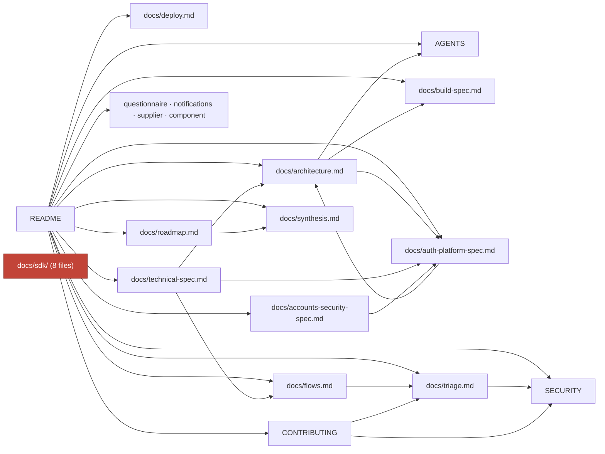
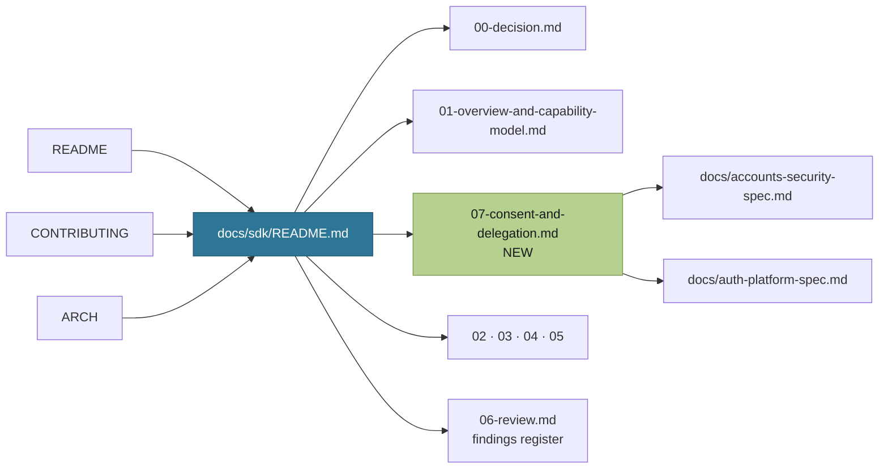
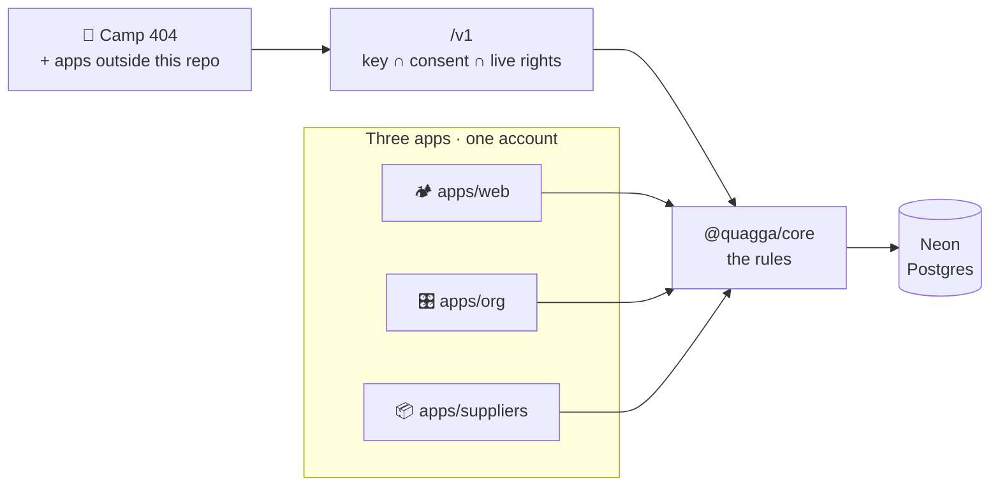
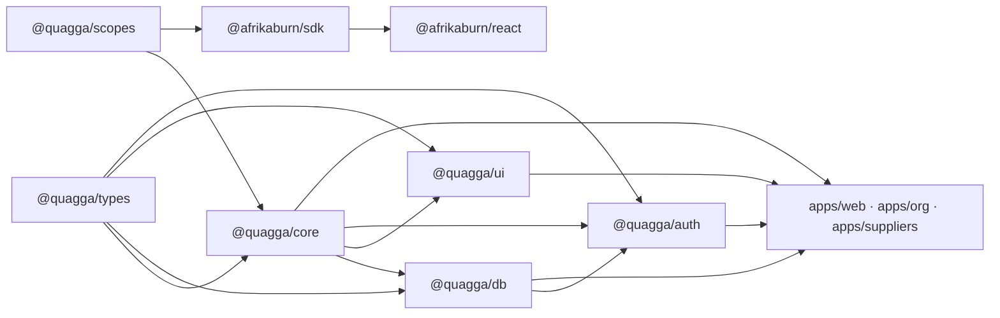
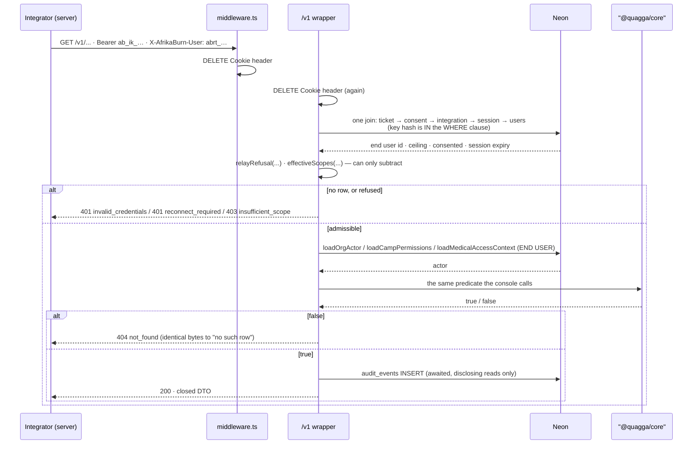

## Shard 05 — Documentation linking and the contribution process

This is the contract for the _documents_, not the code. It carries the literal text that
must land in every file a contributor reads before touching `/v1`, `packages/scopes`,
`packages/sdk*` or migration 0029.

Every edit below is written against the file as it exists today, quoted with line numbers.
Where the current text becomes false the moment the Relay Ticket ships, the replacement is
given verbatim rather than described. Copy it.

**Scope of this shard.** Thirteen files change: `README.md`, `AGENTS.md`, `CONTRIBUTING.md`,
`SECURITY.md`, `docs/architecture.md`, `docs/roadmap.md`, `docs/sdk/README.md`,
`commitlint.config.mjs`, `.github/CODEOWNERS`, `.github/pull_request_template.md`, plus
`.github/ISSUE_TEMPLATE/{bug.yml,config.yml}` and `docs/triage.md`. One file is created:
`docs/sdk/07-consent-and-delegation.md`.

**What this shard inherits and never re-argues.** The build is decided; the consumer is
Camp 404. The mechanism is the Relay Ticket: an integration key `ab_ik_…` that is a ceiling
with no principal, plus a relay ticket `abrt_…` that is a pointer at a live `session` row
(`packages/db/src/schema.ts:376-396`). `org:*` is not delegable. There is no service user
and no `users.kind` column. Nothing is relicensed.

**Two inherited things this shard carries rather than settles, and neither is silent.**
(1) The key prefix. `docs/sdk/06-review.md:390` (A8) settled the family as `ab_sk_`;
`ab_ik_` is proposed in shard 01 §9.1 as a deliberate supersession (a ceiling is a
different animal from a secret key) and is **pending Ryan's ruling**. Every occurrence
below is the string, not the argument — if A8's line holds, `ab_sk_` substitutes
unchanged and nothing else in this shard moves. (2) The vocabulary count. The inherited
spec says **49** strings in four namespaces (`00-decision.md:54`, `:62`,
`01-overview-and-capability-model.md:20`, `:228`); shard 01 §1 adds `bio:medical:read` in
a fifth namespace, so this shard writes **50** throughout. The nine remaining "49"
sentences in `docs/sdk/{00,01,02,03,05}` are **not** in this shard's file list and are
stale the moment §8.3 lands — whoever owns those documents moves them in the same commit.

---

## 1. The cross-link graph

### 1.1 Measured, today

`grep -oE '\]\([^)]*\.md[^)]*\)'` across every root and `docs/` markdown file. Two facts
matter more than the rest:

- **There is no `docs/README.md`.** The documentation index _is_ the table at
  `README.md:196-212`. Anything absent from that table is unreachable by navigation.
- **`docs/sdk/` has zero inbound links from anywhere outside itself.** Verified:
  `grep -rn "docs/sdk" --include='*.md' --include='*.yml' --include='*.mjs' .` excluding
  `docs/sdk/` itself returns **nothing**. Eight files (a README plus seven documents) and
  **8,258** lines of accepted spec — `wc -l docs/sdk/*.md` — are reachable only by running
  `ls docs/`.



`AGENTS.md`, `SECURITY.md`, `docs/build-spec.md` and `docs/deploy.md` emit **zero**
markdown links — they name paths in prose. That is a house convention, not a defect, and
this shard does not change it: the additions below name paths in prose in those four files
and use links only in `README.md`, `CONTRIBUTING.md`, `docs/architecture.md` and
`docs/sdk/README.md`, matching what each file already does.

### 1.2 After

Three new edges, one new node, one new document:



Rejected: a `docs/README.md` index. The README table is already the index and a second one
drifts. Rejected: linking `docs/sdk/` from `AGENTS.md`; that file links to nothing and
gaining one link would invite twenty.

---

## 2. `README.md`

### 2.1 Licence badge — replace line 10

```markdown
[](LICENSE)
[](packages/sdk/LICENSE)
```

The repo-wide licence assertion becomes false the day an Apache-2.0 package lands. Two
badges is the honest shape; one badge with a footnote is not.

### 2.2 The live-deployment warning — replace lines 65-68

```markdown
> ⚠️ **The deployment is live**, with real participants' phone numbers,
> emergency contacts and medical notes in it. Run it locally; never test against
> those URLs. That now covers credentials as well as accounts: **a key minted
> against the live deployment reaches real burners**, and there is no sandbox
> tier. [`SECURITY.md`](SECURITY.md) explains why — it is the one rule with no
> exceptions.
```

### 2.3 `### The two gates` → `### The three gates` — replace lines 105-112

````markdown
### The three gates

```bash
pnpm turbo run lint typecheck test build lint:pack   # the fast gate — never runs a browser
pnpm e2e:local                             # the browser gate — 8 personas, from cold
pnpm e2e:local specs/new-burner            # ...or just one
pnpm sdk:local                             # the API gate — mints a LOCAL key, drives a
                                           #   local consent, calls /v1. No browser.
pnpm test:coverage                         # coverage floors — all workspaces
```
````

The fast gate never starts a route handler and never mints a credential, exactly as it
never starts a browser. `pnpm sdk:local` is the third leg; run it for anything under
`apps/web/app/api/v1/`, `packages/scopes` or `packages/sdk*`.

````

Five files state the fast-gate command verbatim — `README.md:108`, `AGENTS.md:49`,
`CONTRIBUTING.md:234`, `docs/build-spec.md:24`, `.github/workflows/ci.yml:102`. **They move
in one commit or they drift.**

### 2.4 `## Stack` table — insert a row after line 123

```markdown
| **Public API** | `/v1` inside `apps/web` · integration keys (`ab_ik_`) + relay tickets (`abrt_`) · 50 closed scope strings |
````

### 2.5 Shared packages block — replace lines 125-133

```markdown
Shared packages under `@quagga/` (private) and `@afrikaburn/` (published):
```

packages/core domain logic + every authz predicate — the security boundary. NEVER published.
packages/db Drizzle schema, migrations, the deploy migrator, and the shared actor loaders
packages/auth Better Auth config, mounted by all three apps
packages/ui shadcn components and the Tailwind token layer
packages/types Zod schemas and shared types — including the /v1 response DTOs
packages/scopes the 50 closed scope strings and their tiers. Apache-2.0 at birth, never published.
packages/sdk @afrikaburn/sdk — PUBLISHED, Apache-2.0. No authorisation logic.
packages/sdk-react @afrikaburn/react — PUBLISHED, Apache-2.0.

```

```

### 2.6 The directional law — replace lines 135-137

```markdown
**`@quagga/core` never imports `@quagga/db`.** The rules stay pure and testable;
apps ask the predicate, never re-implement it. A hidden button and a refused
action cannot disagree.

**And nothing under `packages/sdk*` imports `@quagga/*`.** The published packages
carry no authorisation logic at all — `org-permissions.ts`, `project-permissions.ts`
and `privacy.ts` are never in a tarball. The SDK's local gate is developer
experience; the server's 403 is the boundary.
```

### 2.7 `## Repo at a glance` — replace lines 141-144

The numerals move. `README.md:143` currently reads `**44** tables · **29** migrations`,
which is correct today (`grep -c '^export const .* = pgTable(' packages/db/src/schema.ts`
= 44; `ls packages/db/migrations/*.sql | wc -l` = 29, latest `0028`). After 0029:

```markdown
|                                          |                                   |                                        |                             |
| ---------------------------------------- | --------------------------------- | -------------------------------------- | --------------------------- |
| **107k** lines of TS/TSX · **46k** tests | **47** tables · **30** migrations | **72** routes across 3 apps + `/v1`    | **51** shared UI components |
| **2,733** unit tests                     | **165** e2e tests · 8 personas    | **11** workspaces with coverage floors | **116** design frames       |
```

Three tables land in 0029 (`integrations`, `integration_consents`, `integration_tickets`),
so 44 → 47 and 29 → 30. Three workspaces enrol in the coverage matrix, so 8 → 11. **Recount
before committing; do not copy these numerals on faith.**

### 2.8 `## How it fits together` mermaid — replace lines 151-161

````markdown

````

````

### 2.9 Contributing "I want to…" table — insert a row after line 178

```markdown
| Build against the platform from another app     | [`docs/sdk/README.md`](docs/sdk/README.md) — the public API and `@afrikaburn/sdk` |
````

### 2.10 "Two rules that catch people out" → three — replace lines 182-190

```markdown
Three rules that catch people out:

- **Nothing may claim something that isn't true.** A disabled control says why;
  a "saved" message means something was saved. It is the most common reason a
  change gets sent back.
- **Personal data has classes**, enforced in `@quagga/core` and never in the UI.
  Some fields can never be public; medical notes are visible only to that
  burner's own camp leads and safety staff, and every read is audited. See
  [`AGENTS.md`](AGENTS.md) §Privacy classes.
- **An API key is a ceiling, never a principal.** Every `/v1` request resolves
  `effective = resolve(END USER, live from the DB) ∩ key.ceiling ∩ scopes that
end user consented to this app`. The end user's presence is proven by their own
  live session, never asserted by the caller. See [`AGENTS.md`](AGENTS.md) rule 9.
```

### 2.11 `## Documentation` table — insert a row after line 206

```markdown
| [`docs/sdk/`](docs/sdk/README.md) | The public API and `@afrikaburn/sdk`: capability model, consent and delegation, endpoint surface, publishing |
```

Placed immediately after `docs/auth-platform-spec.md` — its nearest neighbour in subject.
This single row is the largest documentation fix in the round.

### 2.12 `## Licence` — replace lines 218-223

```markdown
## Licence

**[FSL-1.1-ALv2](LICENSE)** — Functional Source License, converting to Apache 2.0
two years after each release. Use it, read it, build on it; don't ship a
competing product from it in the meantime.

**Two published packages are Apache-2.0 from birth**, because a client library
that is only usable by people who accept a source-available licence is not a
client library: `packages/sdk` (`@afrikaburn/sdk`) and `packages/sdk-react`
(`@afrikaburn/react`). `packages/scopes` (`@quagga/scopes`) carries the same
Apache-2.0 licence because it is the vocabulary they are generated from, but it
stays **private and is never published** to npm. Nothing is relicensed — the apps,
the server and every other package stay FSL-1.1-ALv2, and the authorisation
predicates never enter a published tarball.

Contributions come in under the licence of the directory they land in, and there
is no CLA to sign.
```

---

## 3. `AGENTS.md`

`AGENTS.md` emits no markdown links; all additions below name paths in prose, matching.

### 3.1 `## Read this first` — insert item 4 after line 22

```markdown
4. **A credential you mint is a live credential.** There is no sandbox tier and no test
   shard. A key minted against the production database reaches real burners through
   `/v1`, and a relay ticket minted on the live deployment points at a real person's
   session. Mint locally (`pnpm sdk:local`) or not at all. This is the fourth
   item on this list, and it is newer than the other three.
```

### 3.2 `## What this is` — replace lines 34-35

```markdown
Kickoff-driven, spec-first, public repo, **FSL-1.1-ALv2** for the apps, the server and
every private package (Functional Source License, converting to Apache 2.0 two years
after each release — see `LICENSE`). `packages/sdk` and `packages/sdk-react` are
**Apache-2.0 from birth** and are the only things published to npm; `packages/scopes`
is Apache-2.0 too — it is the vocabulary they are generated from — but stays private
and unpublished (`docs/sdk/05-publishing-and-licensing.md:21`, `:653`).
Nothing is relicensed; the authorisation predicates are never published.
```

### 3.3 Layout block — replace lines 37-44

```
apps/web        participant app   :3000  (teal accent) — also hosts /v1
apps/org        organiser console :3001  (apricot — .org-accent)
apps/suppliers  supplier portal   :3002  (sage — .supplier-accent)
packages/       @quagga/{auth,ui,db,core,types,scopes,eslint-config,typescript-config}
                @afrikaburn/{sdk,react}  ← PUBLISHED, Apache-2.0
design/         ab-initial-app.pen (pen.dev canvas) + brand/ + pen-lessons.md
docs/           specs (law) + sdk/ (the public API) + sources/ (mirrored corpora)
```

### 3.4 `## Commands` — replace lines 48-54

```bash
pnpm turbo run lint typecheck test build lint:pack  # THE gate — green before any commit
pnpm e2e:local                             # the OTHER gate — real DB, real browser
pnpm e2e:local specs/new-burner            # ...or one persona
pnpm sdk:local                             # the THIRD gate — real DB, real key, no browser
pnpm --filter @quagga/web dev              # or org / suppliers
pnpm --filter @quagga/db db:generate       # schema.ts → appended migration (offline)
```

### 3.5 After the browser paragraph — insert after line 66

```markdown
**And the unit gate does not mint a key or start a route handler.** `turbo run … test`
typechecks `app/api/v1/**` and never executes it: no request is parsed, no ticket is
resolved, no audit row is written. `pnpm sdk:local` is the API's equivalent of the
persona suite — it brings up the same compose stack, migrates, seeds, mints a **local**
key, drives a **local** consent to produce a relay ticket, and calls `/v1` over HTTP.
The failure shape is identical to the sign-up dead-end above: a whole class of defect
(a cookie reaching a handler, a ticket that outlives its session, an audit row that
never lands) is invisible to static analysis.
```

### 3.6 Hard engineering rule 3 — append to line 128

```markdown
**Rule 3 now has an API-surface clause.** `/v1` authenticates against our own tables,
not against a better-auth plugin — no `@better-auth/api-key`, no
`@better-auth/oauth-provider`, no new plugin in `packages/auth/src/config.ts`. That is
deliberate: it keeps the exact pin outside the external-credential path entirely. It is
also the only honest option here, because `node_modules` is frequently absent in agent
environments and **a claim about a library's behaviour that was read rather than run is
not a verified claim.** If you must assert one, run it and say so.
```

### 3.7 Hard engineering rule 7 — replace lines 135-137

```markdown
7. TypeScript strict, no `any`; Zod validation on every server action/boundary;
   authz predicates live in `@quagga/core` and are enforced server-side (UI hiding is
   never the security boundary). **The same rule one layer out: a capability manifest
   held by a client is never the security boundary either.** The SDK ships scope
   strings, generated stubs, a manifest evaluator and DTOs — no predicates.
   `org-permissions.ts`, `project-permissions.ts` and `privacy.ts` are never published.
```

### 3.8 New hard engineering rule 9 — insert after line 138

```markdown
9. **An API key is a ceiling, never a principal.** Every `/v1` request that can name a
   burner resolves, live, on every request:
```

effective = resolve(END USER, live from the DB)
∩ key.ceiling
∩ scopes that end user consented to THIS integration

```

Two stages, different in kind. The scope intersection is set maths and can only ever
**subtract**; the decision is still taken by the unchanged `@quagga/core` predicates
over an actor loaded live for the end user. Nothing widens.

**Presence is proven, never asserted.** The end user's presence reaches `/v1` as a
relay ticket whose foreign key is their live `session.id` (`packages/db/src/schema.ts:376-396`),
minted only behind `requireCampUser()` on our own origin by a click on a consent
screen we render. **No endpoint accepts a caller-supplied subject identifier, in any
form, at any version** — a CI source scan asserts the identifier `subjectUserId`
appears nowhere under `apps/web/app/api/v1/**`.

`org:*` is **not delegable** — not "not issued by default", not expressible. Org-rank
authority is the console's authority and a burner clicking a consent screen is not the
party whose rights are at stake for an org capability.
```

### 3.9 Privacy classes — insert after line 181, at the end of the safety-visible block

(After the `_(Disclosing a note to an audience…)_` parenthetical at `:179-181`, not
between it and the `canViewMedicalNotes` sentence it annotates.)

```markdown
    **Through the API, the same row, with two differences.** A disclosing read reached
    through `/v1` writes the **same** `bio.medical.view` action string, with the **END
    USER** as `actor_id` — never an integration, never a machine identity; the column is
    `uuid REFERENCES users(id)` (`packages/db/src/schema.ts:1712-1714`), so it structurally
    cannot hold anything else. The integrating app goes in `meta` as ids only
    (`integrationId`, `consentId`, `ticketId`, `scope`, `requestId`), beside the unchanged
    closed `basis` union. The two differences: (1) the audit write **blocks and fails
    closed** — no row, no body, 503 — because the entire basis on which we disclose to a
    party holding no membership is that it is recorded, and an HTTP round trip retryable
    in 40ms is not a medic at a screen; (2) the burner can read the record themselves at
    `/account/medical-access`, which is a **blocking prerequisite** of the scope existing.
    Everything in the paragraph above still holds: no thresholds, no per-actor profiling,
    no alerting, no counts in `meta` — for integrator reads as much as for staff reads.
```

### 3.10 `## Process` — replace lines 263-266

```markdown
- **No skills, and no new tooling layers, without asking.** Ryan's standing
  preference (3 Aug 2026): don't install agent skills or add abstraction on top of
  the workflow that already exists. The commands in this file are the interface.
  Suggest, don't add. _(One exception is on the record: the SDK publishing chain —
  `tsdown`, `publint`, `attw`, `changesets`, the `lint:pack` turbo task and two release
  workflows — was asked for and approved. It is an exception, not a precedent; it is
  enumerated here so nobody has to guess whether it counts.)_
```

### 3.11 `## Process` — replace lines 271-273

```markdown
- **Adversarial verification.** Non-trivial builds end with independent review agents
  hunting authz holes, privacy leaks, and spec violations — findings get fixed with
  regression tests before pushing. This has caught real majors every time it ran.
  **Any change touching `/v1`, a scope string, a key ceiling or a consent record gets
  the pass, and its result is a NAMED INVARIANT TEST, not a paragraph in a PR.** A
  finding that survives as prose survives until the next person disagrees with it.
```

### 3.12 `## Git` — replace lines 351-353

```markdown
- **Some paths need the maintainer's review** (`.github/CODEOWNERS`): migrations,
  `packages/auth`, `packages/core`, `packages/scopes`, `packages/sdk*`,
  `apps/web/app/api/v1/`, `.changeset/`, `.github/`, the licence scripts, `README.md`,
  `commitlint.config.mjs`, the licence. Not a trust statement — a list of places where a
  mistake is expensive or cannot be undone. **Branch protection is a prerequisite of the
  SDK workstream, not a follow-up**: an Apache-2.0 grant on a published version cannot be
  withdrawn, and CODEOWNERS does nothing until protection requires code-owner review.
```

---

## 4. `CONTRIBUTING.md`

This document is written for a front-end/design/wording contributor and says so at
`:8-10`. An API contributor is the first reader for whom that framing is wrong. The
additions below do not soften it; they add a second door.

### 4.1 The opening frame — replace lines 8-10

```markdown
You do not need to be a backend engineer to contribute. Most of the work is
front-end, design and wording, and none of it needs you to understand the
database.

**One exception, and it is the only one in this file.** If you are working on the
public API (`/v1`), the scope vocabulary, or the published SDK, that framing does not
apply to you: those change behaviour in applications that are not in this repository
and that you cannot deploy. Read [`docs/sdk/README.md`](docs/sdk/README.md) first, then
the checklist under §"Adding a `/v1` endpoint" below.
```

### 4.2 `## Where things live` — replace lines 44-58

```markdown

```

apps/web participant app — what burners see, and where /v1 lives
apps/web/app/api/v1/ the PUBLIC API — consumed by apps outside this repo
apps/org organiser console — AfrikaBurn staff
apps/suppliers supplier portal
packages/ui shared components — used by all three
packages/core the domain rules — permissions, privacy, state machines
packages/db schema + migrations + the shared actor loaders
packages/types Zod schemas — including every /v1 response DTO
packages/scopes the 50 closed scope strings and their tiers (Apache-2.0)
packages/sdk @afrikaburn/sdk — PUBLISHED. No authorisation logic, ever.
packages/sdk-react @afrikaburn/react — PUBLISHED.
design/ the Pencil canvas + brand assets
docs/ the specs. Where a spec and the code disagree, say so in your PR.

```

If you are changing how something **looks**, you are almost certainly in
`apps/*/components/` or `packages/ui/`. If you find yourself in `packages/core`
or `packages/db`, pause — those change behaviour in three apps at once, and they
need a review from the maintainer (see [`.github/CODEOWNERS`](.github/CODEOWNERS)).

If you find yourself in `packages/sdk*`, `packages/scopes` or
`apps/web/app/api/v1/`, **pause harder**. Those change behaviour in applications
that are not in this repository, that you cannot deploy, and that you may not be
able to contact. A published scope string is a promise to somebody else's code;
an Apache-2.0 grant on a published version cannot be withdrawn. That is a strictly
worse blast radius than three apps.
```

### 4.3 New section — insert after `## The house rule` (after line 71)

````markdown
## Adding a `/v1` endpoint

Twelve items. Each is checkable in review, and a reviewer will check them in this
order. If an item does not apply, say "n/a" and why — silence reads as "not done".

**1. Write the DTO before the endpoint.**
The response type comes first, in `packages/types/src/responses/`. It is a closed
`z.object()` parsed with `.parse()` — never `.strict()` (which throws), never
`.passthrough()`, never `z.record()`, `z.any()` or `z.unknown()` anywhere in the tree.
One open-ended node disables stripping for its whole subtree. No field named in
`HARD_LOCKED_PRIVATE_FIELDS` (`packages/core/src/privacy.ts:39-47` — `saId`, `passport`,
`phone`, `onsiteContactName`, `onsiteContactPhone`, `offsiteContactName`,
`offsiteContactPhone`) or `REGISTRATION_CONTACT_KEYS` (`apps/org/lib/queries.ts:952-960`
— seven more human contact columns that sit **outside** the hard-locked set) may appear.
`SAFETY_VISIBLE_FIELDS` (`privacy.ts:57` — `medical`) may appear on exactly one endpoint,
which has its own scope, its own tier and its own audit rule; see item 9.

**2. Declare the scopes, from the closed list.**
One exported `scopes:` array per `route.ts`, drawn from `packages/scopes`. There are
**50** strings in five namespaces — `org:<cap>:<domain>`, `camp:<permission>`, `self:*`,
`bio:*`, `public:*`. You do not invent one to make a feature work; you ask. A scope with
no entry in the `GUARDS` map does not compile — the map is
`{ readonly [S in Scope]: Guard }`, exhaustive by type, not by grep.

**3. Never accept a caller-supplied subject.**
No request body, query parameter or header names a user. The subject arrives as a column
on a row the burner themselves wrote — a relay ticket whose foreign key is their live
`session.id`. A CI scan asserts the identifier `subjectUserId` appears nowhere under
`apps/web/app/api/v1/**`; a rule about the _value_ of a field is weaker than the field
not existing.

**4. Read no cookie — and neither may anything you call.**
Not `cookies()`, not `headers().get("cookie")`, not `getSession`, not
`getCurrentCampUser`, not `requireCampUser`, not `redirect()`. **This is transitive**:
the failure is a store function one call deeper. Every store you call takes an explicit
`userId`. The `Cookie` header is deleted twice — once in `apps/web/middleware.ts` and
again in the `/v1` wrapper — and the CI check is an import-graph walk, not a scan of the
route file.

**5. Resolve the three-way intersection, in order, server-side.**

```
STAGE 1 — the scope gate. Set maths. Can ONLY subtract.
  admissible = ticket.scopes ∩ consent.scopes(live) ∩ integration.ceiling(live)
  ⇒ 403 insufficient_scope

STAGE 2 — the rights gate. The decision. Unchanged @quagga/core predicates over an
  actor loaded LIVE from the DB for the END USER.
  canViewMedicalNotes / hasProjectPermission / orgCanInDomain
  ⇒ 404 not_found (existence-opaque)
```

Nothing is a token claim. Nothing is a cached manifest. There is no sweep job, and there
must never be one — a job's schedule would become the security boundary. Your handler's
only powers are 401 and 403; every 200 still requires a `@quagga/core` predicate to
return `true`.

**6. Load the actor through the shared loaders.**
`loadOrgActor`, `loadCampPermissions` and `loadMedicalAccessContext` live in
`packages/db/src/actor.ts` — singular, as `docs/sdk/04-backend-work-required.md:935` and
`:1422` name it — and are the only sanctioned way to turn a `users.id` into an
actor. Do not paste an app's version. `packages/db` already imports `@quagga/core` and
the reverse is forbidden, which is why the loaders live there.

**7. Refuse without leaking.**
Non-existence, no-permission and not-visible-to-you return **identical bytes**. That is
the API face of `apps/web/lib/groups-store.ts:187`, literally
`if (!registered && !viewerRole) continue;`. A refusal never contains a department name
or an `ORG_DOMAIN_LABELS` value — department names are the org chart. On the wire there
are two 401 buckets and nothing finer: `reconnect_required` (ticket expired, session
ended, consent revoked, renewal window closed — all four have the identical correct
integrator response) and `invalid_credentials` (everything else, byte-identical).
Distinguishing _which_ would tell a thief whether the burner personally revoked.

**8. Rate-limit on three keys.**
`ip`, `integration`, and **`integration:subject`**, all through `consumeRateLimit` against
`action_rate_limit`. Never better-auth's `rate_limit` table — `packages/db/src/schema.ts:453-461`
records that Better Auth sweeps it unfiltered and it cost the password-reset budget once.
The third key exists because under delegation the resource is a _person_, not an app.

**9. If it discloses medical, call the existing resolver — do not write a second one.**
`resolveMedicalNotesForViewer` in `apps/web/lib/medical-access.ts` is the same function
`apps/web/app/(app)/burners/[id]/page.tsx` calls. `/v1` passes one extra `via?` parameter
that flips its `after()` fail-open audit into a blocking fail-closed one. **You do not
reimplement decrypt + the three-state result + the audit write in a route handler.** One
implementation cannot drift from itself, which is why there is no anti-drift test for the
sharpest read in the product.

**10. Audit the disclosure to the human, before the response.**
`audit_events` row: `actor_id` = the **end user's** `users.id`; `action` =
`bio.medical.view`, **unchanged** (a variant string drops out of `getMedicalAccessLog`'s
filter and back _into_ `getAuditTrail` for actors without `personal_information` in
`audit`, creating an unfiltered disclosure census for the one rank that must not have
one); `subject` = whose data; `meta` = ids, enums and `requestId` **only**. On the API
path the insert is `await`ed and precedes the response: no row, no body, 503
`audit_unavailable`. Do **not** add a threshold, a profile, a count or an alert —
`AGENTS.md` is explicit that this is a record, not monitoring, and an enumeration
detector was built and deliberately removed.

**11. Write the invariant test, then break it on purpose.**
`AGENTS.md`: _"After writing a regression test, break the thing on purpose and watch it
go red."_ An endpoint either satisfies the existing suite or adds a named test to it. The
suite runs inside `pnpm turbo run … test`, under the single `CI pass` check.

**12. Run `pnpm sdk:local`.**
The unit gate never starts a route handler. If you have not run it, say so in the PR
rather than letting it be discovered.
````

### 4.4 New section — insert immediately after §4.3

```markdown
## The scope vocabulary

- **It is closed: 50 strings, five namespaces.** `org:<cap>:<domain>`,
  `camp:<permission>`, `self:*`, `bio:*`, `public:*`. You do not add one to make a
  feature work. You ask.
- **`bio:` has exactly one member** — `bio:medical:read` — and it is a separate namespace
  on purpose, so "medical is a higher tier" is structurally enforceable rather than a
  convention in a list. It is disclosing-tier: 120-second single-use tickets, never
  renewable, blocking audit.
- **`org:*` is not delegable.** `isDelegableScope` rejects the prefix. This is not a
  default you can flip; it is a precondition. If it ever changes, the resolver must first
  recompute `orgCanInDomain(loadOrgActor(sponsorUserId), …)` **live on every request**, or
  a demoted sponsor leaves a live ceiling that outlives them. The test that enforces this
  carries that sentence as its failure message.
- **A scope is not a permission.** It names what an integration _may ask for_. Whether the
  end user _has_ it is decided by `@quagga/core`, live, per request.
- **The SDK's copy is generated and committed**, and CI diffs the regenerated output. A
  hand-edit to a generated file passes review and fails the build — which is stated here
  so nobody spends an afternoon on it.
- **Adding, renaming or removing a scope on an existing operation is a breaking change**
  for code you cannot deploy, and it is CODEOWNERS-gated.
```

### 4.5 `### Scopes` — replace lines 158-169

```markdown
### Scopes

Three kinds, and the difference matters:

- **workspace names with their npm scope dropped** — `@quagga/*` and `@afrikaburn/*`:

  `web` · `org` · `suppliers` · `core` · `db` · `ui` · `auth` · `types` · `scopes` ·
  `sdk` · `react` · `e2e`

  (`sdk` and `react` are `@afrikaburn/*`. The directory is `packages/sdk-react`; the
  scope is `react`, matching the **package** name, because that is what a reader
  recognises in a changelog.)

- **`api`** — the `/v1` HTTP surface. It lives inside `apps/web` rather than in a
  workspace of its own, and it gets a scope anyway: without one, every server-side commit
  in the workstream is scoped `web` or `core` and the whole thing is invisible in
  `git log --oneline`.

- **`repo`** — root-level changes (turbo config, workspace tooling, this file).

- **Several workspaces**: comma-separate, most-affected first — `fix(web,org): …`. Past
  three, use the one that owns the change or drop the scope.
- **Repo-wide**: omit the scope entirely, or use `repo`.
```

### 4.6 `## Before you push` — replace lines 231-252 (the heading is line 231)

````markdown
## Before you push

```
pnpm -w exec turbo run lint typecheck test build lint:pack
```

and the e2e shard your change touches:

```
E2E_SERVE=build E2E_PROJECTS=desktop-chromium ./scripts/e2e-local.sh specs/<persona>
```

`scripts/e2e-local.sh` frees ports 3000-3002 first and refuses to run if it
cannot — a leftover server from an interrupted run will otherwise be silently
tested instead of your build.

**If you touched `/v1`, `packages/scopes` or `packages/sdk*`**, also:

```
pnpm sdk:local
```

`pnpm e2e:local` boots all three apps and drives real browsers. The API needs one app,
no browser, and a **minted key** — so it gets its own runner, which reuses the same
`docker-compose.local.yml`, the same migrator and the same seed, and diverges only after
that. Two rules about it, both load-bearing:

- **The minting script refuses to run against anything that is not the compose stack.**
  That refusal is the only thing between a convenience and a production key in somebody's
  shell history. Never disable it. Never add a `--force`.
- **A key or ticket printed by `sdk:local` is printed once and never persisted.** Do not
  commit one, do not paste one into an issue, do not put one in a fixture. It is a secret
  even though it is local.

**If you are doing front-end or design work**, the first command is the one that
matters. The e2e suite needs Docker and takes about ten minutes; run it if you
touched sign-in, sessions, permissions, or anything a person's privacy depends
on. Otherwise CI will run it for you on the pull request, on every shard, for
free — and unlike most projects, **it runs on forks too**, because none of it
needs a secret. Keep it that way: anything needing a registry token belongs in the
publish workflow, never in `ci.yml`, whose `permissions: contents: read` is deliberate.
````

### 4.7 New section — insert after §4.6's "Two traps" block (after line 259)

```markdown
## What you may not do

Each of these is the _cheap_ resolution under deadline, which is why it is written down
in advance rather than argued in a review thread.

| Forbidden                                                                                 | Why                                                                                                                                                                                                                                                                                          |
| ----------------------------------------------------------------------------------------- | -------------------------------------------------------------------------------------------------------------------------------------------------------------------------------------------------------------------------------------------------------------------------------------------- |
| Hand-roll an authz check anywhere near `/v1`                                              | `packages/core/src/org-permissions.ts:22-25` already records what a second source of truth for permissions costs. The scope intersection is _narrowing_, never a second policy.                                                                                                              |
| Publish, re-export or copy `org-permissions.ts`, `project-permissions.ts` or `privacy.ts` | Settled. Enforced by a source/manifest check **and** a tarball check — two on purpose, because a bundler can inline through a devDependency the first one permits.                                                                                                                           |
| Add a permission table, a role table, or a second rights vocabulary                       | Org roles v1 (migration 0018) exists precisely to remove the second vocabulary.                                                                                                                                                                                                              |
| Edit, regenerate or "fix" an existing migration                                           | `AGENTS.md` rules 1-2. Latest is 0028; append-only; applied at deploy against production; there is no staging.                                                                                                                                                                               |
| Accept a `subjectUserId` — or any caller-supplied subject — in a request                  | The impersonation primitive this whole design exists to make inexpressible.                                                                                                                                                                                                                  |
| Add `.passthrough()`, `z.record()` or an allowlist entry to a response schema             | The predicted cheap resolution when a field is missing. Add the field to the DTO instead.                                                                                                                                                                                                    |
| Add volume thresholds, per-actor profiling or alerting on medical reads                   | A detector was built and removed on purpose.                                                                                                                                                                                                                                                 |
| Put a name, an email, a count, a rate or a risk score in `audit_events.meta`              | The POPIA scrubber is a literal three-key subtraction — `SET meta = meta - 'email' - 'contactEmail' - 'primaryEmail'` (`apps/web/lib/account-sanitize.ts:351`); anything else you add is permanent and un-scrubbed. Ids resolve to names at read time through tables erasure _does_ control. |
| Make the API's medical audit non-blocking to "match" the first-party path                 | The first-party fail-open is justified by a medic at a screen. It does not transfer to an HTTP round trip retryable in 40ms, and the record is the entire basis on which disclosure to a non-member is permitted.                                                                            |
| Mint an integration or a key from a grantable capability                                  | Rank only (`requireSystemManager`). The right to edit rights must not be grantable.                                                                                                                                                                                                          |
| Weaken a guard to make a test pass, or lower a coverage floor to make a build pass        | Already `SECURITY.md`; restated here because the API's guards are new and therefore look arbitrary.                                                                                                                                                                                          |
```

### 4.8 `## Review` — append after line 272

```markdown
### If your change touches `/v1`, a scope, a ceiling or a consent record

Carry these into the review. A reviewer will ask for each by name:

- **The DTO diff, shown separately from the handler diff.** They are different questions.
- **Which scopes the endpoint declares, and why each is the narrowest that works.**
- **The invariant test, plus evidence it went red** when the guard was removed.
- **`pnpm sdk:local` output**, not just the fast gate.
- **For a scope-vocabulary change**: what breaks for a consumer that has already
  published against it.
- **For anything reaching personal information**: the audit row it writes, quoted, with
  its `actor_id` and its `meta`.

And expect one question in particular, alongside the existing "expect questions about
_why_": **what happens when the end user's rights change after the key was issued?** The
answer is always "the next request resolves live and collapses" — no cache, no sweep job,
no manifest refresh. If your change makes any other answer possible, that is the change
under review.
```

---

## 5. `SECURITY.md`

`SECURITY.md` emits no markdown links; the additions name paths in prose, matching.

### 5.1 Preamble — replace lines 3-6

```markdown
This repository is public. **The application it builds is live**, with real
AfrikaBurn participants, real camps, and real personal information in it —
including phone numbers, emergency contacts, medical notes and identity
documents. It also **issues credentials to third-party applications**, and the
consent records that bind them are live data about real people. Please read this
before you go looking for anything.
```

### 5.2 Reporting — replace lines 19-28

```markdown
Please include, as far as you can:

- what an attacker could do, in one sentence
- the steps to reproduce it
- which surface it affects (participant app / organiser console / supplier portal /
  the public API `/v1` or the published SDK)
- if a credential is involved: **name it, never paste it** — the key id or its
  `ab_ik_` prefix is enough for us to revoke it before this thread goes any further
- whether you believe it has been exploited

**If you are building against `@afrikaburn/sdk` and are not a contributor to this
repository**, GitHub's private vulnerability reporting is still the right channel —
it does not require you to have contributed. If you cannot reach it, contact the
repository owner directly and say only that you have a security issue to report.

**Safe harbour.** Good-faith research that follows this page — reported privately, no
testing against the live deployment, no access beyond the minimum to confirm — will not
be pursued legally, and we will credit you if you want to be credited. There is no
money; this is a volunteer project. Honest targets, which we would rather commit to and
meet than beat: **acknowledge within 5 business days, triage within 10.**
```

**The two numerals need Ryan's sign-off before this lands.** The file says only "days
rather than hours" today (`SECURITY.md:26-28`); 5/10 is this shard's proposal, and it is
a public commitment binding one volunteer. It is here because an external developer
holding a live credential has no other way to know when to escalate — but if the answer
is "no numbers", delete the sentence and keep the rest of the paragraph. Do not soften it
to a number nobody intends to meet.

### 5.3 Do-not-test — replace lines 46-54

```markdown
Find it locally, report it privately, and we will fix it. Never:

- create accounts, camps or registrations on the live deployment to test a theory
- attempt to access another person's data there, even to demonstrate that you can
- run automated scanners, fuzzers or load tests against it
- act on anything you find in production beyond the minimum needed to confirm it
- **use a live integration key to enumerate.** Iterating user ids, usernames or camp
  slugs against `/v1` is not "confirming a finding"; it is the attack.
- **mint or use a relay ticket for a burner who is not you**, even to demonstrate that
  you can. Consent is the control; forging it once is the breach.
- **finish investigating before reporting a leaked key.** Revocation is instant on the
  next request, but a rotation grace window keeps an old key live — the window is the
  whole exposure. Report first, investigate after.

The positive path: `pnpm sdk:local` mints a key against the local compose stack and
drives a local consent to produce a ticket. The minting script refuses to run against
anything that is not that stack, which is what makes "run it locally" a real instruction
for an API researcher rather than a slogan.

If you stumble into someone else's data by accident, stop, do not save it, and
report it. That is not a failure — it is exactly the kind of thing worth knowing.
```

### 5.4 `## What we consider in scope` — replace lines 56-72

```markdown
## What we consider in scope

Anything that lets someone:

- read personal information they should not — particularly the hard-locked
  private fields (medical notes, ID documents, emergency contacts) and the
  officer phone numbers that are only disclosed after consent
- act as another account, or escalate their own permissions
- reach the organiser console or the supplier portal without the right role
- send to an audience they should not (a bulletin resolving to the wrong people
  is a privacy incident here, not a UI bug)
- bypass the account-deletion guards, or the anti-lockout rule that keeps at
  least one System manager on the deployment

And, on the public API specifically:

- **a key that reaches beyond its owner.** The law is that an API key can only have as
  much access as its owner. Anything making the effective rights of a request a
  superset of `resolve(end user, live) ∩ ceiling ∩ consented` is in scope, including a
  stale cache, a claim carried in a token, or a manifest the server trusts back.
- **a rights change that does not collapse the request.** A demoted membership, a
  removed camp role, a revoked consent or a signed-out session that leaves a call still
  succeeding. The design promises live resolution and a revocation that is a foreign key;
  a violation of that promise is the vulnerability.
- **acting for a burner without proven presence** — minting, renewing or using a relay
  ticket for a subject who did not click Approve, or whose session is gone.
- **a consented scope that is not honoured.** The third leg of the intersection is a
  security control, not a preference. If consenting to A grants B, that is in scope.
- **a ticket that crosses apps.** A ticket minted for app A must be structurally
  invisible to app B's key, and indistinguishable from a bogus ticket.
- **a disclosing read that writes no audit row, or writes the wrong actor.** The row is
  a POPIA-facing record; an integration-attributed row where the end user belongs makes
  the compliance record wrong, and that is a finding even though nothing leaked.
- **a refusal that is an oracle** — anything letting a caller tell "no such burner" from
  "a burner you may not see", or "your consent was revoked" from "your ticket expired".
- **cross-tenant bleed in a multi-tenant integrator** — a client cache keyed on the
  credential rather than the subject.
- **anything published that should not be** — an authorisation predicate, a hard-locked
  field name, or FSL-licensed source inside an npm tarball.

Out of scope: missing security headers with no demonstrated impact, rate-limit
tuning opinions (including on `/v1`), findings that require an already-compromised
device, anything only reachable by an organiser who legitimately holds the permission,
anything an integration can do **within** scopes its owner legitimately holds and the
end user legitimately consented to — that is the system working — and findings against
a key you minted yourself locally with rights you gave it.
```

### 5.5 `## For contributors` — insert after line 93

```markdown
- **The secret list is longer than it looks.** Beyond `DATABASE_URL`,
  `BETTER_AUTH_SECRET`, `RESEND_API_KEY` and blob tokens: `PGCRYPTO_KEY`, any
  integration key, and **any key or relay ticket printed by `pnpm sdk:local`** — local
  is not the same as harmless, and a local key in a fixture is a key in the git history.
- **A published package is a distribution channel for a secret.** Never read an env var
  in `packages/sdk*`. A build that inlines one ships it to every consumer, permanently,
  in a version that cannot be unpublished.
- **The manifest is not the boundary; the server's 403 is.** Same shape as the rule
  above it: a capability document held by a client is a hint about what to render, and
  a client that ignores it must still be refused.
- **`/v1` authenticates against our own tables, not against a better-auth plugin.** That
  keeps the exact pin outside the external-credential path by construction. If anybody
  proposes moving it back in, that is a security review, not a refactor.
```

### 5.6 `## Repository settings` — replace lines 97-101 (preamble + the branch-protection bullet; the `CI pass` fence at `:103-105` stays) and append

```markdown
Not code, so not something a pull request can set. For a maintainer, in
_Settings_:

- **Branch protection on `main` — now a prerequisite, not a nicety.** Every path in
  `.github/CODEOWNERS` is inert until protection requires code-owner review, and that
  list now includes the published packages and the public API. Once code merged here
  issues credentials to third parties, "a convention the tooling does not enforce" is
  not a defensible posture. Require a pull request, require review from code owners, and
  require **exactly one status check**:
```

…then, after the Dependabot bullet at line 124, append:

```markdown
- **npm organisation protections** — publish requires 2FA; releases carry provenance;
  `npm audit signatures` runs in the publish workflow. An Apache-2.0 grant on a
  published version cannot be withdrawn, so the account that can publish is the highest-
  value credential the project has.
- **Name the GHSA-watch owner.** `better-auth` is pinned and excluded from auto-merge,
  which means a human has to be watching. Write down who.

## Credentials we issue

There is nowhere else for this, and an external developer holding a key needs it stated
plainly.

- **An integration key (`ab_ik_…`) is a ceiling, never a principal.** On its own it
  reaches `public:*` and nothing else. It cannot name a burner, cannot read a profile,
  and is not an identity.
- **A relay ticket (`abrt_…`) is not a credential in itself.** It is a pointer at a row
  whose foreign key is a burner's live session. It is minted only on our origin, behind
  the burner's own authentication, by a click on a consent screen we render. It is short-
  lived — 900 seconds ordinarily, 120 seconds and single-use for anything disclosing.
- **Revocation is a foreign key, not a job.** Signing out, resetting a password and
  erasing an account all hard-delete `session` rows; `ON DELETE CASCADE` takes the
  tickets with them, in the same statement. There is no propagation window.
- **Five levels of revocation** exist: the burner revokes their consent; AfrikaBurn
  suspends the integration; the key is revoked; the session ends; the ticket expires.
- **What the holder is told at issue time**: the key is shown once and never again; it
  is not a login; it cannot act for anyone who has not consented; and if it leaks, tell
  us before you finish investigating.
- **What happens when the owner's rights change**: the next request resolves live and
  collapses. There is no cache to wait for.
- **What is recorded when they read something**: a disclosing read writes an
  `audit_events` row naming the **end user** as actor, with the app recorded as the
  basis, and the burner can read that record themselves at `/account/medical-access`.

**Sequencing note, not part of the file's text.** `/account/medical-access` does not
exist today — `apps/web/app/(app)/account/` holds only `delete/` and `security/`. It is
a **blocking prerequisite** of `bio:medical:read` (shard 02 §"…is not shippable",
shard 01 stage 4), so this bullet lands with that page and not before. Publishing a
SECURITY.md sentence pointing at a 404 is precisely the house rule
(`CONTRIBUTING.md:62`) it would violate.

## `/.well-known/security.txt`

RFC 9116. `Contact` and `Expires` are required; `Policy` points at this file. A stale
`Expires` makes the file invalid, so its refresh needs a named cadence — fold it into
the monthly digest. This matters more the moment a developer who is not a GitHub
contributor to this repo is holding a live credential.
```

---

## 6. `docs/architecture.md`

### 6.1 `## System` mermaid — the external arrow direction changes

Today every external arrow is **outbound**: Resend, GitHub, Anthropic, Groq, Blob are all
services _we_ call (`:26-42`). An inbound authenticated surface is a different class and
the diagram has no vocabulary for it. Insert into the `flowchart TB` at `:9-49`:

```mermaid
    subgraph consumers["Apps outside this repo"]
        c404["Camp 404<br/>+ others"]
    end
    api["/v1 · inside apps/web<br/>key ∩ consent ∩ live rights"]

    c404 --> api
    api --> core
    api --> neon

    classDef inbound fill:#B6D090,stroke:#7D9953,color:#17191B
    class c404,api inbound
```

### 6.2 The degradation paragraph — append to line 55

```markdown
**The API degrades the same way.** With no `integrations` row and no key issued, `/v1`
answers `401` to everything and the three apps are unaffected. The env-less boot law
applies to it unchanged — there is no environment variable whose absence breaks a page.
```

### 6.3 `## Package dependencies` — replace the mermaid at lines 61-72 and the table at 74-80

````markdown

````

Three rules hold this shape:

| Rule                                                   | Why                                                                                                                                              |
| ------------------------------------------------------ | ------------------------------------------------------------------------------------------------------------------------------------------------ |
| `@quagga/core` never imports `@quagga/db`              | Domain rules stay pure and testable; the 872 core tests need no database.                                                                        |
| `@quagga/core/report-server` is a separate export path | It reads `GITHUB_TOKEN` and pulls the Anthropic SDK. Re-exporting it from the barrel would ship the filing machinery to every browser bundle.    |
| `packages/sdk*` imports nothing from `@quagga/*`       | The licence wall and the "no authorisation logic in the SDK" law are the same wall. Enforced twice: a source/manifest check and a tarball check. |

````

### 6.4 `## A request` — replace lines 83-84, then append a second sequence after line 108

**The sentence has to move first.** `docs/architecture.md:83` reads *"No middleware.
Every app resolves its own session in a server component…"* — the only occurrence of that
claim in the repo (`grep -rn "No middleware" --include=*.md .` → one hit). It becomes
false the moment `apps/web/middleware.ts` lands with the first `Cookie` strip, and the
diagram appended twenty-five lines below it names that file. Replace `:83-84` with:

```markdown
**No middleware on the app paths.** Every app resolves its own session in a server
component and decides what the visitor may see. The single exception is
`apps/web/middleware.ts`, which matches `/v1/*` only and does exactly one thing:
delete the `Cookie` header. It never reads a session and never runs on a page route.
````

Then, after line 108:

````markdown
An API request is a different sequence, and the difference is the point: it never reads a
cookie, and it resolves the end user's rights live rather than trusting anything the
caller sent.


````

### 6.5 The gate table — insert a fourth row after line 116

```markdown
| `/v1` | Is this burner present, did they consent to this app, and do they still hold it? | `401` / `403` / `404`, in two 401 buckets |
```

### 6.6 `## Data` — replace lines 122-124

```markdown
47 tables in one database, owned by `packages/db`. Migrations are append-only
and run on deploy (`db:migrate:deploy && next build`) — **against production,
with no staging step.**
```

**Correction required in the same commit.** `docs/architecture.md:24` and `:122` both say
**45 tables** today. The real count is **44** (`grep -c '^export const .* = pgTable('
packages/db/src/schema.ts`), which is what `README.md:143` says. Architecture is off by
one _before_ this workstream. Fix it to the measured number, then add three: 47.

### 6.7 The erd — insert after line 144

```markdown
    integrations ||--o{ integrationConsents : "granted by burners"
    users ||--o{ integrationConsents : "grants"
    integrationConsents ||--o{ integrationTickets : "mints"
    session ||--o{ integrationTickets : "proves presence for"
```

And replace the cluster sentence at `:147-151`'s tail:

```markdown
`auditEvents` spans all four, and now also records disclosing reads that arrived through
a connected app — with the **end user** as actor and the app recorded in `meta`.
```

### 6.8 `## Constraints worth knowing` — insert a fifth bullet after line 165

```markdown
- **An issued credential cannot be un-issued from history.** Revocation is instant — the
  next request resolves live, and a deleted `session` row takes its tickets with it by
  foreign key. But a key that has already been used has already read, and the
  `audit_events` row is the only record of what. Consequence for reviewers: the question
  to ask about a `/v1` change is never "can this be undone", it is "what does it write
  down while it happens". Fuller treatment in [`docs/sdk/`](sdk/README.md).
```

---

## 7. `docs/roadmap.md`

### 7.1 `### Platform-as-backend` — replace lines 109-116 **and move the section**

It currently sits _after_ the blockers table (`:95-107`), i.e. filed as an afterthought,
and ends "Explicitly parked until after the design pass lands." That sentence is the one
line a future reviewer will cite to re-open a settled question. **Move the section up to
sit between "The container app" (`:49-58`) and "R2" (`:60`), and replace its body:**

```markdown
### Platform-as-backend: the public API _(accepted; consumer named)_

> _Decision, Aug 2026: this is being built. The earlier "explicitly parked until after
> the design pass lands" is superseded — the design pass landed (`docs/sdk/`), and the
> first consumer is named: **Camp 404** (github.com/ryry79261/camp-404). The security
> review that argued against building it (`docs/sdk/06-review.md`) is retained as the
> findings register, not as a verdict._

A formal backend others can build on: `/v1` inside `apps/web`, plus a published
`@afrikaburn/sdk`. Camp-specific apps authenticate against it and reuse the shared spine
— one Burner Bio per human across every camp app, memberships and entitlements queried
rather than duplicated.

The mechanism, in one line: an integration key is a **ceiling with no principal**, and
every request that names a burner also carries a **relay ticket** pointing at that
burner's live session, so effective rights are
`resolve(end user, live) ∩ key.ceiling ∩ consented scopes` and nothing can widen.

Delivery is staged, and stage 0 is four first-party fixes that must land before any of
it: the `apps/web/lib/medical-access.ts` rank coercion fails closed; the actor loaders
are extracted to `packages/db/src/actor.ts`; the unconditional PII stripper is built;
branch protection is enabled. Full sequence in `docs/sdk/`. An MCP server is a **later,
separate** decision and is not in this lane.
```

### 7.2 Blockers table — insert two rows after line 107

```markdown
| npm organisation ownership under an AfrikaBurn-controlled account | Publishing `@afrikaburn/*`; name reservation | AB |
| Consent-screen copy sign-off — what a burner reads when granting an app access to their bio and, separately, to medical information | The `/connect` screen; `bio:medical:read` | AB / Ryan |
```

### 7.3 Design principle 2 — append to line 12

```markdown
_(Interaction worth naming rather than discovering on site: a relay ticket is bounded
by the burner's live session and is 120 seconds for anything disclosing. That is
incompatible with an offline read. Any on-site feature reached through the API needs
its own answer, and "the token is still valid" is not one.)_
```

---

## 8. `docs/sdk/README.md`

This is the file that must change **first**. Its second paragraph currently instructs
every reader to go and read the argument against building it.

### 8.0 The opening sentence — replace lines 3-5

`:3` still opens _"A proposal for `@afrikaburn/sdk`…"_, and `:5` describes the model
finding C1 broke. Fixing `:7-9` while leaving `:3` says "accepted" three lines under
"proposal".

```markdown
The specification for `@afrikaburn/sdk`: a published npm package that lets third-party
projects talk to the Quagga Portal backend, where **the rights of the burner using that
project — resolved live, and only within what the key and their consent allow — decide
which of the SDK's methods work**.
```

### 8.1 Status — replace lines 7-9

```markdown
**Status: accepted, and being built.** The consumer is named — **Camp 404**
(github.com/ryry79261/camp-404) — and the architecture is settled. `06-review.md` is
retained as the **security findings register**: its findings are tracked and resolved
below, and its provenance is load-bearing. It is not a verdict on whether to build this,
and that question is closed.
```

### 8.2 Reading order — replace the table at lines 13-21

```markdown
| Document                                                                     | What it settles                                                                                           |
| ---------------------------------------------------------------------------- | --------------------------------------------------------------------------------------------------------- |
| [`00-decision.md`](00-decision.md)                                           | The architecture, the decisions table, and what each rejected alternative cost                            |
| [`01-overview-and-capability-model.md`](01-overview-and-capability-model.md) | What the SDK is, the naming scheme, and the capability model — **the load-bearing document**              |
| [`07-consent-and-delegation.md`](07-consent-and-delegation.md)               | **The relay ticket**: how presence is proven, the three-way intersection, and the medical path end to end |
| [`02-core-api-reference.md`](02-core-api-reference.md)                       | The core package: client construction, method surface, error taxonomy, transport                          |
| [`03-react-reference.md`](03-react-reference.md)                             | The React package: provider, hooks, permission-gating components, RSC and credential placement            |
| [`04-backend-work-required.md`](04-backend-work-required.md)                 | The HTTP API, the credential system, and the ordered implementation plan                                  |
| [`05-publishing-and-licensing.md`](05-publishing-and-licensing.md)           | Package layout, build, the Apache-2.0 licence boundary and how CI enforces it                             |
| [`06-review.md`](06-review.md)                                               | The three reviews that produced the findings register — a record, kept unedited                           |
```

`07` sits immediately after `01` because the intersection is **part of** the capability
model, not an appendix to it. Rejected: rewriting `06-review.md` to reflect the new
design — it is a record of a review that happened, and editing it destroys the provenance
this page's own honesty note is built on.

### 8.3 The one-paragraph version — replace lines 25-34

```markdown
An API key is a **ceiling, never a principal** — on its own, `ab_ik_…` reaches `public:*`
and nothing else. Every request that can name a burner also carries a **relay ticket**,
`abrt_…`, a pointer at a row whose foreign key is that burner's live `session.id`, minted
only on our own origin behind their own authentication by a click on a consent screen we
render. Effective rights are resolved **live, on every request**, as
`resolve(END USER, from the DB) ∩ key.ceiling ∩ scopes that end user consented to this
app` — two stages, different in kind: the scope intersection is set maths that can only
subtract, and the decision is still taken by the unchanged `@quagga/core` predicates. So
the delegated answer is provably a subset of the first-party answer for the same human.
Revocation is a foreign key, not a job: signing out deletes the session row and
`ON DELETE CASCADE` takes the tickets with it, in the same statement. The published
package therefore contains **no authorisation logic at all**: 50 closed scope strings,
generated method stubs, a manifest evaluator and response DTOs. `org-permissions.ts`,
`project-permissions.ts` and `privacy.ts` stay here, stay FSL-1.1-ALv2, and are never
published — because `org-permissions.ts:22-25` already records what a second source of
truth for permissions costs. The local gate is developer experience; the server's 403 is
the boundary.
```

### 8.4 Provenance section — append after line 60

```markdown
**Second round, Aug 2026.** The delegation design in `04-backend-work-required.md`
§4.3.12 was found critically broken by this spec's own security review (`06-review.md`,
finding C1): `POST /v1/delegations` took a bare `subjectUserId` with nothing proving the
subject was present or consenting. That endpoint **does not exist in any version**, and
CI scans for the absence of the identifier. The replacement is `07-consent-and-delegation.md`.
```

---

## 9. `commitlint.config.mjs`

`SCOPES` today is ten entries (`:16-31`), `scope-enum` is severity **2** (`:36`), and it
is enforced twice: `.husky/commit-msg` locally, and `.github/workflows/ci.yml` over the PR
title **and every commit in the merge-base range**. `--no-verify` skips the hook; nothing
skips CI.

**This is a hard blocker.** The first commit of the workstream — `feat(sdk): …` — fails CI
before a line of it is reviewed.

### 9.1 The doc-comment — replace line 15

The current comment reads _"Workspace names with the `@quagga/` prefix dropped, plus
`repo` for the root."_ Two of the additions violate it. Rewrite it rather than quietly
adding entries under a false description — `:11-13` says keeping `SCOPES` honest is the
point.

```js
/**
 * The scope vocabulary. Three kinds, and the difference matters:
 *   · workspace names with their npm scope dropped — @quagga/* AND @afrikaburn/*
 *   · `api`  — the /v1 HTTP surface, which lives inside apps/web rather than in a
 *              workspace of its own. It gets a scope anyway: without one, every
 *              server-side commit in that workstream is scoped `web` or `core` and
 *              the whole thing is invisible in `git log --oneline`.
 *   · `repo` — root-level turbo/tooling/CI/docs about the repo itself
 */
```

### 9.2 The list — the diff, against the current ten entries

```diff
 const SCOPES = [
   // apps/*
   "web",
   "org",
   "suppliers",
   // packages/*
   "core",
   "db",
   "ui",
   "auth",
   "types",
+  // packages/* — the published pair and its vocabulary source.
+  // NOTE: `sdk` and `react` are @afrikaburn/*, not @quagga/*. The directory is
+  // packages/sdk-react; the scope is `react`, matching the PACKAGE name, because
+  // that is what a reader recognises in a changelog.
+  "scopes",
+  "sdk",
+  "react",
+  // the public HTTP surface — apps/web/app/api/v1/**. Not a workspace.
+  "api",
   // the e2e workspace
   "e2e",
   // root-level: turbo, workspace tooling, CI, docs about the repo itself
   "repo",
 ];
```

Nothing else in the file changes. `header-max-length` 72 (`:40`), the body/footer warnings
(`:44-45`) and the merge/revert ignores (`:49-52`) are all scope-agnostic.

### 9.3 The vocabulary exists in three places, and they move together

| Copy               | Location                                                         |
| ------------------ | ---------------------------------------------------------------- |
| The enum           | `commitlint.config.mjs:16-31`                                    |
| The prose          | `CONTRIBUTING.md:158-169` → replaced by §4.5 above               |
| The PR-author hint | `.github/pull_request_template.md:5-6` → replaced by §11.1 below |

Three copies, one enum. Neither `docs/sdk/05` nor anything else in the repo mentions the
third; it is the one that will be missed.

---

## 10. `.github/CODEOWNERS`

Everything is `@afrikaburn-theme-camp-app/maintainers` — sole maintainer. **Standing caveat, stated in the file itself
(`:8-9`) and confirmed at `AGENTS.md:330-333`: none of this does anything until branch
protection requires code-owner review.** That does not make the additions wrong; it makes
enabling protection a prerequisite of the workstream (§5.6).

### 10.1 New comment block + entries — append to the file

```
# ---------------------------------------------------------------------------
# THE PUBLISHED SDK AND THE EXTERNAL API — irrevocable in a way nothing else is.
#
# An Apache-2.0 grant on a published version cannot be withdrawn; a scope string
# that shipped is a promise to code in repositories we do not control; and a /v1
# handler is the one place data leaves the platform to a party that holds no
# membership. A migration can at least be corrected by another migration.
/packages/scopes/         @afrikaburn-theme-camp-app/maintainers
/packages/sdk/            @afrikaburn-theme-camp-app/maintainers
/packages/sdk-react/      @afrikaburn-theme-camp-app/maintainers
/apps/web/app/api/v1/     @afrikaburn-theme-camp-app/maintainers
/apps/web/middleware.ts   @afrikaburn-theme-camp-app/maintainers
/.changeset/              @afrikaburn-theme-camp-app/maintainers

# THE LICENCE WALL — two scripts that ARE the boundary. Weakening one is
# indistinguishable from weakening /LICENSE, which is already owned.
/scripts/licence-boundary.mjs  @afrikaburn-theme-camp-app/maintainers
/scripts/licence-tarball.mjs   @afrikaburn-theme-camp-app/maintainers

# THE LOCAL KEY MINTER — not a licence control. Its refusal to target anything
# but the compose stack is the only thing between a convenience and a production
# key in somebody's shell history.
/scripts/sdk-local.sh          @afrikaburn-theme-camp-app/maintainers

# Pre-existing gaps, closed in the same pass.
# README.md carries the licence badge and the licence paragraph, and was unowned
# while AGENTS.md, CONTRIBUTING.md and SECURITY.md were owned.
# commitlint.config.mjs holds a vocabulary that is now cross-repo.
# scripts/e2e-local.sh is invoked verbatim by CI and was unowned.
/README.md                @afrikaburn-theme-camp-app/maintainers
/commitlint.config.mjs    @afrikaburn-theme-camp-app/maintainers
/scripts/e2e-local.sh     @afrikaburn-theme-camp-app/maintainers
```

### 10.2 Amend the existing migrations comment — replace lines 13-22

```
# ---------------------------------------------------------------------------
# MIGRATIONS — the sharpest edge in the repo.
#
# This product is DEPLOYED, with real camps and real people in it. Migrations are
# append-only and the deploy applies them automatically. A migration merged here
# runs against production on the next deploy; there is no staging step that would
# catch it first, and an already-applied migration cannot be edited — only
# corrected by another one.
#
# Migration 0029 lands the integration tables. Read every FOREIGN KEY line by
# line before approving: `integration_tickets.session_id` must be
# ON DELETE CASCADE, because that constraint IS the revocation mechanism. With
# SET NULL — which is what a schema generator would plausibly emit — sign-out
# stops revoking, every test that does not specifically delete a session row
# still passes, and the property the whole design rests on is silently gone.
/packages/db/migrations/  @afrikaburn-theme-camp-app/maintainers
/packages/db/src/schema.ts @afrikaburn-theme-camp-app/maintainers
```

### 10.3 Not owned, deliberately

`/docs/sdk/` stays unowned. Gating documentation slows down the thing you most want people
writing, and a wrong sentence in a spec is correctable. Judgement call, recorded so it is
not mistaken for an omission.

**One path is this shard's own coinage.** `scripts/licence-boundary.mjs` and
`scripts/licence-tarball.mjs` are named by `docs/sdk/05-publishing-and-licensing.md:598-599`;
`scripts/sdk-local.sh` is **not named anywhere else in the round** — shard 01 §20 and
shard 04 refer only to the `pnpm sdk:local` task and "the minter". Settle the filename
with whoever writes the runner before this line is copied, or the CODEOWNERS entry owns
a file that never appears.

**One thing to verify before relying on it:** `/apps/web/app/api/v1/` is written as a
literal path rather than `/apps/*/app/api/v1/`. GitHub's CODEOWNERS supports `*` within a
path segment, but `/v1` lives in `apps/web` and only `apps/web`, so the literal path is
both correct and unambiguous. Do not generalise it speculatively.

---

## 11. `.github/pull_request_template.md`

### 11.1 The header comment — replace lines 1-8

```markdown
<!--
TITLE: Conventional Commits with a workspace scope — see CONTRIBUTING.md.
    type(scope): imperative subject, lowercase, no full stop, <=72 chars
    e.g. fix(web): exclude sanitized accounts from the anti-lockout counts
Scopes: web · org · suppliers · core · db · ui · auth · types · scopes · sdk ·
react · e2e · api · repo. (`sdk`/`react` are the published @afrikaburn packages;
`api` is the /v1 HTTP surface, which is not a workspace.)
Several: fix(web,org): … · none: repo.
Add ! before the colon for a breaking change: feat(db)!: …
-->
```

### 11.2 New section — insert between `## Database` (ends line 32) and `## Testing`

```markdown
## Scopes & external surface

<!-- THIS SURFACE IS CONSUMED BY CODE WE DO NOT DEPLOY, IN REPOSITORIES WE MAY NOT
     BE ABLE TO CONTACT. A published version cannot be unpublished.
     - No change to /v1, a scope string, a key ceiling or a consent record → "none".
     - New or changed endpoint → name the scopes it declares and the DTO it returns.
     - Scope added, renamed or removed → say which, and what breaks for a consumer
       that has already published against it.
     - Personal information reachable → name the audit row it writes, its actor_id,
       and its meta keys.
     - Did you run `pnpm sdk:local`? If not, say so here rather than leaving it to
       be discovered. -->

None.
```

Third load-bearing section, on identical reasoning to Database and Risk: the product is
deployed and the consequence is irreversible. `CONTRIBUTING.md:219-226` and `AGENTS.md:348-350`
both name the load-bearing sections; both must gain this one.

### 11.3 The `## Changes` stub — replace lines 17-21

```markdown
<!-- Grouped by workspace. One line each; link file paths where useful. -->

- **web** —
- **org** —
- **core** —
- **api** —
```

### 11.4 The `## Testing` checklist — replace lines 40-41

```markdown
- [ ] `pnpm -w exec turbo run lint typecheck test build lint:pack`
- [ ] Affected e2e shard(s):
- [ ] `pnpm sdk:local` (required if this touches `/v1`, `packages/scopes` or `packages/sdk*`)
```

---

## 12. Issue templates

### 12.1 `.github/ISSUE_TEMPLATE/bug.yml` — replace the `app` dropdown options at lines 20-24

```yaml
options:
  - Participant app (the one burners use)
  - Organiser console (org staff)
  - Supplier portal
  - The public API (/v1) or the @afrikaburn SDK
  - Not sure
```

### 12.2 `.github/ISSUE_TEMPLATE/config.yml` — insert a third contact link after line 10

```yaml
- name: Building against the API or the SDK?
  url: https://github.com/afrikaburn-theme-camp-app/ab-tc-app/discussions
  about: Integration questions, scope requests and "how do I get a key" go here. A security problem in the API goes to the private advisory link above, even if you are not a contributor.
```

---

## 13. `docs/triage.md`

### 13.1 The taxonomy table — two rows change (`:28-29`)

| Namespace | Change                                                                                                                                                                                                                                                                                                                                                                                |
| --------- | ------------------------------------------------------------------------------------------------------------------------------------------------------------------------------------------------------------------------------------------------------------------------------------------------------------------------------------------------------------------------------------- |
| `app:`    | Values are `web`, `org`, `suppliers`, set "by the reporter, from where it was filed". **A `/v1` report has no app.** Decide rather than leaving it ambiguous: the recommendation is to leave `app:` **unset** on API reports and let `area: api` carry it, because the existing three values are set automatically by the in-app reporter and a fourth would be a value nothing sets. |
| `area:`   | Add `api`. Ten values today (`registration`, `camps`, `projects`, `questionnaires`, `notifications`, `suppliers`, `auth`, `privacy`, `data`, `ui`).                                                                                                                                                                                                                                   |

### 13.2 Append to the vocabulary-lives-in-code note (after line 11)

```markdown
**Consequence, worth stating because it costs an afternoon otherwise.** `GITHUB_LABELS`
lives in `packages/core/src/report.ts` (the `area:` entries at `:237-288`), and
`packages/core/` is CODEOWNERS-gated. Adding one label is a maintainer-reviewed change
plus a `pnpm labels:sync` run — not a click in the GitHub UI, which the reporter would
then not know about.
```

### 13.3 `## Investigate first` — insert a step

```markdown
**An API report arrives with no diagnostics block.** The in-app reporter is a _browser_
feature; a `/v1` problem comes in as a plain issue, or privately through SECURITY.md, and
there is no Environment section to read. Do not treat its absence as an incomplete
report. Ask instead for: the endpoint, the scope the integration declared, the HTTP status
and the refusal code, and the `X-Request-Id`. Never ask for the key — ask for its id.
```

---

## 14. Review requirements — what a reviewer must refuse

This is the operative half of the shard. `CONTRIBUTING.md` §4.8 tells an author what to
carry into review; this tells a reviewer what to send back.

### 14.1 Refuse on sight

| The change                                                                                                      | Refuse because                                                                                                                                              |
| --------------------------------------------------------------------------------------------------------------- | ----------------------------------------------------------------------------------------------------------------------------------------------------------- |
| Any request field, parameter or header that names a user                                                        | The impersonation primitive. There is no "just for the admin endpoint".                                                                                     |
| A `/v1` handler that calls a store which reaches `getCurrentCampUser`                                           | Cookie-subject and ticket-subject are usually the same person, so this is invisible in testing and catastrophic in production.                              |
| `.passthrough()`, `.strict()`, `z.record()`, `z.any()` or `z.unknown()` in a response tree                      | One open node disables stripping for its whole subtree. `.strict()` throws rather than strips, turning a privacy control into a 500.                        |
| A new field on a response DTO whose name appears in `HARD_LOCKED_PRIVATE_FIELDS` or `REGISTRATION_CONTACT_KEYS` | Seven and seven. The build should already have failed; if it did not, the walk is broken and that is the finding.                                           |
| A second `bio.medical.view` implementation, or a second action string                                           | One implementation cannot drift from itself. A variant string re-enters `getAuditTrail` for the one rank that must not see a disclosure census.             |
| `after(` anywhere in the API medical path                                                                       | The API audit blocks and fails closed. This will be proposed as "removing an inconsistency" and it removes the basis for the disclosure.                    |
| An audit `meta` containing a name, an email, a count, a rate, a threshold or a risk score                       | The POPIA scrubber is a three-key subtraction. Everything else you add is permanent.                                                                        |
| A `ON DELETE SET NULL` on `integration_tickets.session_id`                                                      | One word. Sign-out stops revoking; every test that does not delete a session row still passes; it lands on an append-only chain applied against production. |
| An edit to an existing migration file                                                                           | `AGENTS.md` rules 1-2.                                                                                                                                      |
| A new scope string, without a tier entry and a `GUARDS` entry                                                   | It should not compile. If it does, the mapped type was loosened, and _that_ is the change under review.                                                     |
| A commit scoped `web` for a change that is entirely under `app/api/v1/`                                         | Use `api`. The scope exists so the workstream is legible in `git log`.                                                                                      |
| A published-package source file importing `@quagga/*`                                                           | The licence wall and the no-authz-in-the-SDK law are the same wall.                                                                                         |
| A change that reads an env var in `packages/sdk*`                                                               | A build inlines it into every consumer's bundle, permanently.                                                                                               |
| A "temporary" `--force` on the local key minter                                                                 | The refusal is the only thing between a convenience and a production key in a shell history.                                                                |

### 14.2 Refuse pending an answer

| Ask                                                                          | The only acceptable answer                                                                                                      |
| ---------------------------------------------------------------------------- | ------------------------------------------------------------------------------------------------------------------------------- |
| "What happens when the end user's rights change after the key was issued?"   | The next request resolves live and collapses. Any answer involving a cache, a sweep, a TTL or a refresh is the defect.          |
| "What does a caller learn from this refusal that they did not already know?" | Nothing. Two 401 buckets, byte-identical within each; 404 identical for non-existence and no-permission.                        |
| "Which of the three intersection terms grants anything here?"                | Only `resolve(END USER, live)`. The other two subtract. If the ticket or the ceiling is granting, the design has been inverted. |
| "Did you extract the actor loader or paste it?"                              | Extracted, from `packages/db/src/actor.ts`. A pasted org branch carrying `?? "org_staff"` widens the only term that grants.     |
| "Show the test going red."                                                   | A diff or a run. "I'm confident it would" is the thing `AGENTS.md:239-241` exists to refuse.                                    |
| "Is this monitoring?"                                                        | No. If the answer needs a paragraph, it is monitoring.                                                                          |

### 14.3 What a reviewer may not do

- **May not approve a `/v1` change on the fast gate alone.** `pnpm sdk:local` output, or a
  written statement that it was not run and why.
- **May not accept a security finding resolved as prose.** `AGENTS.md` §Process now
  requires a named invariant test. A paragraph survives until the next person disagrees
  with it.
- **May not wave through a migration on the grounds that the Drizzle source looks right.**
  0029's delete rules are asserted against `information_schema.referential_constraints`,
  not against the schema file, because the schema file is what would be wrong.
- **May not lower a coverage floor to land a change.** `packages/core/vitest.config.ts`
  carries the ratchet comment; `relayRefusal`, `effectiveScopes` and the scope-tier table
  sit at 100/100/100/100 as tripwires, not measurements. A floor that fails means someone
  smuggled a predicate into data.

---

## 15. Landing order

Documentation is not free-floating; three of these edits are blockers for the commits that
follow them.

| #   | Lands                                                                    | Blocks                                   | Why                                                                                                    |
| --- | ------------------------------------------------------------------------ | ---------------------------------------- | ------------------------------------------------------------------------------------------------------ |
| 1   | `commitlint.config.mjs` + `CONTRIBUTING.md` §4.5 + PR template §11.1     | **Everything.**                          | `scope-enum` is severity 2 and CI lints the PR title. `feat(sdk):` fails before review.                |
| 2   | Branch protection enabled (`SECURITY.md` §5.6)                           | Every CODEOWNERS entry in §10            | The entries are inert until protection requires code-owner review.                                     |
| 3   | `docs/sdk/README.md` §8.1-8.3                                            | Any reader sent to `docs/sdk/`           | The current front page tells them to go read the argument against.                                     |
| 4   | `README.md` §2.11 + `CONTRIBUTING.md` §4.1 + `docs/architecture.md` §6.8 | Nothing, but it is the reachability fix  | Seven documents currently have zero inbound links.                                                     |
| 5   | `AGENTS.md` rule 9 (§3.8)                                                | Stage 1 of the build                     | The law has to exist in a file agents read by default before the code that implements it.              |
| 6   | `CONTRIBUTING.md` §4.3 endpoint checklist + §4.7 forbidden list          | The first endpoint                       | A reviewer needs something to point at.                                                                |
| 7   | `SECURITY.md` §5.2-5.4, `.github/ISSUE_TEMPLATE/*`                       | Issuing a key to anyone outside the repo | An external developer with a live credential and no reporting path is a control we chose not to build. |
| 8   | `README.md` §2.7 numerals, `docs/architecture.md` §6.6                   | Nothing                                  | Land with migration 0029, and **recount** rather than copying.                                         |

Rejected as a landing order: docs last. Every one of items 1, 2 and 3 is a hard blocker
for code, and item 6 is what a reviewer refuses against.

**One ordering constraint the table cannot express.** `pnpm sdk:local` **does not exist
today** — shard 03 measured it: `grep -n sdk:local package.json` → 0 hits, and the root
`package.json` has no such task. Every edit above that prints the command as an
instruction — `README.md` §2.3, `AGENTS.md` §3.4 and §3.5, `CONTRIBUTING.md` §4.6 and
§4.3 item 12, `SECURITY.md` §5.3, the PR template §11.4 — is a document claiming
something that is not true until the runner lands, which is the one thing
`CONTRIBUTING.md:62` says a document in this repo may not do. Either those edits ride in
the same commit as the runner, or the first pass writes the command in the future tense
and a follow-up commit removes the hedge. It is not acceptable to land them ahead of it
and rely on nobody typing it.

---

## 16. Open items this shard does not resolve

Three, all needing a decision rather than more prose.

1. **`app:` on an API-filed issue.** §13.1 recommends leaving it unset. If Ryan wants a
   fourth value, `packages/core/src/report.ts` gains it and `pnpm labels:sync` runs — but
   nothing sets it automatically, which is the argument against.
2. **Whether preview deployments expose `/v1` at all.** `docs/deploy.md` is silent, and a
   per-PR host with a live key surface is a new attack surface. Out of this shard's scope;
   it belongs in the deploy runbook, and somebody has to decide before the first preview
   after stage 1.
3. **Who owns the GHSA watch, by name.** `SECURITY.md` §5.6 asks for it; this shard cannot
   supply it.
