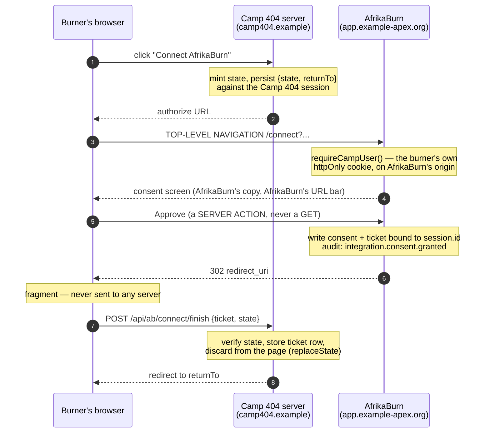

## Reference external-integration guide

> **Renamed 2026-09-11** from "The Camp 404 integration guide" — the content
> was always generic (see the note below, kept from the original: it was
> written without reading any specific camp app's actual code, sourced only
> from this repo's own record of the pattern it was ported from). Framed
> here around a generic reference integrator rather than one named camp.

The document a camp-specific app's developer would follow, start to finish,
to move that app off its own duplicated copy of AfrikaBurn data and onto
`@afrikaburn/sdk`. It is a contract: where it says "must", the platform will
refuse you if you do otherwise, and the refusal is deliberate.

A camp-specific app is named as an illustrative first consumer in
`docs/roadmap.md`'s "Platform-as-backend" section: _"Camp-specific apps
authenticate against it and reuse the shared spine — one Burner Bio per
human across every camp app, memberships/entitlements queried rather than
duplicated."_ The code below assumes a Next App Router app with Drizzle and
Zod-at-boundaries, matching this monorepo's own conventions.

**No specific external camp app's contents were read while writing this.**
Every claim about a "reference camp app's" _current_ shape is sourced from
this repo's own record of the pattern it was originally ported from —
`docs/build-spec.md` (burner-profile field set, questionnaire tables ported
1:1), `docs/synthesis.md:86` (`burner_profiles` pattern), `docs/synthesis.md:96` (one-time
invite links) — and is marked where it is inference. §11 says so again at the point it
matters.

---

### 1. What you are integrating with, in one screen

Three artifacts, and confusing any two of them is the failure mode this whole design
exists to prevent.

| Artifact            | Format                   | Lives                                             | Lifetime                                       | What it is                                                                                                |
| ------------------- | ------------------------ | ------------------------------------------------- | ---------------------------------------------- | --------------------------------------------------------------------------------------------------------- |
| **Integration key** | `ab_ik_…`                | Camp 404's server env only                        | until rotated                                  | A **ceiling**. Names Camp 404. Names no human. On its own it reaches `public:*` and nothing else.         |
| **Relay ticket**    | `abrt_…`                 | Camp 404's database, one row per Camp 404 session | 900s standard · **120s single-use** disclosing | A **pointer at a live AfrikaBurn session row**. Proves a specific burner was present and clicked Approve. |
| **Consent**         | a row in AfrikaBurn's DB | AfrikaBurn                                        | until the burner revokes                       | The scope set _that burner_ granted _Camp 404_. Camp 404 never holds it; it only observes its effects.    |

Every `/v1` request that can name a burner carries the key **and** a ticket. Neither
alone reaches anything.

```
effective = resolve(END USER, live from AfrikaBurn's DB)   ← only this can GRANT
          ∩ key.ceiling                                     ← can only SUBTRACT
          ∩ scopes that burner consented to Camp 404        ← can only SUBTRACT
```

The consequence you should internalise before writing a line: **a delegated answer is
provably a subset of what that same human sees when they log into
`app.example-apex.org` themselves.** If Nomsa cannot see it on AfrikaBurn, Camp 404
cannot see it for her. There is no integration-level override, there is no "trusted
partner" flag, and asking for one is asking for the design to be undone.

#### 1.1 The law, stated so you can check a PR against it

> _"The API key can only have as much access as its owner."_

An integration key is **never a principal**. It cannot act. It has no memberships, no
rank, no camps. There is no service user behind it. `org:*` scopes are not delegable at
all — `isDelegableScope` rejects the prefix, so the SDK will not even let you type one
(§12.4).

#### 1.2 New API names, marked as new

The client surface used throughout this document — `createClient` (synchronous,
public-only), `.as(ticket)`, `ab.connect.url()`, `ab.tickets.remint()`,
`me.rights.manifest()`, `me.tier(scope)`, `AuthenticationError.reason`, and the
`@afrikaburn/sdk/browser` and `@afrikaburn/sdk/testing` subpaths — is **this round's**,
and none of it is in the accepted core reference yet. The accepted document says
otherwise in four places, and all four must move in the same commit as this guide or the
two will teach different clients:

- `docs/sdk/02-core-api-reference.md:266-268` names `createServerClient(...)` and returns
  a **`Promise`** (it fetches the manifest at construction). §4.2 below is synchronous.
- `02:1485-1506` publishes exactly four subpaths — `.`, `./server`, `./manifest`,
  `./errors`. Neither `./browser` nor `./testing` exists.
- `02:422` puts `readonly burners: BurnersNs<S>` on the key-only client. §12.2 below
  deliberately removes it; that removal is the point, but it is a change, not a reading.
- `02:1040` collapses every 401 into one opaque `AuthenticationError` with **no**
  discriminant. §8.2 below reads `e.reason`; that field has to be added.

Everything cited to a repo path is verified. Everything in this list is not yet true.

---

### 2. Prerequisites

Before anyone issues you anything.

| #   | Prerequisite                                                                                                 | Why                                                                                                                                                 | How you satisfy it                                                             |
| --- | ------------------------------------------------------------------------------------------------------------ | --------------------------------------------------------------------------------------------------------------------------------------------------- | ------------------------------------------------------------------------------ |
| 1   | **Camp 404 has a server.** Not "has an API route" — has a place a secret can live that no bundler can reach. | The browser never holds the key and never calls `/v1` (§4.5, §3). If Camp 404 were a pure SPA it could not integrate.                               | It is a Next App Router app. Route handlers and server actions qualify.        |
| 2   | **Camp 404 has its own accounts and its own sessions.**                                                      | The ticket is stored against a Camp 404 session. Without one there is nowhere to put it.                                                            | Already true.                                                                  |
| 3   | **HTTPS on a registered origin.**                                                                            | `redirect_uri` is exact-matched server-side; there is no wildcard, no `startsWith`, no regex.                                                       | Register every origin you will ever redirect to, including previews, up front. |
| 4   | **A named human and a reachable contact email.**                                                             | A POPIA complaint about Camp 404's copy of burner data is addressed through this person. It is stored on the integration row and is not decorative. | Give a real address. An integration whose contact bounces gets suspended.      |
| 5   | **You have read §11 and know what you are deleting.**                                                        | The value of this integration is _removing_ Camp 404's duplicate burner data, not adding a second source of it.                                     | See §11.                                                                       |
| 6   | **Node ≥ 20 with global `fetch`.**                                                                           | `@afrikaburn/sdk` has `"dependencies": {}` — zero runtime dependencies — and uses the platform `fetch`.                                             | Next 16 satisfies this.                                                        |

**Not a prerequisite:** an AfrikaBurn org role, a department, a sponsor's rank, or any
console access for Camp 404's developers. None of those reach anything through the API,
because `org:*` is not delegable.

---

### 3. Key issuance

Issuance is a human act performed by an AfrikaBurn **System manager** in the org console
(`requireSystemManager` — the rank, never a grantable capability). There is no
self-service "create an app" endpoint at any version. You cannot mint your own key, and
neither can an AfrikaBurn staffer who merely holds a permission.

#### 3.1 What you send

```
Integration name        Camp 404
Slug                    camp-404                (appears in the consent screen URL)
Contact                 <a real human, a real address>
Redirect URIs           https://camp404.example/api/ab/connect/callback
                        http://localhost:3404/api/ab/connect/callback     ← dev, see §9
Scopes requested        camp:view_member_details
                        self:profile:read
                        public:camps:read
                        public:editions:read
For each scope          one sentence: what Camp 404 does with it
```

Ask for the narrowest set that works. The ceiling is reviewed monthly and every change
writes an audit row carrying `{before, after}`; a scope you asked for and never used is
a question you will be asked.

#### 3.2 What comes back

- The plaintext key, **once**. Only its sha256 hex is stored — the same `hashToken`
  primitive the account tokens already use (`apps/web/lib/account-tokens.ts:25`). Nobody
  at AfrikaBurn can read it back to you. Lose it and you rotate.
- The registered redirect URIs, echoed, so you can check them.
- The ceiling, echoed.

#### 3.3 Where the key goes

```bash
# Camp 404 .env — server-only. NOT NEXT_PUBLIC_ANYTHING.
AFRIKABURN_API_KEY=ab_ik_...
AFRIKABURN_BASE_URL=https://app.example-apex.org
```

`NEXT_PUBLIC_` is a bundler instruction, not a naming convention. A key behind that
prefix is a literal inlined into every JavaScript file Camp 404 serves. The SDK makes
this loud (§12.1) but the prefix rule is yours to keep.

#### 3.4 Rotation and revocation

| Event                            | Mechanism                                                           | What happens to live tickets                                                |
| -------------------------------- | ------------------------------------------------------------------- | --------------------------------------------------------------------------- |
| You rotate                       | New key issued; old key stays valid until `previous_key_expires_at` | unaffected — tickets are bound to consents, not to key generations          |
| You say "revoke now"             | both key hashes nulled + `status = 'suspended'`, one statement      | **every ticket dies on the next request**, 401 — no key can be presented    |
| AfrikaBurn suspends Camp 404     | `integrations.status = 'suspended'`                                 | **every ticket dies on the next request**, 401                              |
| A burner disconnects Camp 404    | their consent row is revoked                                        | **their** tickets die on the next request, 401                              |
| A burner signs out of AfrikaBurn | their `session` row is deleted                                      | **their** tickets are deleted by `ON DELETE CASCADE`, in the same statement |

Note the last row. Revocation is a foreign key, not a job. There is no propagation
window and no sweep to wait for.

**If a key leaks: report it before you finish investigating.** Do not test the blast
radius first. `SECURITY.md` is the channel.

---

### 4. The consent flow, end to end

#### 4.1 The shape



Five properties of that diagram are load-bearing:

1. **Top-level navigation, never an iframe.** AfrikaBurn sends
   `Content-Security-Policy: frame-ancestors 'none'` and `X-Frame-Options: DENY` on every
   route of every app (`config/security-headers.mjs:18-19`). Those headers exist because
   the org console was framable and a clickjacked click could reach a destructive server
   action (`config/security-headers.mjs:3-5`). They will not be relaxed for you. Do not
   build a modal, a popup-with-postMessage bridge, or a silent-refresh frame.
2. **The burner authenticates on AfrikaBurn's origin, against AfrikaBurn's cookie.** Camp
   404 can neither mint nor read that cookie — no cookie spans two registrable domains.
   That is why presence is _proven_ rather than asserted.
3. **Approve is a server action.** A credential mint is not reachable by navigation, so
   there is no "just link them straight to the approve URL" shortcut and there never will
   be.
4. **The ticket arrives in the URL fragment.** Fragments are never sent to a server, so
   the ticket never lands in a CDN log, a proxy log, an access log, or a `Referer`.
   AfrikaBurn additionally sets `Referrer-Policy: strict-origin-when-cross-origin`
   (`config/security-headers.mjs:24`), but the fragment makes that belt-and-braces.
5. **The ticket goes to Camp 404's server and is erased from the page.** It is not
   `localStorage`. It is not a client-readable cookie. See §4.5.

#### 4.2 Server half — starting the connect

```ts
// camp-404/lib/afrikaburn.ts
// SERVER ONLY. This module must never be imported from a "use client" file.
import "server-only";
import { createClient } from "@afrikaburn/sdk/server";

export const ab = createClient({
  key: process.env.AFRIKABURN_API_KEY!,
  baseUrl: process.env.AFRIKABURN_BASE_URL!,
  // The slug from §3.1. `/connect` is addressed by SLUG, not by key — the authorize
  // URL carries `?integration=camp-404` and the browser must be able to see it, so it
  // cannot be derived from a secret the browser never holds. A synchronous
  // `createClient` makes no request, so it cannot look the slug up either: you pass it.
  integrationSlug: "camp-404",
  appName: "camp-404/2.1.0",
});
```

`createClient` here is **synchronous** and returns a **public-only** client. `ab.camps`,
`ab.editions`, `ab.rights`, `ab.connect` (§4.2) and `ab.tickets` (§8.3) exist.
`ab.burners`, `ab.bio` and `ab.registrations` do not exist on its type — the only route
to anything that names a burner is `.as(ticket)` (§5). This is the ceiling expressed as a
type: you cannot write the impersonation call.

```ts
// camp-404/app/api/ab/connect/start/route.ts
import { randomBytes } from "node:crypto";
import { NextResponse } from "next/server";
import { ab } from "@/lib/afrikaburn";
import { requireCamp404Session } from "@/lib/session";
import { db } from "@/lib/db";
import { abConnectAttempts } from "@/lib/schema";

const REDIRECT_URI = `${process.env.CAMP404_ORIGIN}/api/ab/connect/callback`;

export async function POST(req: Request) {
  const session = await requireCamp404Session();
  const { scopes, returnTo } = (await req.json()) as {
    scopes: string[];
    returnTo: string;
  };

  // STATE IS MINTED SERVER-SIDE AND STORED AGAINST *OUR* SESSION.
  // A state the browser chose proves nothing. This row is the CSRF control and
  // it is also where returnTo lives — an open-redirect is exactly what you get
  // if you round-trip returnTo through the URL instead.
  const state = randomBytes(32).toString("base64url");
  await db.insert(abConnectAttempts).values({
    state,
    sessionId: session.id,
    returnTo: safeInternalPath(returnTo), // reject anything not starting "/"
    expiresAt: new Date(Date.now() + 10 * 60_000),
  });

  return NextResponse.json({
    url: ab.connect.url({
      scopes,
      redirectUri: REDIRECT_URI,
      state,
    }),
  });
}

function safeInternalPath(p: string): string {
  return p.startsWith("/") && !p.startsWith("//") ? p : "/";
}
```

`ab.connect.url()` is a pure string builder. It makes no request, so it cannot leak the
key, and it validates every scope against `isDelegableScope` before returning — an
`org:*` string throws at that call site rather than producing a URL AfrikaBurn will
reject two hops later.

#### 4.3 Client half — the button

```tsx
// camp-404/components/connect-afrikaburn.tsx
"use client";
import { startConnect } from "@afrikaburn/sdk/browser";

export function ConnectAfrikaBurn() {
  return (
    <button
      onClick={() =>
        startConnect({
          scopes: ["camp:view_member_details", "self:profile:read"],
          returnTo: window.location.pathname,
        })
      }
    >
      Connect AfrikaBurn
    </button>
  );
}
```

`@afrikaburn/sdk/browser` is a deliberately tiny entry point. It does exactly two
things and neither of them is an HTTP call to AfrikaBurn:

```ts
// what startConnect actually does
export async function startConnect(opts: {
  scopes: readonly Scope[];
  returnTo?: string;
  /** Path on YOUR origin that mints the authorize URL. Default below. */
  startPath?: string;
}): Promise<never> {
  const res = await fetch(opts.startPath ?? "/api/ab/connect/start", {
    method: "POST",
    headers: { "content-type": "application/json" },
    body: JSON.stringify({ scopes: opts.scopes, returnTo: opts.returnTo }),
  });
  const { url } = await res.json();
  window.location.href = url; // TOP-LEVEL. Not window.open. Not an iframe.
  return new Promise<never>(() => {}); // never resolves; the page is leaving
}
```

_(Spec author's call: the decision names `startConnect({ scopes, returnTo })` as the
browser API. Composing the URL entirely in the browser would put `state` generation in
the browser, where it proves nothing. Routing through a same-origin `startPath` keeps the
signature the decision names and keeps `state` and `redirect_uri` server-controlled. The
default path is a convention; override it if Camp 404 mounts elsewhere._

_Note the open conflict: the delegation document's §6.1 has `startConnect()` persist the
caller's blob in the browser's own `sessionStorage`, keyed by `state`, and leaves who
mints `state` unstated. Both cannot ship — if `state` is browser-minted it is not a CSRF
control and must be documented as decorative. This document assumes server-minted.)_

#### 4.4 The callback — where the ticket becomes a row

The fragment does not reach the server, so the callback route serves an HTML page whose
only job is to read `location.hash`, POST it back to the same origin, and erase it.

```tsx
// camp-404/app/api/ab/connect/callback/route.ts
// Serves the tiny relay page. GET, because it is the target of a 302.
export function GET() {
  return new Response(RELAY_HTML, {
    headers: {
      "content-type": "text/html; charset=utf-8",
      "cache-control": "no-store",
      // This page handles a credential. Nothing may frame it.
      "content-security-policy": "frame-ancestors 'none'",
      "referrer-policy": "no-referrer",
    },
  });
}

const RELAY_HTML = `<!doctype html><meta charset="utf-8"><title>Connecting…</title>
<script>
(async () => {
  const p = new URLSearchParams(location.hash.slice(1));
  // ERASE FIRST. If the POST throws, the ticket must already be off the URL,
  // out of the back/forward cache entry, and out of anything that reads
  // document.location later.
  history.replaceState(null, "", location.pathname);
  const ticket = p.get("ticket"), state = p.get("state"), err = p.get("error");
  const r = await fetch("/api/ab/connect/finish", {
    method: "POST",
    headers: { "content-type": "application/json" },
    body: JSON.stringify({ ticket, state, error: err }),
  });
  const { next } = await r.json();
  location.replace(next || "/");
})();
</script>`;
```

```ts
// camp-404/app/api/ab/connect/finish/route.ts
import { NextResponse } from "next/server";
import { and, eq, gt, isNull } from "drizzle-orm";
import { requireCamp404Session } from "@/lib/session";
import { db } from "@/lib/db";
import { abConnectAttempts, abTickets } from "@/lib/schema";

export async function POST(req: Request) {
  const session = await requireCamp404Session();
  const { ticket, state, error } = await req.json();

  if (error || !ticket || !state)
    return NextResponse.json({ next: "/connect/failed" });

  // The state row must exist, be unconsumed, unexpired, AND belong to THIS
  // session. The session predicate is the CSRF control — without it an attacker
  // who obtains a state value can bind their own AfrikaBurn account to someone
  // else's Camp 404 account.
  const [attempt] = await db
    .update(abConnectAttempts)
    .set({ consumedAt: new Date() })
    .where(
      and(
        eq(abConnectAttempts.state, state),
        eq(abConnectAttempts.sessionId, session.id),
        isNull(abConnectAttempts.consumedAt),
        gt(abConnectAttempts.expiresAt, new Date()),
      ),
    )
    .returning();

  if (!attempt) return NextResponse.json({ next: "/connect/failed" });

  await db
    .insert(abTickets)
    .values({ sessionId: session.id, ticket, updatedAt: new Date() })
    .onConflictDoUpdate({
      target: abTickets.sessionId,
      set: { ticket, updatedAt: new Date() },
    });

  return NextResponse.json({ next: attempt.returnTo });
}
```

#### 4.5 Where each credential lives — the table to check a PR against

|                              | Camp 404 server   | Camp 404 DB                     | Camp 404 browser                     | Camp 404 logs |
| ---------------------------- | ----------------- | ------------------------------- | ------------------------------------ | ------------- |
| `ab_ik_…` key                | **yes**, from env | never                           | **never**                            | never         |
| `abrt_…` ticket              | yes, in-request   | **yes**, one row per session    | in the fragment for <1s, then erased | **never**     |
| AfrikaBurn session cookie    | never             | never                           | never (different registrable domain) | never         |
| Burner PII fetched via `/v1` | in-request        | only what §11 says you may keep | rendered only                        | never         |

**The browser never calls `/v1`.** AfrikaBurn serves **no CORS headers** on `/v1` — no
`Access-Control-Allow-Origin`, no preflight handler. A `fetch("https://app.quagga…/v1/…")`
from Camp 404's browser fails at the preflight, by design, at every scope. There is no
public-client tier. If you find yourself wanting one, you are about to put a credential
in a browser; the answer is a route handler on your own origin.

---

### 5. Reading own-camp data

`.as(ticket)` is the whole delegated surface.

```ts
// camp-404/lib/afrikaburn-session.ts
import "server-only";
import { cache } from "react";
import { eq } from "drizzle-orm";
import { ab } from "./afrikaburn";
import { db } from "./db";
import { abTickets } from "./schema";
import { requireCamp404Session } from "./session";

/**
 * The delegated client for the CURRENT Camp 404 user, or null if they have not
 * connected AfrikaBurn. `cache()` dedupes it across one RSC render tree — the
 * same idiom apps/web/lib/auth.ts:50-60 uses for getAuthenticatedUser().
 */
export const abFor = cache(async () => {
  const session = await requireCamp404Session();
  const [row] = await db
    .select()
    .from(abTickets)
    .where(eq(abTickets.sessionId, session.id))
    .limit(1);
  return row ? ab.as(row.ticket) : null;
});
```

Then, in a server component:

```tsx
// camp-404/app/(app)/afrikaburn/page.tsx
import { abFor } from "@/lib/afrikaburn-session";
import { ConnectAfrikaBurn } from "@/components/connect-afrikaburn";

export default async function Page() {
  const me = await abFor();
  if (!me) return <ConnectAfrikaBurn />;

  const [profile, rights] = await Promise.all([
    me.self.profile(), // scope: self:profile:read
    me.rights.manifest(), // no scope of its own — resolved per ticket
  ]);

  return (
    <>
      <h1>{profile.username ?? "Unnamed burner"}</h1>
      <ul>
        {rights.granted.camps.map((c) => (
          <li key={c.groupId}>
            {c.slug} — {c.backstop ? "lead" : "member"}
          </li>
        ))}
      </ul>
    </>
  );
}
```

**There is no `self:camps:read` scope, and inventing one is the mistake to avoid here.**
The `self:` namespace is six closed strings — `profile`, `notifications` and
`registrations`, each `:read` and `:write` (`docs/sdk/00-decision.md:69-75`). "Which camps
am I in, and what may I do there?" is answered by the manifest, whose `granted.camps` is a
`CampGrant[]` — `{groupId, slug, kind, backstop, permissions, questionnaires}`
(`docs/sdk/00-decision.md:128-135`) — resolved live for the ticket's subject. The
vocabulary is closed; a string that is not in it is not a scope you have not been granted,
it is a string the server does not parse.

Two things this page does not do, and both are structural rather than stylistic:

- **It does not pass a user id anywhere.** There is no `subjectUserId` parameter on any
  method, in any namespace, at any version. The subject is a column on a row the burner
  wrote by clicking Approve. AfrikaBurn's CI scans for the _absence_ of that identifier
  in request-parsing position anywhere under its `/v1` tree.
- **It does not cache the result across users.** See §12.5 — the multi-tenant cache key
  is the single most likely way an integrator leaks one burner's data to another.

#### 5.1 What `public:*` gets you without a ticket

The bare `ab` client — key only, no ticket — reaches the public tranche. Use it for the
things that are genuinely public, and note the shape of the boundary:

```ts
const edition = await ab.editions.active();
const camps = await ab.camps.list({ editionId: edition.id, limit: 50 });
```

`camps.list` returns **registered** camps only. A free camp — one with no registration —
is undiscoverable to anyone who is not a member, and that is a privacy law in this
codebase, not a filter: `apps/web/lib/groups-store.ts:187` is literally
`if (!registered && !viewerRole) continue;`. The API face of that line is that "no such
camp", "a free camp you cannot see" and "a camp that exists but you hold nothing on"
return **identical bytes**. Do not build a UI that distinguishes them; you cannot, and
trying produces an existence oracle.

There is also **no `GET /v1/burners` list at any scope**. Bulk enumeration over Burn
identities is not a DX convenience, and its absence is deliberate.

---

### 6. A permission-aware roster page

The realistic Camp 404 screen: a camp lead looking at their roster, where some rows carry
detail and some do not, and the difference must be decided by AfrikaBurn rather than by
Camp 404.

#### 6.1 Ask the manifest, render, then let the server decide anyway

```tsx
// camp-404/app/(app)/camps/[campId]/roster/page.tsx
import { notFound } from "next/navigation";
import { abFor } from "@/lib/afrikaburn-session";
import { InsufficientScopeError, NotFoundError } from "@afrikaburn/sdk/errors";
import { ReconnectPrompt, NotAuthorised } from "@/components/reconnect";
import { isReconnectRequired } from "@/lib/ab-errors";

export default async function Roster({
  params,
}: {
  params: Promise<{ campId: string }>;
}) {
  const { campId } = await params;
  const me = await abFor();
  if (!me) return <ReconnectPrompt reason="not_connected" />;

  try {
    // The manifest is a DX affordance: it tells you what to RENDER.
    // It is not the boundary. Every call below is re-decided server-side.
    const rights = await me.rights.manifest();
    const maySeeDetail = rights.can("camp:view_member_details", { campId });

    const roster = await me.camps.members.list({ campId, limit: 100 });

    return (
      <table>
        <tbody>
          {roster.items.map((m) => (
            <tr key={m.userId}>
              <td>{m.username ?? "Unnamed burner"}</td>
              <td>{m.role}</td>
              {maySeeDetail && <td>{m.arrivalDate ?? "—"}</td>}
            </tr>
          ))}
        </tbody>
      </table>
    );
  } catch (e) {
    if (isReconnectRequired(e)) return <ReconnectPrompt reason="expired" />;
    if (e instanceof InsufficientScopeError)
      return <NotAuthorised scope={e.requiredScopes} />;
    if (e instanceof NotFoundError) notFound();
    throw e;
  }
}
```

#### 6.2 What is actually happening on AfrikaBurn's side

Understanding this stops you writing code that fights it.

| Stage          | What runs                                                                                                                                                           | Can it grant?                                  |
| -------------- | ------------------------------------------------------------------------------------------------------------------------------------------------------------------- | ---------------------------------------------- |
| Ticket resolve | one SQL join: ticket → consent → integration → **`session`** → users, with the key hash **inside the `WHERE`**                                                      | no                                             |
| Scope gate     | `ticket.scopes ∩ consent.scopes ∩ key.ceiling`                                                                                                                      | **no — set intersection only subtracts**       |
| Rights gate    | `hasProjectPermission(membership, "view_member_details")` from `packages/core/src/project-permissions.ts:43-57`, over a membership loaded live for **the end user** | **yes — this is the only thing that says yes** |

The five camp scopes map 1:1 onto `ProjectPermissionKey`
(`packages/types/src/roles.ts:262-268`): `view_member_details`,
`manage_questionnaires`, `assign_roles`, `manage_roles`, `manage_members`. Two
behaviours fall out of `hasProjectPermission` that will surprise you if you do not know
them:

- **`lead` and `admin` always pass**, whatever their roles say —
  `isPermissionBackstop(m.structuralRole)` short-circuits at
  `project-permissions.ts:47`. A camp lead cannot be denied a camp permission.
- **`manage_roles` implies `assign_roles`** (`project-permissions.ts:53`). Do not model
  these as independent checkboxes in Camp 404's own UI; you will disagree with the
  platform.

#### 6.3 Do not mirror the permission model

Camp 404 must not keep its own copy of "who is a lead of which camp". The manifest is
_assembly_, not a second policy, and a second policy is the failure mode this monorepo
already paid for once — `packages/core/src/org-permissions.ts` exists specifically so
that permissions have one source of truth across three apps. Ask per render; the answer
is cheap and it is correct at the instant you asked.

Concretely: if an AfrikaBurn operator demotes Nomsa at 14:00, her next Camp 404 request
after 14:00 gets the demoted answer. There is no cache to invalidate and no webhook to
wait for, because there is no cache and there are no webhooks.

---

### 7. The medical read

`bio:medical:read` is not a fiftieth scope in the same list. It is its own namespace with
one member, its own tier, its own ticket rules, and its own refusal semantics. Treat it
as a separate integration that happens to share a key.

#### 7.1 What is different

|                  | Standard scope                                         | `bio:medical:read`                                |
| ---------------- | ------------------------------------------------------ | ------------------------------------------------- |
| Ticket TTL       | 900s                                                   | **120s**                                          |
| Single use       | no                                                     | **yes**                                           |
| Server re-mint   | yes, up to `min(session.expires_at, granted_at + 24h)` | **never** — not in `RENEWABLE_SCOPES`             |
| Consent shortcut | none exists, but the screen is short                   | full screen, every time, no shortcut of any kind  |
| Audit            | —                                                      | **blocking, fail-closed.** No audit row, no body. |

Every medical read costs a fresh, deliberate click by the burner who is allowed to look.
That is the point, not friction to be engineered away.

#### 7.2 The flow, honestly

```tsx
// camp-404/app/(app)/camps/[campId]/members/[userId]/medical/page.tsx
import { abFor } from "@/lib/afrikaburn-session";
import { RequestMedicalAccess } from "@/components/request-medical-access";
import { MedicalPanel } from "@/components/medical-panel";

export default async function Medical({
  params,
}: {
  params: Promise<{ campId: string; userId: string }>;
}) {
  const { campId, userId } = await params;
  const me = await abFor();

  // A medical ticket cannot be renewed and cannot be reused. In practice the
  // ticket in the session row is almost never a medical one, so the normal path
  // is: send them to consent, come back, read once.
  if (!me?.tier("bio:medical:read")) {
    return <RequestMedicalAccess campId={campId} userId={userId} />;
  }

  const notes = await me.bio.medical({ userId });
  // notes.state is "notes" | "empty" | "unreadable" — three states, never two.
  return <MedicalPanel {...notes} />;
}
```

`state: "unreadable"` is not an error and must not be rendered as "no medical notes". It
means the field exists and could not be decrypted. Rendering it as an all-clear is the
exact incident the three-state shape exists to prevent; it survives into this API for the
same reason.

#### 7.3 What the burner is told, and what you must not contradict

The consent screen renders AfrikaBurn's own copy — including `MEDICAL_AUDIENCE_NOTE`
(`packages/core/src/bio.ts:156`), the same sentence shown on the bio form when the burner
typed the notes in. It tells them, in substance:

> Every time Camp 404 reads it, we record it against **your** name — not Camp 404's —
> because you are the one who is allowed to look, and the person can see that record.
> Access lasts two minutes and cannot run in the background.
> Camp 404 keeps its own copy of anything you share. Disconnecting stops new access; it
> cannot delete what they already have.

**That last sentence is a promise Camp 404 must keep true.** If Camp 404 caches a medical
note, the copy is Camp 404's responsibility under POPIA in its own right. §11.4 says what
to do. Do not write UI copy claiming AfrikaBurn's revoke button deletes anything on your
side; it does not, and saying so is worse than saying nothing.

#### 7.4 The audit row names a human, not Camp 404

Every disclosing read writes an `audit_events` row with:

- `actor_id` = **the end user's `users.id`** — the human who was allowed to look. The
  column is `uuid REFERENCES users(id)`, so it structurally cannot hold an integration
  id.
- `action` = `bio.medical.view` — unchanged, the same string
  `MEDICAL_VIEW_AUDIT_ACTION` at `packages/core/src/medical-access.ts:142`.
- `subject` = the burner whose notes were read.
- `meta.basis` = `"camp_lead"` (or `"org_staff"`, or `"self"`), the unchanged closed
  union from `packages/core/src/medical-access.ts:126`. Camp 404 is **not** a basis; the
  basis is the human relationship that justified the read.
- `meta.via` = `"integration"`, plus ids for the integration, consent, ticket and request.

The burner sees it on their own page as: _"Nomsa Dlamini · camp lead · 4 Aug, 19:42 ·
**through Camp 404**"_. Both facts. A person read them, through an app.

The write is `await`ed and precedes the response. If the insert fails you get **503
`audit_unavailable` and no body** — this is a deliberate divergence from AfrikaBurn's
first-party path, which writes the row in Next's `after()` and fails open because a medic
at a screen should not wait on a log row. That justification does not transfer to an
HTTP round trip you can retry in 40ms, and the whole basis on which a party with no
membership is permitted to see this is that it is recorded. **Retry a 503; do not treat
it as "no notes".**

---

### 8. Expiry, withdrawal, refusal

#### 8.1 The wire is deliberately vague, and here is why

Six responses. Fourteen distinct internal causes collapse into three of them on purpose —
four into `reconnect_required`, seven into `invalid_credentials`, three into `not_found`.

| HTTP | `code`                | What it means                                                                                                                                      | What Camp 404 does                                                                                                                    |
| ---- | --------------------- | -------------------------------------------------------------------------------------------------------------------------------------------------- | ------------------------------------------------------------------------------------------------------------------------------------- |
| 401  | `reconnect_required`  | ticket expired · session ended · consent revoked · renewal window closed                                                                           | **`startConnect()`.** All four have the same correct response.                                                                        |
| 401  | `invalid_credentials` | no ticket · unknown ticket · ticket minted for a different app · key revoked · integration suspended · account sanitized · ticket already consumed | Delete the stored ticket. Then `startConnect()` — if it fails again the integration is suspended and a human must talk to AfrikaBurn. |
| 403  | `insufficient_scope`  | the scope is not in `ticket ∩ consent ∩ ceiling`                                                                                                   | Re-consent with the scope, or stop asking. Names the scope string and nothing else.                                                   |
| 404  | `not_found`           | does not exist · exists but you may not know that · the predicate refused                                                                          | **Identical bytes for all three.** Render "not found". Do not infer.                                                                  |
| 429  | `rate_limited`        | ip, integration, or **integration:subject** budget                                                                                                 | Back off. The third key exists because under delegation the resource is a _person_.                                                   |
| 503  | `audit_unavailable`   | the disclosure could not be recorded                                                                                                               | Retry. Never render as "no data".                                                                                                     |

You will want to know _which_ of the four `reconnect_required` causes fired. You cannot,
and the SDK will not tell you, because distinguishing them tells whoever holds a stolen
ticket whether the burner personally revoked. The four have the identical correct
response, so naming the bucket leaks nothing actionable.

#### 8.2 A refusal helper worth writing once

```ts
// camp-404/lib/ab-errors.ts
import { AuthenticationError } from "@afrikaburn/sdk/errors";

export function isReconnectRequired(e: unknown): boolean {
  return e instanceof AuthenticationError && e.reason === "reconnect_required";
}

export function isCredentialDead(e: unknown): boolean {
  return e instanceof AuthenticationError && e.reason === "invalid_credentials";
}
```

```ts
// camp-404/lib/afrikaburn-session.ts, continued
export async function withAb<T>(
  fn: (me: DelegatedClient) => Promise<T>,
): Promise<{ ok: true; value: T } | { ok: false; reason: "connect" }> {
  const me = await abFor();
  if (!me) return { ok: false, reason: "connect" };
  try {
    return { ok: true, value: await fn(me) };
  } catch (e) {
    if (isCredentialDead(e)) {
      await dropStoredTicket(); // it will never work again; stop presenting it
      return { ok: false, reason: "connect" };
    }
    if (isReconnectRequired(e)) return { ok: false, reason: "connect" };
    throw e; // 403/404/429/503 are the caller's business, not a session problem
  }
}
```

#### 8.3 Renewal — server to server, no navigation

A standard ticket can be re-minted without sending the burner anywhere, using the key and
the expiring ticket:

```ts
const fresh = await ab.tickets.remint(current); // throws on a bio:* ticket
```

Bounded by `min(session.expires_at, granted_at + 24h)`. Practically: **one navigation per
burner per day, maximum**, and none at all within a working session. A full-page
navigation every fifteen minutes would silently destroy Camp 404's client state, and the
`session` row is the authority either way, so the navigation bought friction and no
security.

`bio:*` tickets throw. There is no flag, no option and no `force`.

#### 8.4 What withdrawal looks like from Camp 404

The burner disconnects Camp 404 on `app.example-apex.org/account/connected-apps`.
Camp 404 receives **no notification** — there are no webhooks in v0.1, deliberately. The
first thing Camp 404 knows is a 401 `reconnect_required` on the next call. That is the
correct and only signal; build for it.

Do not poll a "is my consent still live" endpoint to find out earlier. Every real call
already answers it, and a poll is a request budget spent to learn nothing you were not
about to be told.

---

### 9. Local development

**Never develop against `app.example-apex.org`.** It is the live deployment with
real burners' phone numbers, emergency contacts, medical notes and identity documents in
it. There is no staging — `SECURITY.md:34-35`: _"Everything you can reach at the deployed
URLs is **production**. There is no staging environment. The accounts are real people, the
camps are real camps."_ That applies to an integrator's first integration test exactly as
it applies to a contributor.

#### 9.1 Bring up a real AfrikaBurn locally

From a checkout of this monorepo:

```bash
pnpm sdk:local
```

This is a sibling of `pnpm e2e:local` (`package.json:15` → `scripts/e2e-local.sh`), and
it reuses the same `docker-compose.local.yml` — Postgres 16 plus _two_ Neon proxies,
because `@neondatabase/serverless` speaks both SQL-over-HTTP and WebSocket and no single
proxy implements both (`docs/build-spec.md:53`, "Local stack"; the two-proxy env is set at
`scripts/e2e-local.sh:20-25`). It brings the stack up cold,
runs the append-only migrations, seeds, boots `apps/web` on `:3000`, then:

1. **Mints a local integration key.** The minting script refuses to run against anything
   that is not the compose stack — not behind a warning, not behind `--force`. It checks
   `NODE_ENV`, `NEON_LOCAL_PROXY=1`, the DB host against a fixed local allowlist, and the
   URL against `neon.tech|vercel|amazonaws`. That refusal is the only thing between a
   convenience and a production key in a shell history. Do not add an override.
2. **Drives a local consent** and prints a ticket, so the integration suite starts from a
   delegated client rather than a public one.

The key and the ticket are printed once and never persisted. Do not commit one, do not
paste one into an issue, do not put one in a fixture.

#### 9.2 Point Camp 404 at it

```bash
# camp-404/.env.local
AFRIKABURN_BASE_URL=http://localhost:3000
AFRIKABURN_API_KEY=<printed by sdk:local>
CAMP404_ORIGIN=http://localhost:3404
```

Register `http://localhost:3404/api/ab/connect/callback` as a redirect URI on the local
integration — the minting script takes it as an argument. Exact match applies locally
too; there is no dev-mode wildcard, on purpose, because a dev-mode wildcard is how a
production wildcard gets committed.

#### 9.3 Local caveats that are not bugs

| Observation                 | Cause                                                                                                                                    |
| --------------------------- | ---------------------------------------------------------------------------------------------------------------------------------------- |
| No email arrives            | no mail provider locally; `scripts/e2e-local.sh:34-35` records that email verification is derived OFF for this reason                    |
| Cookies are not `__Secure-` | the secure prefix keys off the origin scheme, not `NODE_ENV`                                                                             |
| No cross-app SSO            | the cookie `Domain` attribute is only attached under the real apex; it is `undefined` off-apex, which is also why previews cannot do SSO |
| The seeded god account      | `GOD_EMAILS` defaults to `e2e-god@quagga.local` in the local scripts                                                                     |

#### 9.4 What you cannot test locally, and must therefore reason about

- **Real rate limits.** The local stack does not exercise the production budgets.
- **A production ceiling.** Your local key's ceiling is whatever the minting script gave
  it; the real one is whatever a System manager approved. Assume less.
- **Suspension.** Have a code path for 401 `invalid_credentials` that does not assume it
  is transient.

---

### 10. Testing with a mock client

Do not hit a network in Camp 404's unit tests, and do not spin up the compose stack for
them either. The SDK ships a mock whose _type is the real client's type_, so a mock that
returns a field the real DTO does not carry fails `tsc`.

```ts
// camp-404/test/ab.ts
import { createMockClient } from "@afrikaburn/sdk/testing";

export const mockAb = createMockClient({
  // The ceiling. Anything outside it throws InsufficientScopeError, locally,
  // with no request — the same class the real client throws.
  ceiling: [
    "camp:view_member_details",
    "self:profile:read",
    "public:camps:read",
  ],
  tickets: {
    abrt_test_nomsa: {
      subject: "user-nomsa",
      scopes: ["camp:view_member_details"],
      tier: "standard",
      expiresAt: "2026-08-06T12:00:00.000Z",
    },
  },
  data: {
    "camps.members.list": {
      "camp-dusty": {
        items: [
          { userId: "user-thabo", username: "thabo", role: "member" },
          { userId: "user-nomsa", username: "nomsa", role: "lead" },
        ],
        nextCursor: null,
      },
    },
  },
});
```

```ts
// camp-404/test/roster.test.ts
import { expect, it } from "vitest";
import {
  InsufficientScopeError,
  AuthenticationError,
} from "@afrikaburn/sdk/errors";
import { mockAb } from "./ab";

it("renders the roster for a camp lead", async () => {
  const me = mockAb.as("abrt_test_nomsa");
  const roster = await me.camps.members.list({ campId: "camp-dusty" });
  expect(roster.items).toHaveLength(2);
});

it("refuses a scope outside the ceiling, without a request", async () => {
  const me = mockAb.as("abrt_test_nomsa");
  await expect(me.bio.medical({ userId: "user-thabo" })).rejects.toBeInstanceOf(
    InsufficientScopeError,
  );
});

it("surfaces an expired ticket as reconnect_required", async () => {
  mockAb.expire("abrt_test_nomsa");
  const me = mockAb.as("abrt_test_nomsa");
  await expect(me.self.profile()).rejects.toSatisfy(
    (e) =>
      e instanceof AuthenticationError && e.reason === "reconnect_required",
  );
});
```

**Test the four refusals, not just the happy path.** The failure modes that actually
happen in production are: expiry mid-session, the burner disconnecting while a page is
open, a scope you never actually held, and a 404 that means "not yours". A test suite
that only asserts the happy path will pass on the day Camp 404 renders "no medical notes"
for a 503.

#### 10.1 What the mock does not do

It does not evaluate `@quagga/core` predicates. It cannot — those are never published
(`org-permissions.ts`, `project-permissions.ts` and `privacy.ts` do not ship in any
tarball). The mock's `ceiling` and `tickets` are a _scope_ simulation only. The rights
half is only ever exercised against a real stack, which is what `pnpm sdk:local` is for.

Being explicit about this is the point: your unit tests prove Camp 404 handles the
answers correctly, not that the answers are correct. The second thing is AfrikaBurn's job
and is not yours to reimplement.

---

### 11. Migrating existing Camp 404 code

This section is the reason the integration is worth doing. The value is _deletion_.

**Marked as inference.** Camp 404's source was not read while writing this. The
inventory below is derived from this repo's record of what was copied from Camp 404:
`docs/build-spec.md:94` (`burner_bios` mirrors Camp 404's burner profile),
`docs/build-spec.md:105` (questionnaire tables ported 1:1), `docs/synthesis.md:86`
(`burner_profiles`), `docs/synthesis.md:96` (one-time invite links),
`docs/synthesis.md:180` (Camp 404's pgcrypto pattern). Check each row against the actual
schema before acting on it.

#### 11.1 The inventory

| What Camp 404 likely has                                                       | Disposition                                                                        | Why                                                                                                                                                                                                                                                                                      |
| ------------------------------------------------------------------------------ | ---------------------------------------------------------------------------------- | ---------------------------------------------------------------------------------------------------------------------------------------------------------------------------------------------------------------------------------------------------------------------------------------- |
| `burner_profiles` — its own copy of name, contact, emergency contacts, medical | **Delete the sensitive columns. Keep camp-local ones.**                            | This is the duplication `docs/roadmap.md:111-113` names: "one Burner Bio per human across every camp app". Camp 404 holding its own emergency contacts means a burner updating them on AfrikaBurn does not update them for the camp that would actually call them.                       |
| Emergency contact / phone / ID / passport columns                              | **Delete. Do not replace with an API call.**                                       | These are `HARD_LOCKED_PRIVATE_FIELDS` (`packages/core/src/privacy.ts:39-47`) — seven fields with **no access path of any kind**, at any scope, in any version, to any caller, including the burner's own delegated ticket. There is no endpoint to migrate them to.                     |
| Medical notes column                                                           | **Delete the column. Replace with a `bio:medical:read` call at the point of use.** | Camp 404 storing a copy means Camp 404 owns a POPIA special-category dataset with its own breach obligations, its own retention question and its own subject-access duty. Reading it live at the moment a camp lead needs it moves all three back to AfrikaBurn, where the audit row is. |
| Its own membership/role table for AfrikaBurn camps                             | **Delete. Read `camp:*` per render.**                                              | A second permission model drifts. `packages/core/src/org-permissions.ts` exists because two rights vocabularies is the failure being removed, not added to.                                                                                                                              |
| One-time invite links (`docs/synthesis.md:96`)                                 | **Keep if they are for Camp 404's own features.** No API equivalent in v0.1.       | Camp-local features stay camp-local. The integration is not a mandate to move everything.                                                                                                                                                                                                |
| Questionnaire tables ported 1:1 (`docs/build-spec.md:105`)                     | **Keep for now.** No questionnaire endpoints in v0.1.                              | Revisit when they land.                                                                                                                                                                                                                                                                  |
| A direct connection to AfrikaBurn's database                                   | **Delete immediately, before anything else.**                                      | See §11.2.                                                                                                                                                                                                                                                                               |
| A scraper against `app.example-apex.org` HTML                                  | **Delete.**                                                                        | Fragile, unaudited, indistinguishable from an attack in the logs, and it bypasses every control in this document.                                                                                                                                                                        |
| A CSV export a human emails around                                             | **Delete the workflow, not just the code.**                                        | An unaudited copy of burner PII in an inbox is the worst artifact in the inventory and the easiest to forget.                                                                                                                                                                            |

#### 11.2 If Camp 404 has a direct database connection, that is the migration

A direct connection is not a slower version of the API; it is the absence of every
control in this document. It has no ticket, so no burner is proven present. It has no
ceiling. It has no consent. It writes no `bio.medical.view` row, so a burner asking "who
saw my medical information?" gets an answer that is silently incomplete. And it reads
`HARD_LOCKED_PRIVATE_FIELDS` that no API path will ever expose.

Sequence it first, and sequence it as a cut-over rather than a coexistence: two paths
where one is audited and one is not is worse than either alone, because the audit trail
now implies a completeness it does not have.

#### 11.3 A safe cut-over order

1. **Ship the connect flow (§4) with `public:*` and `self:profile:read` only.** Prove the
   round trip, the state binding, the ticket row and the refusal handling on a scope set
   where being wrong is cheap.
2. **Add `camp:view_member_details`.** Render the roster from the API _beside_ the local
   table. Diff them for a week. Where they disagree, AfrikaBurn is right — that is the
   staleness you are removing.
3. **Delete the local roster table.** Not "stop writing to it". Delete it, in a
   migration, so nothing can read it by accident.
4. **Delete the sensitive columns from `burner_profiles`** — hard-locked fields first,
   then medical. These have no replacement; they are deletions, not migrations.
5. **Add `bio:medical:read` last**, once §7 is understood and the two-minute single-use
   ticket has been exercised against a local stack.
6. **Delete the CSV workflow.** Tell whoever ran it where the data lives now.

#### 11.4 What you must tell your users

Camp 404's own privacy copy has to change, because it is now a recipient of AfrikaBurn
data by consent rather than an independent holder of it. Three sentences minimum:

- Which AfrikaBurn scopes Camp 404 asks for, in plain language.
- That disconnecting on AfrikaBurn stops future access and does not delete what Camp 404
  already fetched.
- Whom to contact at Camp 404 to have that copy deleted — a named route, not "email us".

The consent screen already tells them the second one. Contradicting it in your own copy
is the fastest way to lose the integration.

---

### 12. Common mistakes, and how the SDK makes each one loud

Each row is a mistake somebody will make. The right-hand column is what stops it, and
where possible it is a compile error rather than a runtime one, because a compile error
cannot be shipped on a Friday.

#### 12.1 Putting the key in the browser

```ts
"use client";
import { createClient } from "@afrikaburn/sdk/server"; // ✗
```

**How it is loud:** `@afrikaburn/sdk/server` carries `import "server-only"`. Next fails
the build with a module-boundary error naming the file. The split mirrors
`packages/core/src/report-server/index.ts:1-13`, which is two mechanisms — a distinct
`exports` subpath _and_ the discipline that the package root never re-exports it.

**Why the `NEXT_PUBLIC_` variant is worse:** `process.env.GITHUB_TOKEN` becomes
`undefined` in a client bundle, but a key passed as a _prop_ is a literal the bundler
inlines. The type split is what catches the second case; nothing else does.

#### 12.2 Naming a subject

```ts
await ab.burners.get({ subjectUserId: "user-thabo" }); // ✗
```

**How it is loud:** `ab.burners` does not exist on a key-only client's type, and no
method in any namespace accepts a subject id. The parameter is not "validated" — it is
absent from the type, absent from the wire schema, and AfrikaBurn's CI scans for the
absence of the identifier in request-parsing position across its whole `/v1` tree. This
is the impersonation primitive the design exists to make unwritable.

#### 12.3 Calling `/v1` from the browser

```ts
"use client";
await fetch("https://app.example-apex.org/v1/self/profile", {
  headers: { "X-AfrikaBurn-User": ticket }, // ✗
});
```

**How it is loud:** no CORS headers exist on `/v1`. The preflight fails. There is no
per-integration origin allowlist to ask for, because a public-client tier is a separate
and later deliberate decision.

#### 12.4 Asking for an `org:*` scope

```ts
ab.connect.url({ scopes: ["org:read:registrations"], ... }); // ✗
```

**How it is loud:** `Scope` does not include the `org:` prefix in the delegable union, so
it is a type error; and `ab.connect.url()` throws at the call site before producing a
URL. Org-rank authority is the console's authority, and a burner clicking a consent
screen is not the party whose rights are at stake for an org capability.

#### 12.5 One cache for all your users

```ts
const cache = new Map<string, Roster>();
cache.set(campId, roster); // ✗ — campId is not the tenant
```

**How it is loud:** it is not, automatically. This is the one on the list that the SDK
cannot fully catch, and it is the one most likely to actually leak data — a
multi-tenant integrator that keys a cache on the integration or the camp rather than on
the _subject_ cross-serves burners. The SDK's own hooks include the subject in every
cache key and the mock client asserts it. In your code: **key on the ticket's subject, or
do not cache.**

#### 12.6 Caching the manifest, or the rights answer

```ts
const rights = await me.rights.manifest();
await redis.set("rights", JSON.stringify(rights), "EX", 3600); // ✗
```

**How it is loud:** the manifest carries a version header, and the SDK fires
`onManifestStale` when the server's differs. But the deeper answer is that you should not
want to: an hour-old rights answer is an hour of stale privilege, and rights here change
by console action, not by schedule. Ask per render.

#### 12.7 Treating `not_found` as "does not exist"

**How it is loud:** it is not, and it must not be. 404 is deliberately overloaded across
"no such row", "exists but you may not know that", and "the predicate refused" — the API
face of `apps/web/lib/groups-store.ts:187`. If Camp 404 renders "this camp has been
deleted" on a 404, it will tell users something false. Render "not found", and stop.

#### 12.8 Treating 503 `audit_unavailable` as empty

**How it is loud:** the error class is not `NotFoundError` and the response has no body
to mistake for one. But the _rendering_ mistake is yours to avoid: a medical panel that
shows "no notes recorded" on a 503 is a false all-clear about a person's health, which is
precisely the class of incident the three-state medical shape exists to prevent. Retry,
or say "could not be loaded".

#### 12.9 Building a background sync

```ts
cron.schedule("*/5 * * * *", () => syncAllBurners()); // ✗
```

**How it is loud:** there is no credential that can do this. A ticket requires a live
`session` row belonging to a burner who clicked Approve; a key alone reaches `public:*`.
Every burner-shaped read requires a burner with a live session, and the SDK documents
this as a non-promise: **no background access, no offline access**. If Camp 404's design
needs a nightly roster sync, the design needs changing, not the credential.

#### 12.10 Re-minting a medical ticket

```ts
const fresh = await ab.tickets.remint(medicalTicket); // ✗ throws
```

**How it is loud:** `RENEWABLE_SCOPES` is a positive allowlist and `bio:*` is not in it.
The throw is at the call site, with the scope named. There is no override.

#### 12.11 Logging the ticket

```ts
logger.info({ ticket }, "fetched roster"); // ✗
```

**How it is loud:** it is not — this one is discipline, and the SDK's own transport never
logs a credential (`ab_ik_` prefix only, never the secret). Add `ticket` to whatever
redaction list Camp 404's logger already has, the same day you add the ticket column.

---

### 13. The checklist

Before Camp 404 goes live against production:

- [ ] The key is in a server-only env var with no `NEXT_PUBLIC_` prefix, and it is not in git.
- [ ] `grep -r NEXT_PUBLIC.*AFRIKABURN` returns nothing.
- [ ] Every redirect URI, including previews, is registered. No wildcards were requested.
- [ ] `state` is minted server-side and bound to a Camp 404 session; `returnTo` is validated as an internal path.
- [ ] The callback page erases the fragment **before** it POSTs, and sends `frame-ancestors 'none'`.
- [ ] The ticket is a database row, not `localStorage`, not a client-readable cookie.
- [ ] The logger redacts `ab_ik_` and `abrt_`.
- [ ] Every cache key includes the subject.
- [ ] 401 `reconnect_required` → `startConnect()`. 401 `invalid_credentials` → drop the stored ticket, then `startConnect()`.
- [ ] 404 renders "not found" and nothing more specific.
- [ ] 503 `audit_unavailable` retries and never renders as empty.
- [ ] No cron, no queue, no background job holds a ticket.
- [ ] The medical panel distinguishes `notes` / `empty` / `unreadable` in three ways, not two.
- [ ] `burner_profiles`' hard-locked columns are deleted, in a migration, not merely unwritten.
- [ ] Camp 404's privacy copy says AfrikaBurn's revoke does not delete Camp 404's copy, and names who at Camp 404 will.
- [ ] The whole flow was exercised end to end against `pnpm sdk:local`, and nothing was ever pointed at the live deployment.

---

### 14. Rejected alternatives

| Rejected                                                                   | One-line reason                                                                                                                                                            |
| -------------------------------------------------------------------------- | -------------------------------------------------------------------------------------------------------------------------------------------------------------------------- |
| Camp 404 embeds the consent screen in an iframe                            | `frame-ancestors 'none'` + `X-Frame-Options: DENY` on `/:path*` (`config/security-headers.mjs:18-19`), and that header exists because the console was framable.            |
| A publishable browser key pinned to `Origin`                               | `curl -H 'Origin: …'` defeats it in one flag; `Origin` is not an authorisation input anywhere in this system.                                                              |
| A long-lived refresh token held by Camp 404's server                       | It converts a compromised integrator server from "bounded by live consent" to "standing access"; renewal is capped at `min(session.expires_at, granted_at + 24h)` instead. |
| Camp 404 asserts `subjectUserId` and AfrikaBurn checks a delegation record | The field does not exist. This is the design that was found critically broken; there is nothing to constrain because there is nothing to send.                             |
| A webhook when a burner revokes                                            | No webhooks in v0.1. Every real call already answers the question, and a webhook is a second, unreliable authority on a fact the next request settles.                     |
| Camp 404 mirrors camp roles locally and refreshes nightly                  | A nightly refresh means up to 24h of stale privilege on a model where a demotion is supposed to bite on the next request.                                                  |
| Camp 404 caches medical notes                                              | It makes Camp 404 an independent holder of special-category data, with its own breach, retention and subject-access duties, to save one 120-second consent click.          |
| Silent ticket minting on a GET for "safe" scopes                           | A credential mint reachable by navigation, gated by a denylist, is one forgotten entry from being wrong. Server-to-server re-mint removed the need entirely.               |
| Distinct error codes for each of the four reconnect causes                 | It tells whoever holds a stolen ticket whether the burner personally revoked; all four have the same correct response.                                                     |
