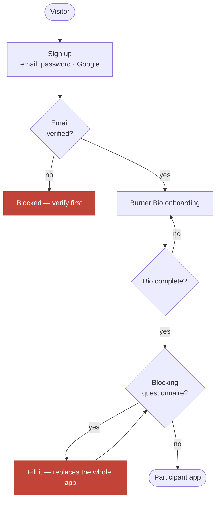

# Burner Bio, onboarding and profiles

| Field                  | Value                                             |
| ---------------------- | ------------------------------------------------- |
| **Category**           | Product                                           |
| **Doc status**         | Active                                            |
| **Normative language** | Descriptive only                                  |
| **Requirement IDs**    | Partial — `ONBOARD-*` (App Spec §3), `CDB-*` (§4) |
| **Owner / Updated**    | Repo maintainers, 2026-09-11                      |

Every burner completes a **Burner Bio** once, per edition, when they join the
platform. It doubles as the platform's onboarding gate and as the burner's
self-owned profile.

## Implements (App Specification)

| App Spec §                       | IDs                                                                                                                        | Status         | Notes                                                                                                                                                                                             |
| -------------------------------- | -------------------------------------------------------------------------------------------------------------------------- | -------------- | ------------------------------------------------------------------------------------------------------------------------------------------------------------------------------------------------- |
| §3 Camper onboarding             | ONBOARD-019, ONBOARD-020                                                                                                   | ✅             | Camp-lead-authored blocking questionnaires and per-respondent completion tracking both work — see [`10-questionnaire-engine.md`](10-questionnaire-engine.md)                                      |
| §3                               | ONBOARD-018                                                                                                                | 🚧             | A camp-authored required question exists; there is no distinct "acknowledgement" artifact separate from a required boolean question                                                               |
| §3                               | ONBOARD-017                                                                                                                | 🚧             | Document upload exists (respondent-side, via the questionnaire engine's file-upload field)                                                                                                        |
| §3                               | ONBOARD-004, ONBOARD-005, ONBOARD-010, ONBOARD-014, ONBOARD-015, ONBOARD-021                                               | 🚧             | The questionnaire engine can carry this content; nothing today is authored as a distinct "principles/behaviour policy" onboarding block                                                           |
| §3                               | ONBOARD-001–003, 006–009, 011–013, 016, 022–028                                                                            | ❌             | Videos, per-year versioning, new-vs-returning differentiated content, and named-role targeting (leads/build/strike/service-provider) are not built                                                |
| §4 Camper database and camp list | CDB-027 (invite to complete own profile)                                                                                   | ✅             | The model's spine                                                                                                                                                                                 |
| §4                               | CDB-037, CDB-038, CDB-040, CDB-041, CDB-043 (encryption, restricted permissions, audit logs, secure access, POPIA consent) | ✅             |                                                                                                                                                                                                   |
| §4                               | CDB-042 (retention)                                                                                                        | 🚧             | See [`02-accounts-and-account-security.md`](02-accounts-and-account-security.md) Drift                                                                                                            |
| §4                               | CDB-001–024 (the record's field list)                                                                                      | ⚠️             | Captured, but via the inverted model below — see Drift                                                                                                                                            |
| §4                               | CDB-039 (masked ID/passport numbers)                                                                                       | ❌ (by design) | Not a partial implementation of masking — masking is deliberately replaced with non-exposure. See Drift                                                                                           |
| §4                               | CDB-035 (carry returning camper details forward)                                                                           | ✅             | Built — see [`07-previous-year-carry-forward.md`](07-previous-year-carry-forward.md)                                                                                                              |
| §4                               | CDB-030 (export camper lists)                                                                                              | ❌             | Correctly not built — the placement export is per-camp, not per-camper, and is tested to never carry a personal field. See [`09-exports-and-scheduled-jobs.md`](09-exports-and-scheduled-jobs.md) |
| §4                               | CDB-031, CDB-032 (filter/search campers)                                                                                   | ❌             | Nothing filters or searches _campers_; what exists filters camps and searches org accounts                                                                                                        |
| §4                               | CDB-026 (admins add campers)                                                                                               | ❌             | Invite-only by design — see Drift                                                                                                                                                                 |

## Drift

> ⚠️ **DRIFT — opposes-with-proposed-decision, App Spec §4 (CDB-001–029 and
> related).** The App Spec describes camp administrators creating and
> editing camper records, including full name, ID/passport number and
> contact details. What is built is the inverse: **each burner owns their
> own profile**; camps invite, people fill in their own details. This is
> enforced in code (`packages/core/src/privacy.ts` hard-locks ID, passport,
> phone and both emergency contacts with no admin-edit path at all), not
> merely a UI choice. The governing App Specification Decision Record —
> **Decision 008, "Canonical camper data model"** — is still `proposed`.
> Until it is accepted, this is this repo's current build stance, not
> settled product law. `docs/roadmap.md` should be read as "not built
> pending Decision 008," not "should never be built."

> ⚠️ **CDB-039 / SEC-017 (masked ID numbers) — not a partial build.** The
> App Spec asks for masked identity numbers. The code deliberately replaces
> masking with **non-exposure**: the field is either fully absent from a
> given viewer's query (`apps/org/components/accounts-table.tsx`) or a
> plain, visible input on the burner's own edit screen
> (`apps/web/components/onboarding/bio-flow.tsx`) — there is no masked
> partial-reveal state anywhere. This is a different design choice, not a
> step toward the spec's model; flag it as such rather than "in progress."

## Onboarding

Built via the general-purpose questionnaire engine (see
[`10-questionnaire-engine.md`](10-questionnaire-engine.md)): the Burner Bio
is the platform's own blocking questionnaire, and the same mechanism lets a
camp lead author a camp-specific blocking questionnaire that gates the app
for that camp's members (`ONBOARD-019`). Per-respondent completion tracking
(`ONBOARD-020`) shows sent/completed/pending, named.

**What has no referent yet**: `ONBOARD-021` ("prevent incomplete campers
being marked fully registered") assumes a per-camper "fully registered"
state distinct from the app-wide onboarding gate; no such state exists to
withhold.

## Burner Bio field set (v3)

Beyond the App Spec's own field list, the build carries several
self-promotional additions, all optional and privacy-flaggable:

- **`about`** — free-text bio ("for the burns"), default public.
- **`camp_history`** — repeatable entries of camps the burner has belonged
  to (linked to a platform group, or free text for unlisted/other-burn
  camps). Default public.
- **`volunteering_interests`** — multi-select from the AfrikaBurn
  portfolio list (ARTeria, Box Office, Chillaz, DMV, Gate, Ice, Greeters,
  Kitchen, Lost & Found, MOOP/LNT, Recycling, Rangers, Sanctuary, Throne
  Crew, Volunteer & Info Booth, + free text). Inquiry only.
- **Ranger section** (all optional, inquiry-framed): completed training,
  curiosity about ranger shifts, Green Dot (emotional-support) training.

None of these are hard-locked — they are self-promotional, not the
privacy-sensitive class described below.

## Privacy classes

Enforced in `@quagga/core` `privacy.ts`, never in the UI; both classes are
excluded from every public projection unconditionally:

- **Hard-locked** (`HARD_LOCKED_PRIVATE_FIELDS`) — phone, both emergency
  contacts, SA ID and passport. Never publicly exposable, with no reveal
  path of any kind. The only path that shares a phone with the org at all is
  an accepted officer registration (explicit consent flow — see
  [`05-camp-roles-and-officers.md`](05-camp-roles-and-officers.md)).
- **Safety-visible** (`SAFETY_VISIBLE_FIELDS`) — medical notes only. Never
  public; visible to the audience the burner disclosed them to (their own
  camp's leads/admins and org staff). Detail: see
  [`14-audit-trail-and-medical-access.md`](14-audit-trail-and-medical-access.md).

The username is a separate, optional public handle (account-level, 3–20
chars, unique on `lower(username)`) — an alias, never a root identity, and
distinct from `display_name`, which is per-edition on the bio itself.
`isBioComplete` keys on `burner_bios.completed_at` (an act, not a filled
field) — no field inside the bio is required by the platform itself; a camp
may add its own required questions via a blocking questionnaire.

## Flow: arriving at a usable account

A blocking questionnaire replaces the app rather than nagging beside it
(`getBlockingActivation`, applied in each app's route-group layout). Account
management stays reachable throughout a gate.

## Invariants and tests

`isBioComplete`, the privacy hard-lock enforcement, and the projection tests
that assert no hard-locked field ever reaches a public view are covered in
`packages/core/src/__tests__/{bio,privacy}.test.ts` and
`e2e/specs/new-burner/privacy-projection.spec.ts`.
