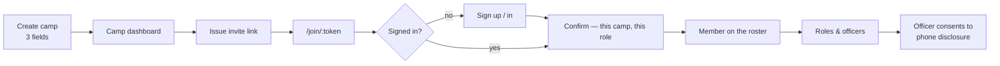

# Camps, directory, invites and roster

| Field                  | Value                                               |
| ---------------------- | --------------------------------------------------- |
| **Category**           | Product                                             |
| **Doc status**         | Active                                              |
| **Normative language** | Descriptive only                                    |
| **Requirement IDs**    | Partial — `CORE-002`, `CDB-025–043`, `COMM-001–003` |
| **Owner / Updated**    | Repo maintainers, 2026-09-11                        |

Any signed-in burner can create a camp instantly; a camp is joinable by
invite link; a directory of registered camps is public.

## Implements (App Specification)

| App Spec §                | IDs                                                                | Status | Notes                                                                                                          |
| ------------------------- | ------------------------------------------------------------------ | ------ | -------------------------------------------------------------------------------------------------------------- |
| §2 Core modules           | CORE-002                                                           | ✅     |                                                                                                                |
| §4a Camper communications | COMM-001, COMM-002 (photo-tile dashboard, name/location/camp tile) | ❌     | No photo column exists on `burner_bios` at all; blocked on that, not on the directory                          |
| §4a                       | COMM-003 (tile opens shared profile)                               | 🚧     | Works from a camp roster row → public profile; entry point is a camp roster, not a cross-camp people directory |

## How it is built

- **`groups`** table: `kind` enum (`org | theme_camp | artwork |
mutant_vehicle`), `name_normalized` (unique per kind, case/space/punct-
  insensitive), 60-word description limit, `joinability` (`open |
invite_only`).
- **Name dedupe** (`packages/core/src/name-dedupe.ts`): reject an
  exact-normalized match on camp creation, warn on trigram similarity ≥ 0.55.
- **`memberships`**: user × group, role enum (`lead | admin | member`, plus
  the org-only ranks — see [`16-org-permissions-and-system-panel.md`](16-org-permissions-and-system-panel.md)).
  Structural roles (`lead`/`admin`) hold every project permission
  irrevocably — the anti-lockout backstop.
- **`invites`**: one-time tokens, 30-day default expiry
  (`packages/core/src/invite.ts`), kind `member` or `lead_transfer`.
- **Routes** (`apps/web`): `/directory` (registered camps only, public,
  joinability badge, category filter chips — see
  [`15-camp-categories.md`](15-camp-categories.md)), `/camps/new` (create),
  `/camps/[slug]` (dashboard: members, invites, registration status tile,
  disabled hint tiles for unbuilt modules), `/join/[token]` (accept an
  invite, sign up first if needed).

## Flow: creation to roster

## Cross-cutting note

Whether a camp roster carries a full camper list (App Spec §4/§14/§16,
REG-003/PNP-001/PNP-040/CDB-030) or only aggregate counts is an open
question tracked against a proposed extension to Decision 008 — see the
drift note in [`03-burner-bio-and-profiles.md`](03-burner-bio-and-profiles.md).
Today the roster shows members; the registration submission and its export
carry population counts, not a per-person list (see
[`06-registration-and-review.md`](06-registration-and-review.md) and
[`09-exports-and-scheduled-jobs.md`](09-exports-and-scheduled-jobs.md)).

## Invariants and tests

Camp creation dedupe, invite expiry, and cross-camp isolation (a lead of
camp A cannot see camp B's roster) are covered in
`apps/web/lib/__tests__/{groups-store,invites-store,name-dedupe}.test.ts`
and `e2e/specs/camp-member/camp-member-cross-camp-isolation.spec.ts`.
