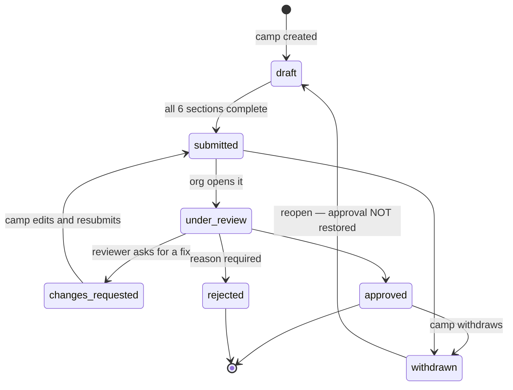
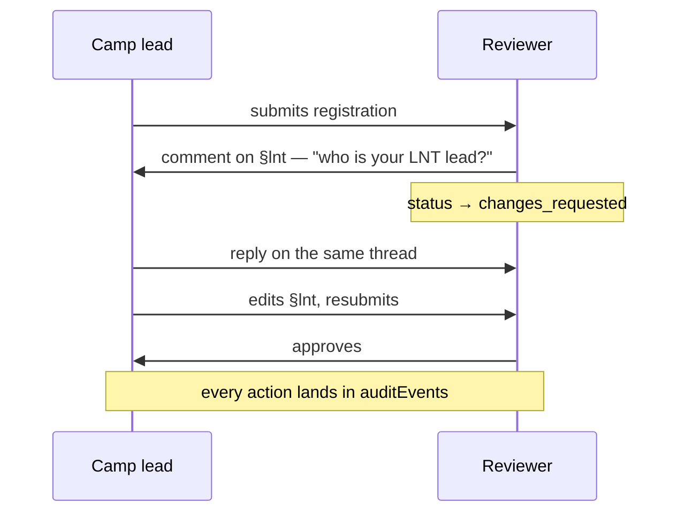

# Registration and review

| Field                  | Value                                                                      |
| ---------------------- | -------------------------------------------------------------------------- |
| **Category**           | Product                                                                    |
| **Doc status**         | Active                                                                     |
| **Normative language** | Descriptive only                                                           |
| **Requirement IDs**    | Partial — `REG-*` (App Spec §14), `PNP-002/003/005/006/007`, `PNP-016–049` |
| **Owner / Updated**    | Repo maintainers, 2026-09-11                                               |

The six-section annual registration wizard and the org review loop — the
most complete part of the platform, and the journey it exists for.

## Implements (App Specification)

| App Spec §                   | IDs                                                                                                                   | Status | Notes                                                                                                                                                                                                            |
| ---------------------------- | --------------------------------------------------------------------------------------------------------------------- | ------ | ---------------------------------------------------------------------------------------------------------------------------------------------------------------------------------------------------------------- |
| §14 Annual registration      | REG-001, REG-002, REG-004, REG-005, REG-007, REG-011, REG-012, REG-014, REG-018, REG-021, REG-022–028                 | ✅     | The state machine (draft → submitted → under_review → changes_requested → resubmitted → approved/declined), plus withdrawal and reopening                                                                        |
| §14                          | REG-006 (interactivity)                                                                                               | 🚧     | Folded into the free-text participation-plan field; no distinct field                                                                                                                                            |
| §14                          | REG-013, REG-015, REG-020 (power, fire, safety documentation)                                                         | ❌     | **Stale if marked otherwise** — no power, fire or safety-document field exists in any registration form; `apps/org/lib/queries.ts` hardcodes these to `false`                                                    |
| §14                          | REG-016, REG-017 (gas, water)                                                                                         | ❌     | Confirmed not built                                                                                                                                                                                              |
| §14                          | REG-003, REG-008–010, REG-019 (camper list, build/strike plans, ticket requirements)                                  | ❌     | Depend on modules not built elsewhere (camper list — see §4 drift; budget — see [`20-payment-reference-tracking.md`](20-payment-reference-tracking.md); tickets — not in scope, Decision 010 proposed)           |
| §14                          | REG-029, REG-030 (placement allocated, layout approved)                                                               | 🚧     | A staff-assigned erf now exists (org-only) — see [`08-placement-codes-and-erf.md`](08-placement-codes-and-erf.md). Not a status field, and the camp cannot see its own erf                                       |
| §16 Plug-and-play prevention | PNP-003, PNP-005, PNP-006, PNP-007                                                                                    | ✅     | Baseline declarations                                                                                                                                                                                            |
| §16                          | PNP-002 (camp budget)                                                                                                 | 🚧     | One optional integer — see [`20-payment-reference-tracking.md`](20-payment-reference-tracking.md)                                                                                                                |
| §16                          | PNP-016–038 (23 named external-service/specialist categories)                                                         | ❌     | The built supplier-declaration vocabulary is 8 delivery categories (Stretch Tents, Transport, Generators, Firewood, Sound & Lighting, Water, Ice, Other); only "Transport" overlaps the spec's 23-item list      |
| §16                          | PNP-039, PNP-049                                                                                                      | 🚧     | Budget review (one number); year-on-year comparison (reviewer-side only, gated on the registration having a carry-forward source — see [`07-previous-year-carry-forward.md`](07-previous-year-carry-forward.md)) |
| §16                          | PNP-040, PNP-041, PNP-042 (review camper numbers, fees, external services)                                            | ✅     | All three appear on the review screen                                                                                                                                                                            |
| §16                          | PNP-047 (request corrective measures)                                                                                 | ✅     | `request_changes` requires a reason, written to the row the camp reads                                                                                                                                           |
| §16                          | PNP-001, PNP-004, PNP-008–015, PNP-044, PNP-045 (camper list, disclosure-threshold triggers, complaint-driven review) | ❌     | Thresholds (>20 participants, >R100k) are computable from data already collected; nothing evaluates them automatically                                                                                           |

## Drift

> ⚠️ **REG-013/015/020 — technical-spec-stale (overstated).** These were
> previously marked 🚧 partial. Verified: `apps/org/lib/queries.ts` hardcodes
> `hasGenerators: false`, `hasOpenFlame: false` and `hasFuelStorage: false`
> for every registration — there is no form field behind any of the three,
> only an always-required Safety Baron officer role standing in for "fire
> exists at every camp eventually." Reclassify as ❌.

## How it is built

- **Two-form model.** AfrikaBurn's real-world process is two forms at
  different times of year: a September application and a January form
  (size, placement, sound, the mandatory layout diagram). The platform
  splits them the same way: `registrations` carries typed columns for the
  September sections, and the January sections ship as an org-authored
  **questionnaire** (see [`10-questionnaire-engine.md`](10-questionnaire-engine.md)) — no
  developer, no deploy, to change what January asks. Only the September
  sections gate submission.
- **Sections**: `identity`, `lnt`, `participation`, `size_logistics`,
  `sound_placement`, `suppliers_commerce` (`SECTION_KEYS`). A section is
  complete when `isSectionComplete` says so, not a manual tick. Word-count
  limits (`packages/core/src/word-count.ts`) apply to free-text fields.
  Layout diagram uploads (up to 4 files) go via Vercel Blob
  (`apps/web/app/api/registration/upload/route.ts`).
- **Supplier declarations** replace free text with a picker from the
  supplier repository (see [`12-suppliers.md`](12-suppliers.md)).
- **State machine** (`packages/core/src/registration-state.ts`): legal
  transitions only, TOCTOU-guarded on write. Reopening a withdrawn
  registration returns a **draft, never the restored approval** — an
  approval handed back without re-review would be a placement nobody
  looked at. Rejection requires a reason, which reaches the camp.
- **Review**: per-section, two-way (`section_reviews` +
  `section_review_replies` — a genuine reply thread, not one-shot
  feedback). Every decision writes an `audit_events` row.
- **Own questionnaire engine, not Google Forms**: this design choice is
  recorded as an engineering decision —
  [`../decisions/decision-014-questionnaire-engine-over-google-forms.md`](../decisions/decision-014-questionnaire-engine-over-google-forms.md).

## Flow: the core loop

## Invariants and tests

`isRegistered` entitlement predicate, the submit-gate (all six sections
complete), and the legal-transitions-only state machine are covered in
`packages/core/src/__tests__/registration-{state,sections}.test.ts` and
`apps/org/lib/__tests__/registration-decision-actions.test.ts`.
