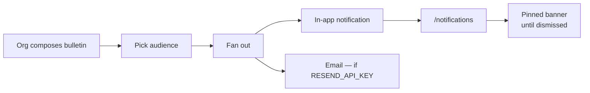

# Bulletins and notifications

| Field                  | Value                                                            |
| ---------------------- | ---------------------------------------------------------------- |
| **Category**           | Product                                                          |
| **Doc status**         | Active                                                           |
| **Normative language** | Descriptive only                                                 |
| **Requirement IDs**    | Partial — `COMM-012` (App Spec §4a); otherwise repo-extends-spec |
| **Owner / Updated**    | Repo maintainers, 2026-09-11                                     |

Every account gets an in-app notification stream; the org gets a bulletin
system to broadcast to an audience — personal events and broadcasts, one
inbox.

## Implements (App Specification)

| App Spec §                | IDs                                               | Status | Notes                                                                                                                            |
| ------------------------- | ------------------------------------------------- | ------ | -------------------------------------------------------------------------------------------------------------------------------- |
| §4a Camper communications | COMM-012 (group communications and announcements) | 🚧     | Org → audience broadcast exists; no camp-level announcement surface — a camp's only broadcast channel is a project questionnaire |

## Model

Two kinds, one inbox:

- **Notification** — personal, event-generated, per-account. Sources:
  registration status changes, wrangler assigned, role/officer assignment
  and acceptance requests, questionnaire released (blocking ones flagged),
  membership events (invite accepted, lead transfer), supplier onboarding
  confirmations, account security events.
- **Bulletin** — org-authored broadcast to an audience, reusing the
  questionnaire audience machinery verbatim. Lands in each recipient's
  inbox as a notification of kind `bulletin` and also exists as a
  standalone, deep-linkable page.

Schema: `bulletins` (edition_id, title, body_md, audience, created_by,
published_at, pinned), `notifications` (recipient, kind, title, body, link,
bulletin_id nullable, created_at, read_at) — append-only, `read_at` set on
open.

## Rules

- **Fewer-forms**: notifications are generated only by events that already
  exist — no new data collection. Bulletin compose is title + body +
  audience + optional pin, nothing else.
- **Privacy**: notifications never leak private fields into previews;
  supplier standing changes are visible only to that supplier; org-internal
  events never reach participant inboxes.
- **Email**: a Resend digest for unread (max once/day) plus immediate email
  only for blocking questionnaires and registration decisions. In-app is
  the source of truth.

## Surfaces

- Every app header (all three apps, desktop + mobile): a bell icon with an
  unread-count badge, opening a notification panel.
- `/notifications` (shared pattern, per-app accent): filter tabs (All /
  Unread / Bulletins), grouped by day.
- Bulletin view (participant): a pinned banner on the camp dashboard for
  pinned bulletins, plus a full bulletin page.
- Org console → Bulletins: list (sent + drafts, audience chip, read-rate
  bar) and compose (title, markdown body, the same audience selector as
  questionnaires, publish + pin toggle).

## Flow

A bulletin reaches its audience and nobody else — the e2e suite asserts the
"nobody else" half, since that is the half that fails quietly.

## Invariants and tests

`packages/core/src/__tests__/security-notifications.test.ts`,
`apps/org/lib/__tests__/{queries-projection,questionnaire-queries}.test.ts`
(audience resolution is shared with the questionnaire engine — see
[`10-questionnaire-engine.md`](10-questionnaire-engine.md)).
