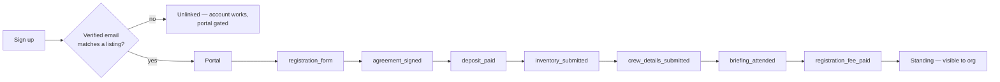

# Suppliers

| Field                  | Value                                                                                                                      |
| ---------------------- | -------------------------------------------------------------------------------------------------------------------------- |
| **Category**           | Product                                                                                                                    |
| **Doc status**         | Active                                                                                                                     |
| **Normative language** | Descriptive only — the deep onboarding/standing workflow has no App Spec counterpart to derive normative requirements from |
| **Requirement IDs**    | Partial — `PNP-005`, `REG-011`                                                                                             |
| **Owner / Updated**    | Repo maintainers, 2026-09-11                                                                                               |

Suppliers get their own portal (`apps/suppliers`) with a real onboarding
checklist; the org sees three things about any supplier: did they onboard
properly, what standing are they in, and the notes trail (infractions or
blessings).

## Implements (App Specification)

| App Spec §                   | IDs                                         | Status | Notes                                                                 |
| ---------------------------- | ------------------------------------------- | ------ | --------------------------------------------------------------------- |
| §16 Plug-and-play prevention | PNP-005 (external services declared)        | ✅     | Registration's supplier-declaration picker draws from this repository |
| §14 Annual registration      | REG-011 (external-service declaration)      | ✅     |                                                                       |
| —                            | The deep onboarding/standing workflow below | —      | Extends the App Spec; no dedicated section to cite against            |

## The supplier model

- **`standing`** enum: `good | watch | suspended` — org-set, visible
  everywhere the supplier appears, including the camp-side picker
  (`suspended` is excluded from the picker; `watch` shows a caution).
- **Onboarding completion** — derived from a 7-step checklist,
  shown as `n/7`; "onboarded properly" means all required steps done for
  the active edition.
- **`supplier_notes`** — an org-internal timeline (`infraction | blessing |
note`, body, author, timestamp). Never visible to the supplier or to
  camps.
- **Supplier reference code** — `SUP-{YYYY}-{NNNN}` (`suppliers.code`),
  stored rather than derived, since the code leaves the platform (depot
  gate lists, delivery manifests) and must not silently re-key itself.
  Allocation is race-safe via a unique-index arbiter.

## Onboarding checklist

Steps drawn from AfrikaBurn's real Supplier Depot procedure:

| #   | Step                     | Who completes              | Who confirms                                 |
| --- | ------------------------ | -------------------------- | -------------------------------------------- |
| 1   | `registration_form`      | supplier                   | auto                                         |
| 2   | `agreement_signed`       | supplier (acknowledgement) | org may revoke                               |
| 3   | `deposit_paid`           | —                          | org confirms (tracked only, never processed) |
| 4   | `inventory_submitted`    | supplier                   | org reviews                                  |
| 5   | `crew_details_submitted` | supplier                   | org reviews                                  |
| 6   | `briefing_attended`      | —                          | org confirms                                 |
| 7   | `registration_fee_paid`  | —                          | org confirms (tracked only)                  |

Self-service steps flip instantly; org-confirmed steps show "awaiting
AfrikaBurn confirmation" on the supplier side.

## Supplier documents (org-controlled)

The org console's supplier sign-up management CRUDs a per-edition list of
documents/links suppliers must read — title, source (external URL or
uploaded file via Blob), a `required_ack` flag, sort order, and an optional
binding to an onboarding step (e.g. the Supplier Agreement document binds to
`agreement_signed`).

**Binding rule** (`validateDocumentBinding`): a document may only bind to a
step the supplier completes _themselves_. Binding to an org-confirmed step
(deposit, briefing, registration fee) is rejected — a supplier ticking a
checkbox must not be able to confirm that money arrived or that they
attended a briefing.

## Sign-up

`/signup` and `/signin` on `apps/suppliers`: business name, contact person,
email, one password field, service category, a rules acknowledgement, then
email verification, then onboarding.

## Surfaces

- **`apps/suppliers`**: onboarding checklist page (each step as a card with
  its Quaggapedia-derived content inline), the supplier's own standing
  (plain language; the notes trail is never shown).
- **Org console `/suppliers`**: table — supplier, onboarding progress
  (`n/7`), standing (inline select), notes (count badge → drawer timeline).
  Row detail shows per-step status with org-confirm controls for the
  org-confirmed steps.

## Guardrails

- Deposits and fees are status-tracking only — no amounts processed,
  consistent with the platform never taking custody of money (see
  [`20-payment-reference-tracking.md`](20-payment-reference-tracking.md)).
- Camp-side supplier picker keys off standing and onboarding completeness.

## Flow

`unlinked` is an ordinary state, not an error — the account exists before
the listing does and can outlive it.

## Invariants and tests

`packages/core/src/__tests__/{supplier-onboarding,supplier-standing,supplier-code,supplier-import}.test.ts`.
