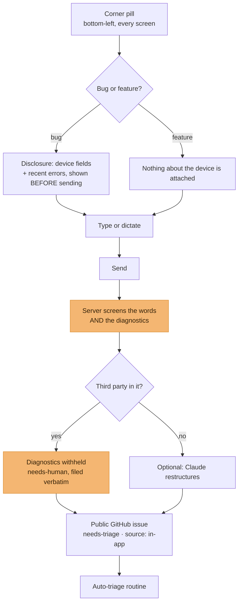

# In-app reporter

| Field                  | Value                                                      |
| ---------------------- | ---------------------------------------------------------- |
| **Category**           | Product                                                    |
| **Doc status**         | Active                                                     |
| **Normative language** | Descriptive only                                           |
| **Requirement IDs**    | N/A — no App Spec section covers user-facing bug reporting |
| **Owner / Updated**    | Repo maintainers, 2026-09-11                               |

A corner button in all three apps lets a signed-in user report a bug or
propose a feature, which files a public GitHub issue. Shipped; previously
undocumented as a feature (only its environment variables and its label
taxonomy were recorded elsewhere).

## Implements (App Specification)

Not derived from any App Spec section — this is repo-built operational
tooling.

## How it is built

- **Disclosure before send**: for a bug report, the reporter shows the
  device/diagnostic fields it would attach (device info, recent client
  errors) _before_ sending, never silently. A feature request attaches
  nothing about the device.
- **Voice dictation** (Groq Whisper): `packages/core/src/report-server/transcribe.ts`,
  used only when `GROQ_API_KEY` is set; otherwise the reporter is
  typing-only and the microphone control is hidden.
- **Screening before publication**: `packages/core/src/report-server/report-screen.ts`
  deterministically decides whether a report may auto-publish or needs a
  human (`needs-human`) — for instance when it appears to name a third
  party, in which case the raw diagnostics are withheld and the report is
  filed verbatim rather than restructured.
- **Optional Claude-assisted structuring**: `packages/core/src/report-server/structure.ts`
  rewrites a screened, publishable report into title/steps/expected/actual
  form when `ANTHROPIC_API_KEY` is set; additive and fails null rather than
  blocking the report on an API error.
- **Label sync**: `packages/core/src/report-server/labels-sync.ts` and
  `scripts/setup-github-labels.ts` keep the GitHub label taxonomy
  (`needs-triage`, `source: in-app`, `type:*`, `app:*`) in sync with the
  vocabulary the reporter itself applies — one list, so the reporter can
  never apply a label the repository has never heard of.
- **Issue creation**: `packages/core/src/report-server/github.ts` — one
  plain `fetch` call (no Octokit dependency, since this module is imported
  by all three Next apps). `packages/core/src/report-server` is a separate
  export path from the `@quagga/core` barrel specifically so this
  machinery (which reads `GITHUB_TOKEN` and pulls in the Anthropic SDK)
  never ships to a browser bundle.

## Identity the reporter files as

**Currently a personal access token; should be an org-owned identity.** The
UI copy already says "filed by the project's reporter account," and the
code should be read the same way regardless of which token currently backs
it — but as of this migration, `GITHUB_TOKEN` is still expected to be a
maintainer's own fine-grained personal access token
(`Issues: read and write`, scoped to the target repo). **This is tracked as
an open item, not resolved here**: rotating it to an org-owned machine user
or GitHub App installation token is an infrastructure action (see
`GOVERNANCE.md` §Infrastructure and secret custody), not a code change this
migration performs.

## Flow

The reporter is only offered where it can work: no `GITHUB_TOKEN`, no
corner pill. What happens to the issue afterwards is
[`../triage.md`](../triage.md).

## Invariants and tests

`packages/core/src/__tests__/{report,report-screen,report-sanitize,report-handler}.test.ts`.
